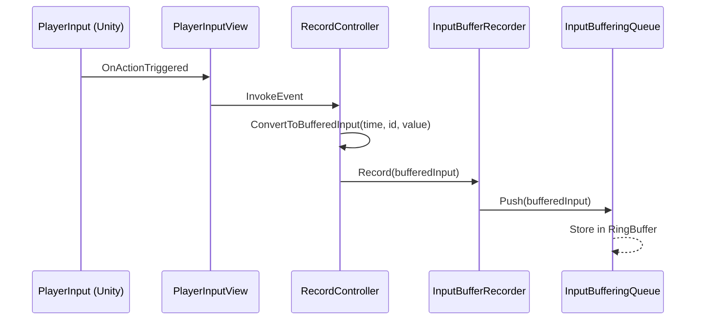

# Persistent-Input

Persistent カテゴリーにおける入力管理および入力バッファリング機能のモジュール詳細。

## 構造概要

入力機能は、Unity の Input System からのイベントを内部 ID（InputActionId）に変換し、時間情報（Timestamp）を付加してバッファ（RingBuffer）に記録する仕組みです。

### 1. Domain
- **BufferedInput**: タイムスタンプ、入力 ID、アクションフェーズ（Started, Performed, Canceled）、および入力値を含む、バッファリング可能な最小単位。
- **InputBufferingQueue**: リングバッファを用いて `BufferedInput` を一定数保持する。
- **InputActionId**: ゲーム内で定義された共通の入力アクション ID。

### 2. Application
- **InputBufferRecorder**: 外部（Adaptor）から渡された `BufferedInput` を `InputBufferingQueue` にプッシュする。

### 3. Adaptor
- **InputIdConverter**: Unity のアクション名やパスを `InputActionId` に変換する。
- **InputContext**: 現在の入力イベントを `BufferedInput` に変換するためのコンテキスト情報を提供。
- **RecordController**: Unity のイベントを購読し、`InputBufferRecorder` に送るための橋渡し。
- **InputTimestampProvider**: 入力発生時の正確なタイムスタンプ（Time.unscaledTime 等）を提供。

### 4. View
- **PlayerInputView**: Unity の `PlayerInput` コンポーネントや C# クラスをラップし、低レイヤーの入力イベントを受け取る。
- **UnityInputMapController**: `InputActionMap` の有効・無効（InGame/OutGame 切り替えなど）を制御。
- **InputMapNames**: 使用されるアクションマップ名の定数定義。

### 6. Composition
- **InputComposition**: 入力関連のコンポーネント（Recorder, Queue, Controller）の組み立てと依存性注入。
- **InputDebugLogger**: デバッグ用に入力履歴をログ出力するヘルパー。

## 入力処理フロー (Mermaid)

