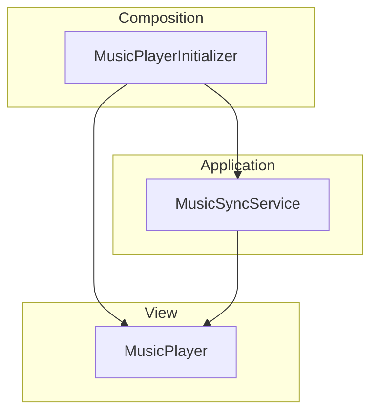

# Persistent-Music

Persistent カテゴリーにおける音楽再生およびリズムの基本機能のモジュール詳細。

## 構造概要

音楽再生機能は、シーンを跨いで一定のリズム（Beat）を維持し、BGMの再生制御（MusicPlayer）を行うために構成されています。

### 1. Domain
- **Beat**: リズムの最小単位（拍）を表すデータ構造。
- **RhythmDefinition**: 曲のBPMや拍子などの基本情報の定義。

### 2. Application
- **MusicSyncService**: 音楽とゲーム内イベントの同期を管理するユースケース。
- **IMusicSyncService**: 同期サービスのインターフェース。

### 3. Adaptor
- **MusicSchedulerAdaptor**: 音楽の進行に合わせたスケジューリングの変換。
- **MusicSyncController**: 音楽同期の入出力を制御。

### 4. View
- **MusicPlayer**: 実際にオーディオソースを用いてBGMを再生するコンポーネント。
- **MusicSyncView**: 音楽との同期状態を可視化する演出（UIなど）。

### 5. InfraStructure
- **EnemyMusicData**: インフラ層で管理される楽曲データ定義。

### 6. Composition
- **MusicPlayerInitializer**: 音楽再生関連のコンポーネントの生成と依存性注入を行う。
- **MusicSyncInitializer**: 音楽同期システムの初期化。

## クラス間連携図 (Mermaid)

