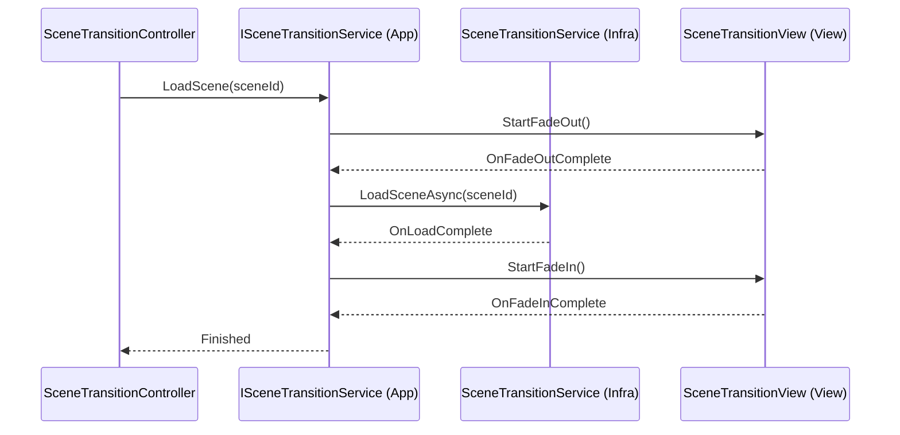

# Persistent-SceneManagement

Persistent カテゴリーにおけるシーン遷移のモジュール詳細。

## 構造概要

シーン遷移機能は、暗転などの演出（View）、遷移ロジック（Application）、およびUnityのSceneManagerを利用した実装（InfraStructure）で構成されています。

### 1. Domain
- **SceneId**: 遷移先のシーンを識別するための列挙型。

### 2. Application
- **ISceneTransitionService**: シーン遷移の開始を指示するためのインターフェース。
- **SceneTransitionApplication**: 遷移演出と遷移ロジックの実行。

### 3. Adaptor
- **SceneTransitionController**: 他のモジュールからシーン遷移をリクエストするためのコントローラー。

### 4. View
- **SceneTransitionView**: フェードイン・フェードアウトなどの視覚演出。

### 5. InfraStructure
- **SceneTransitionService**: Unity の `SceneManager` を呼び出してシーンをロードする実実装。

### 6. Composition
- **SceneTransitionInitializer**: シーン遷移関連のインスタンス生成と依存関係の解決。

## クラス間連携図 (Mermaid)

