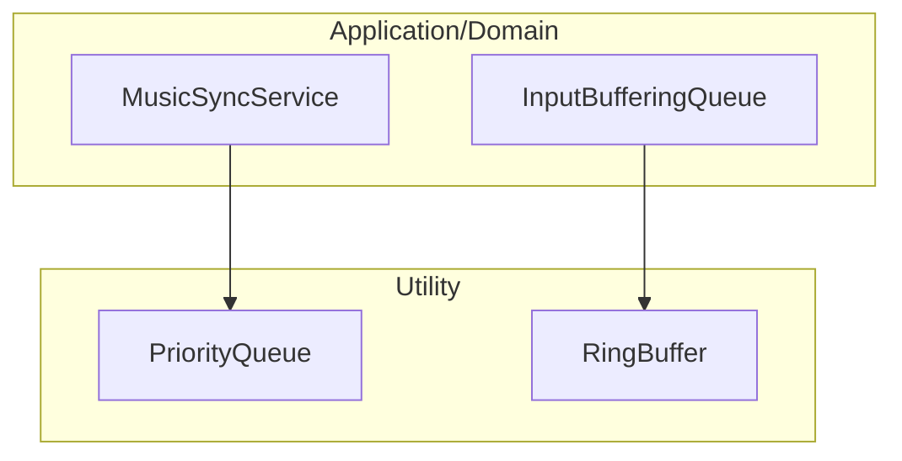

# Utility-Collections

Utility カテゴリーにおける汎用データ構造（コレクション）のモジュール詳細。

## 構造概要

プロジェクト特有のロジック（音楽同期や入力バッファリング）を支えるための、高いパフォーマンスを持つ汎用的なデータ構造を提供します。

### 0. Utility (直下)
- **PriorityQueue<TElement, TPriority>**: 優先度付きキュー。要素を優先度（または時間）順に並べ、効率的に取り出すことができます。
- **RingBuffer<T>**: リングバッファ（循環バッファ）。固定長のメモリを再利用し、最新のデータを上書き保持するために使用されます。

## 各クラスの詳細と役割

### 1. PriorityQueue<TElement, TPriority>
- **役割**: `MusicSyncService` などで、実行予定のスケジュール（ScheduledAction）を時間順に管理するために使用されます。
- **特徴**: ヒープを用いた実装により、挿入と最小値の取り出しが `O(log n)` で行えます。

### 2. RingBuffer<T>
- **役割**: `InputBufferingQueue` で使用され、プレイヤーからの入力を過去 N フレーム分保持するために使用されます。
- **特徴**: メモリの再割り当て（GC）を抑え、最新の要素へのアクセスを高速に行えます。

## クラス間連携図 (Mermaid)

