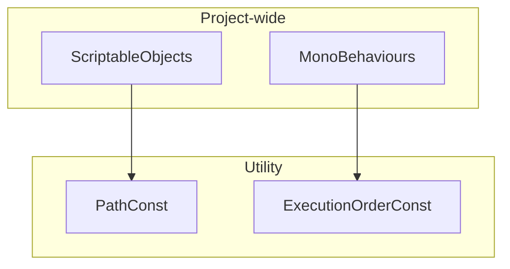

# Utility-Constant

Utility カテゴリーにおける定数（Constant）のモジュール詳細。

## 構造概要

プロジェクト全体で共有される静的なデータや設定、実行順序を定義するモジュールです。

### 0. Utility (直下)
- **PathConst**: アセットメニューのパスや、リソースのロード用パスを管理します。
- **ExecutionOrderConst**: Unity の `DefaultExecutionOrder` 属性に指定する実行優先順位を数値として定義します。

## 各クラスの詳細と役割

### 1. PathConst
- **役割**: ScriptableObject を作成する際などの `[CreateAssetMenu]` 属性の `menuName` 等を一元管理します。
- **特徴**: 静的な文字列定数のみを持ちます。

### 2. ExecutionOrderConst
- **役割**: Unity のスクリプト実行順序（Script Execution Order）をプロジェクト内で統一するために利用されます。
- **特徴**: 数値定数（int）のみを持ち、依存関係の強さに応じた順序を定義します。

### 3. UpdateModeEnum
- **役割**: 更新処理（Update / FixedUpdate / LateUpdate）のモードを指定するための列挙型です。

## クラス間連携図 (Mermaid)

