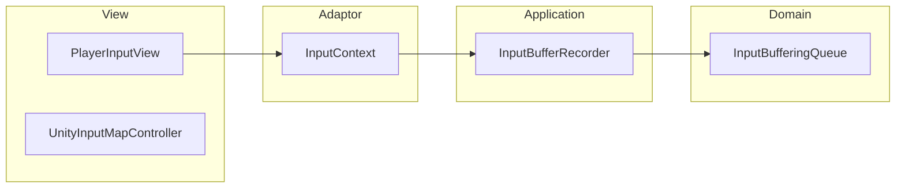

# Persistent 機能構造

Persistent は、シーンの切り替えに関わらず常に存在し、ゲーム全体で共有される機能（入力バッファリング、シーン遷移、音楽再生など）を担当します。

## モジュール詳細

- **[Persistent-Input](./Modules/Persistent-Input.md)**: 入力バッファリング、Unity Input System の統合。
- **[Persistent-Music](./Modules/Persistent-Music.md)**: シーンを跨ぐ BGM 再生とリズム管理。
- **[Persistent-SceneManagement](./Modules/Persistent-SceneManagement.md)**: 暗転演出を伴うシーン遷移ロジック。

## レイヤー構造

### 1. Domain
- **Input**: `InputBufferingQueue` (リングバッファを用いた入力保持), `BufferedInput`, `InputActionId`。
- **Music**: `Beat` 定義。

### 2. Application
- **Input**: `InputBufferRecorder` (View からの入力を Domain に送る)。
- **SceneManagement**: `ISceneTransitionService` インターフェース。

### 3. Adaptor
- **Input**: `InputContext`, `InputActionKind`, `InputIdConverter` (Unity の入力を内部 ID に変換)。
- **SceneManagement**: `SceneTransitionController`。

### 4. View
- **Input**: `UnityInputMapController` (Unity の InputActionMap 制御), `PlayerInputView` (入力イベントの購読)。
- **Music**: `MusicPlayer` (BGM 再生)。
- **SceneManagement**: `SceneTransitionView` (暗転などの演出)。

### 5. InfraStructure
- **SceneManagement**: `SceneTransitionService` (Unity の SceneManager を用いた実実装)。

### 6. Composition
- **EntryPoint**: `PersistentEntryPoint` (ゲーム起動時の初期化)。
- **Input/Music/Scene**: `InputComposition`, `MusicPlayerInitializer`, `SceneTransitionInitializer`。

## 構造図 (Mermaid)

### 入力バッファリングの流れ



### シーン遷移の構造

```mermaid
graph TD
    subgraph Adaptor
        STC[SceneTransitionController]
    end

    subgraph Application
        ISTS[ISceneTransitionService]
    end

    subgraph InfraStructure
        STS[SceneTransitionService]
    end

    subgraph View
        STV[SceneTransitionView]
    end

    STC --> ISTS
    ISTS <|-- STS
    STC --> STV
```
