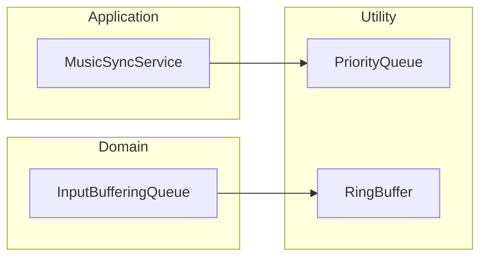

# Utility 機能構造

Utility は、プロジェクト全体で利用される汎用的なクラスやデータ、定数を担当します。

## モジュール詳細

- **[Utility-Collections](./Modules/Utility-Collections.md)**: `PriorityQueue` や `RingBuffer` などの汎用データ構造。
- **[Utility-Constant](./Modules/Utility-Constant.md)**: パス、実行順序、共通の列挙型などの定数定義。

## レイヤー構造

### 0. Utility (直下)
- **Collections**: `PriorityQueue` (優先度付きキュー), `RingBuffer` (リングバッファ)。
- **Constant**: `PathConst` (ファイルパスの定数), `ExecutionOrderConst` (Unity の実行順)。
- **InGame**: `UpdateModeEnum` (更新モードの列挙型)。

## 主なクラス解説

- **PriorityQueue<T, TPriority>**: `MusicSyncService` などで使用され、時間順にアクションを処理する際に利用されます。
- **RingBuffer<T>**: `InputBufferingQueue` で使用され、最新の入力を一定数保持するために利用されます。

## 構造図 (Mermaid)

### 汎用コレクションの利用例

