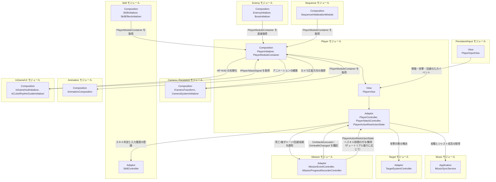

# プレイヤー

- page_id: 3957c2c6-cc02-8017-9b5f-c04dd480c816
- Notion パス: Symphony Kill Chord / システム概要 / プレイヤー
- スナップショットの最終更新: 2026-09-09T03:29:22.046Z
- 書き込み許可: 可
- 処置: 本文置き換え

## 判定

- 信頼性: 一部古い — クラス表の大半は実在する。誤り・古い点は次のとおり。`StageSceneInitializer` という型は無く、ファイル `Runtime/6.Composition/InGame/Player/StageSceneInitializer.cs` の中身は `StageSceneObjects`（`IStageSceneInstance` 実装）である。`PlayerController` は入力バッファを読まず、`PlayerView` から渡された移動入力と回避要求を Application へ委譲する（`Runtime/3.Adaptor/InGame/Player/PlayerController.cs`）。`PlayerModuleContainer` は `PlayerController`・`PlayerInputSuppressionState`・`PlayerStatusBonus`・被弾エフェクト View・`IPlayerAttackSignal` も公開する（`PlayerModuleContainer.cs:25-68`）。回避はリズム履歴に入らない（BT-19）。PR #1513 以降、攻撃のジャスト判定は `IPlayerAttackSignal` で演出側へ配る。武器表示の View 4 型（PR #1840〜#1895）が表に無い。repo の `NotionModuleDocs/Player.md` と Notion は同一（01 棚卸し B 表）
- 整合性:
  - 実装との矛盾: 上記。「入力制御（インプットバッファリング）」「入力バッファリングキュー経由で…先行入力を実現する」は誤りで、入力履歴には読み手が無い（BT-22。`PlayerController.cs:20,24-27` はフィールドに保持するだけ）
  - 他ページとの矛盾: `仕様概要 / リズム判定`（27f7c2c6-cc02-80bb-9c24-e39e11fc7314）の「攻撃や回避のアクションによってリズムを刻む」、`仕様概要 / スキル`（31f7c2c6-cc02-809d-a534-ceee55d7b005）の「最後は回避」コマンドと、実装（攻撃だけがリズム履歴に入る）が食い違う（BT-19。仕様側は担当外）。`入力`（3bf7c2c6-cc02-8100-8e00-d8124e5c09bc）の原稿と入力履歴の扱いをそろえた
- 変更点:
  - 「概要」: 旧: 入力制御（インプットバッファリング） → 新: 入力の受け付けと抑止。表の最終更新日 旧: 2026-08-17 → 新: 2026-09-22
  - 「🏗️ クラス」: `PlayerController` の役割 旧: 入力バッファから操作を取り出して… → 新: `PlayerView` から渡された移動入力・回避要求を委譲し、移動と回避成功を通知する。`PlayerAttackController` の役割に判定結果を `PlayerAttackPresenter` へ渡す旨を追記。`PlayerModuleContainer` の公開物を実装に合わせて修正（旧: `PlayerEntity`/`PlayerAttackController`/`PlayerActionRestrictionState` … → 新: 9 項目）。旧: `StageSceneInitializer` → 新: `StageSceneObjects`。`StationaryWeaponEffectsView`・`MuzzleFlashLight`・`CasingEjectorView`・`WeaponDissolveMaterials` を追加
  - 「🧩 Composition初期化情報」: 公開物を修正し、`PlayerInitializer` 自身の登録と `Build`/`Ready` で取得する依存を追記
  - 「🔗 モジュール結合」: 旧: `PI_View -->|入力バッファ経由の操作|` → 新: 入力イベントを購読。Skill・Animation・InGame/UI の依存と、Camera・Skill・SkillEffect・Sequence・InGame/UI からの参照を追加
  - 「📥 依存しているもの」: Persistent/Input の詳細を修正（BT-22）。InGame/UI & HUD の依存箇所 旧: `InGameHudInitializer`, `SkillInputProgressUIInitializer` → 新: `InGameHudInitializer` のみ（`SkillInputProgressUIInitializer` との結合は無い）。Music の詳細 旧: 回避（Dodge）のリズム同期判定… → 新: 攻撃時の拍種とジャスト成否の取得、BPM に基づく攻撃クールダウン（BT-19）。Skill・Animation の項を追加
  - 「📤 依存されているもの」: Camera・Skill/SkillEffect・Sequence・InGame/UI の項を追加。Mission の参照箇所に `PlayerController`・`PlayerInputSuppressionState`・`PlayerActionRestrictionState` を追加
  - 「② Application」: 回避はリズム履歴に登録しない旨を追記（BT-19）
  - 「③ Adaptor」「⑥ Composition」: `PlayerController` と `StageSceneObjects` の記述を修正
  - 「④ View」: 武器の表示・発射演出の規則を追記（HD-25、HD-26）
- 織り込んだ反映項目: BT-19（システムページの誤記の修正）, BT-22, HD-25, HD-26
- 出典: 実装 `PlayerInitializer.cs:59,110-133,169-392`、`PlayerModuleContainer.cs`、`PlayerController.cs`、`PlayerView.cs:160-176,526-700`、`PlayerAttackController.cs:66,96-179`、`StageSceneInitializer.cs:10-26`、`SkillController.cs:70`（`RegisterBattleActionHistory` の唯一の呼び出し元）、`WeaponItemView.cs:75-82,158-176`、`WeaponDissolveMaterials.cs:210-211`、`StationaryWeaponEffectsView.cs:119-120`、武器プレハブ `Assets/Level/Prefabs/Master/InGame/Weapons/*.prefab`（`_effectDelaySeconds: 0`）。PR #1513、#1840/#1853/#1866（発射演出）、#1856/#1881/#1895（武器のディゾルブ）
- 決定（2026-09-22 八幡）: No.19 回避はリズムを刻まない（実装どおり）。「② Application」の【要確認】を外し、キルコードのコマンドにも回避は使えない旨をそのまま仕様として残した
- 決定（2026-09-22 八幡）: R13 入力履歴 `InputBufferingQueue` は先行入力のために残す。「📥 依存しているもの」の Input の詳細に「入力履歴は先行入力のために残している」と足した
- 要確認: なし（BT-19 は No.19 で解決）

## 適用する本文

# 概要 {color="gray_bg"}

> 💡 **モジュール概要**
> インゲーム中のプレイヤーキャラクターの移動（通常移動・回避）、入力の受け付けと抑止、および攻撃・戦闘の実行制御（`PlayerAttackController`）を司るモジュールである。

| 項目 | 内容 |
| --- | --- |
| **モジュール名** | Player |
| **カテゴリ** | InGame |
| **ステータス** | 実装済み |
| **最終更新日** | 2026-09-22 |

---

## 🏗️ クラス {toggle="true"}

	| クラス名 | レイヤー | 役割・機能 |
	| --- | --- | --- |
	| **`PlayerMoveSpec`** | Domain | 移動速度や回避距離などの設定値を保持するピュアクラス |
	| **`PlayerActionRestrictionReason`** | Domain | プレイヤーの行動制限理由を表すenum（`None`/`Tutorial`/`Silence`）。`Silence`は現状未使用で将来の沈黙効果向けに定義済み |
	| **`PlayerApplication`** | Application | プレイヤーの状態・挙動を総括するメインユースケース |
	| **`PlayerMovementApplication`** | Application | 通常移動時の物理演算・補間 |
	| **`PlayerDodgeMovementApplication`** | Application | 回避アクションのタイムラインと無敵時間処理 |
	| **`PlayerController`** | Adaptor | `PlayerView`から渡された移動入力と回避要求をApplicationに委譲し、移動（`OnMoved`）と回避成功（`OnDodgeSucceeded`）を通知するコントローラー（`IPlayerController`実装） |
	| **`PlayerHealthHudPresenter`** | Adaptor | プレイヤーHPをHUDへ反映するPresenter |
	| **`PlayerInputSuppressionState`** | Adaptor | プレイヤー入力を一定時間だけ無効化する状態を管理 |
	| **`PlayerActionRestrictionState`** | Adaptor | スキル発動の制限状態を管理。理由（`PlayerActionRestrictionReason`）をHashSetで複数保持できるため、チュートリアル・沈黙など複数要因が重なっても正しく解除される。`CanUseSkill`（制限0件でtrue）、`AddSkillRestriction`/`RemoveSkillRestriction`を公開する |
	| **`PlayerAttackController`** | Adaptor | プレイヤーの攻撃実行を制御。入力1回につき拍種とジャスト成否を1回だけ判定し、`PlayerAttackPresenter`経由で演出側へ渡す。`OnAttackExecuted`イベントを公開し、Missionモジュール等から購読される（namespace上は`Adaptor.InGame.Battle`） |
	| **`PlayerView`** | View | 実際のRigidbodyやTransformを操作するMonoBehaviour。`PlayerInputView`の移動・攻撃・回避入力を購読する |
	| **`PlayerAttackWeaponView`** | View | 攻撃BeatTypeに応じた武器モデルの表示切替と攻撃SE再生 |
	| **`WeaponItemView`** | View | 武器1本分の表示切替・SE再生・エフェクト再生 |
	| **`StationaryWeaponEffectsView`** | View | 事前生成した発射演出（マズルフラッシュ・発射音・ライト）を発射地点のワールド座標で再生し、終わった実体を再利用する |
	| **`MuzzleFlashLight`** | View | 発射時に設定時間だけ点灯するライト |
	| **`CasingEjectorView`** | View | 銃の発砲に合わせて薬莢モデルを排出する |
	| **`WeaponDissolveMaterials`** | View | 武器の出現・収納中だけ使う材質を事前生成し、通常時の材質を保持する |
	| **`PlayerAttackWeaponConfig`** / **`PlayerAttackAnimationConfig`** / **`PlayerAttackAnimationEntry`** | View | 攻撃時の武器とアニメーションの対応設定 |
	| **`PlayerGroundOffsetView`** | View | 接地位置の補正 |
	| **`PlayerSpawnPoint`** | View | プレイヤー生成位置を示すマーカー |
	| **`PlayerMoveSpecAsset`** | Infrastructure | 移動・回避の設定値を保持するScriptableObject（`PlayerMoveSpec`の供給元） |
	| **`PlayerInitializer`** | Composition | インプット、カメラ、HUD、攻撃制御などのシステムをプレイヤー具象にDIする |
	| **`PlayerModuleContainer`** | Composition | プレイヤーの公開物をServiceLocatorへ公開するContainer。Enemy/Boss・Camera・Skill・Mission・Sequence・UIの各モジュールが参照する |
	| **`PlayerStatusBonusInitializer`** / **`PlayerStatusBonusModuleContainer`** | Composition | インゲームで適用するステータスボーナスの初期化と公開（Order 490） |
	| **`StageSceneObjects`** / **`IStageSceneInstance`** | Composition | ステージシーン内で共有する参照（生成位置など）の登録と公開。クラスはファイル`StageSceneInitializer.cs`にある |
	| **`PlayerMoveSpecDebug`** | Composition | 移動設定値をデバッグ表示・調整するための補助（エディタ実行時のみ付与） |

### 🧩 Composition初期化情報

| 項目 | 内容 |
| --- | --- |
| **Initializerクラス** | `PlayerInitializer` |
| **Order** | 500（`PlayerInitializer`）／490（`PlayerStatusBonusInitializer`） |
| **公開する ModuleContainer / ServiceLocator登録型** | `PlayerModuleContainer`（`PlayerInitializer`, `PlayerView`, `PlayerEntity`（`CharacterEntity`）, `PlayerStatusBonus`, `DamageEffectView`, `IPlayerAttackSignal`, `PlayerAttackController`, `PlayerActionRestrictionState`, `PlayerController`, `InputSuppressionState` を保持。後ろの4つは`Ready`で設定される）、`PlayerInitializer`自身（`Awake`で登録） |

`Build`で`PlayerStatusBonusModuleContainer`を取得してプレイヤーのEntityを生成し、`PlayerModuleContainer`を登録する。`Ready`で`SceneDependencyModuleContainer`（入力）・`SkillModuleContainer`・`InGameHudInitializer`・`MissionEventController`・`MusicSyncModuleContainer`・`ICameraTransform`・`PlayerInputView`・`TargetSystemModuleContainer`を取得し、攻撃制御と移動制御を組み立てる。

---

## 🔗 モジュール結合

### 📥 依存しているもの

- **`Persistent/Input`**
	- *依存箇所*: `PlayerInputView`, `InputComposition`
	- *詳細*: `PlayerView`が移動・攻撃・回避（モバイルのフリック回避を含む）の入力イベントを購読する。`PlayerInitializer`は入力履歴（`InputBufferingQueue`）を`PlayerController`へ渡すが、現在は参照していない（入力履歴は先行入力のために残している）
- **`Music`**
	- *依存箇所*: `IMusicSyncService`, `MusicSyncState`
	- *詳細*: 攻撃時に`GetCurrentBeatType(out isJustHit)`で拍種とジャスト成否を取得する。攻撃クールダウンは拍数で指定され、BPMから秒へ換算する。回避はリズム判定に使わない
- **`Camera`** / **`Persistent`**
	- *依存箇所*: `ICameraTransform`（Persistent Composition層の抽象）
	- *詳細*: プレイヤーが移動する際、カメラの現在の正面方向を基準にして進行方向を計算するために使用する
- **`Target`**
	- *依存箇所*: `TargetSystemController`, `ITargetableViewModel`, `TargetAreaQuery`
	- *詳細*: `PlayerAttackController`の攻撃対象解決と、扇形範囲の命中判定で使用する
- **`Skill`**
	- *依存箇所*: `SkillModuleContainer`（`SkillController`, `PendingAttackEffectService`）
	- *詳細*: 攻撃のたびに`SkillController.TryExecuteSkill`でスキルコマンドを照合し、入力履歴を登録する。スキルが通常攻撃のダメージを消す場合はその指示に従う
- **`Animation`**
	- *依存箇所*: `AnimationComposition`
	- *詳細*: `PlayerInitializer`がプレイヤー用のアニメーションを構築し、攻撃・回避のワンショットを要求する
- **`InGame/UI & HUD`**
	- *依存箇所*: `InGameHudInitializer`
	- *詳細*: プレイヤー自身のHPを画面に反映するため、`InGameHudInitializer`を取得してHP HUDをセットアップする。スキル入力進捗UIとの結合は無い（`PlayerInitializer`は`SkillInputProgressUIConfig`をプロパティとして公開しているが、読む側は無い）
- **`Mission`**
	- *依存箇所*: `MissionEventController`
	- *詳細*: プレイヤーの死亡や被ダメージ、回避成功実績などのイベントをミッションシステムへ通知する
	- *補足*: 逆方向に、Missionモジュールの`SetSkillExecutionEnabledStepEntryActionExecutor`（チュートリアルのステップ進行アクション）が`PlayerModuleContainer.PlayerActionRestrictionState`を取得し、`AddSkillRestriction`/`RemoveSkillRestriction`で`PlayerActionRestrictionReason.Tutorial`を付与・解除する。この制限状態は`PlayerAttackController.ExecuteAttack`内で`CanUseSkill`として参照され、`SkillController.TryExecuteSkill`の可否に反映される

### 📤 依存されているもの

- **`Enemy`**
	- *参照箇所*: `PlayerModuleContainer`（Compositionでの直接結合）, `CharacterEntity`
	- *詳細*: 敵のAI（移動目標・攻撃先）として、プレイヤーのTransformやEntity情報を提供する
- **`Camera`**
	- *参照箇所*: `PlayerModuleContainer`, `PlayerInputView`
	- *詳細*: `CameraSystemInitializer`が追従対象としてプレイヤーを取得する。カメラが回転操作を受け取るための入力ソースとして、プレイヤーインプットを参照する
- **`Mission`**
	- *参照箇所*: `PlayerAttackController.OnAttackExecuted`, `CharacterEntity.OnHealthChanged`, `PlayerController`, `PlayerInputSuppressionState`, `PlayerActionRestrictionState`
	- *詳細*: `MissionProgressRecorderController`がこれらのイベントを購読し、被ダメージ量・使用武器種・コンボ数・移動・回避をミッション評価条件として記録する。説明ポップアップの表示中は`PlayerInputSuppressionState`で入力を止める
- **`Skill`** / **`SkillEffect`**
	- *参照箇所*: `PlayerModuleContainer`
	- *詳細*: `SkillInitializer`が装備スキル（改造画面を経由しない場合は`PlayerInitializer`のテスト用装備）、プレイヤーのEntity・Transform・ステータスボーナスを取得し、スキルのアニメーション・ボイスの要求を`PlayerView`へ結線する。`SkillEffectInitializer`もテスト用装備のスキルIDを取得する
- **`Sequence`**
	- *参照箇所*: `PlayerModuleContainer`
	- *詳細*: `SequenceInitializationModule`がステージクリア時のカメラ演出などの基準として`PlayerView`を参照する
- **`InGame/UI`**
	- *参照箇所*: `PlayerModuleContainer.PlayerAttackSignal`
	- *詳細*: `ACLikeRhythmGuideInitializer`が攻撃成立の通知を全画面演出・ガイド成功演出・振動へ結線する。`EnemyDirectionIndicatorInitializer`はプレイヤー位置を基準に敵の方向を示す

---

# 詳細 {color="gray_bg"}

## 🧅レイヤー情報

### ① Domain

移動速度や回避距離などの設定値をまとめた`PlayerMoveSpec`を保持する。

### ② Application

プレイヤーの状態・挙動を総括する`PlayerApplication`、通常移動の物理演算・補間を担う`PlayerMovementApplication`、回避アクションのタイムラインと無敵時間処理を担う`PlayerDodgeMovementApplication`といった、移動・回避に特化したピュアなロジッククラスを実装する。 回避はリズムの入力履歴に登録しない。リズム履歴に入るのは攻撃入力だけであり、キルコードのコマンドにも回避は使えない。

### ③ Adaptor

`PlayerView`から渡された移動入力と回避要求をApplicationに委譲する`PlayerController`と、攻撃実行を制御し`OnAttackExecuted`イベントを公開する`PlayerAttackController`（実体は`Adaptor.InGame.Battle`名前空間）を定義する。

### ④ View

実際のRigidbodyやTransformを操作する`PlayerView`が、MonoBehaviourとしての表示・物理制御を担当する。 武器は攻撃中だけ表示する。出現はディゾルブ0.2秒で、最後の発射から2秒後に自動で収納し、収納のディゾルブは0.5秒である（`WeaponItemView`）。表示中に同じ武器で撃ち直した場合は出現のディゾルブを再生せず、収納までの時間だけを延ばす。ディゾルブの縁はHDRの赤（1.25, 0.02, 0.01）で、フラッシュは0.35である（`WeaponDissolveMaterials`）。演出中だけ演出用の材質へ差し替えるため、演出中はMetallic/Emissionの見た目が変わる。 発射演出（マズルフラッシュ・発射音・ライト）は武器ごとに16組を事前生成して使い回す。発射した地点のワールド座標に残り、銃には追従しない。16組すべてが使用中ならその発射の演出だけ省略し、30秒で終わらない演出は止める（`StationaryWeaponEffectsView`）。粒子とライトの遅延`_effectDelaySeconds`は全武器で0秒で、SEは拍のタイミングのまま遅延しない。

### ⑤ Infrastructure

`PlayerMoveSpecAsset`が移動・回避の設定値をScriptableObjectとして保持し、Domainの`PlayerMoveSpec`へ供給する。

### ⑥ Composition

`PlayerInitializer`（Order 500）がインプット・カメラ・HUD・攻撃制御などのシステムをプレイヤー具象にDIし、`PlayerModuleContainer`として他モジュールへ公開する。`PlayerStatusBonusInitializer`（Order 490）が先に走り、スキルビルド由来のステータスボーナスを適用する。`StageSceneObjects`はステージシーン内で共有する参照を`IStageSceneInstance`として公開する。

## 🔌 拡張ポイント

> 現状、ポリモーフィックな拡張ポイント（`SubclassSelector`等）はない。新しい移動・回避挙動を追加する場合は、対応するApplicationクラスの追加、または既存クラスへの分岐追加という形になる。

## 🔄処理フロー

主要な処理フローは、それぞれ子ページに分けている。

<page url="https://www.notion.so/3bf7c2c6cc0281d8a0ced293848ec481">① 通常移動フロー（毎フレーム）</page>

<page url="https://www.notion.so/3bf7c2c6cc0281adbf88ef1cd0770beb">② 攻撃実行フロー（入力イベント時）</page>
