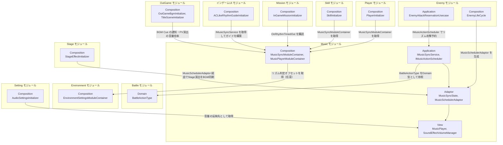

# 音楽

- page_id: 3957c2c6-cc02-806b-9cc8-fbe9c9e8bf63
- Notion パス: Symphony Kill Chord / システム概要 / 音楽
- スナップショットの最終更新: 2026-08-24T13:55:02.966Z
- 書き込み許可: 可
- 処置: 本文置き換え

## 判定

- 信頼性: 一部古い — PR #1513（2026-09-12）で削除した `RhythmJustService` がクラス表・結合図・レイヤー情報に残っている。`IMusicActionScheduler` の引数は `EnemyMusicSpec` ではなく Music の Domain 型 `MusicSyncSpec` になっている（`Runtime/2.Application/InGame/Music/IMusicActionScheduler.cs`）。OutGame/Title の音量変更は `IAudioSettingsViewModel`/`IAudioSettingsCommand` 経由に変わった（`Runtime/4.View/OutGame/Title/VolumeSettingsTabView.cs:18-19`）。repo の `NotionModuleDocs/Music.md`（2026-08-17）より Notion（2026-08-23）の方が新しく、repo にだけある記述は無い（01 棚卸し B 表、差分を再確認済み）
- 整合性:
  - 実装との矛盾: 上記 3 点。加えて、`RhythmGuideInitializer` は `Initialize()` の呼び出し元が無く、配置も開発用シーン `Assets/Level/Scenes/Develop/AnimationTest/InGameAnimation.unity` だけである。本番のリズムガイドは `ACLikeRhythmGuideInitializer`（`Runtime/6.Composition/InGame/UI/`、Order 800）が構築する
  - ページ構造の崩れ: クラス表の途中に引用（音量設定の注記）が入り、その後ろに `EquipmentBgmInitializer`/`SoundEffectInitializer` の行と区切り行が重複して表が 2 つに割れている
  - 他ページとの関係: 装備BGMの詳細は `システム概要 / 装備BGM切り替えシステム`（38c7c2c6-cc02-8050-8963-e1ceece2634e、研究版の記述のまま。OG-220 は担当外）。音量設定は `セッティング` ページに分けている旨の注記は現行どおり
- 変更点:
  - 「概要」表: 旧: 最終更新日 2026-08-23 → 新: 2026-09-22
  - 「🏗️ クラス」: `RhythmJustService` の行を削除。`IMusicSyncService`（`GetCurrentBeatType(out isJustHit)`・`OnRhythmTimedOut`・`ResetPlayback`・`RhythmJudgmentDefinition`）、`MusicSyncController`（判定オフセットの加算・`ResetPlayback`）、`MusicSyncView`（`SetGameplayActive`）、`MusicSchedulerAdaptor`（旧: `EnemyMusicSpec` を変換 → 新: `MusicSyncSpec` を変換。利用元を Enemy/Boss/砲弾/Stage に更新）、`RhythmGuideInitializer`（呼び出し元が無い旨）の役割を修正。`LeadNotificationScheduler`・`RhythmGuideTargetFeedbackPresenter`・`IRhythmGuideTargetFeedbackViewModel`・`IControllableVoiceSource` の行を追加。`UIToolkitSoundEffectBinder` に USS クラスで Cue を選ぶ旨を追記（OG-219 の技術部分）。`EquipmentBgmController` に拍ストリーム購読を追記（OG-220 の技術部分）
  - 「🏗️ クラス」: 表の途中に入っていた注記を表の後ろへ移し、重複行（`EquipmentBgmInitializer`/`SoundEffectInitializer` の 2 行目）と余分な区切り行を削除
  - 「🧩 Composition初期化情報」: 節が無かったため新設（テンプレートの位置。Order とServiceLocator 登録型）
  - 「🔗 モジュール結合」: `RhythmJustService`・`EnemyMusicSpec` を削除。Enemy/Stage は `MusicSchedulerAdaptor` 経由、Skill・Mission・UI（`ACLikeRhythmGuideInitializer`）・Environment（判定オフセット）・Setting（音量）・OutGame の依存を追加。Title の依存を更新
  - 「📥 依存しているもの」: 旧: Enemy（`EnemyMusicSpec`） → 新: 削除。Environment（`EnvironmentSettingsModuleContainer`、任意）を追加
  - 「📤 依存されているもの」: Player の詳細からジャストヒットイベントの記述を削除し `GetCurrentBeatType` に修正。Skill・Mission・Setting・OutGame を追加。Title を「PV 演出の BGM 倍率のみ」に修正。Enemy に Boss・砲弾を追加
  - 「④ View」: 旧: Unityの `AudioSource` と直接対話して再生時間を監視 → 新: `MusicPlayer`（`CriAtomSource`）から再生時間を取得（`MusicPlayer.cs:1,12,19`）
  - 「② Application」「⑥ Composition」: `RhythmJustService` の記述を削除し、判定の副作用なし化とリズムタイムアウトを追記。`EnemyMusicSpec` の記述を削除
  - 末尾に「📝 ジャスト判定の要件」節を新設（BT-10。問題記録 `spec/plan/problem_logs/2026-09-09-just-judgement.md` の修正要件と回帰確認項目）
- 織り込んだ反映項目: BT-09, BT-10, OG-219（技術部分のみ。Cue の割り当て表は新規の仕様ページ側）, OG-220（技術部分のみ。本体は装備BGMページ）
- 出典: 実装 `IMusicSyncService.cs`、`MusicSyncService.cs:36-93,113-133,184-217`、`MusicSyncController.cs`（`Tick` で `RhythmOffsetSeconds` を加算）、`MusicSyncView.cs`（`[DefaultExecutionOrder(-900)]`、`SetGameplayActive`）、`MusicSyncInitializer.cs:25,36-100`、`RhythmJudgmentDefinition.cs:29-32`（`TIMEOUT_BAR_COUNT = 2`）、`MusicSchedulerAdaptor.cs`、`EnemyLifeCycle.cs:149`・`BossLifeCycle.cs:145`・`ShellLifeCycle.cs:79`・`StageEffectInitializer.cs:73`、`ACLikeRhythmGuideInitializer.cs:36,81-205`、`EquipmentBgmController.cs:50-53`、`UISoundEffectConfig.asset`、各 Initializer の `Order`。PR #1513（ジャスト判定統一）、#1675（判定オフセット設定）、#1893（リズムタイムアウト復旧）、#1896（ゲージ・タイムアウト周回）
- 要確認: なし（ジャスト範囲の数値は `仕様概要 / リズム判定 / Just判定について` 側で扱う）

## 適用する本文

# 概要 {color="gray_bg"}

> 💡 **モジュール概要**
> ゲームの根幹である「BPM・ビート情報（拍）・リズム同期判定（ジャスト入力等）・音量管理・BGM/SE/Voice ソースの音響制御」を司る、プロジェクト全体の中核となるモジュールである。

| 項目 | 内容 |
| --- | --- |
| **モジュール名** | Music |
| **カテゴリ** | InGame + Persistent / Core System |
| **ステータス** | 実装済み |
| **最終更新日** | 2026-09-22 |

---

## 🏗️ クラス {toggle="true"}

	| クラス名 | レイヤー | 役割・機能 |
	| --- | --- | --- |
	| **`BeatType`** | Domain | 一拍・四拍・裏拍などの拍の種類を表す `enum` |
	| **`MusicTimingCalculator`** | Domain | 音楽の実行タイミングを計算する静的クラス |
	| **`MusicSyncSpec`** / **`ScheduledAction`** / **`ExecuteRequestTiming`** | Domain | 同期予約に使うタイミング情報と、予約されたアクション |
	| **`RhythmPattern`** / **`RhythmDefinition`** | Domain | リズムパターンとその定義を表す値オブジェクト |
	| **`RhythmJudgmentDefinition`** / **`RhythmJudgmentRange`** | Domain | リズム判定の範囲定義。拍種ごとのジャスト範囲と、リズムタイムアウトの小節数（2小節、定数）を持つ |
	| **`RhythmState`** / **`RhythmInputRecord`** | Domain | リズム入力の履歴管理と1入力分の記録 |
	| **`SkillBgmSelectorTable`** / **`BgmSelectorSequence`** | Domain | スキルIDとBGMセレクターラベルの対応、および小節ごとの再生シーケンス |
	| **`IMusicSyncService`** | Application | 再生タイムに基づくビート更新・アクション予約・拍履歴取得を定義するサービスインターフェース。現在の拍種とジャスト成否を副作用なしで返す`GetCurrentBeatType(out isJustHit)`、リズムタイムアウトの通知`OnRhythmTimedOut`、履歴と予約を通知なしで破棄する`ResetPlayback`、ガイドと共有する`RhythmJudgmentDefinition`を持つ |
	| **`IMusicActionScheduler`** | Application | ビートタイミングでコールバックを予約・実行するスケジューラーのインターフェース |
	| **`LeadNotificationScheduler`** | Application | 基準タイミングから指定拍数だけ遡った予告を予約する共通処理。敵の攻撃予告と砲弾の着弾予告が使う |
	| **`MusicSyncService`** | Application | `IMusicSyncService`実装。音楽同期とアクション実行予約を管理し、最後の入力から2小節入力が無いと履歴を破棄して`OnRhythmTimedOut`を通知する |
	| **`EquipmentBgmService`** | Application | 装備スキル構成から組んだシーケンスを保持し、小節の進行に応じてBGMを切り替える |
	| **`RhythmGuideUsecase`** | Application | リズムガイドの計算ロジック |
	| **`MusicSyncController`** | Adaptor | 毎フレーム、再生時間にリズム判定オフセット（環境設定）を加えてから `MusicSyncState.UpdatePlayTime` と `IMusicSyncService.Update` を呼び出すコントローラー。`ResetPlayback`で同期状態を破棄する |
	| **`MusicSyncState`** | Adaptor | 現在の BPM・再生時間・次の拍までのカウントなどのリズム状態を保持するクラス |
	| **`MusicSchedulerAdaptor`** | Adaptor | `IMusicActionScheduler` の実装。`MusicSyncSpec` を `ExecuteRequestTiming` に変換し `IMusicSyncService.RegisterAction` を呼ぶ。敵・ボス・砲弾の生成処理と`StageEffectInitializer`が生成して使う |
	| **`RhythmGuideDto`** | Adaptor | リズムインジケータ（UI）へ送る readonly ref struct DTO |
	| **`RhythmGuideZoneDto`** | Adaptor | ガイド表示エリアの描画データを保持する readonly struct DTO |
	| **`RhythmGuidePresenter`** | Adaptor | リズムガイドの表示用データを生成 |
	| **`RhythmGuideTargetFeedbackPresenter`** / **`IRhythmGuideTargetFeedbackViewModel`** | Adaptor | 攻撃成立通知（`IPlayerAttackSignal`）を現在のチュートリアル対象拍と照合し、一致したときガイドへ成功演出を伝える |
	| **`EquipmentBgmController`** | Adaptor | 装備BGM切り替えの窓口。`MusicSyncState`の拍ストリームを購読し、小節が変わるたびに鳴らすラベルを反映する |
	| **`MusicSyncView`** | View | BGM の再生時間を監視し、ゲームプレイ中だけ毎フレーム `MusicSyncController.Tick` を呼び出して再生タイムスタンプを更新する MonoBehaviour。`SetGameplayActive(false)`や Cue 変更で同期状態を破棄する |
	| **`MusicPlayer`** | View | BGM/SE/Voice の音源管理およびボリュームマネージャーとの仲介を担う MonoBehaviour（`IVolumeManager` を実装） |
	| **`MusicViewModel`** | View | 楽曲情報の表示状態を保持する ViewModel（`IMusicViewModel` を実装） |
	| **`RhythmGuideView`** / **`RhythmGuideViewModel`** / **`RhythmGuideLabelView`** / **`RhythmGuideUpdateView`** | View | リズムガイドの描画とラベル表示 |
	| **`ACLikeRhythmGuideView`** / **`ACLikeRhythmGuideViewModel`** / **`ACLikeRhythmGuideEffectConfig`** | View | AC風リズムガイドのビート表示・判定ゾーン描画とその演出設定 |
	| **`SoundEffectSource`** / **`SoundEffectVolumeManager`** / **`AttackSoundConfig`** | View (Persistent) | SEの再生元・音量管理・攻撃SE設定 |
	| **`VoiceSource`** / **`VoiceVolumeManager`** | View (Persistent) | Voice再生用のCRI Atom Sourceの登録と、音量の一括管理 |
	| **`PersistentAudioVolumeRegistryView`** | View (Persistent) | 永続音量管理の登録窓口 |
	| **`RhythmJudgmentDefinitionAsset`** / **`BgmSelectorLabelTableAsset`** | Infrastructure | 判定定義とBGMセレクターラベル表のScriptableObject |
	| **`MusicSyncInitializer`** | Composition (InGame) | 楽曲とタイミング制御エンジンの結びつけ・ServiceLocator への登録 |
	| **`RhythmGuideInitializer`** | Composition (InGame) | 旧リズムガイド UI の紐付け初期化。`Initialize()`の呼び出し元は無く、開発用シーンに配置が残るだけである。本番のガイドは`ACLikeRhythmGuideInitializer`（インゲームUI側）が構築する |
	| **`MusicPlayerInitializer`** | Composition (Persistent) | `MusicPlayer` を常駐シーンでセットアップする初期化クラス |
	| **`IBgmCuePlayer`** | Adaptor | 再生するBGM Cueの切り替えをViewへ要求する出力ポート |
	| **`IBgmSelectorPlayer`** | Adaptor | 再生中BGMのセレクターラベル切り替えを行う出力ポート |
	| **`IVolumeManager`** / **`IVolumeApplicable`** / **`IPlayableAudioSource`** | Adaptor | 音量管理・音量適用先・再生可能Audio Sourceの共通契約 |
	| **`IControllableVoiceSource`** | Adaptor | 会話音声の再生を制御するインタフェース |
	| **`UISoundEffectKind`** / **`IUISoundEffectCommand`** | Adaptor | UI操作音の種類（`Select`/`SkillSet`）と、その再生を要求する契約 |
	| **`UISoundEffectConfig`** | View | UI Toolkitの操作に対応するUI操作音のCue設定を保持するScriptableObject |
	| **`UISoundEffectCommand`** | View | `IUISoundEffectCommand`実装。指定された種類のCueを再生する |
	| **`UIToolkitSoundEffectBinder`** | View | `rootVisualElement`のUI Toolkitイベントを監視し、対応するUI操作音を解決して再生ポートへ渡す。要素に付いたUSSクラス（`ui-se-select`など）で Cue を選び、該当が無いButtonは既定のCueを鳴らす |
	| **`MusicSyncModuleContainer`** | Composition (InGame) | 音楽同期まわりをServiceLocatorへ公開するContainer |
	| **`MusicPlayerModuleContainer`** | Composition (Persistent) | `MusicPlayer`とBGM再生ポートをServiceLocatorへ公開するContainer |
	| **`EquipmentBgmInitializer`** / **`EquipmentBgmModuleContainer`** | Composition (InGame) | 装備スキル構成に応じたBGMループを初期化し、公開物を保持する |
	| **`SoundEffectInitializer`** | Composition (Persistent) | `SoundEffectVolumeManager`まわりを初期化する |
	| **`UISoundEffectInitializer`** / **`UISoundEffectModuleContainer`** | Composition (Persistent) | 常駐シーンのUI操作音Sourceを使用可能にして公開する（Order 36） |
	| **`OutGameUISoundEffectInitializer`** / **`OutGameUISoundEffectModuleContainer`** | Composition (OutGame) | シーンの`UIDocument`へUI操作音のイベント監視を接続する（Order 125） |
	| **`OutGameBgmInitializer`** | Composition (OutGame) | シーンに設定されたBGM Cueを常駐シーンの`MusicPlayer`へ通知する（Order 30） |

	> 音量設定そのもの（`AudioSettingsController`・`AudioSettingsService`・セーブ経路）は、設定画面から使う都合上「セッティング」ページにまとめている。本モジュールの各`IVolumeManager`はその反映先である。

### 🧩 Composition初期化情報

| 項目 | 内容 |
| --- | --- |
| **Initializerクラス** | InGame: `MusicSyncInitializer` / `EquipmentBgmInitializer` Persistent: `MusicPlayerInitializer` / `SoundEffectInitializer` / `UISoundEffectInitializer` OutGame: `OutGameBgmInitializer` / `OutGameUISoundEffectInitializer` |
| **Order** | InGame: `MusicSyncInitializer` 200 / `EquipmentBgmInitializer` 250 Persistent: `MusicPlayerInitializer` 20 / `SoundEffectInitializer` 30 / `UISoundEffectInitializer` 36 OutGame: `OutGameBgmInitializer` 30 / `OutGameUISoundEffectInitializer` 125 |
| **公開する ModuleContainer / ServiceLocator登録型** | `MusicSyncModuleContainer`（`MusicSyncController`, `MusicSyncService`, `MusicSyncState` を保持）、`IMusicSyncService`、`MusicSyncState`、`EquipmentBgmModuleContainer`、`MusicPlayer`、`MusicPlayerModuleContainer`（`IBgmCuePlayer` を保持）、`SoundEffectVolumeManager`、`VoiceVolumeManager`、`UISoundEffectModuleContainer`、`OutGameUISoundEffectModuleContainer` |

`MusicSyncView`は`[DefaultExecutionOrder(-900)]`で、他の毎フレーム処理より先に同期状態を更新する。本番のリズムガイドを構築する`ACLikeRhythmGuideInitializer`（Order 800）は、`MusicSyncModuleContainer`を`Ready`で取得する。

---

## 🔗 モジュール結合

### 📥 依存しているもの

- **`InGame/Battle`**（Domain型のみ）
	- *依存箇所*: `BattleActionType`
	- *詳細*: `IMusicSyncService`が`GetActionHistory()`/`RegisterBattleActionHistory(BattleActionType, ...)`という形でBattleモジュールのDomain型を直接扱う。「他モジュールに依存しない完全独立モジュール」という記載は誤りだった
- **`Persistent/Environment`**（任意）
	- *依存箇所*: `EnvironmentSettingsModuleContainer`（`IEnvironmentSettingsViewModel`）
	- *詳細*: `MusicSyncInitializer`がリズム判定オフセット（`RhythmOffsetSeconds`）を取得し、`MusicSyncController`が再生時間へ加える。取得できない場合はオフセット0秒で続行する

### 📤 依存されているもの

- **`InGame/Player`**
	- *参照箇所*: `MusicSyncModuleContainer`（`IMusicSyncService`, `MusicSyncState`）
	- *詳細*: 攻撃時に`GetCurrentBeatType(out isJustHit)`で拍種とジャスト成否を1回だけ取得し、BPM情報に基づく移動・アニメーション・拍管理を行うために参照する
- **`InGame/Skill`**
	- *参照箇所*: `MusicSyncModuleContainer`（`IMusicSyncService`）
	- *詳細*: スキル発動時に`RegisterBattleActionHistory`で入力履歴を登録し、履歴からリズムコマンドを照合する
- **`InGame/Mission`**
	- *参照箇所*: `MusicSyncModuleContainer`（`IMusicSyncService.OnRhythmTimedOut`）
	- *詳細*: リズムタイムアウトでコンボを0に戻す
- **`InGame/Enemy`**
	- *参照箇所*: `MusicSchedulerAdaptor`, `IMusicActionScheduler`, `LeadNotificationScheduler`
	- *詳細*: 敵・ボス・砲弾の生成処理が`MusicSchedulerAdaptor`を生成し、敵キャラクターが特定のビートタイミング（2拍前・1拍前・ジャスト拍）に攻撃予約を登録してリズムに同期したAI攻撃制御を行う
- **`InGame/Stage`**
	- *参照箇所*: `MusicSchedulerAdaptor`, `IMusicSyncService.RegisterAction`
	- *詳細*: `StageEffectInitializer`がWave開始時の演出（爆発・建物倒壊等）をBGM同期で再生するために利用する
- **`InGame/UI`**
	- *参照箇所*: `MusicSyncModuleContainer`, `RhythmGuideDto`, `MusicSyncState`
	- *詳細*: `ACLikeRhythmGuideInitializer`が`IMusicSyncService`を取得してリズムガイドを構築し、画面上のビートインジケータの描画タイミングを同期させる
- **`Persistent/Setting`**
	- *参照箇所*: `MusicPlayer`, `SoundEffectVolumeManager`, `VoiceVolumeManager`
	- *詳細*: `AudioSettingsInitializer`が音量設定の反映先として取得する
- **`OutGame`**
	- *参照箇所*: `MusicPlayerModuleContainer`（`IBgmCuePlayer`）, `MusicPlayer`, `UISoundEffectModuleContainer`
	- *詳細*: `OutGameBgmInitializer`がシーンのBGM Cueを通知し、`OutGameUISoundEffectInitializer`がUI操作音を接続する。`TitleSceneInitializer`はタイトルのPV演出中のBGM音量倍率（`SetPresentationVolume`）にだけ`MusicPlayer`を使う。タイトルの音量設定タブ（`VolumeSettingsTabView`）は`IAudioSettingsViewModel`/`IAudioSettingsCommand`経由で操作し、本モジュールの具象クラスを直接触らない

---

# 詳細 {color="gray_bg"}

## 🧅レイヤー情報

### ① Domain

> 拍（ビート）の種類を表す`BeatType`に加え、タイミング計算（`MusicTimingCalculator`）、リズムパターンと判定範囲の定義、入力履歴（`RhythmState`）、装備スキルからBGMを決める`SkillBgmSelectorTable`を保持する。

### ② Application

> 再生時間に基づくビート更新（`IMusicSyncService`）と、指定ビート後への非同期コールバック管理（`IMusicActionScheduler`）を実装する。ジャスト判定は`IMusicSyncService.GetCurrentBeatType(out isJustHit)`が副作用なしで返し、同じ判定定義をリズムガイドと共有する。最後の入力から2小節入力が無いと、入力履歴を破棄して`OnRhythmTimedOut`を通知する。`IMusicSyncService`のAPI設計上、`BattleActionType`（Battleモジュール）というDomain型を直接扱うため、厳密には他モジュールへの依存が存在する。

### ③ Adaptor

> 毎フレームのリズム同期処理を回す `MusicSyncController`、現在のBPM情報や拍数データを格納する `MusicSyncState`、およびUI層へと送る `RhythmGuideDto` などのデータブリッジを定義する。

### ④ View

> `MusicPlayer`（CRI の `CriAtomSource`）から再生時間を取得して同期を回す `MusicSyncView`、BGM/SE/Voiceソースのマネジメントを担う `MusicPlayer`（音量変更の窓口インターフェースを含む）などのUnity依存制御を担当する。

### ⑤ Infrastructure

> `RhythmJudgmentDefinitionAsset`が判定定義を、`BgmSelectorLabelTableAsset`がBGMセレクターラベル表をScriptableObjectとして供給する。

### ⑥ Composition

> ゲーム内BGMとタイミング同期システムをリンクさせる `MusicSyncInitializer`、常駐シーンの `MusicPlayerInitializer` など、アプリ全域へのDIセットアップを担当する。本番のリズムガイドはインゲームUI側の `ACLikeRhythmGuideInitializer` が構築する。

## 🔄処理フロー

主要な処理フローは、それぞれ子ページに分けている。

<page url="https://www.notion.so/3bf7c2c6cc0281faa314c728299d6ede">① BGM 再生とリズム同期の更新フロー（毎フレーム）</page>

<page url="https://www.notion.so/3bf7c2c6cc0281c98bc6ea98fd68d791">② プレイヤー入力に対するジャスト判定フロー</page>

<page url="https://www.notion.so/3bf7c2c6cc028125a337cc26fa0cbb3f">③ リズムアクション予約フロー（Enemy 等の外部モジュールから）</page>

## 📝 ジャスト判定の要件

ジャスト判定は、2026-09 に複数あった判定経路を1つにまとめた。変更するときは次の要件を守る。

- ジャスト範囲はマスターデータ（`RhythmJudgmentDefinitionAsset`）に集約し、開始を含み終了を含まない
- ジャスト範囲と拍種分類の範囲が重なる場合は、ジャスト範囲の拍種を優先する（ガイドのマーカーと攻撃の拍種を一致させるため）
- 判定の読み取りは副作用を持たない。攻撃は入力履歴を更新する前に1回だけ判定し、その結果をスキル・ダメージ・多段ヒット・演出へ渡す
- 入力履歴が無いとき、および拍オフセットより前は非ジャストとする
- 1小節を超えたあとはクランプ前の経過で評価し、ジャストが続かないようにする

回帰確認の観点: 6拍種の開始・終了の境界 / 繰り返しの読み取り / 初回入力 / 1小節超過 / 巻き戻し / 空振り / スキル発動 / 多段ヒット / ガイドの更新順とレイアウト変更
