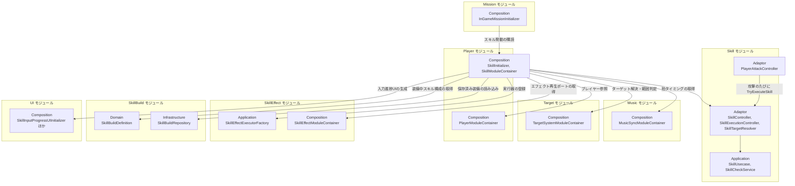

# スキル

- page_id: 3957c2c6-cc02-806e-bbe8-e391a7ad8c86
- Notion パス: Symphony Kill Chord / システム概要 / スキル
- スナップショットの最終更新: 2026-08-24T13:51:17.301Z
- 書き込み許可: 可
- 処置: 本文置き換え

## 判定

- 信頼性: 一部古い — クラス表の大半は実在し、`SkillInitializer` の Order 450 も正しい（`Runtime/6.Composition/InGame/Skill/SkillInitializer.cs:44`）。repo の `NotionModuleDocs/Skill.md`（2026-08-17）より Notion（2026-08-23）の方が新しく、`SkillHitScheduler`/`SkillHitController`/`SkillHitLoopView` の行は Notion にしかない（01 棚卸し B 表）。次の点が違う、または足りない
  - `SkillUseCase` はクラス名の大小が違い、実在名は `SkillUsecase`（ファイル名は `SkillUseCase.cs`。`Runtime/2.Application/InGame/Skill/SkillUseCase.cs:12`）
  - ⑤ Infrastructure を「当モジュールでは使用していない」としているが、`SkillRepository`・`SkillTemplateAsset`（`Runtime/5.InfraStructure/Player/`）があり、`SkillInitializer` が Addressables から読み込む（`SkillInitializer.cs:65-101`）
  - クラス表に無い型: `SkillEffectParameterGrowth`/`SkillEffectParameterGrowthStep`/`SkillEffectParameterGrowthType`、`SkillTemplate`・`SkillEffectContext`（`Runtime/1.Domain/Player/`）、`ISkillVisual`、`ISkillInputProgressRowView`、`ISkillCrosshairProgressView`、`SkillInputProgressUpdateDTO`、`IViewAction`（宣言のみで利用なし）
  - リズム入力の起点は「プレイヤー → `SkillExecutionController`」ではなく、`PlayerAttackController` → `SkillController.TryExecuteSkill` である。リズムを刻むのは攻撃入力だけ（`SkillController.cs` の `RegisterBattleActionHistory` の呼び出し元は `PlayerAttackController.cs:111` だけで、`BattleActionType.Attack` 固定）（BT-19）
  - クールダウン中は `CooldownBlocked` を返すだけで、`SkillExecutionFailurePolicy` は使わない。`SkillExecutionFailurePolicy` は対象の解決に失敗したときの扱いだが、`SkillUsecase.TryExecuteSkill` は対象がいなくても true（空撃ち）を返すため、現在この分岐には到達しない（`SkillExecutionController.cs:57-106`、`SkillUseCase.cs:34-58`）
  - ② 入力進捗の表示フローにリズムガイド下のスキル入力ガイド（`SkillGuideProgressView`・`SkillGuideProgressController`、PR #1880/#1889/#1896）が無い（BT-12）
- 整合性:
  - 他ページとの矛盾: `仕様概要 / スキル`（31f7c2c6-cc02-809d-a534-ceee55d7b005）の「アクション種類は攻撃や回避など」「“最後は回避”というコマンド」と、実装（拍の並びだけを比べ、アクション種類は見ない。`SkillDefinition.cs:64-72`）が食い違う（BT-19。仕様側は担当外）
  - `キャラ&バトル / ④ SkillHitSchedulerによる連撃タイミング制御`（3d67c2c6-cc02-811b-ac59-e928713c9cc2）の原稿と、`SkillHitScheduler`/`SkillHitController`/`SkillHitLoopView` の役割を一致させた
  - 01 棚卸し B 表の「`SkillUseCase` は実在名 `SkillUsecase` と大小違い」は Notion にも残っている
- 変更点:
  - 「概要」表: 旧: 最終更新日 2026-08-23 → 新: 2026-09-22。概要文の「分離されました」を「分離した」に（である調の誤り）
  - 「🏗️ クラス」: 旧: `SkillUseCase` → 新: `SkillUsecase`。`SkillRhythmState` の役割に容量（パターン長の 2 倍）を追記。`SkillController` の役割 旧: 表示と入力チェックを仲介 → 新: 攻撃入力ごとに入力履歴を登録し、装備スキル全体の判定を回す。`SkillCheckService` の役割に末尾一致を追記。`SkillGuideProgressController`・`SkillGuideProgressView` の役割を具体化（BT-12）。不足していた Domain・Adaptor・Infrastructure の型を追加
  - 「🧩 Composition初期化情報」: 公開物（`SkillController`・`ISkillResultViewModel`・`PendingAttackEffectService`）と、`ResourceLoadAsync`/`Ready` で取得する依存を追記
  - 「🔗 モジュール結合」: SkillEffect（`SkillEffectModuleContainer`・`SkillEffectExecutorFactory`）と SkillBuild の Infrastructure（`SkillBuildRepository`）への依存、Player からの `TryExecuteSkill` 呼び出しを追加
  - 「📥 依存しているもの」: Player の詳細 旧: `SkillAttackController`がスキル由来の攻撃を実行する → 新: プレイヤーの Entity・Transform・ステータスボーナス・テスト用装備を取得する。SkillEffect の項を追加
  - 「📤 依存されているもの」: Player の詳細に `PlayerAttackController` が毎回の攻撃で呼ぶ旨を追記
  - 「② Application」「⑤ Infrastructure」: `SkillUsecase` と `SkillRepository`/`SkillTemplateAsset` を追記
- 織り込んだ反映項目: BT-12（システムページ側）, BT-19（スキル側の記述）
- 出典: 実装 `SkillInitializer.cs:44,65-260,335,424,463-470`、`SkillModuleContainer.cs:21-27`、`SkillController.cs:53-80`、`SkillExecutionController.cs:17,57-160`、`SkillUseCase.cs`、`SkillCheckService.cs`、`SkillDefinition.cs:60-72`、`SkillGuideProgressController.cs`、`SkillGuideProgressView.cs:17-215`、`SkillInputProgressPresenter.cs`、`ACLikeRhythmGuideView.cs:321-340`、`Runtime/5.InfraStructure/Player/SkillRepository.cs`・`SkillTemplateAsset.cs`。マスターデータ `Assets/Level/Data/Master/InGame/Skill/SkillInputProgressUIConfig.asset:40-50`。PR #1880、#1889、#1896、#1907（全ゲージへの常時表示を取り消し）
- 要確認:
  - 【要確認: 企画】回避・アクション種類をスキルコマンドに使う仕様（`仕様概要 / スキル`）を残すか、攻撃の拍だけで判定する現状に合わせるか（BT-19）
  - 【要確認: プログラム担当】対象がいないときの空撃ち（クールダウンを消費し効果なし）と、到達しない `SkillExecutionFailurePolicy` の扱い

## 適用する本文

# 概要 {color="gray_bg"}

> 💡 **モジュール概要**
> 戦闘中のスキル発動を司るモジュールである。リズムコマンドの入力判定、クールダウン管理、効果の実行、発動状況のUI表示までを担当する。装備スキルの編成（SkillBuild）とスキルツリーの解放（SkillTree）は、別モジュールへ分離した。

| 項目 | 内容 |
| --- | --- |
| **モジュール名** | Skill |
| **カテゴリ** | InGame |
| **ステータス** | 実装済み |
| **最終更新日** | 2026-09-22 |

---

## 🏗️ クラス {toggle="true"}

	| クラス名 | レイヤー | 役割・機能 |
	| --- | --- | --- |
	| **`SkillDefinition`** | Domain | スキルの定義（発動条件・効果・演出）を保持するドメインクラス |
	| **`SkillId`** / **`SkillType`** / **`SkillLevel`** | Domain | スキルの識別子・種別・レベル |
	| **`SkillPattern`** | Domain | 発動に必要な入力パターン |
	| **`SkillRhythmState`** | Domain | プレイヤーのリズム入力履歴。スキルごとに持ち、容量はパターン長の2倍 |
	| **`SkillEffectSpec`** / **`SkillEffectType`** / **`SkillEffectParameter`** / **`SkillEffectParameterId`** | Domain | スキル効果の定義データと、そのパラメータ |
	| **`SkillEffectParameterGrowth`** / **`SkillEffectParameterGrowthStep`** / **`SkillEffectParameterGrowthType`** | Domain | スキルレベルによる効果パラメータの成長方式と、レベルアップごとの成長ステップ |
	| **`SkillTargetingType`** | Domain | 対象の取り方（単体・範囲など） |
	| **`SkillCooldownTime`** | Domain | クールダウン時間 |
	| **`SkillEffectDisplayMode`** / **`SkillEffectValueFormat`** | Domain | 効果値の表示方法 |
	| **`SkillNormalAttackDamagePolicy`** | Domain | 通常攻撃ダメージの扱いを決めるポリシー |
	| **`SkillTemplate`** / **`SkillEffectContext`** | Domain | スキルの設定データと、効果の発動に必要な情報（対象・プレイヤー・拍・ジャスト成否）をまとめた構造体（置き場は`1.Domain/Player/`） |
	| **`SkillUsecase`** | Application | スキル発動の判定と実行を扱うユースケース（ファイル名は`SkillUseCase.cs`）。対象を解決できないときは効果を実行せず、発動は成立させる（空撃ち） |
	| **`SkillCheckService`** | Application | リズムコマンド入力の正誤判定。入力履歴の末尾がパターンと一致するかを見る |
	| **`ISkillEffectExecutor`** / **`ISkillEffectExecutorResolver`** / **`SkillEffectExecutorResolver`** | Application | 効果の実行器と、効果種別から実行器を引く解決テーブル |
	| **`ISkillTargetResolver`** / **`SkillTargetResolveResult`** | Application | ターゲット解決の抽象と結果 |
	| **`ISkillRepository`** | Application | スキル定義の取得抽象 |
	| **`IViewAction`** | Application | スキルの実行（Effect + Visual）を行うインターフェース。現在は宣言だけで利用箇所が無い |
	| **`SkillExecutionController`** | Adaptor | スキルの発動を管理するコントローラー。クールダウン・入力履歴・パターン照合・発動・進捗表示の更新をスキル1つ分受け持つ |
	| **`SkillHitScheduler`** | Application | 連撃スキルのヒットを時間差で適用するスケジューラ。ダメージのタイミングはこのスケジューラが権限を持ち、エフェクトの生成可否には依存しない |
	| **`SkillHitController`** | Adaptor | 連撃スキルのヒット進行をViewから受け取り、Applicationへ橋渡しする |
	| **`SkillHitLoopView`** | View | 連撃スキルのヒット適用を定期更新する（`IGameplayControllable`実装） |
	| **`SkillController`** | Adaptor | 攻撃入力のたびに入力履歴を登録し、装備スキルごとの`SkillExecutionController`で判定を回す。発動したスキルのアニメーション・ボイス・武器の表示要求を通知し、通常攻撃のダメージを消すかどうかを呼び出し元へ返す |
	| **`SkillAttackController`** | Adaptor | スキル専用の攻撃実行アダプター |
	| **`SkillCooldownState`** | Adaptor | スキルごとのクールダウン完了時刻を管理し発動可否を判定 |
	| **`SkillExecutionResult`** / **`SkillExecutionResultType`** / **`SkillExecutionFailurePolicy`** | Adaptor | 発動結果と、失敗時の扱い |
	| **`SkillTargetResolver`** | Adaptor | スキル発動時のターゲット解決（Targetモジュールの`TargetAreaQuery`を利用） |
	| **`SkillResultPresenter`** / **`SkillResultDTO`** / **`ISkillResultViewModel`** | Adaptor | 発動結果をViewModel用DTOへ変換して通知 |
	| **`ISkillVisual`** | Adaptor | スキルのビジュアル演出の契約（`SkillView`が実装） |
	| **`SkillInputProgressController`** / **`SkillInputProgressPresenter`** / **`SkillInputProgressState`** / **`SkillInputProgressUpdateDTO`** | Adaptor (SkillUI) | コマンド入力進捗の管理・表示データ生成 |
	| **`ISkillInputProgressRowView`** / **`ISkillCrosshairProgressView`** | Adaptor (SkillUI) | 入力進捗を表示する行（ガイド・一覧）とクロスヘアのViewの契約 |
	| **`SkillCrosshairProgressController`** | Adaptor (SkillUI) | クロスヘア上の進捗表示の制御。入力中のスキルを、ロックオン中だけ表示する |
	| **`SkillGuideProgressController`** | Adaptor (SkillUI) | リズムガイド下のスキル入力ガイドの表示制御。未入力のときは全スキルの走り出しを、入力中は最も進んでいるスキルだけを表示する |
	| **`SkillView`** / **`SkillResultView`** / **`SkillResultViewModel`** | View | スキル発動結果の表示 |
	| **`SkillCrosshairProgressView`** / **`SkillCrosshairStepView`** | View (SkillUI) | クロスヘア進捗の描画 |
	| **`SkillGuideProgressView`** | View (SkillUI) | リズムガイド下のスキル入力ガイド。次に入力する1拍のスキルアイコンを、リズムガイドの同じ拍のジャスト位置へ左右対称に出し、その拍の範囲に色帯を付ける。クールダウン中はゲージで残り時間を示す |
	| **`SkillListRowView`** / **`SkillListStepView`** | View (SkillUI) | 装備スキル一覧の行と拍ステップ表示 |
	| **`SkillBeatVisualSetting`** / **`SkillInputProgressUIConfig`** ほか設定クラス | View (SkillUI) | 拍アイコンの見た目・アニメーションの設定 |
	| **`SkillRepository`** / **`SkillTemplateAsset`** | Infrastructure | スキル定義（`SkillTemplate`）を保持するScriptableObject。`SkillInitializer`がAddressablesから読み込む |
	| **`SkillDisplayTextFormatter`** / **`SkillEffectDescriptionFormatter`** / **`SkillDisplayText`** | Adaptor (OutGame) | スキル説明文の整形。アウトゲームの一覧表示で使用 |
	| **`SkillInitializer`** / **`SkillModuleContainer`** | Composition | Skillモジュールの構築とServiceLocatorへの公開（Order 450） |

### 🧩 Composition初期化情報

| 項目 | 内容 |
| --- | --- |
| **Initializerクラス** | `SkillInitializer` |
| **Order** | 450（InGame初期化ライフサイクル。Player(500)より前） |
| **公開する ModuleContainer / ServiceLocator登録型** | `SkillModuleContainer`（`SkillController`, `ISkillResultViewModel`, `PendingAttackEffectService` を保持。`SkillController`と`PendingAttackEffectService`は`Ready`で設定される）。装備構成が未登録なら`SkillBuildDefinition`も登録する |

`ResourceLoadAsync`で`SkillRepository`と`SkillBuildRepository`をAddressablesから読み込み、装備構成（`SkillBuildDefinition`）を用意する。`Ready`で`PlayerModuleContainer`・`TargetSystemModuleContainer`・`MusicSyncModuleContainer`・入力進捗UIの各Initializer・`SkillEffectModuleContainer`を取得して組み立てる。`PlayerInitializer`（Order 500）は`Ready`で`SkillModuleContainer.SkillController`を取得するため、Skillの`Ready`が先に終わっている必要がある。

---

## 🔗 モジュール結合

### 📥 依存しているもの

- **`Music`**
	- *依存箇所*: `MusicSyncModuleContainer`
	- *詳細*: リズムコマンドの判定に拍タイミングを使用する。攻撃入力を`RegisterBattleActionHistory`で登録し、リズムタイムアウト（`OnRhythmTimedOut`）で全スキルの入力進捗をリセットする。BPMから演出と連撃の再生速度を決める
- **`Target`**
	- *依存箇所*: `TargetSystemModuleContainer`（`TargetAreaQuery`を含む）
	- *詳細*: `SkillTargetResolver`が単体・範囲スキルの対象を解決する
- **`Player`**
	- *依存箇所*: `PlayerModuleContainer`
	- *詳細*: プレイヤーのEntity・Transform・ステータスボーナス・テスト用装備（改造画面を経由しない場合）を取得し、スキルのアニメーション・ボイスの要求を`PlayerView`へ結線する。`SkillAttackController`がプレイヤーのEntityでスキル由来の攻撃を実行する
- **`SkillEffect`**
	- *依存箇所*: `SkillEffectExecutorFactory`, `SkillEffectModuleContainer`（`ISkillEffectPlayer`）
	- *詳細*: 効果の実行器を解決テーブルへ登録し、各スキルの`SkillView`へエフェクト再生ポートを渡す
- **`SkillBuild`**
	- *依存箇所*: `SkillBuildDefinition`, `SkillBuildRepository`
	- *詳細*: 装備中のスキル構成を取得し、インゲームで発動可能なスキルを決める。未登録の場合は保存済みの装備から`SkillBuildDefinition`を作って登録する
- **`UI`**
	- *依存箇所*: `SkillInputProgressUIInitializer`, `SkillCrosshairProgressUIInitializer`, `SkillListUIInitializer`
	- *詳細*: コマンド入力の進捗表示UIを生成する

### 📤 依存されているもの

- **`Mission`**
	- *参照箇所*: `SkillModuleContainer`
	- *詳細*: `InGameMissionInitializer`がスキル発動を購読し、ミッション条件の達成判定に使用する
- **`Player`**
	- *参照箇所*: `SkillModuleContainer`
	- *詳細*: `PlayerInitializer`がスキル発動と通常攻撃の結線に使用する。`PlayerAttackController`は攻撃のたびに`SkillController.TryExecuteSkill`を呼び、`PendingAttackEffectService`から命中時効果を取り出す

---

# 詳細 {color="gray_bg"}

## 🧅レイヤー情報

### ① Domain

スキル定義（`SkillDefinition`）、発動に必要な入力パターン（`SkillPattern`）、入力履歴（`SkillRhythmState`）、効果の定義（`SkillEffectSpec`）とクールダウン時間を保持する。

### ② Application

リズムコマンドの正誤判定（`SkillCheckService`）、発動判定と実行（`SkillUsecase`）、効果種別から実行器を引く解決テーブル（`SkillEffectExecutorResolver`）を実装する。 判定するのは拍の並びだけで、アクションの種類（`BattleActionType`）は見ない。入力履歴に入るのは攻撃入力だけである。【要確認: 回避などアクション種類をコマンドに使う仕様を残すか企画に確認】

### ③ Adaptor

発動制御（`SkillExecutionController`）、クールダウン管理（`SkillCooldownState`）、ターゲット解決（`SkillTargetResolver`）、結果通知（`SkillResultPresenter`）を担当する。`SkillUI/`配下に入力進捗の表示制御がまとまっている。

### ④ View

発動結果の表示（`SkillResultView`）と、コマンド入力の進捗表示（クロスヘア進捗・ガイド・装備スキル一覧）を担当する。拍アイコンの見た目は設定クラスでInspectorから調整できる。

### ⑤ Infrastructure

`SkillRepository`（`SkillTemplateAsset`の集合）がスキル定義をScriptableObjectとして供給し、`SkillInitializer`がAddressablesから読み込む。

### ⑥ Composition

`SkillInitializer`（Order 450）がスキル発動まわりを構築し、`SkillModuleContainer`として公開する。

## 🔌 拡張ポイント

| 拡張したいこと | 実装する場所 | 追加登録の要否 |
| --- | --- | --- |
| 新しいスキル効果を追加したい | `ISkillEffectExecutor`（Application）を実装したクラスを`Player/SkillEffect`へ追加する | 必要。`SkillEffectType`へ値を足し、`SkillEffectExecutorFactory`へ`resolver.Register(...)`を追記する。自動検出ではないため、登録を忘れると該当スキルが発動しても効果だけ起きない |
| コマンド入力の見た目を変えたい | `SkillInputProgressUIConfig` / `SkillBeatVisualSettingConfig` などの設定アセット | 不要（コード変更なし） |

## 🔄処理フロー

主要な処理フローは、それぞれ子ページに分けている。

<page url="https://www.notion.so/3bf7c2c6cc0281aa9f1bef1cacd3f8d5">① スキル発動フロー（リズムコマンド入力）</page>

<page url="https://www.notion.so/3bf7c2c6cc0281108f4bd3f8a5738048">② 入力進捗の表示フロー</page>
