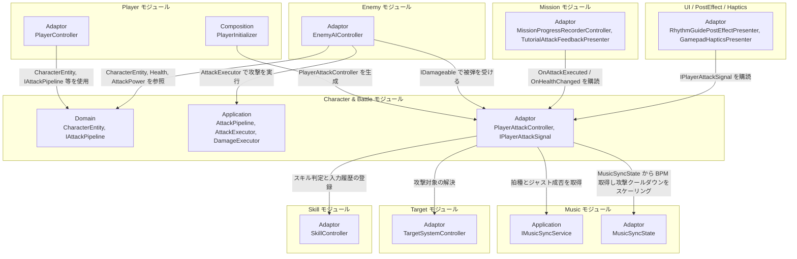

# キャラ&バトル

- page_id: 3957c2c6-cc02-80d8-b0c3-d586b36180fa
- Notion パス: Symphony Kill Chord / システム概要 / キャラ&バトル
- スナップショットの最終更新: 2026-09-09T03:31:54.452Z
- 書き込み許可: 可
- 処置: 本文置き換え

## 判定

- 信頼性: 一部古い — クラス表の 70 型のうち 69 型は実在する。`AttackPilpelineAsset` はファイル名の綴りで、クラス名は `AttackPipelineAsset`（`Runtime/5.InfraStructure/InGame/Battle/AttackPilpelineAsset.cs:13`）。01 棚卸し B 表は「誤字は Notion 側に無し」としていたが、Notion のクラス表と ⑤ Infrastructure にも残っている。PR #1513（2026-09-12）で追加した `PlayerAttackPresenter`・`PlayerAttackDto`・`IPlayerAttackSignal`・`PlayerAttackSignal` が表に無い。結合図の `ActionParams`、依存節の `BeatStep` は存在しない型で、ジャスト倍率を掛けるのは `WeaponDamageStep`（`Runtime/2.Application/InGame/Battle/WeaponDamageStep.cs:28-31`）。`PlayerAttackController` は `MusicSyncState` のほかに `IMusicSyncService`（拍種とジャスト判定）と Skill の `SkillController` にも依存する。repo の `NotionModuleDocs/Character&Battle.md` と Notion は同一（01 棚卸し B 表）
- 整合性:
  - 実装との矛盾: 上記
  - 他ページとの矛盾: `プレイヤー`（3957c2c6-cc02-8017-9b5f-c04dd480c816）は `PlayerHealthHudPresenter` を Player の Adaptor として載せ、このページは「`InGame/UI` モジュール（namespace `Adaptor.InGame.UI`）に属する」として除外している。実装の namespace は `KillChord.Runtime.Adaptor.InGame.Player`（`Runtime/3.Adaptor/InGame/Player/PlayerHealthHudPresenter.cs:5`）、`EnemyHealthHudPresenter` は `Runtime/3.Adaptor/InGame/Enemy/` にあり、`Adaptor.InGame.UI` にあるのは `IHealthHudViewModel`/`HealthHudDTO` だけである。注記を実装に合わせて直した
  - ジャスト倍率: 現行データでは全 6 武器の `_justDamageMultiplier` が 1（`Assets/Level/Data/Master/InGame/Battle/PlayerAttack_Beat*.asset:18`）で、`仕様概要 / リズム判定 / Just判定について` の 200% と食い違う（BT-01。仕様側の担当領域で要企画確認）
- 変更点:
  - 「概要」表: 旧: 最終更新日 2026-09-09 → 新: 2026-09-22
  - 「🏗️ クラス」: `AttackPipeline` 系の行 旧: `AttackPilpelineAsset` → 新: `AttackPipelineAsset`（ファイル名は `AttackPilpelineAsset.cs`）。`PlayerAttackPresenter`/`PlayerAttackDto`/`IPlayerAttackSignal`（Adaptor）と `PlayerAttackSignal`（View）の行を追加。`PlayerAttackController` の役割に判定と通知の経路を追記。`SkillHitScheduler` の役割の利用元を修正（`SkillHitController`・`Skill_13`、生成は `SkillInitializer`）
  - 「🏗️ クラス」表下の注記: 旧: HUD Presenter 群は `InGame/UI` モジュール（namespace `Adaptor.InGame.UI`）に属する → 新: 実装の配置（Player/Enemy/UI）に修正
  - 「🏗️ クラス」「② Application」: `PendingAttackEffectService` 旧: 次の通常攻撃へ付与する追加効果 → 新: 予約した効果はスキルを発動させたその攻撃で使われる（`TryExecuteSkill` の直後に `Consume`。`PlayerAttackController.cs:111-113`）
  - 「🧩 Composition初期化情報」: 節が無かったため新設（Initializer は無く、Player・Skill の Initializer が生成する旨）
  - 「🔗 モジュール結合」: `ActionParams` を削除。Skill（`SkillController`）への依存、Music の `IMusicSyncService`、Presenter → Signal の購読側（UI・Haptics・Mission）を追加
  - 「📥 依存しているもの」: Music の依存箇所に `IMusicSyncService` を追加し、旧: `BeatStep` が `JustDamageMultiplier` で計算 → 新: `WeaponDamageStep`。Skill の項を追加
  - 「📤 依存されているもの」: `IPlayerAttackSignal` の購読側（UI・Haptics・Mission のチュートリアル表示）を追加
  - 「⑤ Infrastructure」: `AttackPilpelineAsset` → `AttackPipelineAsset`、プレイヤーの攻撃パイプラインの現在の順序を追記
  - 「⑥ Composition」: 生成する Initializer を具体化
- 織り込んだ反映項目: BT-09（`IPlayerAttackSignal` 経路）
- 出典: 実装 `Runtime/1.Domain/InGame/Battle/**`、`Runtime/2.Application/InGame/Battle/**`、`Runtime/3.Adaptor/InGame/Battle/**`、`Runtime/4.View/InGame/Battle/**`、`PlayerAttackController.cs:36-179`、`PlayerInitializer.cs:320-340`、`SkillInitializer.cs:190-204`、`ACLikeRhythmGuideInitializer.cs:150-205`、`TutorialAttackFeedbackPresenter.cs:21`。マスターデータ `Assets/Level/Data/Master/InGame/Battle/PlayerAttackPipeline.asset:16-29`、`PlayerAttack_Beat*.asset:17-18`。PR #1513
- 要確認: なし（ジャスト倍率の扱いは BT-01 として仕様側で企画確認）

## 適用する本文

# 概要 {color="gray_bg"}

> 💡 **モジュール概要**
> インゲーム中のキャラクターパラメータ管理、戦闘時の攻撃力・防御力・クリティカル計算、ダメージパイプライン、およびバフ（ステータス効果）システムを司るモジュールである。

| 項目 | 内容 |
| --- | --- |
| **モジュール名** | Character & Battle |
| **カテゴリ** | InGame / Core |
| **ステータス** | 実装済み |
| **最終更新日** | 2026-09-22 |

---

## 🏗️ クラス {toggle="true"}

	| クラス名 | レイヤー | 役割・機能 |
	| --- | --- | --- |
	| **`CharacterEntity`** | Domain | キャラクター（プレイヤー/敵共通）の基底Entity。`IAttacker`/`IDefender`を実装し、HPや攻撃力などのコアデータを保持 |
	| **`HealthEntity`** / **`Health`** | Domain | HP変化の状態管理と、HP値を表すValueObject。変化は`CharacterEntity.OnHealthChanged`で通知する |
	| **`BarrierEntity`** | Domain | キャラクターが保持するバリア |
	| **`CharacterCombatSpec`** | Domain | そのキャラクターが使用できる攻撃定義を管理する |
	| **`CharacterDefinitionId`** / **`CharacterName`** | Domain | キャラクター定義の識別子と表示名 |
	| **`AttackPower`** / **`CriticalChance`** / **`CriticalMultiplier`** | Domain | 攻撃力・クリティカル率・クリティカル倍率のValueObject |
	| **`AttackCooldown`** / **`AttackRangeMin`** / **`AttackRangeMax`** / **`AttackRotationSpeed`** | Domain | 攻撃の間隔・射程・旋回速度のValueObject |
	| **`MoveSpeed`** / **`DodgeSpeed`** / **`DodgeDuration`** / **`DodgeCooldown`** | Domain | 移動と回避のValueObject |
	| **`AttackDefinition`** / **`AttackSpec`** | Domain | 攻撃定義と、攻撃に使うパラメータをまとめた構造体 |
	| **`AttackInterval`** / **`AttackIntervalEntity`** | Domain | 攻撃間隔の値と、その進行を管理するEntity |
	| **`AttackResult`** / **`Damage`** | Domain | 攻撃計算の結果と、ダメージ値 |
	| **`AttackStepContext`** | Domain | 各パイプラインステップへ渡すコンテキストのreadonly ref struct |
	| **`DamageDealtContext`** / **`DamageTakenContext`** | Domain | ダメージを与えた側・受けた側それぞれの情報 |
	| **`AttackTarget`** / **`BattleActionType`** | Domain | 攻撃対象の指定と、バトルアクションの種別 |
	| **`IAttacker`** / **`IDefender`** / **`IBarrierHolder`** | Domain | 攻撃側・防御側・バリア保持者の契約 |
	| **`IAttackPipeline`** / **`IAttackController`** | Domain | ダメージ計算パイプラインと、攻撃制御の契約 |
	| **`AttackPipeline`** | Application | 複数の攻撃処理ステップを順番に実行する |
	| **`AttackCalculator`** / **`AttackExecutor`** / **`DamageExecutor`** | Application | 計算・適用を担うピュアクラス群 |
	| **`IAttackStep`** | Application | パイプラインの1ステップを表す契約 |
	| **`ConfirmedDamage`** / **`CriticalStep`** / **`WeaponDamageStep`** / **`OutOfRangeDamageStep`** | Application | ダメージ確定・クリティカル抽選・武器倍率とジャスト倍率・射程外減衰の各ステップ |
	| **`AttackIntervalEvaluator`** | Application | 攻撃開始からの硬直時間を計測し、攻撃中フラグを管理する |
	| **`PendingAttackEffectService`** | Application | スキルが予約した命中時の追加効果を保持する。`PlayerAttackController`がスキル判定の直後に取り出すため、効果はスキルを発動させたその攻撃に乗る（空振りなら失われる） |
	| **`IAttackHitEffect`** | Application | 命中時の追加効果の契約 |
	| **`SkillHitScheduler`** | Application | 連撃スキルのヒットを時間差で適用するスケジューラ。`SetPlaybackSpeed`/`Schedule`/`Tick`/`Clear`の4APIを持つ。ダメージのタイミングの権限を持ち、エフェクトの生成可否には依存しない。Skillモジュールの`SkillInitializer`が生成し、`SkillHitController`・`Skill_13`から利用される |
	| **`PlayerAttackController`** | Adaptor | プレイヤーの攻撃を制御し、`OnAttackExecuted`を公開する。入力1回につき拍種とジャスト成否を1回だけ判定し、ダメージ・スキル・演出通知へ同じ結果を渡す。実体はPlayerモジュールの`PlayerModuleContainer`が保持する |
	| **`PlayerAttackPresenter`** / **`PlayerAttackDto`** / **`IPlayerAttackSignal`** | Adaptor | 入力時に確定した拍種とジャスト成否を、表示側へ入力1回につき1回渡す経路。空振り・通常攻撃のスキップ・多段ヒットでも通知は1回である |
	| **`PlayerBattleState`** | Adaptor | プレイヤーの戦闘中の状態を保持する |
	| **`IDamageable`** | Adaptor | ダメージを受けられるオブジェクトの契約 |
	| **`AttackResultPresenter`** / **`AttackResultDTO`** / **`IAttackResultViewModel`** | Adaptor | 攻撃結果（ヒットごと）をViewへ通知する経路 |
	| **`AttackResultView`** / **`AttackResultViewModel`** | View | 攻撃結果（ダメージ数値・クリティカル演出）の表示 |
	| **`PlayerAttackSignal`** | View | `IPlayerAttackSignal`の実装。攻撃成立を`OnAttackExecuted(拍数, ジャスト成否)`として購読側へ通知する |
	| **`IOneShotVisualEffect`** | View | ワンショット演出の再生契約 |
	| **`ParticleSystemPoolView`** / **`ParticleSystemRingBufferView`** / **`ReusableParticleSystemView`** | View | ParticleSystemのワンショット再生をプール・リングバッファで管理する |
	| **`ParticleSystemOneShotVisualEffect`** / **`PooledParticleSystemOneShotVisualEffect`** / **`VisualEffectGraphOneShotVisualEffect`** / **`SoundEffectOneShotVisualEffect`** | View | `IOneShotVisualEffect`の各実装 |
	| **`FootStepView`** | View | 足音演出の再生 |
	| **`CharacterDefinitionAsset`** / **`CharacterDefinitionRepository`** / **`CharacterFactory`** | Infrastructure | キャラクター定義アセットの保持・ID検索と、そこからの`CharacterEntity`生成 |
	| **`AttackDefinitionAsset`** / **`AttackDefinitionFactory`** / **`AttackSpecAsset`** / **`AttackPipelineAsset`** | Infrastructure | 攻撃定義・攻撃パラメータ・パイプラインのScriptableObjectと生成（`AttackPipelineAsset`のファイル名は`AttackPilpelineAsset.cs`） |

	> `PlayerHealthHudPresenter`（`Adaptor.InGame.Player`）・`EnemyHealthHudPresenter`（Enemyモジュール）と、`IHealthHudViewModel`/`HealthHudDTO`（`Adaptor.InGame.UI`）は本表から除外している。HP変化通知（`CharacterEntity.OnHealthChanged`）の連携先として、処理フロー②で参照する。

### 🧩 Composition初期化情報

| 項目 | 内容 |
| --- | --- |
| **Initializerクラス** | なし（PlayerモジュールとSkillモジュールのInitializerが構築する） |
| **公開する ModuleContainer / ServiceLocator登録型** | なし（`PlayerAttackController`と`IPlayerAttackSignal`は`PlayerModuleContainer`、`PendingAttackEffectService`は`SkillModuleContainer`が公開する） |

`PlayerInitializer`（Order 500）が`PlayerAttackController`・`PlayerAttackPresenter`・`PlayerAttackSignal`・`AttackResultPresenter`を生成する。`SkillInitializer`（Order 450）が`PendingAttackEffectService`と`SkillHitScheduler`を生成する。

---

## 🔗 モジュール結合

### 📥 依存しているもの

- **`Music`**
	- *依存箇所*: `IMusicSyncService`, `MusicSyncState`
	- *詳細*: `PlayerAttackController`が攻撃のたびに`GetCurrentBeatType(out isJustHit)`で拍種とジャスト成否を取得し、攻撃クールダウンの時間をBPMに基づいてスケーリングする。ジャスト入力ボーナスは`WeaponDamageStep`が`AttackDefinition.JustDamageMultiplier`で計算しており、バフの持続時間計算とは無関係である
- **`Target`**
	- *依存箇所*: `TargetSystemController`, `ITargetableViewModel`, `TargetAreaQuery`
	- *詳細*: `PlayerAttackController`が攻撃対象の解決と、扇形範囲の命中判定にTargetモジュールを利用する
- **`Skill`**
	- *依存箇所*: `SkillController`, `PendingAttackEffectService`（`SkillModuleContainer`経由）
	- *詳細*: `PlayerAttackController`が攻撃のたびに`SkillController.TryExecuteSkill`を呼び、スキルが通常攻撃のダメージを消すかどうかの指示を受ける。スキルが予約した命中時の追加効果を`PendingAttackEffectService`から取り出し、同じ攻撃に乗せる

### 📤 依存されているもの

- **`InGame/Player`**
	- *参照箇所*: `CharacterEntity`, `PlayerAttackController`, `AttackExecutor`
	- *詳細*: プレイヤーキャラクターのHP・ステータス情報を `CharacterEntity` として保持し、攻撃アクションのトリガーとして `PlayerAttackController` および `AttackExecutor` を介してダメージフローを実行する
- **`InGame/Enemy`**
	- *参照箇所*: `CharacterEntity`, `AttackExecutor`, `IDamageable`
	- *詳細*: 敵キャラクターがパラメータを`CharacterEntity`で表現し、AIの攻撃契機や被弾処理で攻撃実行と`IDamageable`を使用する。敵側の戦闘状態を持つ`EnemyBattleState`はEnemyモジュールに属する
- **`InGame/Mission`**
	- *参照箇所*: `CharacterEntity.OnHealthChanged`, `PlayerAttackController.OnAttackExecuted`, `IPlayerAttackSignal`
	- *詳細*: `MissionProgressRecorderController`がこれらのイベントを購読し、被ダメージ量・使用武器種・コンボ数をミッション評価条件として記録する。`TutorialAttackFeedbackPresenter`は`IPlayerAttackSignal`でチュートリアルの判定表示を出す
- **`InGame/UI`** / **`PostEffect`** / **`Haptics`**
	- *参照箇所*: `IPlayerAttackSignal`
	- *詳細*: `ACLikeRhythmGuideInitializer`が、全画面演出（`RhythmGuidePostEffectPresenter`）・ガイドの成功演出（`RhythmGuideTargetFeedbackPresenter`）・ゲームパッド振動（`GamepadHapticsPresenter`）へ結線する

---

# 詳細 {color="gray_bg"}

## 🧅レイヤー情報

### ① Domain

> キャラクターの基本戦闘能力（HP、攻撃力、クリティカル率など）を保持するEntityや、ダメージ計算パイプラインのインターフェース（`IAttackPipeline`）、コンテキストを定義する純粋なドメインルール層である。

### ② Application

> 攻撃計算の実行（`AttackPipeline`, `AttackCalculator`, `AttackExecutor`, `DamageExecutor`）と、その構成要素であるステップ（`CriticalStep`, `ConfirmedDamage`, `WeaponDamageStep`, `OutOfRangeDamageStep`）を実装する。攻撃の硬直管理（`AttackIntervalEvaluator`）と、スキルが予約した命中時の追加効果（`PendingAttackEffectService`）もここに属する。バフ・デバフの実体はStatusEffectモジュールとBuffモジュールにある。

### ③ Adaptor

> 攻撃コマンドを実行する`PlayerAttackController`、プレイヤーの戦闘状態を持つ`PlayerBattleState`、ダメージを受けられる対象の契約`IDamageable`、結果をUI側へ中継する`AttackResultPresenter`、および攻撃成立の判定結果を演出側へ渡す`PlayerAttackPresenter`/`IPlayerAttackSignal`を定義する。

### ④ View

> Presenterが配信したDTOを受け取って、画面にダメージ数値をポップアップ描画したり、HPバーを滑らかに変動させたりするUnityの描画・UIコンポーネントを担当する。`PlayerAttackSignal`は攻撃成立を購読側へ配るイベントの窓口である。

### ⑤ Infrastructure

> `CharacterDefinitionAsset`と`CharacterDefinitionRepository`がキャラクター定義をIDで引けるようにし、`CharacterFactory`がそこから`CharacterEntity`を生成する。攻撃側は`AttackDefinitionAsset`・`AttackSpecAsset`・`AttackPipelineAsset`が定義を保持し、`AttackDefinitionFactory`がDomainへ変換する。プレイヤーの6武器の攻撃定義（`PlayerAttack_Beat*.asset`）は、すべて`PlayerAttackPipeline.asset`（`CriticalStep` → `WeaponDamageStep` → `OutOfRangeDamageStep` の順）を使う。

### ⑥ Composition

> 当モジュールのクラスの依存解決（DI）は、呼び出し側となる Player・Skill・Enemy モジュールの初期化コンポーネント内で行われる。プレイヤーの攻撃制御は`PlayerInitializer`、連撃スケジューラと追加効果の管理は`SkillInitializer`が生成する。

## 🔄処理フロー

主要な処理フローは、それぞれ子ページに分けている。

<page url="https://www.notion.so/3bf7c2c6cc02815fbe7df3fe8018830c">① プレイヤー攻撃実行フロー（入力イベント時）</page>

<page url="https://www.notion.so/3bf7c2c6cc0281de8e4bd03a21ab3c44">② HP 変化とHUDへの反映フロー（ダメージ被弾時）</page>

<page url="https://www.notion.so/3bf7c2c6cc0281938e0ce0604f828db6">③ 状態効果の適用フロー（攻撃前後）</page>

<page url="https://www.notion.so/3d67c2c6cc02811bac59e928713c9cc2">④ SkillHitSchedulerによる連撃タイミング制御</page>
