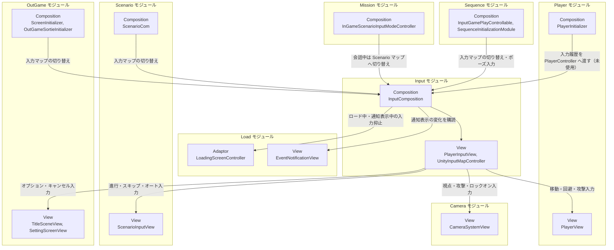

# 入力

- page_id: 3bf7c2c6-cc02-8100-8e00-d8124e5c09bc
- Notion パス: Symphony Kill Chord / システム概要 / 入力
- スナップショットの最終更新: 2026-08-17T17:57:28.956Z
- 書き込み許可: 可
- 処置: 本文置き換え

## 判定

- 信頼性: 一部古い — クラス表の 16 型はすべて実在し、`InputComposition` の Order 50 も正しい（`Runtime/6.Composition/Persistent/Input/InputComposition.cs:25`）。ただし、2026-09-04 に削除された `ReturnToTitleInitializer` が結合図・依存節に残っている。`PlayerInputView` のイベント一覧に「位置リセット」「タイトル復帰」が残り、シナリオ操作の 6 イベントが無い（`Runtime/4.View/Persistent/Input/PlayerInputView.cs:25-51`）。入力履歴（`InputBufferingQueue`）は記録するだけで、Music/Skill は読んでいない（BT-22）。ServiceLocator には `PlayerInputView` のほかに `InputComposition` 自身も登録し、ロード中と通知表示中は入力を抑止する（PR 由来の機能で、記述が無い）。repo の `NotionModuleDocs/Input.md` と Notion は同一（01 棚卸し B 表）
- 整合性:
  - 実装との矛盾: 上記。スキルの判定は Music の `RhythmState`（`MusicSyncService` 内、容量 64）と、スキルごとの `SkillRhythmState` を使う（`Runtime/2.Application/InGame/Music/MusicSyncService.cs:24,219`）。`PlayerController` は `InputBufferingQueue` をフィールドに持つだけで参照しない（`Runtime/3.Adaptor/InGame/Player/PlayerController.cs:20,24-27`）。読むのは開発用の `InputDebugLogger`（`Assets/Scripts/Develop/Composition/Persistent/Input/InputDebugLogger.cs:17`）だけである
  - 他ページとの矛盾: `プレイヤー`（3957c2c6-cc02-8017-9b5f-c04dd480c816）の「入力制御（インプットバッファリング）」も同じ誤り（同領域の原稿で修正）。用語 `入力バッファリング【要確認】`（3a37c2c6-cc02-800b-81bd-fef4026dd658）は「実装あり・未使用」として確定できる（用語は担当外）
- 変更点:
  - 「概要」: モジュール概要の「リズム判定用の入力履歴の記録」を「入力履歴の記録（現在は読み手が無い）」に修正。表の最終更新日 旧: 2026-08-17 → 新: 2026-09-22
  - 「🏗️ クラス」: `InputBufferingQueue` と `RecordController` の役割に「現在は読み手が無い」を追記。`UnityInputMapController` の役割に 5 つの入力マップと入力抑止を追記。表下の注記のイベント一覧 旧: …位置リセット・タイトル復帰 → 新: シナリオ操作（進行・早送り・一時停止・スキップ・オート・UI非表示）、モバイルの回避フリックを追加
  - 「🧩 Composition初期化情報」: 旧: `PlayerInputView`をServiceLocatorへ登録する → 新: `PlayerInputView` と `InputComposition`（入力マップ制御と入力履歴を公開）を登録する。`Ready` で `LoadingScreenController`・`EventNotificationView` を取得する旨を追記
  - 「🔗 モジュール結合」: `ReturnToTitleInitializer` と「`I_Domain -->|入力履歴の提供| M_App`」を削除。Sequence のノードを `InputGamePlayControllable, SequenceInitializationModule` に変更。Mission・Load・OutGame（Screen/Title/Sortie）とシーン遷移を追加
  - 「📥 依存しているもの」: 旧: なし → 新: Load（ロード画面・イベント通知）
  - 「📤 依存されているもの」: Sequence の詳細 旧: `ReturnToTitleInitializer`はESC長押しを購読する → 新: `SequenceInitializationModule` がオプション入力で戦闘ポーズを開き、`BattlePauseModule` がポーズ中の入力マップを切り替える。`Music / Skill` の項（入力履歴でリズムコマンドを判定）を削除し、Player の項に「入力履歴は保持するだけ」を追記。Mission・OutGame・シーン遷移の項を追加
  - 「① Domain」「② Application」「⑥ Composition」: 入力履歴に読み手が無いこと、登録型、入力抑止を追記
  - 末尾に「🎮 入力マップと割り当て」節を新設（入力アセットのマップ別の割り当て。OG-218 の技術詳細）
- 決定（2026-09-22 八幡）: R56 ゲームパッドの決定・キャンセルは設定で切り替えられるようにし、既定は海外式（決定 = South / キャンセル = East）とする。「🎮 入力マップと割り当て」の表の後ろの段落に仕様と現状（日本式）を書き、【要確認】（OG-218）を外した
- 実装の修正が必要: R56 決定・キャンセルの配置を切り替える設定を作り、既定を South 決定にする（Issue #2068、根拠 `Assets/Settings/Input/KillChordInputActioMap.inputactions` の OutGame / UI の Submit が East、Cancel が South）
- 織り込んだ反映項目: BT-22, OG-218（技術詳細のうち入力マップと割り当て。フォーカス表示・Navigation 系クラスは `Runtime/4.View/OutGame/Navigation/` のアウトゲーム側で、新規の仕様ページ `アウトゲーム操作（コントローラー）` の担当）
- 出典: 実装 `InputComposition.cs:25-57,170-216`、`PlayerInputView.cs:25-51`、`UnityInputMapController.cs:14-70`、`RecordController.cs`、`InputBufferingQueue.cs`、`SequenceInitializationModule.cs:195`、`BattlePauseModule.cs:34,50`、`InputGamePlayControllable.cs:26,42`、`InGameScenarioInputModeController.cs:21,27`、`SceneTransitionInitializer.cs:49-51`、`ScenarioInputView.cs:131-136`、入力アセット `Assets/Settings/Input/KillChordInputActioMap.inputactions`、`Assets/Level/Scenes/Master/Persistent.unity:628`（`_bufferCapacity: 10`）
- 決定（2026-09-22 八幡）: R13 入力履歴 `InputBufferingQueue` は先行入力のために残す。「🏗️ クラス」の `InputBufferingQueue` の行を「先行入力のために残している（現状は読む処理が無い）」にした
- 決定（2026-09-22 八幡）: R29 スマホの視点操作は画面右半分のスワイプが基本で、コントローラーを繋げばスティックでも操作できる。「🏗️ クラス」の `MobileInput` の行に書き、現状（全画面）を併記した
- 実装の修正が必要: R29 スマホの視点操作を画面右半分のスワイプに限る（根拠 `Assets/Level/Prefabs/Master/InGame/SmartphoneCanvas.prefab:445-463` の `TouchArea` は 1920×1080 の全画面、`Assets/Scripts/Runtime/4.View/Persistent/Input/MobileInput.cs:151-165` はタグだけを見て左右を判定しない。右スティックは `Assets/Settings/Input/KillChordInputActioMap.inputactions:309` で割り当て済み）
- 要確認: なし

## 適用する本文

# 概要 {color="gray_bg"}

> 💡 **モジュール概要**
> Unity Input Systemを包み、ゲーム内の入力を`InputContext`として各モジュールへ配る常駐モジュールである。入力マップの切り替えと、入力履歴の記録も担当する（入力履歴は現在どのモジュールも読んでいない）。

| 項目 | 内容 |
| --- | --- |
| **モジュール名** | Input |
| **カテゴリ** | Persistent |
| **ステータス** | 実装済み |
| **最終更新日** | 2026-09-22 |

---

## 🏗️ クラス {toggle="true"}

	| クラス名 | レイヤー | 役割・機能 |
	| --- | --- | --- |
	| **`InputActionId`** | Domain | 入力アクションを識別するID |
	| **`BufferedInput`** | Domain | 履歴に保存される入力データ |
	| **`InputBufferingQueue`** | Domain | 入力をバッファリングする。先行入力のために残している（現状は読む処理が無い） |
	| **`InputBufferRecorder`** | Application | 入力を`BufferedInput`へ変換してバッファへ記録する |
	| **`InputContext`** | Adaptor | 入力1件分の共通データ。値の型ごとにジェネリックで扱う |
	| **`InputActionKind`** | Adaptor | 入力の種類を表す列挙型 |
	| **`InputIdConverter`** | Adaptor | `InputActionKind`を`InputActionId`へ変換する |
	| **`InputTimestampProvider`** | Adaptor | 入力履歴用の時刻取得 |
	| **`RecordController`** | Adaptor | 入力を履歴保存用に変換して`InputBufferRecorder`へ渡す。記録するのはオプション・決定・キャンセル・回避・攻撃・移動・マウス視点の入力である |
	| **`PlayerInputView`** | View | 入力イベントを受け取り`InputContext`を生成して外部へ通知する。当モジュールの主要な窓口 |
	| **`UnityInputMapController`** | View | Unity Input Systemの`InputActionMap`を制御する。Common・InGame・OutGame・Scenario・UIの5マップを、「Commonと1つ」「1つだけ」「すべて無効」で切り替え、ロード中などの入力抑止も受け持つ |
	| **`InputMapNames`** | View | 入力マップ名を定数で管理する |
	| **`MobileInput`** | View | モバイルの視点操作領域からドラッグとフリック入力を通知する。スマホの視点操作は画面右半分のスワイプが基本である（コントローラーを接続すれば右スティックでも操作できる）。現状の視点操作領域（`SmartphoneCanvas`の`TouchArea`）は全画面で、右半分に限っていない（修正が必要） |
	| **`MobileStickFlickInput`** / **`MobileStickFlickInputConfig`** | View | 仮想スティック上のポインター軌跡からフリック方向を通知する |
	| **`InputComposition`** | Composition | 入力まわりの初期化（Order 50） |

	`PlayerInputView`が公開する入力イベントは、移動・視点（マウス／ゲームパッド／モバイル）・攻撃・回避（モバイルのフリック回避を含む）・ロックオン・ロックオン対象切替・決定・キャンセル・オプションと、シナリオ操作（進行・早送り・一時停止・スキップ・オート・UI非表示）である。値の型は`float`か`Vector2`で、モバイルのロックオン対象切替を除き`InputContext<T>`として渡す。

### 🧩 Composition初期化情報

| 項目 | 内容 |
| --- | --- |
| **Initializerクラス** | `InputComposition` |
| **Order** | 50（Persistentシーン内。カメラ(40)の後、多くのInGameモジュールより前） |
| **公開する ModuleContainer / ServiceLocator登録型** | `PlayerInputView`と、`InputComposition`自身（`GetInputMapController`で`UnityInputMapController`、`GetBufferedInputBuffer`で`InputBufferingQueue`を公開する）をServiceLocatorへ登録する |

`Ready`でロード画面の`LoadingScreenController`とイベント通知の`EventNotificationView`を取得し、ロード中または通知の表示中は入力通知と全入力マップを止める。どちらかが終わっても、もう一方が続いている間は止めたままにする。

---

## 🔗 モジュール結合

### 📥 依存しているもの

- **`Load`**
	- *依存箇所*: `LoadingScreenController`, `EventNotificationView`
	- *詳細*: `InputComposition`が`Ready`で取得し、ロード中とイベント通知の表示中に入力を抑止する。取得できない場合は`Ready`が失敗する

### 📤 依存されているもの

- **`Camera`**
	- *参照箇所*: `PlayerInputView`, `MobileInput`
	- *詳細*: 視点移動・ロックオン・攻撃の各入力を購読する。Android実行時は`MobileInput`と結線する
- **`Player`**
	- *参照箇所*: `PlayerInputView`, `InputComposition`
	- *詳細*: 移動・回避・攻撃の入力を購読する。`PlayerInitializer`は入力履歴（`InputBufferingQueue`）を`PlayerController`へ渡すが、`PlayerController`は参照していない
- **`Scenario`**
	- *参照箇所*: `PlayerInputView`, `InputComposition`
	- *詳細*: `ScenarioInputView`が進行・早送り・一時停止・スキップ・オート・UI非表示へ変換する。`ScenarioCom`は会話の開始と終了で入力マップを`Scenario`と`OutGame`の間で切り替える
- **`Sequence`**
	- *参照箇所*: `UnityInputMapController`, `PlayerInputView`
	- *詳細*: `InputGamePlayControllable`が入力マップを`InGame`と`Common`の間で切り替える。`SequenceInitializationModule`はオプション入力で戦闘ポーズを開き、`BattlePauseModule`がポーズ中は`Common`だけに切り替える
- **`Mission`**
	- *参照箇所*: `InputComposition`, `PlayerInputView`
	- *詳細*: `InGameScenarioInputModeController`がインゲームの会話中だけ入力マップを`Scenario`へ切り替える
- **`OutGame`**
	- *参照箇所*: `InputComposition`, `PlayerInputView`
	- *詳細*: `ScreenInitializer`・出撃処理が入力マップを`OutGame`（出撃前の会話では`Scenario`）へ切り替える。タイトル・メニュー・設定画面がオプション入力とキャンセル入力を購読する
- **`SceneManagement`**
	- *参照箇所*: `InputComposition`
	- *詳細*: `SceneTransitionInitializer`がシーン遷移の開始時に全入力マップを無効にする

---

# 詳細 {color="gray_bg"}

## 🧅レイヤー情報

### ① Domain

入力アクションの識別子と、履歴として保存する入力データ、そのバッファリングを保持する。バッファの容量は`InputComposition`の`_bufferCapacity`（現在値 10。`Persistent.unity`）で決まる。

### ② Application

`InputBufferRecorder`が入力を履歴用の形へ変換して記録する。記録した履歴を読むゲーム側の処理は現在無い（リズム判定はMusicモジュールの`RhythmState`、スキルの判定はスキルごとの`SkillRhythmState`を使う）。

### ③ Adaptor

`InputContext`が入力1件分の共通データを表し、`InputActionKind`と`InputActionId`の変換、履歴用の時刻取得、記録の仲介を担当する。

### ④ View

`PlayerInputView`がUnity Input Systemのイベントを受け、`InputContext`として外部へ通知する。入力マップの制御と、モバイル固有の操作（視点ドラッグ、仮想スティックのフリック）も同層にある。

### ⑤ Infrastructure

当モジュールでは使用していない。

### ⑥ Composition

`InputComposition`（Order 50）が入力まわりを構築し、`PlayerInputView`と`InputComposition`自身を公開する。ロード中と通知表示中の入力抑止も担当する。

## 🔌 拡張ポイント

| 拡張したいこと | 実装する場所 | 追加登録の要否 |
| --- | --- | --- |
| 新しい入力アクションを追加したい | Unity Input Systemのアセットへアクションを追加し、`PlayerInputView`へイベントと通知処理を足す。履歴に残す場合は`InputActionKind`と`InputIdConverter`も更新する | 必要（`InputIdConverter`への追記を忘れると、入力は通知されるが履歴に残らない） |
| 入力マップを増やしたい | `InputMapNames`へ定数を追加し、`UnityInputMapController`で切り替える | 必要（定数の追加漏れは文字列指定の取り違えにつながる） |

## 🔄処理フロー

主要な処理フローは、それぞれ子ページに分けている。

<page url="https://www.notion.so/3bf7c2c6cc0281698adede45506dca3c">① 入力の通知フロー</page>

<page url="https://www.notion.so/3bf7c2c6cc02813385d8d8821dffb628">② 入力履歴の記録フロー</page>

## 🎮 入力マップと割り当て

入力アセット`Assets/Settings/Input/KillChordInputActioMap.inputactions`の割り当てである。変更するときはアセットを直し、この表も更新する。

| マップ | アクション | キーボード・マウス | ゲームパッド |
| --- | --- | --- | --- |
| Common | Option | Esc | Start |
| InGame | Move | W / A / S / D | 左スティック |
| InGame | Look | マウス移動 | 右スティック |
| InGame | Attack | 左クリック | 右トリガー / East |
| InGame | Dodge | Space | South |
| InGame | LockOn | ホイールクリック | 左トリガー |
| InGame | LockOnSelect | Q / R | 左ショルダー / 右ショルダー |
| OutGame | Submit | Enter | East |
| OutGame | Cancel | Esc | South |
| UI | Navigate | W / A / S / D / 矢印キー | 左右スティック / 十字キー |
| UI | Submit | Submit（Enter） | East |
| UI | Cancel | Cancel（Esc） | South |
| Scenario | Advance | 左クリック / Enter | East |
| Scenario | FastForward | 左Shift | South |
| Scenario | Pause | Space | Start |
| Scenario | Skip | Esc | North |
| Scenario | Auto | Ctrl | West |
| Scenario | HideUI | W | 右ショルダー |

ゲームパッドの East は Xbox の B / PlayStation の ○、South は Xbox の A / PlayStation の × である。現状は決定を East、キャンセルを South に置く日本式の配置である。仕様は、設定で切り替えられるようにし、既定は海外式（決定 = South / キャンセル = East）とする（未実装、#2068）。
