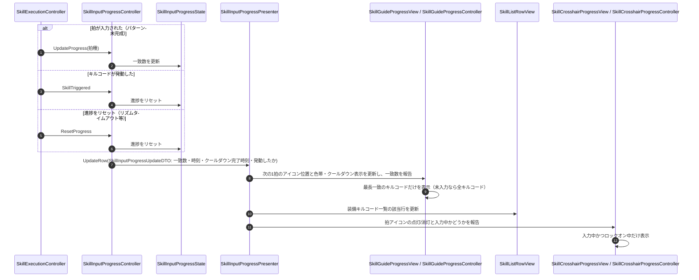

# ② 入力進捗の表示フロー

- page_id: 3bf7c2c6-cc02-8110-8f4b-d3f8a5738048
- Notion パス: Symphony Kill Chord / システム概要 / スキル / ② 入力進捗の表示フロー
- スナップショットの最終更新: 2026-08-17T13:21:31.236Z
- 書き込み許可: 可
- 処置: 本文置き換え

## 判定

- 信頼性: 一部古い — 図はクロスヘアと装備スキル一覧だけで、リズムガイド下のスキル入力ガイド（`SkillGuideProgressView`・`SkillGuideProgressController`。PR #1880 → 取り消し → #1889 → #1896）が無い（BT-12）。入力を受けて更新するのは `SkillController` ではなく、スキルごとの `SkillExecutionController` が持つ `SkillInputProgressController` である。`SkillInputProgressState` が Presenter へ通知するのではなく、Controller が State を更新してから Presenter を呼ぶ（`Runtime/3.Adaptor/InGame/Skill/SkillUI/SkillInputProgressController.cs`、`SkillInputProgressPresenter.cs`）。クロスヘアはロックオン中だけ表示し、ロックオンの着脱に毎フレーム追従する（`SkillCrosshairProgressController.cs`）
- 整合性: `仕様概要 / インゲームHUD / リズムUI`（3437c2c6-cc02-8037-8dac-d9c3d3ae1e4e）には「スキル入力ガイド」の記述が無い（BT-12 の仕様側。担当外）。全ゲージに拍の色を常時出す案は PR #1907 で取り消した（仕様側の記載で扱う）
- 変更点:
  - 冒頭の説明文: 旧: クロスヘア・ガイド・装備スキル一覧の3か所へ同時に反映 → 新: 3 か所それぞれの表示条件（ガイドは最長一致だけ、クロスヘアはロックオン中だけ）と、ガイドのアイコン・色帯・クールダウンの表し方を追記
  - シーケンス図: 参加者を `SkillExecutionController` / `SkillInputProgressController` / `SkillInputProgressState` / `SkillInputProgressPresenter` / `SkillGuideProgressView`+`SkillGuideProgressController` / `SkillListRowView` / `SkillCrosshairProgressView`+`SkillCrosshairProgressController` に変更。進捗・発動・リセットの 3 契機を追加
  - 本文末尾に入力成功・リセット時の演出値の表を追加（数値が 3 つ以上並ぶため）
- 織り込んだ反映項目: BT-12
- 出典: 実装 `SkillInputProgressController.cs`、`SkillInputProgressPresenter.cs`、`SkillGuideProgressController.cs`、`SkillCrosshairProgressController.cs`、`Runtime/4.View/InGame/Skill/SkillUI/SkillGuideProgressView.cs:17-215`、`Runtime/4.View/InGame/Music/ACLikeRhythmGuideView.cs:321-340`（`TryGetBeatRange`）、`SkillInitializer.cs:463-470`、マスターデータ `Assets/Level/Data/Master/InGame/Skill/SkillInputProgressUIConfig.asset:40-50`。PR #1880、#1889、#1896、#1907
- 決定（2026-09-22 八幡）: No.1 冒頭の説明文、表示先の箇条書き（キルコード入力ガイド・クロスヘア・装備キルコード一覧）、シーケンス図のラベルの説明語「スキル」を「キルコード」に直した（クラス名は変えていない）
- 要確認: なし

## 適用する本文

入力途中の状態を、リズムガイド下のキルコード入力ガイド・クロスヘア・装備キルコード一覧の3か所へ反映する。進捗が変わるのは、拍が入力されたとき・キルコードが発動したとき・進捗がリセットされたとき（リズムタイムアウトなど）である。

- キルコード入力ガイド: 未入力のときは全キルコードの走り出しを、入力中は最も進んでいるキルコードだけを表示する。各キルコードの「次に入力する1拍」のアイコンを、リズムガイドの同じ拍のジャスト位置へ左右対称に出す。その拍のジャスト中心を含む同じ色のブロックの区間に色帯を付ける（色帯はキルコードの次の対象拍にだけ付け、ゲージ全体には出さない）。クールダウン中はゲージで残り時間を示す
- クロスヘア: 入力中のキルコードを、ロックオン対象がいる間だけ表示する。同じ拍で始動した複数のキルコードはすべて表示する。ロックオンの着脱には毎フレーム追従する
- 装備キルコード一覧: 該当キルコードの行の拍ステップを更新する

入力成功時とリセット時のアイコンの演出値である。値の正本は`Assets/Level/Data/Master/InGame/Skill/SkillInputProgressUIConfig.asset`である。

| 名前 | 値 | 単位 | 正本 |
| --- | --- | --- | --- |
| 入力成功時の拡大 | 1.25 | 倍 | `_inputSuccessScaleMultiplier` |
| 入力成功時の回転 | 12 | 度 | `_inputSuccessRotationAngle` |
| 入力成功時の演出時間 | 0.3 | 秒 | `_inputSuccessDuration` |
| リセット時の揺れ幅 | 20 | UI座標の距離 | `_resetShakeDistance` |
| リセット時の揺れ時間 | 0.35 | 秒 | `_resetShakeDuration` |
