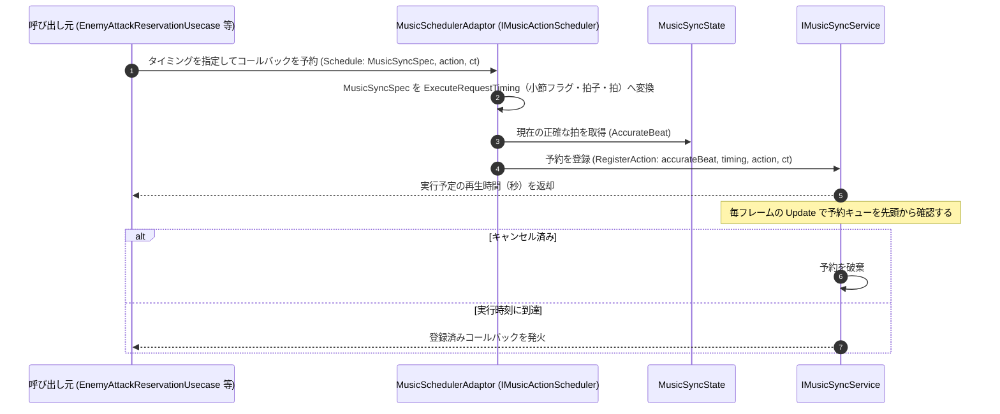

# ③ リズムアクション予約フロー（Enemy 等の外部モジュールから）

- page_id: 3bf7c2c6-cc02-8125-a337-cc26fa0cbb3f
- Notion パス: Symphony Kill Chord / システム概要 / 音楽 / ③ リズムアクション予約フロー（Enemy 等の外部モジュールから）
- スナップショットの最終更新: 2026-08-17T13:21:11.176Z
- 書き込み許可: 可
- 処置: 本文置き換え

## 判定

- 信頼性: 一部古い — 「`IMusicSyncService` が `IMusicActionScheduler` に実行チェックを依頼し、Scheduler がコールバックを発火する」という図は実装と違う。`MusicSchedulerAdaptor`（`IMusicActionScheduler` の実装）は予約を `IMusicSyncService.RegisterAction` へ渡すだけで、実行は `MusicSyncService.Update` が優先度キューから直接行う（`Runtime/3.Adaptor/InGame/Music/MusicSchedulerAdaptor.cs`、`Runtime/2.Application/InGame/Music/MusicSyncService.cs:73-92,166-174`）。「指定ビート数後」ではなく「現在/次の小節と小節内の拍」で指定する（`MusicSyncSpec` → `ExecuteRequestTiming`）。予告用の `LeadNotificationScheduler` が無い
- 整合性: 親ページ `音楽` の原稿と一致させた
- 変更点:
  - 冒頭の説明文: 旧: 指定ビート後にコールバックを登録 → 新: 小節と拍で指定したタイミングにコールバックを登録。予告を遡って予約する `LeadNotificationScheduler` を追記
  - シーケンス図: `MusicSchedulerAdaptor` による変換、`RegisterAction` の戻り値（実行予定の再生時間）、`Update` 内でのキャンセル済み予約の破棄と実行を追加
- 織り込んだ反映項目: BT-09（音楽ページのフロー更新の一部）
- 出典: 実装 `IMusicActionScheduler.cs`、`MusicSchedulerAdaptor.cs`、`LeadNotificationScheduler.cs`、`MusicSyncService.cs:73-92,160-174`、`EnemyLifeCycle.cs:149`・`BossLifeCycle.cs:145`・`ShellLifeCycle.cs:79`・`StageEffectInitializer.cs:73`
- 要確認: なし

## 適用する本文

Enemy などの外部モジュールが `IMusicActionScheduler` を使って、小節と拍で指定したタイミングにコールバックを登録する処理フローである。`IMusicActionScheduler` の実装は`MusicSchedulerAdaptor`で、敵・ボス・砲弾の生成処理と`StageEffectInitializer`が生成する。攻撃予告のように基準タイミングより前に鳴らす通知は、`LeadNotificationScheduler`が指定拍数だけ遡ったタイミングを計算して同じ経路で予約する。

