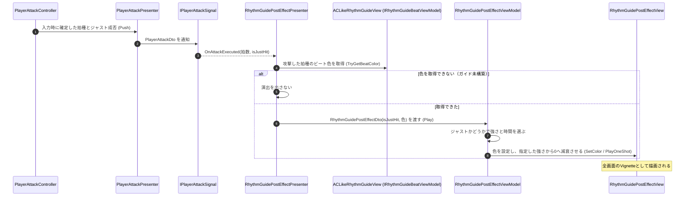

# ① 攻撃時の全画面演出フロー

- page_id: 3bf7c2c6-cc02-812b-ac16-d305bb01f5aa
- Notion パス: Symphony Kill Chord / システム概要 / リズムガイド全画面演出 / ① 攻撃時の全画面演出フロー
- スナップショットの最終更新: 2026-08-24T13:46:56.898Z
- 書き込み許可: 可
- 処置: 本文置き換え

## 判定

- 信頼性: 陳腐化 — 図の「Presenter → `RhythmJustService`: ジャスト成否と現在のビート色を取得」は、PR #1513（2026-09-12）で `RhythmJustService` を削除したため成り立たない。現行は `PlayerAttackController` が判定した結果を `PlayerAttackPresenter` → `IPlayerAttackSignal.OnAttackExecuted(拍数, isJustHit)` で受け取り、ビート色は `ACLikeRhythmGuideView`（`IRhythmGuideBeatViewModel`）から取る（`Runtime/3.Adaptor/InGame/PostEffect/RhythmGuidePostEffectPresenter.cs:50-60`）
- 整合性: 親ページの原稿、`音楽 / ② プレイヤー入力に対するジャスト判定フロー`（3bf7c2c6-cc02-81c9-8bc6-ea98fd68d791）の原稿と同じ経路にそろえた
- 変更点:
  - シーケンス図: 旧: `Attack -->> Presenter: OnAttackExecuted` → `Presenter ->> Just (RhythmJustService)` → 新: `Attack ->> AttackPresenter: Push` → `Signal -->> Presenter: OnAttackExecuted(拍数, isJustHit)` → `Presenter ->> Guide: TryGetBeatColor`。色が取れないときは演出を出さない分岐と、強さ・時間の選び分けを追加
  - 冒頭の説明文: 空振りでも演出が出る旨を追記
- 織り込んだ反映項目: BT-09
- 出典: 実装 `PlayerAttackController.cs:127-128`、`PlayerAttackPresenter.cs`、`PlayerAttackSignal.cs`、`RhythmGuidePostEffectPresenter.cs:50-60`、`RhythmGuidePostEffectViewModel.cs`（`Play`）、`RhythmGuidePostEffectView.cs`（`SetColor`・`PlayOneShot`）
- 要確認: なし

## 適用する本文

攻撃のたびに、ジャストできたかどうかを画面全体で返す。入力1回につき1回再生し、空振りでも再生する。

