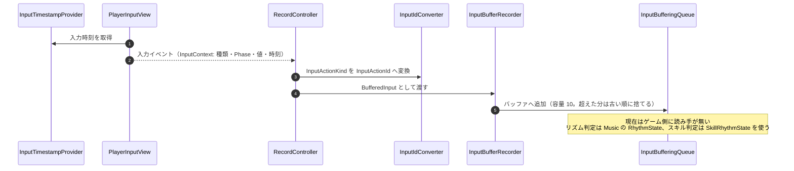

# ② 入力履歴の記録フロー

- page_id: 3bf7c2c6-cc02-8133-85d8-d8821dffb628
- Notion パス: Symphony Kill Chord / システム概要 / 入力 / ② 入力履歴の記録フロー
- スナップショットの最終更新: 2026-08-17T17:57:28.955Z
- 書き込み許可: 可
- 処置: 本文置き換え

## 判定

- 信頼性: 一部古い — 記録の流れ（`RecordController` → `InputIdConverter` → `InputBufferRecorder` → `InputBufferingQueue`）は実装どおり。ただし図の Note「リズムコマンドの判定側が、拍と突き合わせて参照する」と冒頭の「リズム判定のため」は誤りである。`InputBufferingQueue` を読むゲーム側の処理は無く、購読しているのは開発用の `InputDebugLogger` だけである（`Assets/Scripts/Develop/Composition/Persistent/Input/InputDebugLogger.cs:17`）。時刻は `RecordController` が取るのではなく、`PlayerInputView` が `InputContext` を作るときに `InputTimestampProvider` から取る
- 整合性: 親ページ `入力`・`プレイヤー`（3957c2c6-cc02-8017-9b5f-c04dd480c816）の原稿と一致させた
- 変更点:
  - 冒頭の説明文: 旧: リズム判定のため、入力を時刻付きでバッファへ残す → 新: 入力を時刻付きでバッファへ残す（現在は読み手が無い）。記録対象のアクションを追記
  - シーケンス図: 時刻の取得を `PlayerInputView` 側へ移し、`InputContext` から時刻を受け取る形に修正。Note 旧: リズムコマンドの判定側が参照する → 新: 現在はゲーム側に読み手が無い（リズム判定は Music の `RhythmState` を使う）。容量を超えたときの扱いを追記
- 織り込んだ反映項目: BT-22
- 出典: 実装 `Runtime/3.Adaptor/Persistent/Input/RecordController.cs`、`Runtime/4.View/Persistent/Input/PlayerInputView.cs:112-115`、`Runtime/6.Composition/Persistent/Input/InputComposition.cs:170-216`、`Runtime/1.Domain/Persistent/Input/InputBufferingQueue.cs`、`Assets/Level/Scenes/Master/Persistent.unity:628`
- 要確認:
  - 【要確認: プログラム担当】読み手の無い入力履歴を残すか削除するか（用語 `入力バッファリング【要確認】` の確定と合わせて判断する）

## 適用する本文

入力を時刻付きでバッファへ残す。記録するのはオプション・決定・キャンセル・回避・攻撃・移動・マウス視点の入力である。記録した履歴を読むゲーム側の処理は現在無い。【要確認: 残すか削除するかをプログラム担当に確認】

