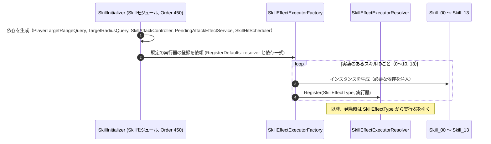

# ① 実行器の登録フロー（初期化時）

- page_id: 3bf7c2c6-cc02-8133-b82b-de2ef61e9249
- Notion パス: Symphony Kill Chord / システム概要 / スキル効果 / ① 実行器の登録フロー（初期化時）
- スナップショットの最終更新: 2026-08-17T18:04:33.107Z
- 書き込み許可: 可
- 処置: 本文置き換え

## 判定

- 信頼性: 一部古い — 流れ（`SkillInitializer` → `SkillEffectExecutorFactory.RegisterDefaults` → `resolver.Register(SkillEffectType, 実行器)`）は実装どおり。ただし、登録の前に `SkillInitializer` が依存（`SkillAttackController`・`PendingAttackEffectService`・範囲クエリ 2 種・`SkillHitScheduler`）を生成して渡すこと、登録されるスキル ID（0〜10 と 13）が書かれていない（`Runtime/6.Composition/InGame/Skill/SkillInitializer.cs:184-204`、`Runtime/2.Application/Player/SkillEffect/SkillEffectExecutorFactory.cs:23-41`）
- 整合性: 親ページ `スキル効果` の原稿（依存を受け取るスキル 2・7・8・9・13）と一致させた
- 変更点:
  - 冒頭の説明文: 登録されるスキル ID と、依存を受け取るスキルを追記
  - シーケンス図: 依存の生成（`PlayerTargetRangeQuery`・`TargetRadiusQuery`・`SkillAttackController`・`PendingAttackEffectService`・`SkillHitScheduler`）と `RegisterDefaults` の引数を追加
- 織り込んだ反映項目: なし（実装との整合修正）
- 出典: 実装 `SkillInitializer.cs:184-205`、`SkillEffectExecutorFactory.cs`
- 要確認: なし

## 適用する本文

スキル種別と実行器の対応は、初期化時に手動で登録される。登録されるのはスキル0〜10と13の12件である。スキル2・7・8・9・13の実行器は、`SkillInitializer`が生成した依存を受け取る。

