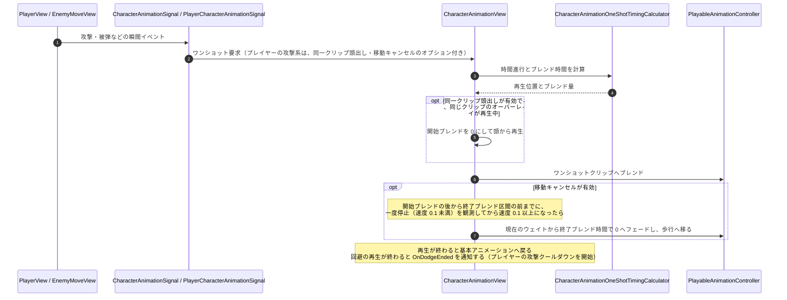

# ② ワンショット再生のフロー（攻撃・被弾時）

- page_id: 3bf7c2c6-cc02-8138-abda-cbff3308ad44
- Notion パス: Symphony Kill Chord / システム概要 / キャラクターアニメーション / ② ワンショット再生のフロー（攻撃・被弾時）
- スナップショットの最終更新: 2026-08-17T18:07:43.820Z
- 書き込み許可: 可
- 処置: 本文置き換え

## 判定

- 信頼性: 一部古い — 大筋（瞬間イベント → ワンショット要求 → 時間とブレンドの計算 → 基本へ戻る）は実装どおり。プレイヤーの攻撃系だけに付く 2 つのオプション（同一クリップの頭出し・移動キャンセル）、回避終了の通知（`OnDodgeEnded`）が無い（CM-19）
- 整合性: 親ページ `キャラクターアニメーション` の原稿「🎬 ワンショットの遷移ルール」と一致させた
- 変更点:
  - 冒頭の説明文: プレイヤーの攻撃系だけオプションが付く旨を追記
  - シーケンス図: `PlayerCharacterAnimationSignal` 経由の分岐、同一クリップの開始ブレンド 0、移動キャンセルの条件、回避終了の通知を追加
- 織り込んだ反映項目: CM-19
- 出典: 実装 `CharacterAnimationView.cs:107-130,240-290`、`PlayerCharacterAnimationSignal.cs:85-110`、`PlayerInitializer.cs`（`OnDodgeEnded` で攻撃クールダウン開始）、リポジトリ文書 `Assets/Docs/攻撃アニメーション遷移改善計画書.md` §3.4
- 要確認: なし

## 適用する本文

瞬間イベントを受けて、基本アニメーションへ重ねて再生する。プレイヤーの攻撃系の要求（`PlayerCharacterAnimationSignal`経由）だけ、同一クリップの頭出しと移動キャンセルのオプションが付く。敵の要求はどちらもOFFである。

