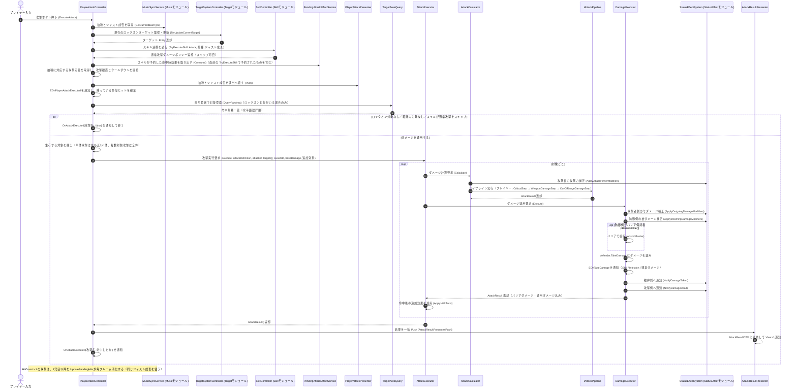

# ① プレイヤー攻撃実行フロー（入力イベント時）

- page_id: 3bf7c2c6-cc02-815f-be7d-f3fe8018830c
- Notion パス: Symphony Kill Chord / システム概要 / キャラ&バトル / ① プレイヤー攻撃実行フロー（入力イベント時）
- スナップショットの最終更新: 2026-09-09T03:30:25.906Z
- 書き込み許可: 可
- 処置: 本文置き換え

## 判定

- 信頼性: 一部古い — 対象探索・単体/複数対象・多段ヒットの説明は実装どおり。次の点が実装と違う、または足りない
  - 拍種とジャストの判定（`GetCurrentBeatType(out isJustHit)`、PR #1513）、`PendingAttackEffectService.Consume`、`PlayerAttackPresenter.Push`、`EOnPlayerAttackExecuted` の通知が無い（`Runtime/3.Adaptor/InGame/Battle/PlayerAttackController.cs:96-179`）
  - ロックオン対象がいない・範囲内に敵がいない・スキルが通常攻撃をスキップする場合は、ダメージを適用せず `OnAttackExecuted(攻撃名, false)` で終わる分岐が無い
  - `AttackCalculator` はパイプラインの前に攻撃者の `ApplyAttackPowerModifiers` を掛ける（`AttackCalculator.cs:36-40`）
  - パイプラインの順序 旧: WeaponDamageStep → CriticalStep → OutOfRangeDamageStep → ConfirmedDamage は誤り。プレイヤーの攻撃定義が使う `PlayerAttackPipeline.asset` は CriticalStep → WeaponDamageStep → OutOfRangeDamageStep で、ConfirmedDamage は入っていない（`Assets/Level/Data/Master/InGame/Battle/PlayerAttackPipeline.asset:16-29`）
  - `EOnTakeDamage` の通知は `TakeDamage` の前ではなく後（`DamageExecutor.cs:94-114`）
  - `OnAttackExecuted` はループの後に 1 回だけ `(攻撃名, 命中したか)` で発火する（旧図には無い）
- 整合性: `プレイヤー / ② 攻撃実行フロー（入力イベント時）`（3bf7c2c6-cc02-81ad-bf88-ef1cd0770beb）の原稿はプレイヤー側（入力の受け付けと攻撃後の表示）に絞り、ダメージ計算はこのページを参照させた
- 変更点:
  - 冒頭の説明文: 判定を 1 回だけ行う旨と、ダメージを適用しない 3 つの分岐を追記
  - シーケンス図: 上記の不足を追加し、パイプラインの順序と `EOnTakeDamage` の位置を修正
- 織り込んだ反映項目: BT-09（判定と通知の経路）
- 出典: 実装 `PlayerAttackController.cs:96-179,212-338`、`AttackExecutor.cs`、`AttackCalculator.cs`、`DamageExecutor.cs:57-127`、`AttackPipeline.cs`、マスターデータ `PlayerAttackPipeline.asset`、`PlayerAttack_Beat*.asset:17`
- 要確認: なし

## 適用する本文

プレイヤーが攻撃ボタンを押した際、ターゲット取得・スキル連携・複数対象探索・パイプライン計算・ダメージ反映までの一連の処理である。拍種とジャスト成否は最初に1回だけ判定し、スキル・ダメージ・多段ヒット・演出通知へ同じ結果を渡す。ロックオン対象がいる場合、扇形範囲クエリで生存中の対象を探索し、単体攻撃なら最も近い1体、複数対象攻撃（`AttackDefinition.IsMultiTarget`）なら全件へ命中させる。ロックオン対象がいない・範囲内に敵がいない・スキルが通常攻撃のダメージをスキップする、のいずれかの場合はダメージを適用せず、`OnAttackExecuted(攻撃名, false)`を通知して終わる。`AttackDefinition.HitCount`が2以上の攻撃は、1発目をこのフローで即時適用し、2発目以降を`PlayerAttackController.UpdatePendingHits`が毎フレーム・ヒット間隔ごとに消化する。

