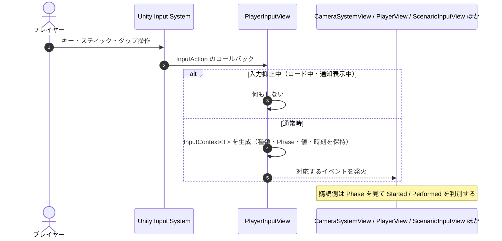

# ① 入力の通知フロー

- page_id: 3bf7c2c6-cc02-8169-8ade-de45506dca3c
- Notion パス: Symphony Kill Chord / システム概要 / 入力 / ① 入力の通知フロー
- スナップショットの最終更新: 2026-08-17T17:57:27.660Z
- 書き込み許可: 可
- 処置: 本文置き換え

## 判定

- 信頼性: 一部古い — 通知の流れ（`InputAction` のコールバック → `InputContext<T>` → イベント発火）は実装どおり。ただし、入力抑止中は通知しない分岐（`PlayerInputView.SetInputEnabled`、ロード中・通知表示中に `InputComposition` が切り替える）と、有効な入力マップによって届くアクションが変わる点が無い。`InputContext` は Phase と値のほかに入力の種類と時刻を持つ
- 整合性: 親ページ `入力` の原稿（入力抑止・入力マップ）と一致させた
- 変更点:
  - 冒頭の説明文: 入力マップと入力抑止の前提を追記
  - シーケンス図: 入力抑止中は何もしない分岐を追加。`InputContext<T>` の中身に種類と時刻を追記。購読側に `ScenarioInputView` を追加
- 織り込んだ反映項目: なし（親ページの変更に合わせた整合修正）
- 出典: 実装 `Runtime/4.View/Persistent/Input/PlayerInputView.cs:105-116,356-370`、`Runtime/6.Composition/Persistent/Input/InputComposition.cs:130-160`
- 要確認: なし

## 適用する本文

Unity Input Systemのイベントを`InputContext`へ包み、購読側へ配る。届くのは、その時点で有効な入力マップ（`UnityInputMapController`が切り替える）のアクションだけである。ロード中とイベント通知の表示中は、`InputComposition`が`PlayerInputView.SetInputEnabled(false)`で通知を止める。

