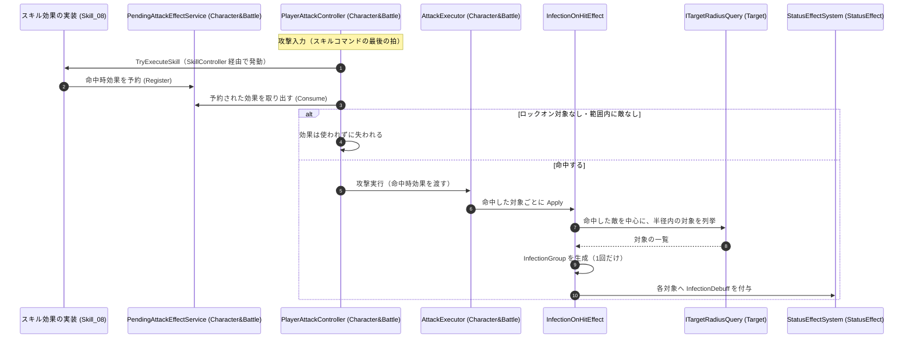

# ② 命中時効果の付与フロー（伝染の例）

- page_id: 3bf7c2c6-cc02-816a-b33c-da870be1fab5
- Notion パス: Symphony Kill Chord / システム概要 / スキル効果 / ② 命中時効果の付与フロー（伝染の例）
- スナップショットの最終更新: 2026-08-24T13:46:20.058Z
- 書き込み許可: 可
- 処置: 本文置き換え

## 判定

- 信頼性: 一部古い — 次の点が実装と違う
  - 「`PendingAttackEffectService` → `InfectionOnHitEffect`: 命中を通知」は誤り。`PendingAttackEffectService` は予約を保持するだけで、攻撃時に `PlayerAttackController` が `Consume` で取り出して `AttackExecutor` へ渡し、`AttackExecutor.ApplyHitEffects` が命中した対象ごとに `Apply` を呼ぶ（`Runtime/3.Adaptor/InGame/Battle/PlayerAttackController.cs:113`、`Runtime/2.Application/InGame/Battle/AttackExecutor.cs`（`ApplyHitEffects`））
  - 範囲の列挙は `TargetAreaQuery` ではなく `ITargetRadiusQuery`（命中した敵を中心とする半径）で行う（`Runtime/2.Application/InGame/SkillEffect/InfectionOnHitEffect.cs:36`）
  - 付与は 1 回だけ（`_isApplied`）で、周囲の敵は同じ `InfectionGroup` にまとめられる
  - 「次の通常攻撃」は、実際にはスキルを発動させたその攻撃である。`PlayerAttackController.ExecuteAttack` は `SkillController.TryExecuteSkill`（ここでスキル 8 が効果を予約する）の直後に `Consume` するため、同じ入力の通常攻撃に効果が乗る。その攻撃が空振り（ロックオン対象なし・範囲内に敵なし）だと、取り出した効果は使われずに失われる（`PlayerAttackController.cs:111-113,130-141`）
- 整合性: 親ページ `スキル効果` の原稿（拡張ポイントの命中時効果の行）と、`キャラ&バトル / ① プレイヤー攻撃実行フロー`（3bf7c2c6-cc02-815f-be7d-f3fe8018830c）の原稿（`Consume` と `ApplyHitEffects`）と一致させた
- 変更点:
  - 冒頭の説明文: 予約した効果は、スキルを発動させたその攻撃で使われる旨、空振りで失われる旨、1 回だけ付与する旨を追記
  - シーケンス図: 参加者に `PlayerAttackController` と `AttackExecutor` を追加し、命中の通知元を修正。旧: `TargetAreaQuery (Target)` → 新: `ITargetRadiusQuery (Target)`。`InfectionGroup` の生成を追加
- 織り込んだ反映項目: なし（実装との整合修正）
- 出典: 実装 `Skill_08.cs:46-57`、`PendingAttackEffectService.cs:15-45`、`PlayerAttackController.cs:113,150`、`AttackExecutor.cs`、`InfectionOnHitEffect.cs:30-70`
- 要確認:
  - 【要確認: 企画】命中時効果が、スキルを発動させた攻撃が空振りすると失われる現状を仕様とするか

## 適用する本文

命中をきっかけに、範囲内の対象へ状態効果を広げる。スキルは発動した時点で命中時効果を予約し、`PlayerAttackController`がスキル判定の直後に取り出すため、効果はスキルを発動させたその攻撃に乗る。その攻撃が空振りした場合、効果は使われずに失われる。【要確認: 空振りで失われる現状を仕様とするか企画に確認】付与は1回だけで、周囲の敵は1つの伝染グループにまとめられる。

