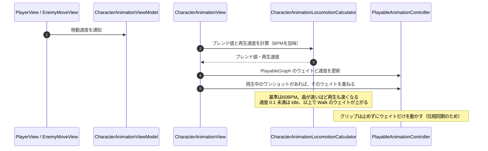

# ① 移動アニメーションのブレンドフロー（毎フレーム）

- page_id: 3bf7c2c6-cc02-816c-bd45-f9abba361f98
- Notion パス: Symphony Kill Chord / システム概要 / キャラクターアニメーション / ① 移動アニメーションのブレンドフロー（毎フレーム）
- スナップショットの最終更新: 2026-08-17T18:07:42.464Z
- 書き込み許可: 可
- 処置: 本文置き換え

## 判定

- 信頼性: 一部古い — 流れ（移動速度の通知 → ブレンド値と再生速度の計算 → PlayableGraph の更新）は実装どおり。音楽の位相同期の要件と、それが「クリップを止めない」ことで成り立っている点、途中生成の敵のずれ、Idle↔Walk の段差が書かれていない（CM-20）
- 整合性: 親ページ `キャラクターアニメーション` の原稿「🎵 ロコモーションの音楽同期」と一致させた
- 変更点:
  - 冒頭の説明文: 位相同期の仕組みを追記
  - シーケンス図: Note 旧: 基準は60BPM。曲が速いほど再生も速くなる → 新: 同じ内容に、ウェイトだけを動かしクリップは止めない旨と、Idle↔Walk のしきい値を追加。オーバーレイ（ワンショット）のウェイトを重ねる手順を追加
- 織り込んだ反映項目: CM-20
- 出典: 実装 `CharacterAnimationView.cs:48-71`（`ApplyBaseWeights` を毎フレーム呼ぶ）、`CharacterAnimationLocomotionCalculator.cs:10-17`、`PlayableAnimationController.cs:45-55`、リポジトリ文書 `Assets/Docs/ロコモーションAnimatorController常駐BlendTree化計画書.md` §1.1・§2.2
- 要確認: なし（計画の扱いは親ページの判定に記載）

## 適用する本文

移動速度とBPMから、クリップのブレンド値と再生速度を決める。全クリップは初期化時に再生を始めて止めず、ウェイトだけを動かすため、ロコモーションは音楽の位相に同期する（クリップの表示時間 = 音楽時間 mod クリップ長）。ただし曲の途中で生成された敵は、生成時刻が起点になるため位相がずれる。

