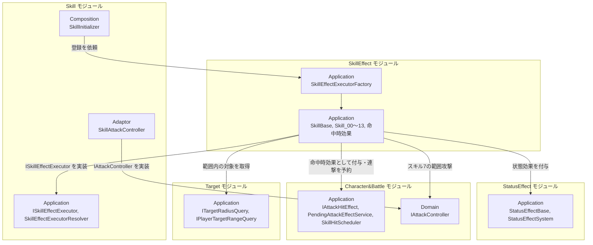
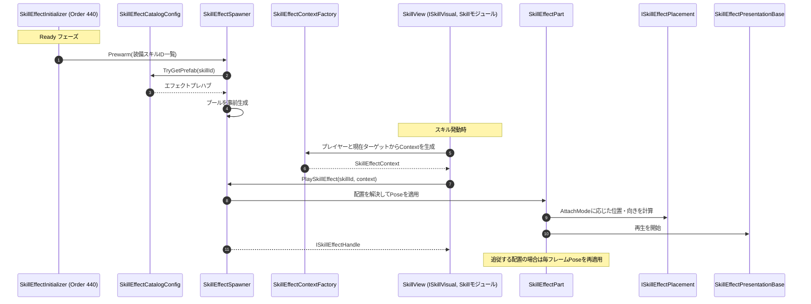

# スキル効果

- page_id: 3bf7c2c6-cc02-8184-8715-f2f741dc1d4f
- Notion パス: Symphony Kill Chord / システム概要 / スキル効果
- スナップショットの最終更新: 2026-08-24T13:46:22.632Z
- 書き込み許可: 可
- 処置: 本文置き換え

## 判定

- 信頼性: 一部古い — クラス表（効果の実装 7 行、演出基盤 約 40 型）はすべて実在し、`SkillEffectInitializer` の Order 440（定数 `MODULE_ORDER`）も正しい（`Runtime/6.Composition/InGame/Skill/Effect/SkillEffectInitializer.cs:23,79`）。repo の `NotionModuleDocs/SkillEffect.md`（2026-08-18）より Notion（2026-08-23）の方が新しく、演出基盤の節は Notion にしかない（01 棚卸し B 表）。次の点が違う、または足りない
  - Target への依存は `TargetAreaQuery` ではなく、`ITargetRadiusQuery`（スキル 8 の伝染）と `IPlayerTargetRangeQuery`（スキル 9 のフィールド）である（`Runtime/2.Application/Player/SkillEffect/SkillEffectExecutorFactory.cs:23-41`、`InfectionOnHitEffect.cs:36`）
  - Character&Battle への依存に `SkillHitScheduler`（スキル 13）と `IAttackController`（スキル 7 の `SkillAttackController`）、`AttackCalculator`/`DamageExecutor` が無い
  - 演出の再生フローの `SkillVisual` は存在しない型名で、実体は `SkillView`（`ISkillVisual` 実装、`Runtime/4.View/InGame/Skill/SkillView.cs:10,48`）
  - 命中時効果は「次の攻撃」ではなく、スキルを発動させたその攻撃で使われる（`TryExecuteSkill` の直後に `Consume`）。命中時に呼ぶのは `AttackExecutor` で、`PendingAttackEffectService` が命中を通知するのではない。空振りすると効果は失われる
  - スキルごとの演出の現状（Timeline は 0・13 だけ、アニメーションキーの空欄）が書かれていない（BT-35）
- 整合性:
  - 他ページとの矛盾: DB「KillChordデータ」の `13スキル` は「`Skill_Right` アニメーションでプレイヤーが銃を構える」、`4スキル` は「AnimationKey を Skill_Right に設定する必要がある（現状空欄）」とするが、マスターデータではスキル 13 が `Skill_Left`、スキル 4〜10 は空欄（BT-35。DB 行は担当外）
  - `SkillEffectInitializer`（Order 440）は `SkillCrosshairProgressUIInitializer`（Order 440）と同じ Order である。両者は互いを参照しないため現状は問題ないが、同じ Order の実行順は保証されない（IF-02）
- 変更点:
  - 「概要」表: 旧: 最終更新日 2026-08-23 → 新: 2026-09-22
  - 「🏗️ クラス」: `Skill_00`〜`Skill_10`, `Skill_13` の行に、依存を注入するスキル（2・7・8・9・13）を追記
  - 「🔗 モジュール結合」: Target のノード 旧: `TargetAreaQuery` → 新: `ITargetRadiusQuery, IPlayerTargetRangeQuery`。Character&Battle のノードに `SkillHitScheduler`・`IAttackController` を追加
  - 「📥 依存しているもの」: Character&Battle と Target の依存箇所・詳細を修正
  - 「🔌 拡張ポイント」: 命中時効果の行 旧: `PendingAttackEffectService`経由で次の攻撃へ付与する → 新: 予約した効果はスキルを発動させたその攻撃で使われ、空振りなら失われる（`PlayerAttackController.cs:111-113` は `TryExecuteSkill` の直後に `Consume` する）
  - 「✨ スキルエフェクト演出基盤 / 🧩 Composition初期化情報」: `Ready` の装備スキルの解決順（改造画面のビルド → Player のテスト装備）と、`SkillInitializer` が `SkillEffectModuleContainer` を取得する旨を追記
  - 「✨ … / 🔄 スキルエフェクト再生フロー」: 旧: `Visual as SkillVisual（Skillモジュール）` → 新: `SkillView (ISkillVisual)`
  - 末尾に「📋 スキルごとの演出の現状」節を新設（BT-35）
- 織り込んだ反映項目: BT-35
- 出典: 実装 `SkillEffectExecutorFactory.cs`、`Skill_02.cs:39-45`、`Skill_07.cs`、`Skill_08.cs:46-57`、`Skill_09.cs:38`、`Skill_13.cs:21,52`、`InfectionOnHitEffect.cs:30-70`、`SkillEffectInitializer.cs:25-130`、`SkillInitializer.cs:184-205,335`、`SkillView.cs`。マスターデータ `Assets/Level/Data/Master/InGame/Skill/Effect/SkillEffectCatalogConfig.asset:16-63`、`SkillEffectTimeline_skill_00.playable`・`SkillEffectTimeline_skill_13.playable`、`Assets/Level/Data/Master/Skill/Templates/SkillData*.asset`（`_animationKey`）、`Assets/Level/Data/Master/InGame/SkillExecutedShakeConfig.asset:15-20`。PR #1490（スキル 13 の SE）、#1439（発動時のカメラシェイク）、#1423（発動時のポストエフェクト）
- 要確認:
  - 【要確認: 企画】命中時効果（スキル 2・8）が、発動させた攻撃の空振りで失われる現状を仕様とするか
  - 【要確認: 実機・エフェクト担当】スキル 2〜10 のエフェクトプレハブはカタログに登録済みだが、ファイルサイズがほぼ同じで共通の仮プレハブの可能性がある
  - 【要確認: 企画】スキル 13 のアニメーションキー（実値 `Skill_Left`、仕様 `Skill_Right`）と、スキル 4〜10 の空欄（通常攻撃のモーションで代用）をどうするか

## 適用する本文

# 概要 {color="gray_bg"}

> 💡 **モジュール概要**
> スキル1つ1つの効果を実装するモジュールである。Skillモジュールが定義した`ISkillEffectExecutor`の実装が並び、`SkillEffectExecutorFactory`が`SkillEffectType`と対応付けて登録する。あわせて、スキル発動時の見た目を組み立てる演出基盤（`InGame/Skill/Effect`）も本ページで扱う。

| 項目 | 内容 |
| --- | --- |
| **モジュール名** | SkillEffect |
| **カテゴリ** | InGame |
| **ステータス** | 実装済み |
| **最終更新日** | 2026-09-22 |

---

## 🏗️ クラス {toggle="true"}

	| クラス名 | レイヤー | 役割・機能 |
	| --- | --- | --- |
	| **`SkillBase`** | Application | `ISkillEffectExecutor`を実装するスキル効果の基盤クラス |
	| **`SkillEffectExecutorFactory`** | Application | 既定のスキル効果実行器を`SkillEffectExecutorResolver`へ登録する |
	| **`Skill_00`**〜**`Skill_10`**, **`Skill_13`** | Application | スキルIDごとの効果実装。置き場は`Player/SkillEffect/`。依存を受け取るのは、2（`PendingAttackEffectService`）・7（`IAttackController`）・8（`PendingAttackEffectService`・`ITargetRadiusQuery`）・9（`IPlayerTargetRangeQuery`）・13（`SkillHitScheduler`）である |
	| **`InfectionDebuff`** | Application | 伝染状態を表す状態効果 |
	| **`InfectionGroup`** | Application | 伝染ダメージのグループ |
	| **`InfectionOnHitEffect`** | Application | 命中時に、指定範囲内の対象へ伝染デバフを付与する |
	| **`DamageTakenIncreaseOnHitEffect`** | Application | 命中時に、対象の受けるダメージを増加させる状態効果を付与する |

	`Skill_11`と`Skill_12`は存在しない。IDは連番だが、実装のある番号だけが登録される。
	命中時効果（`InfectionOnHitEffect`・`DamageTakenIncreaseOnHitEffect`）は`Skill_*`とは別に`InGame/SkillEffect/`にあり、`IAttackHitEffect`（Character&Battleモジュール）として攻撃へ付与される。

### 🧩 Composition初期化情報

| 項目 | 内容 |
| --- | --- |
| **Initializerクラス** | なし |
| **公開する ModuleContainer / ServiceLocator登録型** | なし。`SkillEffectExecutorFactory`をSkillモジュールの`SkillInitializer`（Order 450）が呼び、解決テーブルへ登録する |

---

## 🔗 モジュール結合

### 📥 依存しているもの

- **`Skill`**
	- *依存箇所*: `ISkillEffectExecutor`, `SkillEffectType`, `SkillEffectExecutorResolver`
	- *詳細*: 実行器の契約と、効果種別を識別する列挙型を利用する
- **`StatusEffect`**
	- *依存箇所*: `StatusEffectBase`, `IStatusEffectSystem`
	- *詳細*: 継続的な効果は状態効果として対象へ付与する
- **`Character&Battle`**
	- *依存箇所*: `IAttackHitEffect`, `PendingAttackEffectService`, `SkillHitScheduler`, `IAttackController`, `AttackCalculator`, `DamageExecutor`, `CharacterEntity`
	- *詳細*: 命中時に発動する効果を、攻撃へ付与する形で登録する（スキルを発動させたその攻撃で使われる）。連撃（スキル13）はヒットのタイミングを`SkillHitScheduler`へ予約する。スキル7は`IAttackController`（実装はSkillモジュールの`SkillAttackController`）で範囲攻撃を行う。自前でダメージを計算するスキルは`AttackCalculator`と`DamageExecutor`を使う
- **`Target`**
	- *依存箇所*: `ITargetRadiusQuery`, `IPlayerTargetRangeQuery`
	- *詳細*: 伝染（スキル8）が命中した敵の周囲の対象を、クリティカルフィールド（スキル9）が自分の周囲の対象を列挙する

### 📤 依存されているもの

- **`Skill`**
	- *参照箇所*: `SkillEffectExecutorFactory`
	- *詳細*: `SkillInitializer`が呼び、スキル種別と実行器の対応を解決テーブルへ登録する

---

# 詳細 {color="gray_bg"}

## 🧅レイヤー情報

### ① Domain

当モジュールでは使用していない。効果が扱うデータはSkill・StatusEffect・Character&BattleのDomainを参照する。

### ② Application

スキル効果の実装が並ぶ。`SkillBase`が共通の土台を提供し、個々の`Skill_*`が固有の処理を持つ。命中時に働く効果は別ファイル群として`InGame/SkillEffect/`にある。

### ③ Adaptor

当モジュールでは使用していない。

### ④ View

当モジュールでは使用していない。演出はSkillモジュールとCharacter&Battleモジュールが担当する。

### ⑤ Infrastructure

当モジュールでは使用していない。

### ⑥ Composition

専用のInitializerは持たない。登録はSkillモジュールの初期化から呼ばれる。

## 🔌 拡張ポイント

| 拡張したいこと | 実装する場所 | 追加登録の要否 |
| --- | --- | --- |
| 新しいスキル効果を追加したい | `SkillBase`を継承した`Skill_XX`を`Player/SkillEffect/`へ追加する | 必要。`SkillEffectType`（Skillモジュール）へ値を足し、`SkillEffectExecutorFactory`へ`resolver.Register(...)`を追記する。**自動検出ではないため、登録を忘れるとスキルは発動しても効果だけ起きない** |
| 命中時に働く効果を追加したい | `IAttackHitEffect`（Character&Battle）を実装したクラスを`InGame/SkillEffect/`へ追加し、`PendingAttackEffectService`経由で攻撃へ付与する（予約した効果は、スキルを発動させたその攻撃の`AttackExecutor`が命中時に呼ぶ。空振りなら失われる） | 必要（付与する側のスキル実装から呼ぶ） |

## 🔄処理フロー

主要な処理フローは、それぞれ子ページに分けている。

<page url="https://www.notion.so/3bf7c2c6cc028133b82bde2ef61e9249">① 実行器の登録フロー（初期化時）</page>

<page url="https://www.notion.so/3bf7c2c6cc02816ab33cda870be1fab5">② 命中時効果の付与フロー（伝染の例）</page>

# ✨ スキルエフェクト演出基盤（`InGame/Skill/Effect`） {color="gray_bg"}

> 💡 **節の概要**
> スキル効果の「当たり判定・ダメージ」ではなく、「見た目」を組み立てる仕組みである。スキルIDからプレハブを引き、そのプレハブが持つ配置ストラテジーと再生ストラテジーの組み合わせで演出が決まる。エフェクトの内容はコードではなくプレハブ側が持ち、コードは対応表と再生の枠だけを提供する。

## 🏗️ クラス

| クラス名 | レイヤー | 役割・機能 |
| --- | --- | --- |
| **`ISkillEffectPlayer`** | Adaptor | スキルIDとContextを受け取りエフェクト再生を依頼する契約。`StopAll`も持つ |
| **`ISkillEffectHandle`** | Adaptor | 再生中エフェクトの操作契約 |
| **`ISkillEffectWeaponSource`** | Adaptor | エフェクトの取り付け先となる武器を提供する契約 |
| **`SkillEffectContext`** | Adaptor | プレイヤー・対象・武器のTransform、ワールド座標、向き、スケール、BPM連動の再生速度を運ぶDTO |
| **`SkillEffectAttachMode`** | Adaptor | 配置方式のenum。`PlayerFollow`/`PlayerPoint`/`TargetFollow`/`TargetPoint`/`WorldPoint`/`BetweenPlayerAndTarget`/`WeaponFollow`の7種 |
| **`ISkillEffectSpawner`** | View | 事前生成と再生を行うSpawnerの契約（`ISkillEffectPlayer`を継承） |
| **`SkillEffectSpawner`** | View | プールからインスタンスを取り出して再生する。`Prewarm`で装備スキル分を事前生成し、実行時のGCを抑える |
| **`SkillEffectCatalogConfig`** | View | スキルIDとエフェクトプレハブの対応表だけを持つScriptableObject |
| **`SkillEffectInstance`** | View | プールで再利用されるエフェクト1つ分のルートView |
| **`SkillEffectPart`** | View | 1つのエフェクト内で独立した配置を持つ構成要素。プレイヤー追従の演出と対象追従の演出を同居させるために使う |
| **`SkillEffectContextFactory`** | View | プレイヤーと現在のターゲットから`SkillEffectContext`を生成する |
| **`ISkillEffectPlacement`** / **`SkillEffectPlacementResolver`** / **`SkillEffectPose`** / **`SkillEffectRotationUtility`** | View | 配置ストラテジーの契約、`SkillEffectAttachMode`からの解決、配置結果の値オブジェクト、向き計算のユーティリティ |
| **`PlayerFollowSkillEffectPlacement`** / **`PlayerPointSkillEffectPlacement`** / **`TargetFollowSkillEffectPlacement`** / **`TargetPointSkillEffectPlacement`** / **`WorldPointSkillEffectPlacement`** / **`BetweenPointsSkillEffectPlacement`** / **`WeaponFollowSkillEffectPlacement`** | View | 各配置方式の実装。`AttachMode`と1対1で対応する |
| **`SkillEffectPresentationBase`** | View | 再生手段を表すストラテジーの基底クラス |
| **`MotionSkillEffectPresentationBase`** | View | LitMotionで再生するストラテジーの基底クラス |
| **`ParticleSystemSkillEffectPresentation`** / **`VisualEffectGraphSkillEffectPresentation`** / **`TimelineSkillEffectPresentation`** / **`GameObjectSkillEffectPresentation`** | View | ParticleSystem・VFX Graph・Timeline・GameObjectの表示切替による再生 |
| **`ScalePunchSkillEffectPresentation`** / **`TravelMotionSkillEffectPresentation`** / **`ScatterTravelSkillEffectPresentation`** / **`MaterialFloatMotionSkillEffectPresentation`** / **`SkillEffectMotionFunnel`** | View | LitMotionによる拡大・移動・円周状の散開・マテリアルのfloat補間・漏斗状の到達演出 |
| **`TracerSkillEffectPresentation`** | View | 銃口から対象へ弾道を一瞬だけ描く曳光弾の演出 |
| **`CriticalBranchSkillEffectPresentation`** | View | クリティカル成立時のみ追加演出を再生する |
| **`SkillEffectInitializer`** | Composition | シーンロード時にプールを構築し、`ISkillEffectPlayer`を公開する（Order 440） |
| **`SkillEffectModuleContainer`** | Composition | Spawnerの公開物を保持するContainer |

### 🧩 Composition初期化情報

| 項目 | 内容 |
| --- | --- |
| **Initializerクラス** | `SkillEffectInitializer` |
| **Order** | 440（Skillモジュールより先に構築する） |
| **公開する ModuleContainer / ServiceLocator登録型** | `SkillEffectModuleContainer`（`ISkillEffectPlayer`を保持）。`Ready()`で装備スキルを解決し`Prewarm`する |

`Build()`ではポストエフェクト（`IPostEffectOverlayPlayer`）を`ServiceLocator.TryGetInstance`で取得し、存在する場合のみ注入する。常駐カメラ側が持つ機能であり、無くても再生自体は成立する。 `Ready()`の装備スキルは、改造画面を経由した場合はそのビルド（`SkillBuildDefinition`）を使い、経由していない場合は`PlayerInitializer`のテスト用装備を使う。 `SkillInitializer`（Order 450）が`SkillEffectModuleContainer`を取得し、各スキルの`SkillView`へ`ISkillEffectPlayer`を渡す。

## 🔌 拡張ポイント

| 拡張したいこと | 実装する場所 | 追加登録の要否 |
| --- | --- | --- |
| 新しいスキルにエフェクトを付けたい | `SkillEffectCatalogConfig`へスキルIDとプレハブの組を追加する | 不要（コード変更なし。未登録のスキルIDは再生要求が無視される） |
| 新しい再生手段を追加したい | `SkillEffectPresentationBase`（LitMotionを使う場合は`MotionSkillEffectPresentationBase`）を継承したコンポーネントを作り、エフェクトプレハブへ付ける | 不要（`SkillEffectPart`がルート配下から自動収集する。ただしInspectorで明示指定した場合はその配列が優先される） |
| 新しい配置方式を追加したい | `ISkillEffectPlacement`を実装し、`SkillEffectAttachMode`へ値を追加して`SkillEffectPlacementResolver`の解決先に加える | 必要（Resolverへの追記漏れは、その方式を選んでも配置が解決されない原因になる） |

## 🔄 スキルエフェクト再生フロー

## 📋 スキルごとの演出の現状

スキルごとの演出の設定である。値の正本はマスターデータ（アニメーションキーは`Assets/Level/Data/Master/Skill/Templates/SkillData*.asset`の`_animationKey`、プレハブは`SkillEffectCatalogConfig.asset`）である。

| スキル | エフェクトプレハブ | Timeline | アニメーションキー |
| --- | --- | --- | --- |
| 0 | 登録あり | `SkillEffectTimeline_skill_00.playable` | `Skill_Right` |
| 1 | 登録あり | なし | `Skill_Left` |
| 2 | 登録あり【要確認】 | なし | `Skill_Left` |
| 3 | 登録あり【要確認】 | なし | `Skill_Right` |
| 4〜10 | 登録あり【要確認】 | なし | 空欄（通常攻撃のモーションで代用） |
| 13 | 登録あり | `SkillEffectTimeline_skill_13.playable`（発射のSignal 4回でSEを鳴らす） | `Skill_Left` |

- 【要確認】スキル2〜10のプレハブはファイルサイズがほぼ同じで、共通の仮プレハブの可能性がある。実機とエフェクト担当に確認する
- 【要確認】スキル13のアニメーションキーは仕様（DB「KillChordデータ」の`13スキル`）では`Skill_Right`、実値は`Skill_Left`である。スキル4〜10の空欄をどうするかと合わせて企画に確認する
- どのスキルも、発動時（`EOnSkillExecuted`）にカメラシェイクが入る（0.3秒。`Assets/Level/Data/Master/InGame/SkillExecutedShakeConfig.asset`）。ポストエフェクトは、エフェクトのインスタンスに`PostEffectOverlayConfig`が設定されている場合だけ`IPostEffectOverlayPlayer.AddForSeconds`で掛かる
