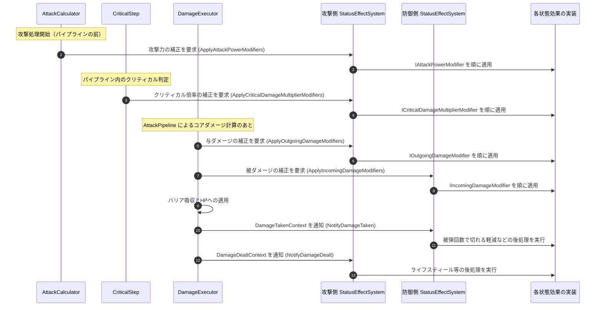

# ③ 状態効果の適用フロー（攻撃前後）

- page_id: 3bf7c2c6-cc02-8193-8e0c-e0604f828db6
- Notion パス: Symphony Kill Chord / システム概要 / キャラ&バトル / ③ 状態効果の適用フロー（攻撃前後）
- スナップショットの最終更新: 2026-08-17T17:23:36.452Z
- 書き込み許可: 可
- 処置: 本文置き換え

## 判定

- 信頼性: 一部古い — 図では `PlayerAttackController` が `StatusEffectSystem` を直接呼ぶが、実装で呼ぶのは `AttackCalculator`（攻撃力補正）、`CriticalStep`（クリティカル倍率補正）、`DamageExecutor`（与/被ダメージ補正・通知）である（`Runtime/2.Application/InGame/Battle/AttackCalculator.cs:36-40`、`CriticalStep.cs:40`、`DamageExecutor.cs:80-127`）。補正の段階が 4 つあること（攻撃力 → クリティカル倍率 → 与ダメージ → 被ダメージ）、被弾側への通知（`NotifyDamageTaken`）が無い
- 整合性: `状態効果（バフ・デバフ） / ① ダメージ計算への補正フロー`（3bf7c2c6-cc02-81c7-a04c-c30f7ac31798）の原稿と同じ段階・順序にそろえた
- 変更点:
  - シーケンス図: 呼び出し元を `AttackCalculator` / `CriticalStep` / `DamageExecutor` に修正し、攻撃力補正・クリティカル倍率補正・被ダメージ補正・`NotifyDamageTaken` を追加
- 織り込んだ反映項目: なし（実装との整合修正）
- 出典: 実装 `AttackCalculator.cs`、`CriticalStep.cs:35-45`、`DamageExecutor.cs:57-127`、`Runtime/1.Domain/InGame/StatusEffect/IStatusEffectSystem.cs:20-70`
- 要確認: なし

## 適用する本文

バフ・デバフは状態効果（StatusEffect）として実装され、ダメージの授受に合わせて呼び出される。効果の実体はStatusEffectモジュールとBuffモジュールにあり、当モジュールは呼び出し口とコンテキストを提供する。補正は、攻撃力 → クリティカル倍率 → 与ダメージ → 被ダメージ の順に掛かる。

