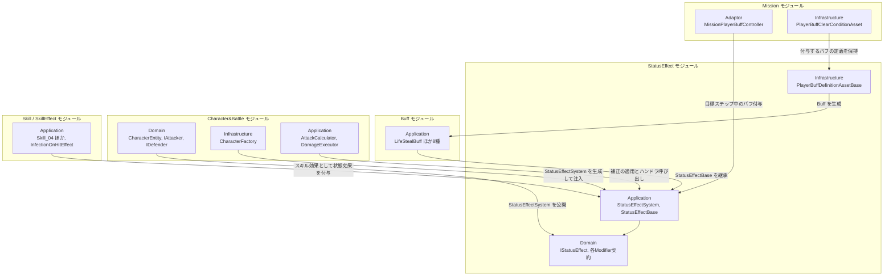

# 状態効果（バフ・デバフ）

- page_id: 3bf7c2c6-cc02-819c-a123-d2d22318d23b
- Notion パス: Symphony Kill Chord / システム概要 / 状態効果（バフ・デバフ）
- スナップショットの最終更新: 2026-08-17T17:54:03.955Z
- 書き込み許可: 可
- 処置: 本文置き換え

## 判定

- 信頼性: 一部古い — クラス表の 26 型はすべて実在し、Buff 各型の実装契約も実装どおり。次の点が違う、または足りない
  - Infrastructure に `PlayerBuffDefinitionAssetBase`・`AttackPowerMultiplierBuffAsset`・`DamageReductionBuffAsset` があるのに「当モジュールでは使用していない」としている（`Runtime/5.InfraStructure/InGame/Buff/`。Mission の `PlayerBuffClearConditionAsset` が `[SerializeReference, SubclassSelector]` で持つ）
  - 補正を呼ぶのは `AttackPipeline` ではなく `AttackCalculator`（攻撃力）・`CriticalStep`（クリティカル倍率）・`DamageExecutor`（与/被ダメージ・通知）である
  - 期限切れは「毎フレーム確認」ではなく、付与・補正・通知・取得の呼び出しのたびに取り除く。使用回数を使い切った効果は被弾通知のあとに取り除く（`Runtime/2.Application/InGame/StatusEffect/StatusEffectSystem.cs`）
  - 再付与の方針はスキルごとのマスター値だが、スキル 7 の攻撃力増加・減少はコードで `Replace` に固定している（BT-37）
  - バリアには上限が無く、バフが切れても消えない（`BarrierEntity.Add` に上限なし、`ClearBarrier` の呼び出し元が無い）（BT-37）
  - repo の `NotionModuleDocs/StatusEffect.md` と Notion は同一（01 棚卸し B 表）
- 整合性:
  - 実装との矛盾: スキル 7 のマスターデータ `SkillData07.asset` の `_statusEffectReapplyPolicy: 4`（Ignore）は、コードが固定値で上書きするため効かない
  - 他ページとの関係: ゲーム側 `仕様概要 / キャラクターステータス / ダメージ計算`（3767c2c6-cc02-80f5-b2e7-f2de9f55413f）には重ねがけの規則が無い（BT-37 のゲーム側。担当外）。`キャラ&バトル / ③ 状態効果の適用フロー`（3bf7c2c6-cc02-8193-8e0c-e0604f828db6）の原稿と補正の順序をそろえた
- 変更点:
  - 「概要」表: 旧: 最終更新日 2026-08-17 → 新: 2026-09-22
  - 「🏗️ クラス / 仕組み」: `StatusEffectSystem` の役割に期限の扱いを追記。`StatusEffectReapplyPolicy` の役割に 5 つの値を追記
  - 「🏗️ クラス」: 小見出し「アセット（`InGame/Buff`・Infrastructure）」を追加し 3 型を載せた
  - 「🔗 モジュール結合」: 旧: `C_App["Application AttackPipeline"]` → 新: `AttackCalculator, DamageExecutor`。Mission が Infrastructure のアセット経由で付与する線、SkillEffect の命中時効果からの付与を追加
  - 「📤 依存されているもの」: Character&Battle の詳細 旧: `AttackPipeline`がダメージ計算の前後で… → 新: `AttackCalculator`・`CriticalStep`・`DamageExecutor`。Skill の参照箇所に具体的なスキル、SkillEffect の項、Mission に `PlayerBuffClearConditionAsset` を追加
  - 「⑤ Infrastructure」: 旧: 当モジュールでは使用していない → 新: ミッション用のバフ定義アセット
  - 「🔌 拡張ポイント」: 補正の種類の追加先 旧: `StatusEffectSystem`と`AttackPipeline` → 新: `IStatusEffectSystem`/`StatusEffectSystem` と呼び出し側（`AttackCalculator`・`CriticalStep`・`DamageExecutor`）。「ミッションで付与するバフを増やしたい」の行を追加
  - 末尾に「📋 スキルごとの再付与方針とバリア」節を新設（BT-37）
- 決定（2026-09-22 八幡）: R32 バフ・デバフの HUD は未実装として残す。「④ View」に「バフ・デバフの HUD 表示は未実装である」と書いた
- 織り込んだ反映項目: BT-37
- 出典: 実装 `StatusEffectSystem.cs`、`StatusEffectReapplyPolicy.cs`、`AttackPowerIncreaseBuff.cs:13-20`、`AttackPowerReductionDebuff.cs`、`Skill_04.cs:22-26`・`Skill_06.cs:26-31`・`Skill_07.cs:70-72,207-209`・`Skill_09.cs:38-43`・`Skill_10.cs:27-30`、`DamageTakenIncreaseOnHitEffect.cs:31`、`InfectionOnHitEffect.cs:60`、`BarrierEntity.cs`、`CharacterEntity.cs:221`、`PlayerBuffDefinitionAssetBase.cs`、`PlayerBuffClearConditionAsset.cs:52-53`、`MissionPlayerBuffController.cs:69,81`。マスターデータ `Assets/Level/Data/Master/Skill/Templates/SkillData02/04/06/07/08/09/10.asset`（`_statusEffectReapplyPolicy`）
- 要確認:
  - 【要確認: 企画・プログラム】スキル 7 はマスター値 Ignore（重ねがけ無視）とコード固定の Replace（後から発動した方で置き換え・効果時間リセット）のどちらが正しいか。Notion のスキル仕様「後から発動した方を採用・効果時間リセット」は Replace と一致する
  - 【要確認: 企画】バリアが上限なしで、バフが切れても残る現状を仕様とするか

## 適用する本文

# 概要 {color="gray_bg"}

> 💡 **モジュール概要**
> バフ・デバフを状態効果として扱う仕組みを提供するモジュールである。`InGame/StatusEffect`が契約と管理システムを、`InGame/Buff`が具体的な効果を持つ。旧`IBuff`/`BuffSystem`はこの仕組みへ置き換えられた。

| 項目 | 内容 |
| --- | --- |
| **モジュール名** | StatusEffect |
| **カテゴリ** | InGame |
| **ステータス** | 実装済み |
| **最終更新日** | 2026-09-22 |

---

## 🏗️ クラス {toggle="true"}

### 仕組み（`InGame/StatusEffect`）

| クラス名 | レイヤー | 役割・機能 |
| --- | --- | --- |
| **`IStatusEffect`** | Domain | バフ・デバフを含む状態効果の共通契約 |
| **`IStatusEffectSystem`** | Domain | キャラクターが保持する状態効果を管理するシステムの契約 |
| **`StatusEffectRuntimeEntity`** | Domain | 付与中の状態効果と有効期限を保持するEntity |
| **`StatusEffectId`** / **`StatusEffectCategory`** / **`StatusEffectDuration`** | Domain | 識別子・分類・継続時間 |
| **`StatusEffectReapplyPolicy`** | Domain | 同じ状態効果を再付与したときの扱い。`Stack`（別効果として重複）/`ExtendDuration`（効果時間を延長）/`RefreshDuration`（効果時間を初期値に戻す）/`Replace`（新しい効果で置き換え）/`Ignore`（無視） |
| **`IAccumulatingStatusEffect`** | Domain | 再適用時に効果を累積できることを表す契約 |
| **`IConsumableStatusEffect`** | Domain | 使用回数を消費する状態効果の契約 |
| **`IAttackPowerModifier`** | Domain | 攻撃力を補正する |
| **`IOutgoingDamageModifier`** / **`IIncomingDamageModifier`** | Domain | 与ダメージ・被ダメージを補正する |
| **`ICriticalDamageMultiplierModifier`** | Domain | クリティカルダメージ倍率を補正する |
| **`IDamageDealtHandler`** / **`IDamageTakenHandler`** | Domain | ダメージを与えた／受けた際に処理を行う |
| **`StatusEffectBase`** | Application | 状態効果の共通データを持つ基底クラス |
| **`StatusEffectSystem`** | Application | `IStatusEffectSystem`実装。付与・期限管理・補正の適用を担う。期限切れの効果は、付与・補正・通知・取得の呼び出しのたびに取り除く |
| **`DamageTakenIncreaseDebuff`** | Application | 被ダメージ増加のデバフ |

### 効果の実装（`InGame/Buff`）

いずれも`StatusEffectBase`を継承し、必要な補正契約を実装する。

| クラス名 | 実装する契約 | 効果 |
| --- | --- | --- |
| **`AttackPowerIncreaseBuff`** | `IAttackPowerModifier` | 攻撃力を一定量増加させる |
| **`AttackPowerReductionDebuff`** | `IAttackPowerModifier` | 攻撃力を減少させる |
| **`AttackPowerMultiplierBuff`** | `IOutgoingDamageModifier` | 与ダメージを一定倍率へ変更し続ける永続バフ |
| **`DamageReductionBuff`** | `IIncomingDamageModifier` | 被ダメージを一定割合軽減し続ける永続バフ |
| **`HitCountDamageReductionBuff`** | `IIncomingDamageModifier`, `IDamageTakenHandler`, `IConsumableStatusEffect` | 指定回数まで被ダメージを軽減する |
| **`CriticalDamageFieldBuff`** | `ICriticalDamageMultiplierModifier` | クリティカルダメージ倍率を一定値に変更する |
| **`LifeStealBuff`** | `IDamageDealtHandler` | 与えたダメージの一部を回復する |
| **`BarrierGainBuff`** | `IDamageDealtHandler` | 与えたダメージに応じてバリアを獲得する |

### アセット（`InGame/Buff`・Infrastructure）

| クラス名 | レイヤー | 役割・機能 |
| --- | --- | --- |
| **`PlayerBuffDefinitionAssetBase`** | Infrastructure | ミッションのステップ中にプレイヤーへ付与するバフ・デバフ定義の基底。`Create()`で状態効果を生成し、再付与方針をInspectorで持つ（既定は`Ignore`） |
| **`AttackPowerMultiplierBuffAsset`** / **`DamageReductionBuffAsset`** | Infrastructure | `AttackPowerMultiplierBuff`・`DamageReductionBuff`を生成する定義 |

### 🧩 Composition初期化情報

| 項目 | 内容 |
| --- | --- |
| **Initializerクラス** | なし |
| **公開する ModuleContainer / ServiceLocator登録型** | なし。`StatusEffectSystem`はキャラクター単位で生成され、`CharacterFactory`が`CharacterEntity`のコンストラクタへ渡す |

ServiceLocatorを介さず、`CharacterEntity.StatusEffectSystem`から辿る。`IAttacker`と`IDefender`の双方がこのプロパティを公開しているため、攻撃側・防御側のどちらからでも参照できる。

---

## 🔗 モジュール結合

### 📥 依存しているもの

- **`Character&Battle`**
	- *依存箇所*: `CharacterEntity`, `Damage`, `DamageDealtContext`, `DamageTakenContext`
	- *詳細*: 補正の対象となるダメージ値と、効果の持ち主であるキャラクターを扱う

### 📤 依存されているもの

- **`Character&Battle`**
	- *参照箇所*: `IStatusEffectSystem`
	- *詳細*: `CharacterFactory`が生成して`CharacterEntity`へ注入する。`AttackCalculator`（攻撃力）・`CriticalStep`（クリティカル倍率）・`DamageExecutor`（与ダメージ・被ダメージ・与/被ダメージの通知）が補正とハンドラを呼ぶ
- **`Skill`**
	- *参照箇所*: `StatusEffectBase`の派生
	- *詳細*: スキル効果の実行器（`Skill_04`・`Skill_06`・`Skill_07`・`Skill_09`・`Skill_10`）が自分または対象へ状態効果を付与する
- **`SkillEffect`**
	- *参照箇所*: `StatusEffectBase`の派生
	- *詳細*: 命中時効果（`DamageTakenIncreaseOnHitEffect`・`InfectionOnHitEffect`）が命中した敵へ`DamageTakenIncreaseDebuff`・`InfectionDebuff`を付与する
- **`Mission`**
	- *参照箇所*: `PlayerBuffDefinitionAssetBase`, `StatusEffectBase`の派生
	- *詳細*: `PlayerBuffClearConditionAsset`が付与するバフの定義を持ち、`MissionPlayerBuffController`が目標ステップの間だけプレイヤーへ付与し、ステップを抜けると取り除く

---

# 詳細 {color="gray_bg"}

## 🧅レイヤー情報

### ① Domain

状態効果の共通契約と、補正の種類ごとに分かれた契約群を保持する。効果が「何を補正するか」は実装する契約で決まり、`StatusEffectSystem`は契約ごとに対象を集めて適用する。

### ② Application

`StatusEffectSystem`が付与・期限管理・補正の適用を行い、`StatusEffectBase`が継続時間や識別子といった共通データを提供する。具体的な効果は`InGame/Buff`にある。

### ③ Adaptor

当モジュールでは使用していない。

### ④ View

当モジュールでは使用していない。バフ・デバフのHUD表示は未実装である。

### ⑤ Infrastructure

ミッションのステップ中にプレイヤーへ付与するバフの定義（`PlayerBuffDefinitionAssetBase`とその派生）を持つ。スキルが付与する効果の生成は、各スキルの実行器が行う。

### ⑥ Composition

当モジュールでは使用していない。`StatusEffectSystem`はキャラクター単位の生成で、`CharacterFactory`が担う。

## 🔌 拡張ポイント

| 拡張したいこと | 実装する場所 | 追加登録の要否 |
| --- | --- | --- |
| 新しいバフ・デバフを追加したい | `StatusEffectBase`（Application）を継承し、効かせたい補正の契約（`IAttackPowerModifier`・`IIncomingDamageModifier`・`IDamageDealtHandler`等）を実装する。置き場は`InGame/Buff` | 不要（`StatusEffectSystem`が契約ごとに対象を集めるため、実装した契約に応じて自動的に効く） |
| 新しい補正の種類を追加したい | 補正契約（Domain）を追加し、`IStatusEffectSystem`/`StatusEffectSystem`に集計メソッドを足して、呼び出し側（`AttackCalculator`・`CriticalStep`・`DamageExecutor`の該当箇所）で適用する | 必要（適用側への追記を忘れると、効果は付与されるが数値に反映されない） |
| 再付与時の扱いを変えたい | `StatusEffectReapplyPolicy`を指定する。累積させたい場合は`IAccumulatingStatusEffect`を実装する | 不要 |
| ミッションで付与するバフを増やしたい | `PlayerBuffDefinitionAssetBase`（Infrastructure）を継承し、`Create()`で状態効果を返す | 不要（`[SerializeReference, SubclassSelector]`により`PlayerBuffClearConditionAsset`のInspectorへ自動的に出現） |

## 🔄処理フロー

主要な処理フローは、それぞれ子ページに分けている。

<page url="https://www.notion.so/3bf7c2c6cc0281c7a04cc30f7ac31798">① ダメージ計算への補正フロー</page>

<page url="https://www.notion.so/3bf7c2c6cc0281b4a3d3dd438788c33f">② 付与と期限切れのフロー</page>

## 📋 スキルごとの再付与方針とバリア

スキルが付与する状態効果の再付与方針である。値の正本はスキルのマスターデータ（`Assets/Level/Data/Master/Skill/Templates/SkillData*.asset`の`_statusEffectReapplyPolicy`）で、コードで固定しているものはその旨を書く。

| スキル | 状態効果 | 付与先 | 再付与方針 | 正本 |
| --- | --- | --- | --- | --- |
| 2 | `DamageTakenIncreaseDebuff`（被ダメージ増加） | 命中した敵 | ExtendDuration（延長） | `SkillData02.asset` |
| 4 | `BarrierGainBuff`（バリア獲得） | 自分 | ExtendDuration（延長） | `SkillData04.asset` |
| 6 | `LifeStealBuff`（与ダメージの一部を回復） | 自分 | RefreshDuration（効果時間を初期値に戻す） | `SkillData06.asset` |
| 7 | `AttackPowerIncreaseBuff`（攻撃力の加算）/ `AttackPowerReductionDebuff`（攻撃力の減算） | 自分 / 範囲内の敵 | Replace（コードで固定）。マスター値は Ignore だが使われない【要確認】 | `Skill_07.cs`・`AttackPowerIncreaseBuff.cs`・`AttackPowerReductionDebuff.cs` |
| 8 | `InfectionDebuff`（伝染） | 命中した敵 | Replace（置き換え） | `SkillData08.asset` |
| 9 | `CriticalDamageFieldBuff`（周囲の敵へのクリティカル倍率） | 自分 | ExtendDuration（延長） | `SkillData09.asset` |
| 10 | `HitCountDamageReductionBuff`（回数制の被ダメージ軽減） | 自分 | Replace（置き換え） | `SkillData10.asset` |

- スキル7の攻撃力増加は、減らした攻撃力を元にした固定値の加算であり、倍率ではない
- `Stack`以外の方針では、同じ`StatusEffectId`の効果が付与済みなら方針に従って1件にまとめる。付与済みの効果が`IAccumulatingStatusEffect`なら、`Replace`と`Ignore`以外の方針で効果量も累積する
- バリアの量には上限が無い。`BarrierGainBuff`の効果時間が切れても、獲得済みのバリアは残る（バリアを消す`ClearBarrier`は定義だけで、呼び出し元が無い）【要確認: この現状を仕様とするか企画に確認】
