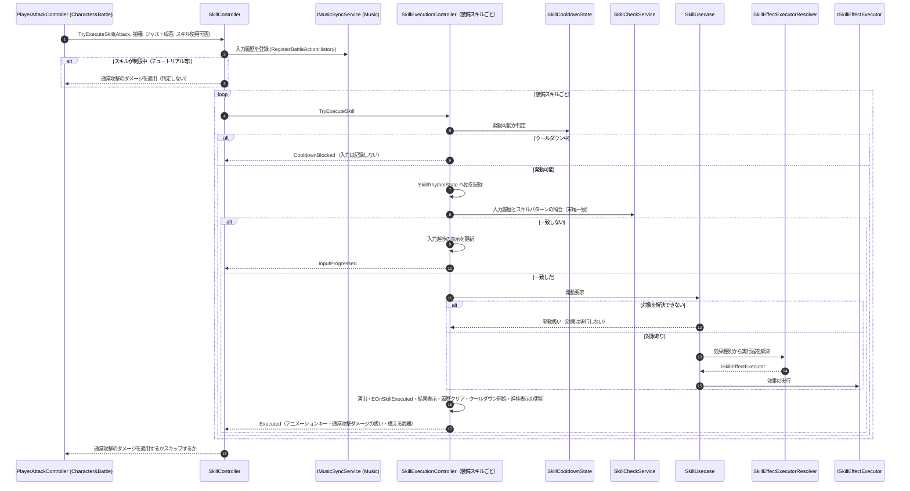

# ① スキル発動フロー（リズムコマンド入力）

- page_id: 3bf7c2c6-cc02-81aa-9f1b-ef1cacd3f8d5
- Notion パス: Symphony Kill Chord / システム概要 / スキル / ① スキル発動フロー（リズムコマンド入力）
- スナップショットの最終更新: 2026-08-17T13:21:28.643Z
- 書き込み許可: 可
- 処置: 本文置き換え

## 判定

- 信頼性: 一部古い — 次の点が実装と違う（`Runtime/3.Adaptor/InGame/Skill/SkillController.cs:53-80`、`SkillExecutionController.cs:57-106`、`Runtime/2.Application/InGame/Skill/SkillUseCase.cs:34-58`）
  - 起点は「プレイヤー → `SkillExecutionController`」ではなく、攻撃入力を受けた `PlayerAttackController` → `SkillController.TryExecuteSkill` である。回避などほかの入力は来ない（BT-19）
  - `SkillController` が先に Music の入力履歴を登録し、チュートリアル等でスキルが制限されている間は判定しない
  - クールダウンの確認はパターン照合の前で、クールダウン中のスキルにはその入力が記録されない。結果は `CooldownBlocked` で、`SkillExecutionFailurePolicy` は使わない
  - 照合は入力履歴の末尾一致である。一致したら `SkillUsecase` が対象を解決し、対象がいなければ効果を実行せずに発動扱い（空撃ち）にする。この場合もクールダウンは始まる
  - 発動後に演出（`ISkillVisual`）、`EOnSkillExecuted` 通知、結果表示、履歴のクリア、クールダウン開始、進捗表示の更新を行い、`SkillController` がアニメーション・ボイス・武器の表示要求と、通常攻撃のダメージを消すかどうかを返す
  - 装備スキルを順に判定するため、1 回の入力で複数のスキルが同時に発動しうる
- 整合性: 親ページ `スキル`（3957c2c6-cc02-806e-bbe8-e391a7ad8c86）の原稿、`キャラ&バトル / ① プレイヤー攻撃実行フロー`（3bf7c2c6-cc02-815f-be7d-f3fe8018830c）の原稿と一致させた
- 変更点:
  - 冒頭の説明文: 起点、末尾一致、空撃ち、複数同時発動を追記
  - シーケンス図: 旧: `Player ->> Ctrl (SkillExecutionController)` → 新: `PlayerAttackController ->> SkillController`。旧: クールダウン中 → `SkillExecutionFailurePolicy` に従い失敗を通知 → 新: `CooldownBlocked` を返す。照合前のクールダウン確認、`SkillRhythmState` への記録、対象なしの空撃ち、発動後の処理を追加
- 織り込んだ反映項目: BT-19（スキル側の記述）
- 出典: 実装 `PlayerAttackController.cs:111`、`SkillController.cs`、`SkillExecutionController.cs`、`SkillUseCase.cs`、`SkillCheckService.cs`、`SkillDefinition.cs:60-72`
- 要確認:
  - 【要確認: プログラム担当】対象がいないときの空撃ち（クールダウンを消費し効果なし）を仕様とするか

## 適用する本文

拍に合わせた入力列がスキルのパターンと一致したとき、クールダウンとターゲットを確認して効果を実行する。入力の起点は攻撃入力で、`PlayerAttackController`が攻撃のたびに`SkillController.TryExecuteSkill`を呼ぶ。照合は入力履歴の末尾がパターンと一致するかで判定する。対象がいない場合は効果を実行せずに発動扱い（空撃ち）にし、クールダウンも始まる。装備スキルを順に判定するため、1回の入力で複数のスキルが発動することがある。

