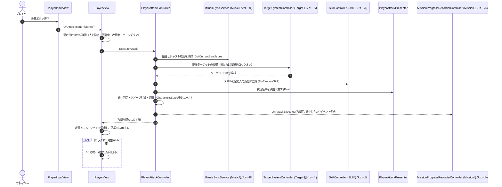

# ② 攻撃実行フロー（入力イベント時）

- page_id: 3bf7c2c6-cc02-81ad-bf88-ef1cd0770beb
- Notion パス: Symphony Kill Chord / システム概要 / プレイヤー / ② 攻撃実行フロー（入力イベント時）
- スナップショットの最終更新: 2026-08-17T13:20:44.015Z
- 書き込み許可: 可
- 処置: 本文置き換え

## 判定

- 信頼性: 一部古い — 大筋（入力 → `PlayerAttackController` → ターゲット取得 → ダメージ → `OnAttackExecuted`）は正しい。ただし、`PlayerView` が攻撃を受け付ける条件（押した瞬間だけ・入力抑止中でない・回避中でない・攻撃中/クールダウン中でない）、拍種とジャストの判定、スキル判定、判定結果の演出への通知（PR #1513 の `PlayerAttackPresenter` → `IPlayerAttackSignal`）、攻撃後のアニメーション・武器表示・向き直りが無い。`OnAttackExecuted` は命中しなくても `(攻撃名, false)` で必ず発火する
- 整合性: 詳しいダメージ計算は `キャラ&バトル / ① プレイヤー攻撃実行フロー（入力イベント時）`（3bf7c2c6-cc02-815f-be7d-f3fe8018830c）が扱う。このページはプレイヤー側（入力の受け付けと攻撃後の表示）に絞り、重複を避けた
- 変更点:
  - 冒頭の説明文: 受け付け条件と、ダメージ計算の詳細は キャラ&バトル ① にある旨を追記
  - シーケンス図: `PlayerInputView` と `PlayerView` を追加。`GetCurrentBeatType`・`TryExecuteSkill`・`PlayerAttackPresenter.Push`・`OnAttackExecuted(攻撃名, 命中したか)`・攻撃アニメーション要求・武器表示・向き直りを追加
- 織り込んだ反映項目: BT-09（判定結果の通知経路）
- 出典: 実装 `Runtime/4.View/InGame/Player/PlayerView.cs:546-594,685-700`、`Runtime/3.Adaptor/InGame/Battle/PlayerAttackController.cs:96-179`
- 決定（2026-09-22 八幡）: R30 ロックオン対象がいなければ正面へ直線で撃つ。冒頭の説明文に仕様と現状（弾が真っすぐ飛ばない）を書いた
- 実装の修正が必要: R30 対象がいないときに正面へ直線で撃つ（Issue #2055、根拠 `Assets/Scripts/Runtime/3.Adaptor/InGame/Battle/PlayerAttackController.cs:134-139`）
- 要確認: なし

## 適用する本文

攻撃入力を受け、ターゲット解決からダメージ適用・イベント通知までを実行する。`PlayerView`は、押した瞬間の入力で、入力抑止中・回避中・攻撃中・攻撃クールダウン中のいずれでもないときだけ攻撃を実行する。ダメージ計算の詳細は「キャラ&バトル」の①を参照する。
ロックオン対象も候補もいないときは、正面へ直線で撃つ（敵にはHitしない）。現状は攻撃の成立を通知して終わり、弾が真っすぐ飛ばない（修正が必要。Issue #2055）。

