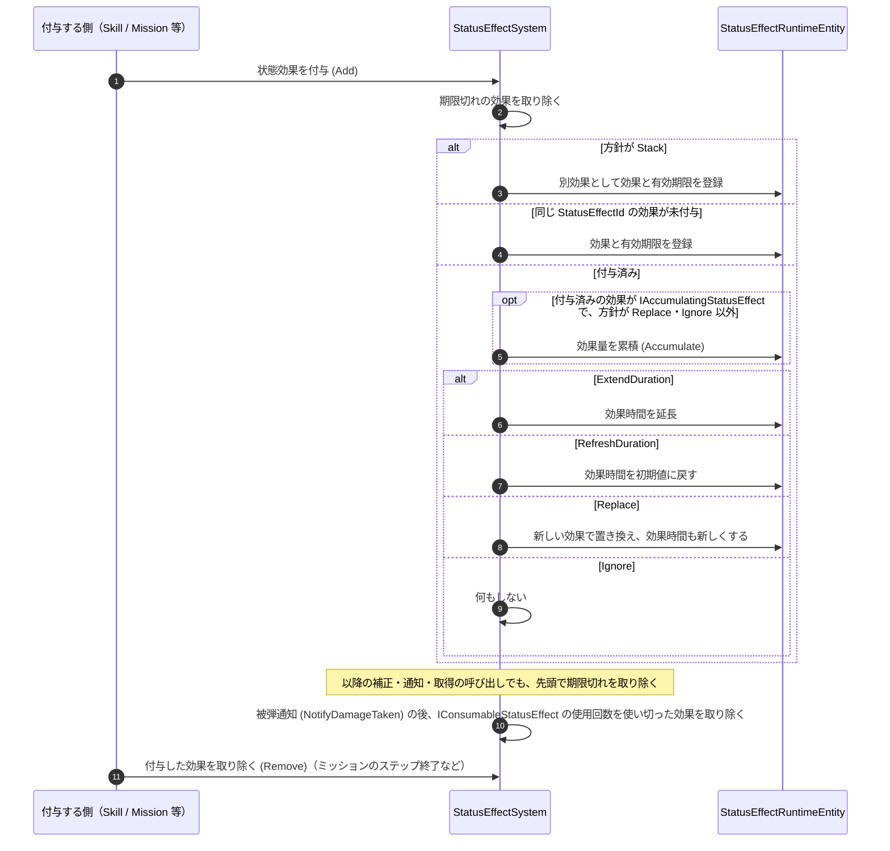

# ② 付与と期限切れのフロー

- page_id: 3bf7c2c6-cc02-81b4-a3d3-dd438788c33f
- Notion パス: Symphony Kill Chord / システム概要 / 状態効果（バフ・デバフ） / ② 付与と期限切れのフロー
- スナップショットの最終更新: 2026-08-17T17:54:03.954Z
- 書き込み許可: 可
- 処置: 本文置き換え

## 判定

- 信頼性: 一部古い — 次の点が実装と違う（`Runtime/2.Application/InGame/StatusEffect/StatusEffectSystem.cs`）
  - `loop 毎フレーム` で期限を確認する処理は無い。期限切れの効果は `Add`・各補正・`NotifyDamageDealt`/`NotifyDamageTaken`・`TryGet` の呼び出しのたびに取り除く。時刻は `Time.time`
  - 使用回数を使い切った効果（`IConsumableStatusEffect`）を取り除くのは、`NotifyDamageTaken` の直後だけである
  - `Stack` は「同じ効果が付与済みか」を見ずに常に別効果として追加する。累積（`IAccumulatingStatusEffect.Accumulate`）は、付与済みの効果が累積可能で、方針が `Replace`・`Ignore` 以外のときに行い、そのうえで方針の処理（延長・リセット）も行う
  - 取り除く経路に、付与した側の `Remove`（ミッションのステップ終了など）と `Clear` がある
- 整合性: 親ページ `状態効果（バフ・デバフ）` の原稿の「📋 スキルごとの再付与方針とバリア」と一致させた
- 変更点:
  - 冒頭の説明文: 期限は呼び出しのたびに確認する旨を追記
  - シーケンス図: `Stack` の分岐、累積の条件、方針ごとの処理（延長・リセット・置き換え・無視）を追加。旧: `loop 毎フレーム` → 新: 各呼び出しの先頭で期限切れを取り除く。被弾通知の後の使用済み効果の除去、付与した側の `Remove` を追加
- 織り込んだ反映項目: BT-37（再付与の扱い）
- 出典: 実装 `StatusEffectSystem.cs`（`Add`・`RemoveExpiredEffects`・`RemoveConsumedEffects`・`GetCurrentTime`）、`StatusEffectReapplyPolicy.cs`、`MissionPlayerBuffController.cs:69,81`
- 要確認: なし

## 適用する本文

同じ効果を再付与したときの扱いは`StatusEffectReapplyPolicy`で決まる。期限切れは毎フレームではなく、付与・補正・通知・取得の呼び出しのたびに、その先頭で確認して取り除く（時刻は`Time.time`）。

