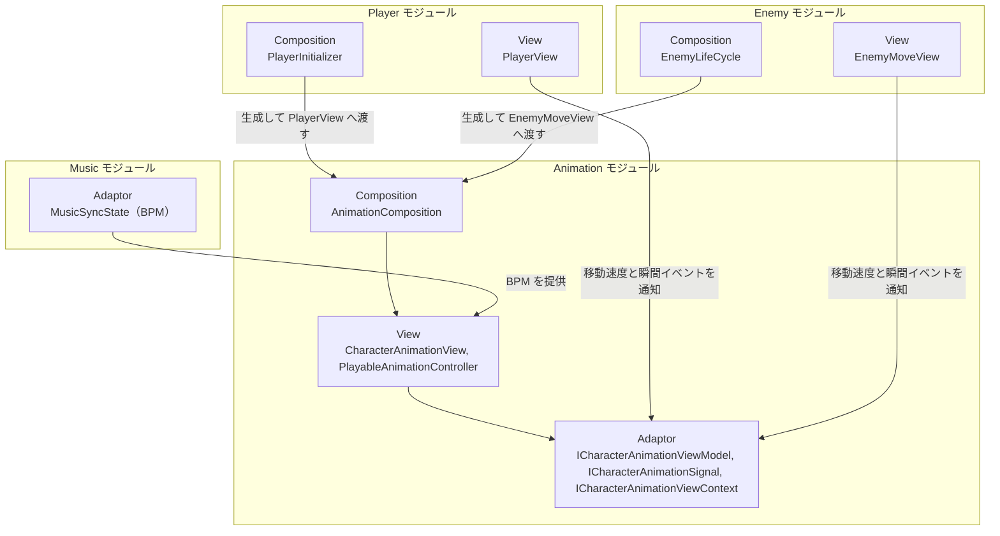

# キャラクターアニメーション

- page_id: 3bf7c2c6-cc02-81be-a722-ccf86f074347
- Notion パス: Symphony Kill Chord / システム概要 / キャラクターアニメーション
- スナップショットの最終更新: 2026-09-09T03:28:57.191Z
- 書き込み許可: 可
- 処置: 本文置き換え

## 判定

- 信頼性: 一部古い — クラス表の 18 型はすべて実在し、`AnimationComposition` の `Init`/`InitForPlayer`、`PlayerInitializer`・`EnemyLifeCycle` からの生成も実装どおり（`Runtime/6.Composition/InGame/Player/PlayerInitializer.cs:347-351`、`Runtime/6.Composition/InGame/Enemy/EnemyLifeCycle.cs:181-183`）。古いのは次の 1 点で、repo の `NotionModuleDocs/Animation.md`（2026-09-17、6aa560a2d）の方が新しい（01 棚卸し B 表）
  - クラス節の注意書き「Adaptor層の3契約は `3.Adaptor/InGame/Animaiton/` にある。リネームは Issue #1312」は、PR #1803（2026-09-17、hotfix/1312）でフォルダを `3.Adaptor/InGame/Animation/` にリネーム済みのため不要（CM-18）
  - 加えて、ワンショットの遷移ルール（同一クリップの連打・移動キャンセル・ブレンド値）、ロコモーションの音楽位相同期の要件と既知の課題、クリップの割り当てが書かれていない（CM-19・CM-20・CM-21）
- 整合性:
  - repo の `Animation.md` との差は上記の注意書きだけで、ほかの節は同一（差分を再確認済み）
  - `CharacterAnimationClipType` は Idle=0 / Walk=1 / Dodge=2 / Attack=3 / Reserved=4 の 5 種で、Notion 本文は Reserved に触れていない（`Runtime/4.View/InGame/Animation/CharacterAnimationClipType.cs`）
- 変更点:
  - 「概要」表: 旧: 最終更新日 2026-08-17 → 新: 2026-09-22
  - 「🏗️ クラス」: 表下の注意書き（`Animaiton` フォルダ・Issue #1312）を削除。`CharacterAnimationClipType` の役割に 5 種の値を追記
  - 末尾に「🎬 ワンショットの遷移ルール」（CM-19）、「🎵 ロコモーションの音楽同期」（CM-20）、「🎞️ クリップの割り当て」（CM-21）の 3 節を新設
- 織り込んだ反映項目: CM-18, CM-19, CM-20, CM-21（HD-25・HD-26 は武器表示の内容で、`プレイヤー`（3957c2c6-cc02-8017-9b5f-c04dd480c816）の原稿の ④ View に織り込んだ）
- 出典: 実装 `CharacterAnimationView.cs:64,107-130,240-290`、`PlayerCharacterAnimationSignal.cs:85-100`、`CharacterAnimationOneShotTimingCalculator.cs:72-74`、`CharacterAnimationLocomotionCalculator.cs:10-17`、`PlayableAnimationController.cs:45-55`。マスターデータ `Assets/Level/Data/Master/Character/PlayerAnimationConfig.asset:15-47`、`PlayerAttackAnimationConfig.asset:16-39`、`EnemyAnimationConfig.asset:15-42`。PR #1338・#1352（移動キャンセル）、#1589（走りモーション）、#1803（フォルダのリネーム）。リポジトリ文書 `Assets/Docs/攻撃アニメーション遷移改善計画書.md`（実装済み）、`Assets/Docs/ロコモーションAnimatorController常駐BlendTree化計画書.md`（2026-07-17、未着手）
- 要確認:
  - 【要確認: 企画・プログラム】ロコモーションの BlendTree 化計画を継続するか破棄するか（CM-20）
  - 【要確認: プログラム担当】`Reserved` 枠の用途（敵の設定だけが 5 枠目を使う）（CM-21）
  - 【要確認: 実機】プレイヤーの Idle・既定の攻撃クリップと、敵の全クリップは GUID から git 管理下のファイルを特定できなかった（CM-21）

## 適用する本文

# 概要 {color="gray_bg"}

> 💡 **モジュール概要**
> キャラクターのアニメーション再生を司るモジュールである。PlayableGraphでクリップをブレンド再生し、移動速度とBPMから再生速度を決める。プレイヤーと敵の双方が使う。

| 項目 | 内容 |
| --- | --- |
| **モジュール名** | Animation |
| **カテゴリ** | InGame |
| **ステータス** | 実装済み |
| **最終更新日** | 2026-09-22 |

---

## 🏗️ クラス {toggle="true"}

	| クラス名 | レイヤー | 役割・機能 |
	| --- | --- | --- |
	| **`ICharacterAnimationViewModel`** | Adaptor | アニメーションの連続状態を扱う契約 |
	| **`ICharacterAnimationSignal`** | Adaptor | 瞬間イベントとワンショット要求を扱う契約 |
	| **`ICharacterAnimationViewContext`** | Adaptor | アニメーションに必要な依存をまとめる契約 |
	| **`IPlayerCharacterAnimationSignal`** | Adaptor | `ICharacterAnimationSignal`を継承し、プレイヤー専用の要求（回避・攻撃キー指定・BeatType指定攻撃）を追加定義する契約 |
	| **`CharacterAnimationView`** | View | 再生と計算をView層で完結させる。当モジュールの本体 |
	| **`CharacterAnimationViewModel`** | View | 連続状態（移動速度など）を保持する |
	| **`CharacterAnimationSignal`** | View | 瞬間イベント（攻撃・被弾など）を伝達する |
	| **`PlayerCharacterAnimationSignal`** | View | `CharacterAnimationSignal`を継承し`IPlayerCharacterAnimationSignal`を実装するプレイヤー専用差分クラス。`RequestDodge`（回避）、`RequestAttack(string)`（キー指定）、`RequestAttack(int)`（BeatType指定）を追加し、いずれも内部の`RequestPlayerAttack`（同一クリップ再突入時のブレンドスキップ・移動によるキャンセル許可を付与）へ委譲する。`NotifyOneShotEnded`をoverrideし、回避終了時に`OnDodgeEnded`を通知する |
	| **`CharacterAnimationViewContext`** | View | View側の依存をまとめる |
	| **`PlayableAnimationController`** | View | PlayableGraphを構築してクリップをブレンド再生する純粋クラス |
	| **`CharacterAnimationLocomotionCalculator`** | View | 移動速度とBPMから基本アニメーションのブレンド値と再生速度を計算する |
	| **`CharacterAnimationOneShotTimingCalculator`** | View | ワンショットアニメーションの時間進行とブレンド時間を計算する |
	| **`CharacterAnimationPlaybackMap`** | View | 再生インデックスと再生時間を保持する |
	| **`CharacterAnimationRequest`** | View | 内部の再生要求 |
	| **`CharacterAnimationClipType`** | View | 基本アニメーションのクリップ種別（Idle=0 / Walk=1 / Dodge=2 / Attack=3 / Reserved=4） |
	| **`CharacterAnimationCatalogConfig`** / **`CharacterAnimationCatalogEntry`** | View | クリップの表示設定と、その1件分 |
	| **`AnimationComposition`** | Composition | アニメーションの依存関係を構築する |

### 🧩 Composition初期化情報

| 項目 | 内容 |
| --- | --- |
| **Initializerクラス** | `AnimationComposition` |
| **Order** | なし（`InGameInitializationModuleBase`を継承しないプレーンクラス） |
| **公開する ModuleContainer / ServiceLocator登録型** | なし。キャラクター単位で構築され、`PlayerInitializer`と`EnemyLifeCycle`が生成して各Viewへ渡す |

ServiceLocatorへは登録しない。アニメーションはキャラクターごとに独立した状態を持つため、キャラクターの生成に合わせて構築する。 `AnimationComposition`は`Init`（敵など共通クラス`CharacterAnimationSignal`を生成する既定パス）と`InitForPlayer`（プレイヤー専用の`PlayerCharacterAnimationSignal`を生成する専用パス）の2つの初期化エントリを持つ。両者は内部の`InitInternal`へSignal生成用のファクトリを渡すことで共通化されており、`InitForPlayer`はさらに`PlayerAttackAnimationConfig`（プレイヤー攻撃アニメーション設定）を受け取り、BeatType別のクリップを`attackIndices`として組み込む点が`Init`との差分である。

---

## 🔗 モジュール結合

### 📥 依存しているもの

- **`Music`**
	- *依存箇所*: BPM
	- *詳細*: `CharacterAnimationLocomotionCalculator`が現在のBPMから再生速度を決める。基準は60BPMで、曲が速いほどアニメーションも速くなる

### 📤 依存されているもの

- **`Player`**
	- *参照箇所*: `CharacterAnimationView`, `AnimationComposition`
	- *詳細*: `PlayerInitializer`が構築し、`PlayerView`が移動速度と攻撃・回避の瞬間イベントを通知する
- **`Enemy`**
	- *参照箇所*: `CharacterAnimationView`, `AnimationComposition`
	- *詳細*: `EnemyLifeCycle`が構築し、`EnemyMoveView`が移動状態を通知する

---

# 詳細 {color="gray_bg"}

## 🧅レイヤー情報

### ① Domain

当モジュールでは使用していない。

### ② Application

当モジュールでは使用していない。計算はView層の純粋クラスへ置いている。

### ③ Adaptor

連続状態・瞬間イベント・依存のまとめという3つの契約を定義する。連続状態（移動速度）と瞬間イベント（攻撃・被弾）を分けているのが特徴で、前者はブレンド値へ、後者はワンショット再生へつながる。

### ④ View

`CharacterAnimationView`が再生と計算を完結させる。`PlayableAnimationController`がPlayableGraphの構築とブレンド再生を担い、2つのCalculatorが移動アニメーションのブレンド値とワンショットの時間進行を計算する。

### ⑤ Infrastructure

当モジュールでは使用していない。クリップの設定は`CharacterAnimationCatalogConfig`がView層で保持する。

### ⑥ Composition

`AnimationComposition`がキャラクター単位で依存を構築する。初期化ライフサイクルには乗らず、キャラクターの生成側から呼ばれる。

## 🔌 拡張ポイント

| 拡張したいこと | 実装する場所 | 追加登録の要否 |
| --- | --- | --- |
| 基本アニメーションのクリップを増やしたい | `CharacterAnimationClipType`へ値を追加し、`CharacterAnimationCatalogConfig`へ対応するクリップを設定する | 必要（カタログへの設定漏れは、その種別だけ再生されない） |
| ワンショット演出を追加したい | `ICharacterAnimationSignal`経由で要求を送る。タイミングは`CharacterAnimationOneShotTimingCalculator`が扱う | 不要（既存の仕組みで再生できる） |

## 🔄処理フロー

主要な処理フローは、それぞれ子ページに分けている。

<page url="https://www.notion.so/3bf7c2c6cc02816cbd45f9abba361f98">① 移動アニメーションのブレンドフロー（毎フレーム）</page>

<page url="https://www.notion.so/3bf7c2c6cc028138abdacbff3308ad44">② ワンショット再生のフロー（攻撃・被弾時）</page>

## 🎬 ワンショットの遷移ルール

プレイヤーの攻撃系のワンショット（通常攻撃・BeatType別攻撃・キー指定のスキル）だけ、次の2つのオプションをONにする。敵はどちらもOFFで、従来どおりの再生になる。敵は移動しながら攻撃するため、移動キャンセルを共通で入れると敵の攻撃アニメーションが即座に消えてしまうからである。

- 同一クリップの連続要求: 有効なオーバーレイと同じクリップを要求した場合は、開始ブレンドを0にして頭から再生する。異なるクリップ、またはオーバーレイの終了後の要求では、通常どおり開始ブレンドを掛ける
- 移動キャンセル: 開始ブレンドが終わってから終了ブレンド区間に入るまでの間に、一度停止（速度 0.1 未満）を観測したあとで速度が 0.1 以上になったら、現在のウェイトから終了ブレンド時間で0へフェードして歩行へ移る。すでに終了ブレンド区間に入っていれば、自然なフェードアウトに任せる。回避中はキャンセルしない

ブレンド時間は30fps基準のフレーム数で、クリップごとの値はConfigにある。未設定時の既定は開始4F / 終了8Fである。

| 対象 | 開始ブレンド | 終了ブレンド | 正本 |
| --- | --- | --- | --- |
| プレイヤー 回避（Dodge） | 3F | 5F | `Assets/Level/Data/Master/Character/PlayerAnimationConfig.asset` |
| プレイヤー 既定の攻撃（Attack） | 3F | 12F | 同上 |
| プレイヤー スキル `Skill_Right` | 6F | 12F | 同上 |
| プレイヤー スキル `Skill_Left` | 3F | 8F | 同上 |
| プレイヤー BeatType別攻撃（全拍種） | 1F | 12F | `Assets/Level/Data/Master/Character/PlayerAttackAnimationConfig.asset` |
| 敵 | 4F | 8F | `Assets/Level/Data/Master/Character/EnemyAnimationConfig.asset` |

再生速度はBPM ÷ 60で、ブレンド時間も同じ倍率で縮む。

## 🎵 ロコモーションの音楽同期

ロコモーション（Idle/Walk）は音楽に位相まで同期させる要件である。クリップの表示時間は「音楽時間 mod クリップ長」とする（例: 2秒のクリップ・60BPMで、曲の2.3秒目に移動を始めるとクリップの0.3秒目から表示する）。 現在の実装は、全クリップを初期化時に再生開始して止めず、ウェイトだけを動かすことで、この同期を副次的に満たしている。

既知の課題は次のとおりである。

- 曲の途中で生成された敵は、PlayableGraphの生成時刻が起点になるため、音楽との位相がずれる（`PlayableAnimationController`は生成時に`Play()`するだけで、曲の現在時刻への頭出しをしていない）
- Idle↔Walkの切り替えは速度0.1（`WALK_THRESHOLD`）を境に段差が出る

ロコモーションを`AnimatorControllerPlayable`の常駐BlendTreeへ移す計画（BlendTreeは一度も遷移しない。BlendTreeに入れるクリップは同じ拍数で制作する）は未着手である。【要確認: この計画を継続するか破棄するかを企画・プログラム担当に確認】

## 🎞️ クリップの割り当て

| キャラクター | 枠・キー | クリップ |
| --- | --- | --- |
| プレイヤー | Walk | `Symphony_run_v001_nons.fbx`（走りモーション） |
| プレイヤー | Dodge | `20260816_dodge.fbx` |
| プレイヤー | BeatType 1 / 2 / 4 の攻撃 | `Sympnonhy_ARpose_0615_3` |
| プレイヤー | BeatType 3 / 6 / 8 の攻撃 | `Sympnonhy_HGpose_0615_3` |
| プレイヤー | スキル `Skill_Right` | `Skill_Rifle.anim` |
| プレイヤー | スキル `Skill_Left` | `Skill_Pistol.anim` |

- Walk枠には走りモーションを割り当てている
- 敵は`Reserved`を含む5枠を使う（`EnemyAnimationConfig.asset`）。【要確認: Reserved枠の用途をプログラム担当に確認】
- プレイヤーのIdle・既定の攻撃と、敵の全クリップは、リポジトリ内のファイルを特定できていない。【要確認: 実機で確認】
