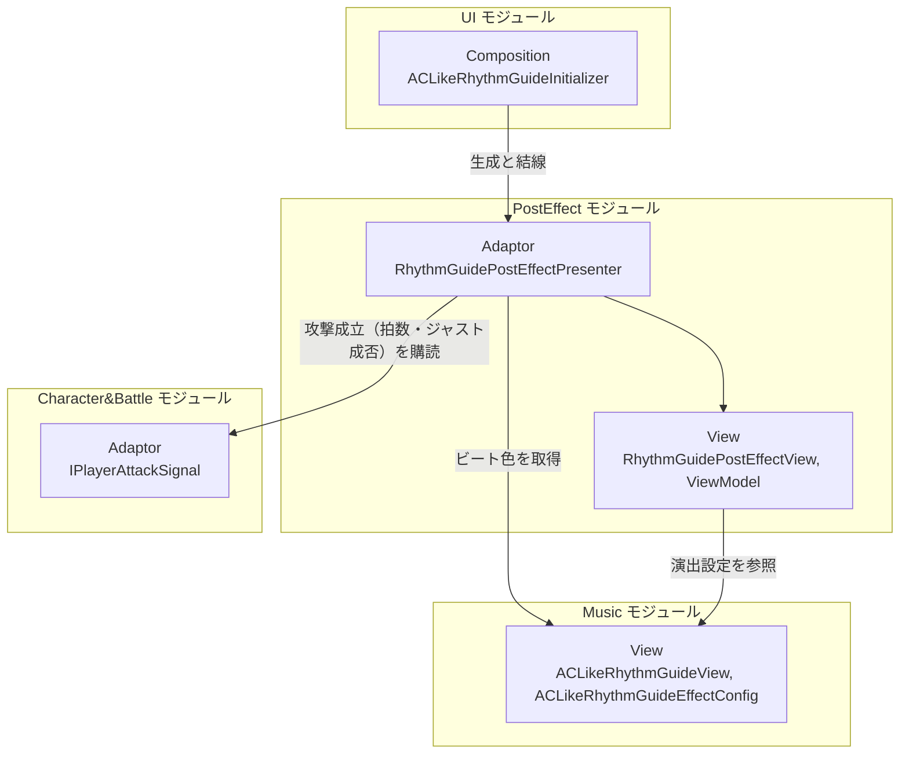

# リズムガイド全画面演出

- page_id: 3bf7c2c6-cc02-81c7-9528-ca85aee87fa3
- Notion パス: Symphony Kill Chord / システム概要 / リズムガイド全画面演出
- スナップショットの最終更新: 2026-08-24T13:46:58.484Z
- 書き込み許可: 可
- 処置: 本文置き換え

## 判定

- 信頼性: 一部古い — クラス表の 6 型とオーバーレイ節の 3 型はすべて実在する。ただし、PR #1513（2026-09-12）で削除した `RhythmJustService` が結合図と依存節に残っている。Presenter が購読するのは `PlayerAttackController.OnAttackExecuted` ではなく `IPlayerAttackSignal.OnAttackExecuted(拍数, isJustHit)` であり、ビート色は `ACLikeRhythmGuideView`（`IRhythmGuideBeatViewModel` の実装）から取る（`Runtime/3.Adaptor/InGame/PostEffect/RhythmGuidePostEffectPresenter.cs:19-60`、`Runtime/4.View/InGame/Music/ACLikeRhythmGuideView.cs:16`）。repo の `NotionModuleDocs/PostEffect.md`（2026-08-19）より Notion（2026-08-23）の方が新しく、オーバーレイ節は Notion にしかない（01 棚卸し B 表）
- 整合性:
  - 実装との矛盾: 上記。オーバーレイの `IPostEffectOverlayPlayer` を ServiceLocator へ登録するのは常駐カメラの `CameraInitializer`（`Runtime/6.Composition/Persistent/Camera/CameraInitializer.cs:34-39`）だが、記述が無い
  - 他ページとの関係: 親の `音楽`（3957c2c6-cc02-806b-9cc8-fbe9c9e8bf63）・子 ② ジャスト判定フローの原稿と同じ経路にそろえた。被弾時の画面演出（`PlayerView` の `_Pixel`、HD-23）はこのモジュールではなく、担当外
- 変更点:
  - 「概要」表: 旧: 最終更新日 2026-08-23 → 新: 2026-09-22
  - 「🏗️ クラス」: `IRhythmGuideBeatViewModel` の役割を「拍種に対応するビート色を返す契約（`ACLikeRhythmGuideView` が実装）」に、`RhythmGuidePostEffectPresenter` の役割を「`IPlayerAttackSignal` の攻撃成立通知を受け…」に修正
  - 「🔗 モジュール結合」: 旧: `M_App["Application RhythmJustService"]`・`B_Adaptor["Adaptor PlayerAttackController"]` → 新: Music の View `ACLikeRhythmGuideView`（ビート色）、Character&Battle の Adaptor `IPlayerAttackSignal`
  - 「📥 依存しているもの」: Music の依存箇所 旧: `RhythmJustService` → 新: `IRhythmGuideBeatViewModel`（`ACLikeRhythmGuideView`）。Character&Battle の依存箇所 旧: `PlayerAttackController.OnAttackExecuted` → 新: `IPlayerAttackSignal.OnAttackExecuted`
  - 「② Application」「③ Adaptor」: 判定を再計算せず入力時の結果をそのまま使う旨に修正
  - 「④ View」: Vignette の現在値の表を追加（数値が 5 つ並ぶため）
  - 「🎛️ ポストエフェクトオーバーレイ」: `CameraInitializer` が登録する旨と、`IPostEffectOverlayPlayer` の操作（`Add`/`Remove`/`AddForSeconds`/`RemoveAll`）を追記
- 織り込んだ反映項目: BT-09
- 出典: 実装 `RhythmGuidePostEffectPresenter.cs`、`RhythmGuidePostEffectViewModel.cs`、`RhythmGuidePostEffectView.cs`（既定 0.1 秒・`UpdateIgnoreTimeScale`）、`ACLikeRhythmGuideInitializer.cs:150-168`、`IPostEffectOverlayPlayer.cs:13-40`、`CameraInitializer.cs:34-39`、`SkillEffectInitializer.cs:38`。マスターデータ `Assets/Level/Data/Master/InGame/Music/ACLikeRhythmGuideEffectConfig.asset:28-33`。PR #1513
- 要確認: なし

## 適用する本文

# 概要 {color="gray_bg"}

> 💡 **モジュール概要**
> 全画面のポストプロセス演出を司るモジュールである。リズムガイドの全画面演出（攻撃実行時のジャスト成否とビート色をVignetteで反映する）に加え、Config単位でVolumeを重ねがけできる汎用のOverlay機構を持つ。

| 項目 | 内容 |
| --- | --- |
| **モジュール名** | PostEffect |
| **カテゴリ** | インゲーム |
| **ステータス** | 実装済み |
| **最終更新日** | 2026-09-22 |

---

## 🏗️ クラス {toggle="true"}

	| クラス名 | レイヤー | 役割・機能 |
	| --- | --- | --- |
	| **`IRhythmGuideBeatViewModel`** | Adaptor | 拍種に対応するリズムガイドのビート色を返す契約（`ACLikeRhythmGuideView`が実装する） |
	| **`IRhythmGuidePostEffectViewModel`** | Adaptor | 全画面演出の再生指示を受け取る契約 |
	| **`RhythmGuidePostEffectDto`** | Adaptor | 演出1回分の表示データ |
	| **`RhythmGuidePostEffectPresenter`** | Adaptor | `IPlayerAttackSignal`の攻撃成立通知を受け、入力時に確定したジャスト成否とビート色をViewModelへ伝える |
	| **`RhythmGuidePostEffectViewModel`** | View | 演出設定を参照して表示内容を決め、Viewへ反映する |
	| **`RhythmGuidePostEffectView`** | View | 全画面演出のMaterialを操作する |

### 🧩 Composition初期化情報

| 項目 | 内容 |
| --- | --- |
| **Initializerクラス** | なし（UIモジュールの`ACLikeRhythmGuideInitializer`が構築する） |
| **公開する ModuleContainer / ServiceLocator登録型** | なし |

Presenterとその依存はAC風リズムガイドの初期化と一体で生成される。演出設定（`ACLikeRhythmGuideEffectConfig`）はMusicモジュールのView層にあり、Inspectorから調整する。

---

## 🔗 モジュール結合

### 📥 依存しているもの

- **`Music`**
	- *依存箇所*: `IRhythmGuideBeatViewModel`（`ACLikeRhythmGuideView`）, `ACLikeRhythmGuideEffectConfig`
	- *詳細*: 攻撃した拍種のビート色をガイドから受け取り、演出設定に従って見た目を決める。ガイドが未構築で色を取れない場合は演出を出さない
- **`Character&Battle`**
	- *依存箇所*: `IPlayerAttackSignal.OnAttackExecuted`
	- *詳細*: 攻撃成立を演出の起点にする。入力1回につき1回通知され、空振りでも通知される

### 📤 依存されているもの

- **`UI`**
	- *参照箇所*: `ACLikeRhythmGuideInitializer`
	- *詳細*: AC風リズムガイドの初期化が、当モジュールのPresenter・ViewModel・Viewを生成して結線する。当モジュール側に専用のInitializerは無い

---

# 詳細 {color="gray_bg"}

## 🧅レイヤー情報

### ① Domain

当モジュールでは使用していない。

### ② Application

当モジュールでは使用していない。ジャスト判定はMusicモジュールが持ち、攻撃入力時に確定した結果を`IPlayerAttackSignal`で受け取る。

### ③ Adaptor

`RhythmGuidePostEffectPresenter`が攻撃成立の通知を受け、ジャスト成否とビート色を`RhythmGuidePostEffectDto`へ詰めてViewModelへ渡す。判定を再計算せず、入力時の結果をそのまま使う。

### ④ View

`RhythmGuidePostEffectViewModel`が演出設定を参照して表示内容を決め、`RhythmGuidePostEffectView`がMaterialを操作して全画面のVignetteを描く。ジャスト時は濃く長く、それ以外は控えめに出す。再生はタイムスケールの影響を受けない。

| 名前 | 値 | 単位 | 正本 |
| --- | --- | --- | --- |
| Vignette の有効化 | 有効 | — | `ACLikeRhythmGuideEffectConfig.asset` の `_isVignetteEnabled` |
| ジャスト時の強さ | 1 | 0〜1 | 同 `_vignetteIntensity` |
| ジャスト以外の強さ | 0.3 | 0〜1 | 同 `_normalVignetteIntensity` |
| ジャスト時の時間 | 0.4 | 秒 | 同 `_vignetteDuration` |
| ジャスト以外の時間 | 0.2 | 秒 | 同 `_normalVignetteDuration` |
| イージング | OutQuad | — | 同 `_vignetteEase` |

表の値は現在値であり、正本は `Assets/Level/Data/Master/InGame/Music/ACLikeRhythmGuideEffectConfig.asset` である。

### ⑤ Infrastructure

当モジュールでは使用していない。

### ⑥ Composition

専用のInitializerは持たない。UIモジュールの`ACLikeRhythmGuideInitializer`（Order 800）が生成と結線を行う。

## 🔌 拡張ポイント

| 拡張したいこと | 実装する場所 | 追加登録の要否 |
| --- | --- | --- |
| 演出の色や強さを変えたい | `ACLikeRhythmGuideEffectConfig`（Musicモジュール） | 不要（コード変更なし） |
| 別の全画面演出を追加したい | `IRhythmGuidePostEffectViewModel`を実装したViewModelとViewを作り、`ACLikeRhythmGuideInitializer`で差し替える | 必要（Initializerでの結線が要る） |

## 🔄処理フロー

主要な処理フローは、それぞれ子ページに分けている。

<page url="https://www.notion.so/3bf7c2c6cc02812bac16d305bb01f5aa">① 攻撃時の全画面演出フロー</page>

# 🎛️ ポストエフェクトオーバーレイ（`Persistent/PostEffect`） {color="gray_bg"}

> 💡 **節の概要**
> 「画面全体にVolumeを掛けたいが、一部のオブジェクトだけは影響を受けさせたくない」という要求に応える汎用機構である。Config単位で起動し、除外レイヤーをポストプロセス無しのOverlayカメラへ逃がしたうえで、Baseカメラ側にだけVolumeを適用する。

| クラス名 | レイヤー | 役割・機能 |
| --- | --- | --- |
| **`IPostEffectOverlayPlayer`** | View (Persistent) | Config単位でOverlayカメラの起動と停止を受け付ける契約。同じConfigの多重要求は参照数で数え、すべて取り下げられた時点で停止する。操作は`Add`/`Remove`/`AddForSeconds`（遅延と継続秒数を指定）/`RemoveAll` |
| **`PostEffectOverlayConfig`** | View (Persistent) | 除外レイヤー・VolumeProfile・Volumeの強さ・フェードイン/アウト秒数・イージングを保持するScriptableObject |
| **`PostEffectOverlayCamera`** | View (Persistent) | Baseカメラ側の制御本体。起動中は除外レイヤーをOverlayカメラへ逃がし、停止時はカメラスタックから外して元へ戻す |

Configは同時に何個でも起動でき、Volumeは重ねて適用される。フェードイン秒数が設定されている場合は、現在の強さから設定値まで持ち上げる。 `PostEffectOverlayCamera`は常駐カメラと同じGameObjectに置き、常駐カメラの`CameraInitializer`が`IPostEffectOverlayPlayer`としてServiceLocatorへ登録する。 スキルエフェクト側（`SkillEffectInitializer`）は`ServiceLocator.TryGetInstance`でこの`IPostEffectOverlayPlayer`を取得し、存在する場合のみ`SkillEffectSpawner`へ注入する。常駐カメラが用意されていない状況でもエフェクト再生自体は成立する。

## 🔌 拡張ポイント

| 拡張したいこと | 実装する場所 | 追加登録の要否 |
| --- | --- | --- |
| 新しい全画面演出を追加したい | `PostEffectOverlayConfig`を作成し、VolumeProfileと除外レイヤーを設定して`IPostEffectOverlayPlayer.Add`へ渡す | 不要（コード変更なし。Configを持つ側が起動と取り下げを対で呼ぶ） |
