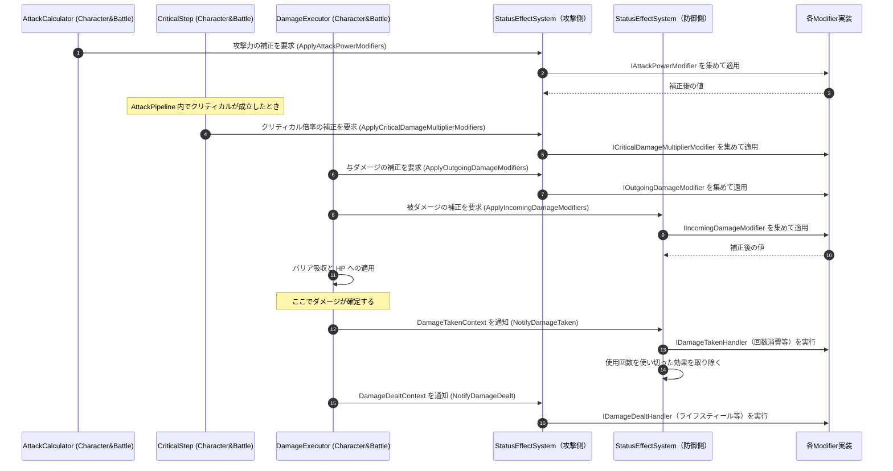

# ① ダメージ計算への補正フロー

- page_id: 3bf7c2c6-cc02-81c7-a04c-c30f7ac31798
- Notion パス: Symphony Kill Chord / システム概要 / 状態効果（バフ・デバフ） / ① ダメージ計算への補正フロー
- スナップショットの最終更新: 2026-08-17T17:54:02.647Z
- 書き込み許可: 可
- 処置: 本文置き換え

## 判定

- 信頼性: 一部古い — 補正と通知の種類は正しいが、呼び出し元が `AttackPipeline` の 1 か所になっている。実装では、攻撃力の補正は `AttackCalculator`（パイプラインの前）、クリティカル倍率の補正は `CriticalStep`（パイプライン内）、与ダメージ・被ダメージの補正と通知は `DamageExecutor`（パイプラインの後）が呼ぶ（`Runtime/2.Application/InGame/Battle/AttackCalculator.cs:36-40`、`CriticalStep.cs:40`、`DamageExecutor.cs:80-127`）。`ICriticalDamageMultiplierModifier` の段が無い。攻撃力と与ダメージの補正は別の段であり、1 回の要求ではない。「ここでダメージが確定する」の位置は、バリア吸収と HP への適用の後である
- 整合性: `キャラ&バトル / ③ 状態効果の適用フロー（攻撃前後）`（3bf7c2c6-cc02-8193-8e0c-e0604f828db6）の原稿と同じ段階・順序にそろえた
- 変更点:
  - シーケンス図: 参加者を `AttackCalculator` / `CriticalStep` / `DamageExecutor` に分け、クリティカル倍率補正の段、バリア吸収と HP 適用、被弾通知の後に使い切った効果を取り除く処理を追加
- 織り込んだ反映項目: なし（実装との整合修正）
- 出典: 実装 `AttackCalculator.cs`、`CriticalStep.cs:35-45`、`DamageExecutor.cs:57-127`、`StatusEffectSystem.cs`（`NotifyDamageTaken` の後の `RemoveConsumedEffects`）
- 要確認: なし

## 適用する本文

攻撃側と防御側それぞれの状態効果が、ダメージ計算の前後で呼ばれる。補正は、攻撃力 → クリティカル倍率 → 与ダメージ → 被ダメージ の順に掛かる。

