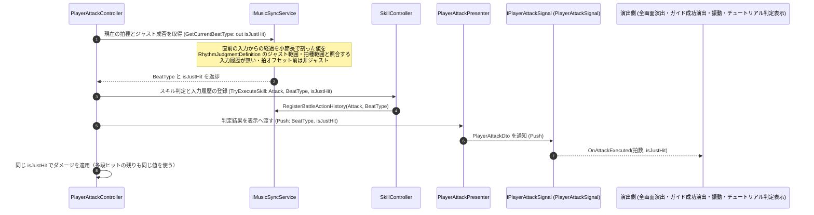

# ② プレイヤー入力に対するジャスト判定フロー

- page_id: 3bf7c2c6-cc02-81c9-8bc6-ea98fd68d791
- Notion パス: Symphony Kill Chord / システム概要 / 音楽 / ② プレイヤー入力に対するジャスト判定フロー
- スナップショットの最終更新: 2026-08-17T13:21:08.902Z
- 書き込み許可: 可
- 処置: 本文置き換え

## 判定

- 信頼性: 陳腐化 — 図の中心の `RhythmJustService`（`TriggerJustHit` / `_isJustHit` / `IsJustHit()` の読み取りでリセット）は PR #1513（2026-09-12、コミット 2b0028c0f）で削除された。現行は `IMusicSyncService.GetCurrentBeatType(out bool isJustHit)` が拍種とジャスト成否を副作用なしで返し（`Runtime/2.Application/InGame/Music/MusicSyncService.cs:113-133`）、`PlayerAttackController` が入力履歴を更新する前に 1 回だけ呼ぶ（`Runtime/3.Adaptor/InGame/Battle/PlayerAttackController.cs:107-111`）。呼び出し元が `MusicSyncState` の `BeatLength` を参照して自分で許容範囲を比べる処理も無い
- 整合性: 親ページ `音楽` と `リズムガイド全画面演出`（3bf7c2c6-cc02-81c7-9528-ca85aee87fa3）の原稿と同じ経路（`PlayerAttackPresenter` → `IPlayerAttackSignal`）にそろえた
- 変更点:
  - 冒頭の説明文: 判定結果を攻撃・スキル・演出が共有する旨を追記
  - シーケンス図: 旧: Player Action → `MusicSyncState` 参照 → `RhythmJustService.TriggerJustHit` → 次フレームでリセット → 新: `PlayerAttackController` → `GetCurrentBeatType(out isJustHit)` → `SkillController.TryExecuteSkill`（履歴登録）→ ダメージ適用 → `PlayerAttackPresenter.Push` → `IPlayerAttackSignal.OnAttackExecuted` → 各演出
- 織り込んだ反映項目: BT-09
- 出典: 実装 `MusicSyncService.cs:113-133,184-217`、`PlayerAttackController.cs:96-179`、`Runtime/3.Adaptor/InGame/Skill/SkillController.cs:70`、`PlayerAttackPresenter.cs`、`Runtime/4.View/InGame/Battle/PlayerAttackSignal.cs`、購読側 `RhythmGuidePostEffectPresenter.cs:19`・`RhythmGuideTargetFeedbackPresenter.cs:18`・`GamepadHapticsPresenter.cs:18`・`TutorialAttackFeedbackPresenter.cs:21`。問題記録 `spec/plan/problem_logs/2026-09-09-just-judgement.md`
- 要確認: なし

## 適用する本文

プレイヤーが攻撃入力を行った際に、現在のビートタイミングと照合して拍種とジャストかどうかを判定するフローである。判定は入力1回につき1回だけ行い、その結果を攻撃・スキル・多段ヒット・画面演出が共有する。判定の読み取りは状態を変えない。

