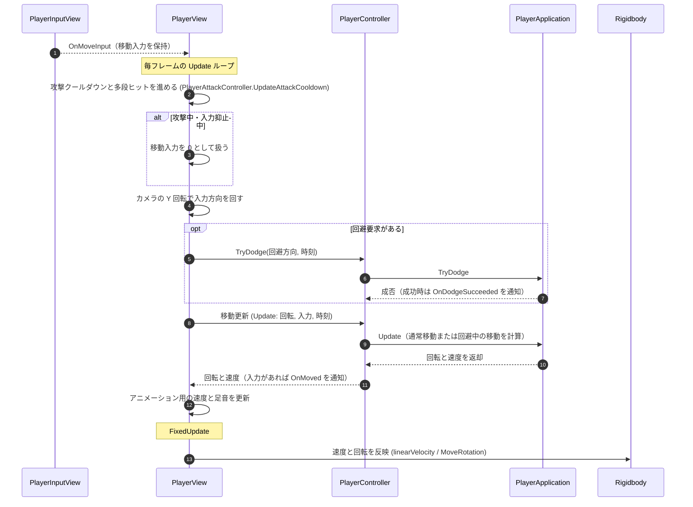

# ① 通常移動フロー（毎フレーム）

- page_id: 3bf7c2c6-cc02-81d8-a0ce-d293848ec481
- Notion パス: Symphony Kill Chord / システム概要 / プレイヤー / ① 通常移動フロー（毎フレーム）
- スナップショットの最終更新: 2026-08-17T13:20:40.969Z
- 書き込み許可: 可
- 処置: 本文置き換え

## 判定

- 信頼性: 陳腐化 — 図の「`PlayerInputView` → `PlayerController`: 入力バッファから移動操作を取得」「`PlayerController` → `ICameraTransform`: カメラ正面方向を取得」は実装と違う。実装では `PlayerView` が `PlayerInputView.OnMoveInput` で移動入力を保持し、`Update` でカメラの Y 回転を使って入力を回し、`PlayerController.Update(ref rotation, 入力, 時刻, out velocity)` を呼ぶ。Rigidbody への反映は `FixedUpdate` で行う（`Runtime/4.View/InGame/Player/PlayerView.cs:160-176,526-530,596-664`）。攻撃中・入力抑止中は移動入力を 0 にする、回避の要求を同じ更新で処理する、という分岐も無い
- 整合性: 親ページ `プレイヤー` の原稿（`PlayerController` の役割、入力履歴は未使用）と一致させた
- 変更点:
  - 冒頭の説明文: 旧: 入力バッファから取り出した移動操作を → 新: `PlayerView` が保持している移動入力を
  - シーケンス図: 参加者を `PlayerInputView` / `PlayerView` / `PlayerController` / `PlayerApplication` / `Rigidbody` に変更。カメラ方向の補正を `PlayerView` 側へ移し、攻撃中・入力抑止中の分岐、回避要求の処理、アニメーション速度の更新、`FixedUpdate` での反映を追加
- 織り込んだ反映項目: BT-22（入力バッファ経由という誤記の修正）
- 出典: 実装 `PlayerView.cs:160-176,526-545,596-700`、`Runtime/3.Adaptor/InGame/Player/PlayerController.cs`、`Runtime/2.Application/InGame/Player/PlayerApplication.cs:21-39`
- 要確認: なし

## 適用する本文

`PlayerView`が保持している移動入力を、カメラ正面方向を基準に補正して反映する。移動入力は`PlayerInputView.OnMoveInput`を受けるたびに`PlayerView`が保持する。

