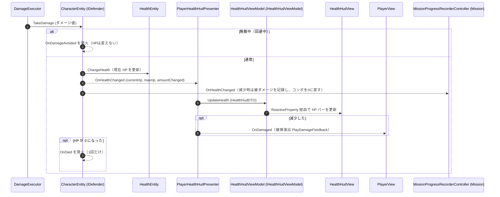

# ② HP 変化とHUDへの反映フロー（ダメージ被弾時）

- page_id: 3bf7c2c6-cc02-81de-8e4b-d03a21ab3c44
- Notion パス: Symphony Kill Chord / システム概要 / キャラ&バトル / ② HP 変化とHUDへの反映フロー（ダメージ被弾時）
- スナップショットの最終更新: 2026-08-17T17:23:35.155Z
- 書き込み許可: 可
- 処置: 本文置き換え

## 判定

- 信頼性: 一部古い — 大筋は正しいが、`OnHealthChanged` を発火するのは `HealthEntity` ではなく `CharacterEntity` である（`HealthEntity` はイベントを持たない。`Runtime/1.Domain/InGame/Character/CharacterEntity.cs:47,99-129`、`HealthEntity.cs`）。無敵中（回避中）はHPを変えず `OnDamageAvoided` を出す分岐、HP 0 での `OnDied`、HUD以外の購読側（被弾演出・ミッション記録）、`ConsumeHealth`（スキルによるHP消費）でも同じイベントが出る点が無い
- 整合性:
  - 親ページ `キャラ&バトル` の原稿で、HUD Presenter の配置の注記を実装に合わせた（`PlayerHealthHudPresenter` は `Adaptor.InGame.Player`）
  - `コンボ表示 / ① コンボ表示の更新フロー`（3bf7c2c6-cc02-81f8-897e-feb08a04a660）の原稿と、HP 減少でコンボが 0 に戻る点をそろえた
  - 被弾時の画面演出（`PlayerView` の `_Pixel`、HD-23）は反映先が別ページ（新規の被弾フィードバック節）のため、ここでは `PlayDamageFeedback` の呼び出しまでにとどめた
- 変更点:
  - 冒頭の説明文: 被弾・回復・HP消費のいずれでも同じ通知が出る旨を追記
  - シーケンス図: 旧: `HEntity -->> Defender: OnHealthChanged イベントを発火` → 新: `CharacterEntity` が `HealthEntity.ChangeHealth` のあとに `OnHealthChanged` を発火。無敵中の分岐、`OnDied`、被弾演出（`OnDamaged` → `PlayerView.PlayDamageFeedback`）、`MissionProgressRecorderController` の購読、`HealthHudViewModel`/`HealthHudView` の実名を追加
- 織り込んだ反映項目: なし（HD-23・HD-24 は反映先が別ページのため見送り。被弾演出の呼び出し点だけ図に入れた）
- 出典: 実装 `CharacterEntity.cs:47-53,99-142`、`Runtime/3.Adaptor/InGame/Player/PlayerHealthHudPresenter.cs`、`Runtime/4.View/InGame/UI/HealthHudViewModel.cs:14-29`、`HealthHudView.cs:27`、`PlayerView.cs:229`、`MissionProgressRecorderController.cs:186-198`、`PlayerInitializer.cs`（`HandlePlayerHealthChanged` が `EOnPlayerTakeDamage` を通知）
- 要確認: なし

## 適用する本文

ダメージを受けた際に Entity の HP が変化し、HUD（HPバー）へ即時反映される処理フローである。`OnHealthChanged`は被弾だけでなく、回復とスキルによるHP消費（`ConsumeHealth`）でも発火する。変化量はダメージが負、回復が正である。

敵の HP は`EnemyHealthHudPresenter`（Enemyモジュール）が同じ経路で頭上のHPバーへ反映する。
