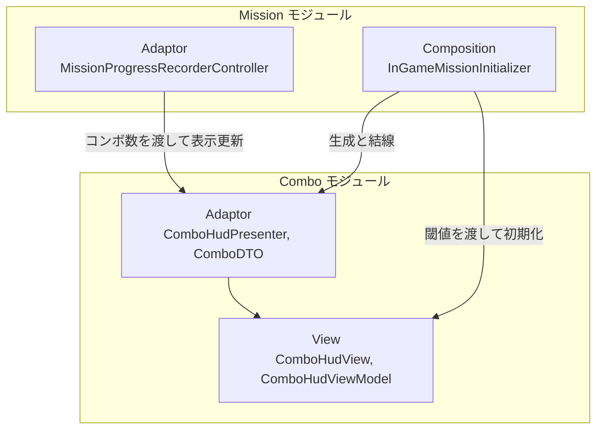

# コンボ表示

- page_id: 3bf7c2c6-cc02-81f7-aebb-c3c2d7d22f10
- Notion パス: Symphony Kill Chord / システム概要 / コンボ表示
- スナップショットの最終更新: 2026-08-17T18:14:48.095Z
- 書き込み許可: 可
- 処置: 本文置き換え

## 判定

- 信頼性: 一部古い — クラス表の 5 型はすべて実在する（`Runtime/3.Adaptor/InGame/Combo/`・`Runtime/4.View/InGame/Combo/`）。ただし依存の向きと、表示閾値（4 コンボ未満は非表示。PR #1893）が書かれていない。repo の `NotionModuleDocs/Combo.md` と Notion は同一（01 棚卸し B 表）
- 整合性:
  - 実装との矛盾: 結合図と「📥 依存しているもの」は「Combo が Mission の `MissionProgress`/`ComboCount` に依存する」と書くが、実装は逆向きである。`ComboHudPresenter.Present(int)` は int を受け取るだけで Mission の型を参照しない。Mission 側の `MissionProgressRecorderController` が `ComboHudPresenter` をコンストラクタで受け取り `Present` を呼ぶ（`MissionProgressRecorderController.cs:25-35,165,197,232-238`）。`InGameMissionInitializer` が `ComboHudViewModel`/`ComboHudPresenter` を生成し `ComboHudView.Initialize(viewModel, _comboVisibleCount)` を呼ぶ（`InGameMissionInitializer.cs:282-287`）
  - 他ページとの関係: 加算・リセットの規則はゲーム側 `仕様概要 / コンボについて`（3257c2c6-cc02-80e1-83de-f95681edd07d）に「敵に攻撃を与える＝1コンボ」「被ダメージで0」とだけあり、空振り・タイムアウトの規則が無い（BT-29。反映は仕様側の担当領域）
- 変更点:
  - 「概要」表: 旧: 最終更新日 2026-08-17 → 新: 2026-09-22
  - 「🏗️ クラス」: `ComboHudView` の役割に「表示閾値未満では非表示」「更新時の揺れ演出」を追記
  - 「🧩 Composition初期化情報」: 表示閾値 `_comboVisibleCount`（`InGameMissionInitializer` の SerializeField、`InGame.unity` の値 4）の行を追加
  - 「🔗 モジュール結合」: 旧: `M_Domain -->|コンボ数の提供| CB_Adaptor` → 新: Mission の Adaptor `MissionProgressRecorderController` が `ComboHudPresenter` を呼ぶ向きに修正
  - 「📥 依存しているもの」: 旧: Mission（`MissionProgress`, `ComboCount`） → 新: なし
  - 「📤 依存されているもの」: 旧: なし → 新: Mission（`InGameMissionInitializer`・`MissionProgressRecorderController`）
  - 「④ View」: 閾値と揺れ演出を追記
- 織り込んだ反映項目: BT-29（システムページ側の部分: 表示閾値と、コンボ数を更新する契機。加算・リセットの規則そのものは子ページ ① に記載）
- 出典: 実装 `Runtime/4.View/InGame/Combo/ComboHudView.cs:21-60`、`Runtime/6.Composition/InGame/Mission/InGameMissionInitializer.cs:47,282-287,448-449`、`Assets/Level/Scenes/Master/InGame.unity:57729`、PR #1893（rhythm timeout と Combo HUD の表示を復旧）、PR #1811（表示位置を右端から内側へ）
- 決定（2026-09-22 八幡）: No.20 コンボは 3 以上で表示する。「🧩 Composition初期化情報」の表示閾値の行と「④ View」の閾値を「仕様は 3。現状の値は 4」に直した
- 実装の修正が必要: コンボの表示閾値を 4 から 3 にする（No.20。`Assets/Scripts/Runtime/6.Composition/InGame/Mission/InGameMissionInitializer.cs:449` `_comboVisibleCount = 4`、`Assets/Level/Scenes/Master/InGame.unity:57729`、判定箇所 `Assets/Scripts/Runtime/4.View/InGame/Combo/ComboHudView.cs:45`）
- 要確認: なし（コンボ規則の意図確認は子ページ ① の判定に記載）

## 適用する本文

# 概要 {color="gray_bg"}

> 💡 **モジュール概要**
> コンボ数のHUD表示を司るモジュールである。表示のみを担当し、コンボの計測と保持はMissionモジュールの`MissionProgress`が行う。

| 項目 | 内容 |
| --- | --- |
| **モジュール名** | Combo |
| **カテゴリ** | インゲーム |
| **ステータス** | 実装済み |
| **最終更新日** | 2026-09-22 |

---

## 🏗️ クラス {toggle="true"}

	| クラス名 | レイヤー | 役割・機能 |
	| --- | --- | --- |
	| **`ComboDTO`** | Adaptor | コンボ表示用のデータ |
	| **`ComboHudPresenter`** | Adaptor | コンボHUDの表示内容を更新する |
	| **`IComboHudViewModel`** | Adaptor | ViewModelの契約 |
	| **`ComboHudViewModel`** | View | 表示内容を保持する |
	| **`ComboHudView`** | View | コンボ数を画面へ表示する。表示閾値未満では表示ルートごと隠し、更新のたびに数字を揺らす |

### 🧩 Composition初期化情報

| 項目 | 内容 |
| --- | --- |
| **Initializerクラス** | なし（Missionモジュールの`InGameMissionInitializer`が構築する） |
| **公開する ModuleContainer / ServiceLocator登録型** | なし |
| **表示閾値** | `InGameMissionInitializer`の`_comboVisibleCount`。仕様は 3（3コンボ以上で表示）。現状の値は 4（`InGame.unity`で設定）で、仕様と食い違っている |

コンボ数はミッションの評価条件にも使われるため、計測はMissionモジュールが持ち、当モジュールはその表示だけを引き受ける。

---

## 🔗 モジュール結合

### 📥 依存しているもの

- なし
	- *詳細*: `ComboHudPresenter`はコンボ数を int で受け取るだけで、他モジュールの型を参照しない

### 📤 依存されているもの

- **`Mission`**
	- *参照箇所*: `InGameMissionInitializer`, `MissionProgressRecorderController`
	- *詳細*: `InGameMissionInitializer`が`ComboHudViewModel`と`ComboHudPresenter`を生成し、`ComboHudView`を初期化する。`MissionProgressRecorderController`はコンボ数を更新するたびに`ComboHudPresenter.Present`を呼ぶ

---

# 詳細 {color="gray_bg"}

## 🧅レイヤー情報

### ① Domain

当モジュールでは使用していない。コンボの値はMissionモジュールのDomainが持つ。

### ② Application

当モジュールでは使用していない。

### ③ Adaptor

`ComboHudPresenter`がコンボ数を`ComboDTO`へ詰めてViewModelへ渡す。

### ④ View

`ComboHudViewModel`が表示内容を保持し、`ComboHudView`が画面へ表示する。 `ComboHudView`は、コンボ数が表示閾値（仕様は 3。現状の値は 4）未満のとき表示ルートを非表示にしてテキストを空にする。閾値以上のときは数字を更新し、0.1 秒の揺れ演出（LitMotion の Punch）を再生する。

### ⑤ Infrastructure

当モジュールでは使用していない。

### ⑥ Composition

専用のInitializerは持たない。`InGameMissionInitializer`（Order 600）が生成と結線を行う。

## 🔌 拡張ポイント

| 拡張したいこと | 実装する場所 | 追加登録の要否 |
| --- | --- | --- |
| 表示項目を増やしたい | `ComboDTO`へフィールドを追加し、`ComboHudPresenter`で値を設定して`ComboHudView`へ反映先を足す | 不要 |

## 🔄処理フロー

主要な処理フローは、それぞれ子ページに分けている。

<page url="https://www.notion.so/3bf7c2c6cc0281f8897efeb08a04a660">① コンボ表示の更新フロー</page>
