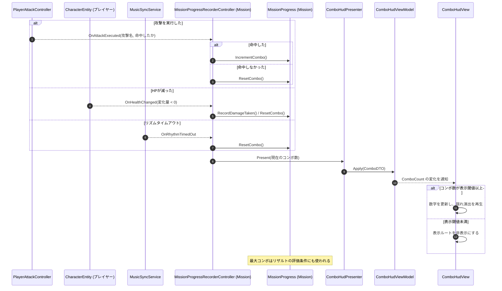

# ① コンボ表示の更新フロー

- page_id: 3bf7c2c6-cc02-81f8-897e-feb08a04a660
- Notion パス: Symphony Kill Chord / システム概要 / コンボ表示 / ① コンボ表示の更新フロー
- スナップショットの最終更新: 2026-08-17T18:14:48.094Z
- 書き込み許可: 可
- 処置: 本文置き換え

## 判定

- 信頼性: 一部古い — 図の「`MissionProgress` → `ComboHudPresenter` へコンボ数を渡す」は実装と違う。実装では `MissionProgressRecorderController` が `MissionProgress` を更新したあと、自分で `ComboHudPresenter.Present` を呼ぶ（`Runtime/3.Adaptor/InGame/Mission/MissionProgressRecorderController.cs:161-165,186-198,227-239`）。また攻撃以外の更新契機（被ダメージ・リズムタイムアウト）と、表示閾値が書かれていない
- 整合性:
  - 実装との矛盾: 上記の呼び出し元の違い
  - 他ページとの矛盾: `仕様概要 / コンボについて`（3257c2c6-cc02-80e1-83de-f95681edd07d）は「敵に攻撃を与える＝１コンボ」「敵からのダメージを受けるとコンボが途切れて０」だけで、空振り・タイムアウトでのリセットが無い（BT-29。仕様側の更新は担当外）
- 変更点:
  - シーケンス図: 旧: `Progress -->> Presenter: 現在のコンボ数` → 新: `Recorder ->> Presenter: Present(コンボ数)`。被ダメージ（`OnHealthChanged`）とリズムタイムアウト（`OnRhythmTimedOut`）の経路、閾値による表示・非表示を追加
  - 本文末尾に「コンボ数が変わる契機」の表を追加（既存に当てはまる節が無いため新設）
- 織り込んだ反映項目: BT-29
- 出典: 実装 `MissionProgressRecorderController.cs:47-77,158-240`、`PlayerAttackController.cs:127-158`（空振り・スキップ時は `OnAttackExecuted(name, false)`）、`CharacterEntity.cs:173-178`（`ConsumeHealth` も `OnHealthChanged` を出す）、`ComboHudView.cs:40-60`、PR #1893（2 小節のリズムタイムアウトでコンボを破棄、HUD の閾値表示を復旧）
- 決定（2026-09-22 八幡）: No.20 コンボは 3 以上で表示する。本文末尾の閾値の文を「3 以上で表示。現状は 4（不具合）」に直した
- 決定（2026-09-22 八幡）: No.21 被ダメージでリセットし、キルコード発動ではリセットしない。「コンボ数が変わる契機」の表で、キルコード発動の行を「0に戻す（現状）」と本来の仕様の併記に直し、【要確認】を外した
- 実装の修正が必要: コンボの表示閾値を 4 から 3 にする（No.20。`Assets/Scripts/Runtime/6.Composition/InGame/Mission/InGameMissionInitializer.cs:449` `_comboVisibleCount = 4`、シーンの上書き値 `Assets/Level/Scenes/Master/InGame.unity:57729`、判定箇所 `Assets/Scripts/Runtime/4.View/InGame/Combo/ComboHudView.cs:45`）
- 実装の修正が必要: 通常攻撃のダメージをスキップするキルコードの発動時に、攻撃を「命中しなかった」として通知してコンボを 0 に戻している（No.21。`Assets/Scripts/Runtime/3.Adaptor/InGame/Battle/PlayerAttackController.cs:147-153` → `Assets/Scripts/Runtime/3.Adaptor/InGame/Mission/MissionProgressRecorderController.cs:232-236`）
- 要確認:
  - 【要確認: 企画】スキル 5 の HP 消費は被ダメージ扱いでコンボが 0 に戻る（`MissionProgressRecorderController.cs:207-219`）。被ダメージ（リセットする）とキルコード発動（リセットしない）のどちらに当たるか（No.21）

## 適用する本文

計測はMission側で行われ、当モジュールはその結果を受けて表示する。コンボ数を変えたのと同じ処理の中で、`MissionProgressRecorderController`が`ComboHudPresenter`を呼ぶ。

### コンボ数が変わる契機

| 契機 | コンボ数 | 補足 |
| --- | --- | --- |
| 攻撃が命中した | +1 | 多段攻撃（8拍の3ヒットなど）も攻撃1回につき+1 |
| 攻撃が命中しなかった | 0に戻す | ロックオン対象なし、範囲内に敵がいない場合 |
| 通常攻撃のダメージをスキップするキルコードが発動した | 0に戻す（現状） | 本来の仕様では、キルコード発動ではコンボをリセットしない。現状は攻撃が「命中しなかった」として通知されるため0に戻る（不具合） |
| プレイヤーのHPが減った | 0に戻す | 被ダメージとして記録する。現状はキルコードによるHP消費も含む。【要確認: キルコード（スキル 5）のHP消費を被ダメージとしてリセットするか、キルコード発動としてリセットしないかを企画に確認】 |
| リズムタイムアウト | 0に戻す | 最後の入力から一定小節（`TimeoutBarCount`）入力が無いとき |

コンボ数が3以上のときに画面へ表示する。現状は表示閾値が4で、4未満のコンボ数は画面に出さない（不具合）。
