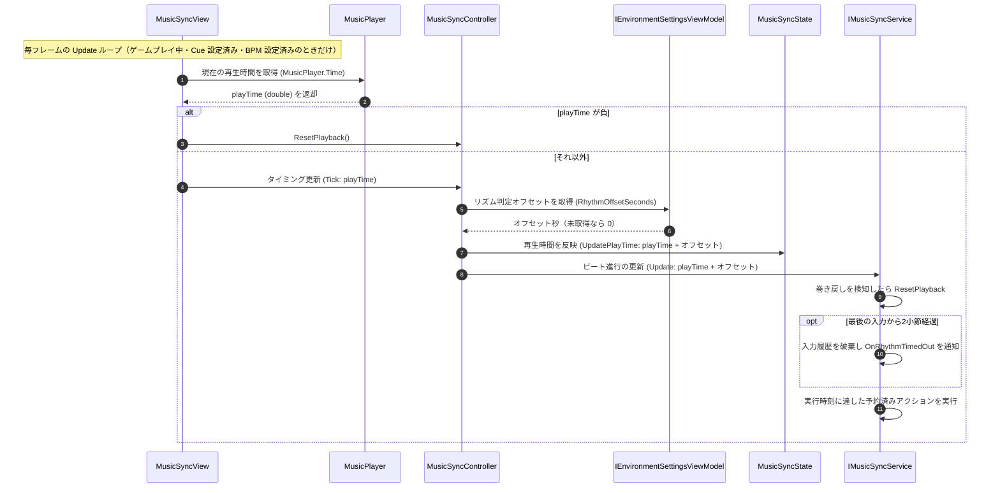

# ① BGM 再生とリズム同期の更新フロー（毎フレーム）

- page_id: 3bf7c2c6-cc02-81fa-a314-c728299d6ede
- Notion パス: Symphony Kill Chord / システム概要 / 音楽 / ① BGM 再生とリズム同期の更新フロー（毎フレーム）
- スナップショットの最終更新: 2026-08-17T13:21:06.466Z
- 書き込み許可: 可
- 処置: 本文置き換え

## 判定

- 信頼性: 一部古い — 大筋（`MusicSyncView` → `MusicPlayer.Time` → `MusicSyncController.Tick` → `MusicSyncState.UpdatePlayTime` / `IMusicSyncService.Update`）は実装どおり。ただし、判定オフセットの加算（PR #1675）、ゲームプレイ中だけ回す制御（`SetGameplayActive`）、巻き戻し検知とリズムタイムアウト（PR #1893・#1896）が無い。本文の「AudioSource の再生タイム」は誤りで、`MusicPlayer` は CRI の `CriAtomSource` を使う（`Runtime/4.View/Persistent/Music/MusicPlayer.cs:1,12,19`）
- 整合性: 親ページ `音楽`（3957c2c6-cc02-806b-9cc8-fbe9c9e8bf63）の原稿と一致させた
- 変更点:
  - 冒頭の説明文: 旧: AudioSource の再生タイムを元に → 新: `MusicPlayer`（CRI）の再生時間を元に、ゲームプレイ中だけ
  - シーケンス図: 実行条件、再生時間が負のときの `ResetPlayback`、判定オフセットの加算、`Update` 内の巻き戻し検知・リズムタイムアウト・予約実行の順を追加
- 織り込んだ反映項目: BT-09（`OnRhythmTimedOut`・`ResetPlayback`・判定オフセットの注入）
- 出典: 実装 `Runtime/4.View/InGame/Music/MusicSyncView.cs`（`Update`、`SetGameplayActive`）、`Runtime/3.Adaptor/InGame/Music/MusicSyncController.cs`（`Tick`）、`Runtime/2.Application/InGame/Music/MusicSyncService.cs:36-93`、`Runtime/1.Domain/InGame/Music/RhythmJudgmentDefinition.cs:29-32`
- 要確認: なし

## 適用する本文

`MusicPlayer`（CRI）の再生時間を元に、ゲームプレイ中だけ毎フレーム BPM・拍情報が更新される処理フローである。ゲームプレイの開始・終了は`MusicSyncInitializer`の`StartGameplay`/`StopGameplay`が`MusicSyncView.SetGameplayActive`で切り替え、終了時とBGMのCue変更時には同期状態（入力履歴・予約・ゲージ基準）を破棄する。

