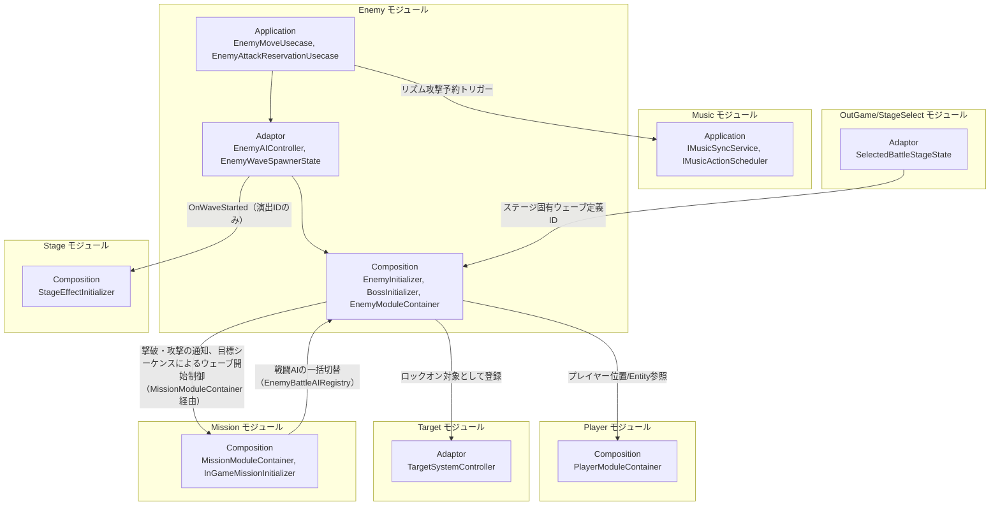
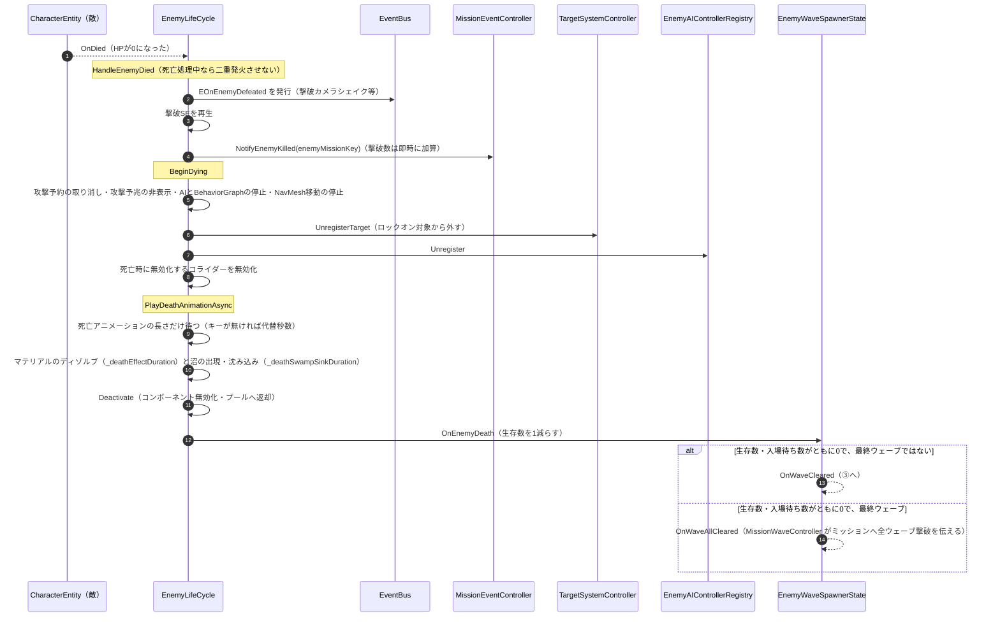

# 敵

- page_id: 3957c2c6-cc02-80cd-94c0-f412b11ffcf7
- Notion パス: Symphony Kill Chord / システム概要 / 敵
- スナップショットの最終更新: 2026-09-09T03:33:12.894Z
- 書き込み許可: 可（システム概要 配下）
- 処置: 本文置き換え（子ページ ⑤ を 1 件新設。本文は末尾の「新規子ページの本文」）
- 確認日 / コミット: 2026-09-22 / origin/develop 73fefeb45

## 判定

- 信頼性: 一部古い — 2026-09-09 に更新されているが、TGS 期の追加実装（PR #1393 / #1484 / #1592 / #1671 / #1702 / #1721 / #1740 / #1776 / #1802）が入っていない。クラス表のクラスはすべて実在する（Grep 確認）。`EnemyInitializer` の Order 700 は正しい（`Assets/Scripts/Runtime/6.Composition/InGame/Enemy/EnemyInitializer.cs:42`）。リポジトリ側 `Assets/Docs/ScriptsDocs/Modules/NotionModuleDocs/Enemy.md`（2026-09-09、5c2e73b59）はこのページと同内容で、リポジトリにだけある記述は無い
- 整合性:
  - システム概要 / ミッション 39e7c2c6-cc02-80d5-ac4e-cd46b87fd375 は「敵側は `ServiceLocator.GetInstance<MissionEventController>()` で直接取得」と書き、このページは「Container 経由に統一」と書いていて矛盾する。実装は Container 経由（`EnemyLifeCycle.cs:117`、`Boss/BossLifeCycle.cs:127`）。このページが正しい（ミッション側の原稿で修正）
  - 実装との矛盾: 依存の向きが Enemy→Mission の一方向として書かれているが、Mission→Enemy もある（`InGameMissionInitializer.cs:212` が `EnemyModuleContainer.EnemyBattleAIRegistry` を取得）。Enemy は Mission の目標シーケンスも読む（`EnemyInitializer.cs:197-203,384-398`）
  - 実装との矛盾: Music の `IMusicSyncService` / `IMusicActionScheduler` は Application 層（`2.Application/InGame/Music/`）。ページは Adaptor と書いている
  - 実装との矛盾: Target への登録は `ITargetable` を直接渡すのではなく `TargetSystemController.RegisterTarget`（`TargetSystemModuleContainer` 経由、`EnemyLifeCycle.cs:234`）
  - 仕様概要 / 敵 3117c2c6-cc02-8057-904b-e438e45510db との相互リンクが無い（EN-35。A1 の原稿で仕様側からのリンクは追加済み）
  - `StageEffectInitializer._stageEffectCatalogAssets` は `InGame.unity:141522` で空のままで、互換フォールバックが全シーンで使われている。ページの記述どおり
- 変更点:
  - 概要の表: 「最終更新日」を 2026-09-22 に更新した。「関連する仕様ページ」の行を追加した（EN-35）
  - 🏗️ クラス: `EnemyAIControllerRegistry`、`IsBattleAiActivatedCondition`、`EnemyMoveInstruction`、`IEnemyWaveTimerView`、`IEnemyRaycastDetectViewModel`、`INearestAttackPositionSearchViewModel`、`IRaycastDetectView`、`ShellMusicConstants`、`DamageNumberPoolView` を追加した。`EnemyWaveSpawnerState` の説明に入場待ち数の予約・`OnWaveAllCleared` を、`EnemyLifeCycle` の説明に入場・死亡処理を、`EnemyPools` に事前生成とシェーダーウォームアップを、`EnemyMovementAIFacade` に横歩きを、`EnemyStateFacade` に硬直の回復を足した（EN-25）
  - 🧩 Composition初期化情報: 公開型に `EnemyWaveSpawnerController`・`EnemyAIControllerRegistry`・`BossInitializer` を追加した。旧: 「`EnemyWaveSpawnerState`・`StageEffectCatalog`等を保持」 → 新: 保持する 5 つを列挙
  - 🔗 モジュール結合（図）: Target のノードを旧: 「View ITargetable」 → 新: 「Adaptor TargetSystemController」。Mission との双方向の矢印（戦闘 AI の一括切替、目標シーケンスによる Wave 開始制御）を追加した
  - 📥 依存しているもの: Music の層を旧: 「(Adaptor)」 → 新: 「(Application)」。Player に `DamageEffectView` を、Target を `TargetSystemController` に直した。「Mission」を新設（撃破・攻撃の通知、Wave 開始制御）。「EventBus」を新設（`EOnTakeDamage` の購読と `EOnEnemyDefeated` の発行）
  - 📤 依存されているもの: 「Mission」に戦闘 AI の一括切替を追加した。「Stage」の段落からリポジトリ文書のパス参照（`Assets/Docs/Enemy-Stageモジュール結合改善計画書.md`）を削除し、内容をページ末尾の新しい節へ移した（EN-30）。「OutGame/StageSelect」を新設（バトルシーン名の解決）
  - 🧅レイヤー情報: ③ Adaptor に登録簿と入場待ち数を、④ View に横歩きと硬直の回復を、⑥ Composition に入場・死亡・事前生成・Mission の Wave 制御を追記した
  - 🔄処理フロー: ⑤ 死亡処理フローを新しい子ページとして追加した（EN-25）
  - 🗺️ ステージ概念の所在（新しい節、末尾）: リポジトリ文書にだけあった「ステージ」概念の分散表と設計方針を移植した。StageSelect の行は旧文書の `StageDefinition.EnemyWaveDefinitionAssetKey` → 新: `BattleStageDefinition.EnemyWaveDefinitionId`（`BattleStageAsset` + `StageBindAsset` の構成）に直した（EN-30）
- 決定（2026-09-22 八幡）: No.13 クリティカル時の敵の硬直は仕様に無い（硬直なしが正）。🏗️ クラスの `EnemyAIController`・ファサード・Action ノードの行、📥 依存しているもの の EventBus、🧅レイヤー情報 の ④ View に、硬直が実装の不具合であることを書いた
- 決定（2026-09-22 八幡）: No.16 攻撃の予兆表示が出た後は、プレイヤーが射程外に出ても攻撃を実行する。予兆の前に射程外になった場合は攻撃しない。🏗️ クラスの `EnemyAIController` の行に、現状（射程外で取り消す）と本来の仕様を併記した
- 決定（2026-09-22 八幡）: No.2 敵の出現単位の説明語「Wave」「フェーズ」を「ウェーブ」に直した（概要・🏗️ クラス・🧩 Composition初期化情報・🔗 モジュール結合の図のラベル・📥 依存しているもの・📤 依存されているもの・🧅レイヤー情報・🔌 拡張ポイント・🗺️ ステージ概念の所在・新規子ページの本文）。クラス名・メンバー名・ページ名（仕様概要の「フェーズについて」、子ページ ③ の題名）は変えていない
- 実装の修正が必要: No.13 クリティカル被弾時の硬直を削除する（根拠 `Assets/Scripts/Runtime/3.Adaptor/InGame/Enemy/EnemyAIController.cs:244-252`、`Assets/Scripts/Runtime/3.Adaptor/InGame/Enemy/Boss/BossAIController.cs:200-208`、PR #1671）
- 実装の修正が必要: No.16 予兆表示（2 拍前の `On2BeatBefore`）の後は射程外に出ても予約を取り消さない（根拠 `Assets/Scripts/Runtime/3.Adaptor/InGame/Enemy/EnemyAIController.cs:132-140` で射程外に出ると `CancelAttack` する、PR #1592）
- 織り込んだ反映項目: EN-25, EN-30, EN-24（依存の向きの矛盾の解消部分）, EN-35（相互リンク部分）
- 出典: 実装（`6.Composition/InGame/Enemy/EnemyInitializer.cs:134-237,384-462`、`EnemyModuleContainer.cs`、`EnemyLifeCycle.cs:117,167,198-203,223-340,562-620,773-800`、`3.Adaptor/InGame/Enemy/EnemyAIController.cs`、`EnemyAIControllerRegistry.cs`、`EnemyWaveSpawnerController.cs`、`EnemyWaveSpawnerState.cs`、`4.View/InGame/Enemy/EnemyWaveTimerView.cs`、`BehaviorGraphNode/Action/AttackTargetAction.cs`、`AIFacade/EnemyStateFacade.cs:68`、`BehaviorGraphNode/Action/GetStunnedAction.cs:17`、`6.Composition/InGame/Stage/StageEffectInitializer.cs:57,114,157-160`、`5.InfraStructure/OutGame/StageSelect/BattleStageAsset.cs:27,66`、`6.Composition/InGame/Mission/InGameMissionInitializer.cs:212`）、PR #1393 / #1484 / #1592 / #1671 / #1702 / #1721 / #1740 / #1776 / #1802、リポジトリ文書 `Assets/Docs/Enemy-Stageモジュール結合改善計画書.md` §2.1・§2.3
- 要確認:
  - `BossInitializer` は `EnemyInitializer` がシーンから探して初期化する（`EnemyInitializer.cs:452-462`）。クラスの説明は「テスト専用」のまま。本実装へ統合する予定があるか（プログラム担当）
  - No.16: 予兆デカールを出さない砲兵（`EnemyLifeCycle.cs:196-202` で歩兵だけに接続）で、どの時点を「予兆表示の後」とみなすか（企画）
  - `StageEffectInitializer` 側のカタログを設定して互換フォールバックを外す作業の予定（プログラム担当）
  - 見出しの階層は NotionMarkdownWriter の形式（H1 = 概要 / 詳細）で書いた。スナップショットは 1 段下がって見えるため、貼るときに既存ページの見た目と合っているか確かめる

## 適用する本文

# 概要 {color="gray_bg"}

> 💡 **モジュール概要**
> インゲーム中の敵キャラクター（雑魚敵からボスまで）のAI意思決定、移動制御、攻撃予約（リズム同期）、およびスポナー（出現制御）を司るモジュールである。Addressables経由で共通のウェーブ定義リポジトリをロードし、選択ステージのIDに対応するウェーブを生成して、ウェーブ開始をイベントで他モジュールへ通知する。

| 項目 | 内容 |
| --- | --- |
| **モジュール名** | Enemy |
| **カテゴリ** | InGame / Character |
| **ステータス** | 実装済み（`BossInitializer`はテスト専用ドライバとして残存、本実装への統合は未完了） |
| **最終更新日** | 2026-09-22 |
| **関連する仕様ページ** | 仕様概要 / 敵（3117c2c6-cc02-8057-904b-e438e45510db）、仕様概要 / ステージルール / フェーズについて（3497c2c6-cc02-802d-9439-de4cfc3001ab） |

---

## 🏗️ クラス {toggle="true"}

| クラス名 | レイヤー | 役割・機能 |
| --- | --- | --- |
| **`EnemyType`** | Domain | 敵のクラス分け（歩兵・砲兵等）。ファイル名は`EnemyTypeEnum.cs`だが型名は`EnemyType` |
| **`EnemyDefinitionId`** | Domain | 敵定義を識別するID |
| **`EnemyWaveDefinition`** / **`EnemyWaveDefinitionId`** / **`EnemyWaveDetail`** | Domain | 1ウェーブ分の構成（敵種類・数・継続時間・演出ID）とその識別子、明細 |
| **`EnemyWaves`** | Domain | `EnemyWaveDefinition[]`をラップし、ループ設定・次ウェーブ取得・最終ウェーブ判定を提供。全ウェーブに登場する敵定義IDの一覧（事前生成用）も返す |
| **`EnemyMoveSpec`** / **`EnemyMoveDecision`** | Domain | 移動パラメータと、移動AIが次フレームに取る行動 |
| **`EnemyPostAttackBehaviorKind`** / **`EnemyPostAttackBehaviorSpec`** | Domain | 攻撃後行動（再攻撃/味方合流/障害物接近）の種類と、抽選に使う重み・距離等の能力値 |
| **`EnemyAttackMusicSpec`** | Domain | 敵の攻撃に関する音楽同期のタイミング情報 |
| **`ShellEntity`** / **`ShellAttackSpec`** | Domain | 砲弾のEntityと、砲弾固有の攻撃パラメータ |
| **`ShellMusicConstants`** | Domain | 砲弾の着弾予告（爆発の2拍前・1拍前）に関する音楽同期の定数 |
| **`BossAttackKind`** | Domain | ボスの攻撃種別 |
| **`EnemyMoveUsecase`** | Application | 移動方向の算出とレイキャストによる衝突回避 |
| **`EnemyAttackUsecase`** / **`EnemyAttackReservationUsecase`** | Application | 攻撃の実行と、ビートに同期した攻撃予約 |
| **`ShellAttackUsecase`** / **`ShellReservationUsecase`** | Application | 砲弾の攻撃処理と、爆発の予約 |
| **`BossAttackReservationUsecase`** / **`EnemyTripleShotAttackUsecase`** | Application | ボス専用の攻撃予約と、3方向攻撃 |
| **`EnemyRaycastDetectService`** | Application | 索敵・壁検知のレイキャスト |
| **`NearestAttackPositionSearchService`** | Application | プレイヤーへ接近する際の最適な攻撃座標を探索 |
| **`EnemyPostAttackBehaviorUsecase`** | Application | 攻撃後の行動（再攻撃/味方合流/障害物接近）を重み抽選で決定し、合流・接近の場合は上書き移動先を算出する |
| **`ObstacleSearchService`** | Application | 最も近い障害物の位置検索を`IObstacleSearchRepository`へ委譲する |
| **`IEnemyWaveDefinitionRepository`** / **`IEnemyRaycastDetectRepository`** / **`INearestAttackPositionSearchRepository`** / **`IObstacleSearchRepository`** | Application | 各種リポジトリ境界 |
| **`EnemyAIController`** | Adaptor | AIの状態管理と、移動・攻撃予約への仲介。攻撃範囲を出たときは予約中の攻撃を取り消す（現状。本来の仕様は、攻撃の予兆表示が出た後はプレイヤーが射程外に出ても攻撃を実行し、予兆の前に射程外になった場合は攻撃しない）。クリティカル被弾（`EOnTakeDamage`）で硬直させる（実装の不具合。仕様に硬直は無く、削除が必要） |
| **`EnemyMoveInstruction`** | Adaptor | `EnemyAIController`がViewへ返す移動指示（移動するか・移動先・速度） |
| **`EnemyAIControllerRegistry`** | Adaptor | 出現中の敵の`EnemyAIController`を保持する登録簿。戦闘AIの一括有効・無効化と、攻撃後の味方合流に使う最寄りの味方の検索を行う |
| **`BossAIController`** / **`BossAttackPattern`** | Adaptor | ボスの行動制御と、攻撃パターン1種の束 |
| **`IEnemySharedFacade`** / **`IEnemyStateFacade`** / **`IEnemyMovementAIFacade`** / **`IEnemyBattleAIFacade`** | Adaptor | BehaviorGraphから敵の情報・状態・移動・戦闘へ触るためのファサード契約 |
| **`IEnemyAttackController`** | Adaptor | 敵の攻撃コントローラーの契約 |
| **`EnemyInfantryAttackController`** / **`EnemyArtilleryAttackController`** / **`EnemyTripleShotAttackController`** | Adaptor | 歩兵・砲兵・3方向攻撃それぞれの攻撃制御 |
| **`ShellController`** / **`ShellSpecPresenter`** | Adaptor | 砲弾の制御と、砲弾パラメータのView伝達 |
| **`EnemyBattleState`** | Adaptor | 敵の戦闘中の状態を保持 |
| **`EnemyWaveSpawnerState`** / **`EnemyWaveSpawnerController`** | Adaptor | 出現ウェーブの保持（`OnWaveStarted`・`OnWaveCleared`・`OnWaveAllCleared`を公開）と、次ウェーブの生成指示。生成前にウェーブの全出現予定数を「入場待ち数」として予約し、生存数と入場待ち数がともに0になるまで全滅扱いにしない |
| **`IEnemyWaveTimerView`** | Adaptor | ウェーブタイマー（`EnemyWaveTimerView`）の契約。Missionによる自動生成の抑制もここから指示する |
| **`EnemyRaycastDetectController`** / **`NearestAttackPositionSearchController`** | Adaptor | 索敵と攻撃位置探索の窓口 |
| **`IEnemyRaycastDetectViewModel`** / **`INearestAttackPositionSearchViewModel`** / **`IRaycastDetectView`** | Adaptor | 射線判定・攻撃位置探索・ボスのレイキャストのAdaptor→View境界の契約 |
| **`ObstacleSearchController`** | Adaptor | `IObstacleSearchRepository`実装。障害物検索を`IObstacleSearchViewModel`（Viewの`NearbyObstacleSearchView`）へ委譲する |
| **`IObstacleSearchViewModel`** | Adaptor | 障害物検索のAdaptor→View境界の契約 |
| **`EnemyHealthHudPresenter`** | Adaptor | 敵HPのHUD反映 |
| **`DamageNumberDTO`** / **`DamageNumberType`** / **`IDamageNumber`** | Adaptor | 被ダメージ数値表示の通知 |
| **`IEnemySpawner`** / **`IShellSpawner`** / **`IShellLifeCycle`** / **`IShellView`** | Adaptor | 生成とライフサイクルの契約 |
| **`EnemyBattleAIFacade`** / **`EnemyMovementAIFacade`** / **`EnemyStateFacade`** / **`EnemySharedFacade`** | View | 上記ファサード契約の実装。ボス用も`Boss/AIFacade/`配下に同構成で存在する。`EnemyStateFacade`は`IsDiscovered`（発見済みか）・`IsPlayerDiscoverable`（視野角・索敵距離・視線を満たし発見可能か）・`LookAround`（未発見時にその場で見回す）・`Discover`を追加公開しており、これらは`IEnemyStateFacade`インターフェースには定義されていない実装限定のメンバーである（BehaviorGraphノードは`BlackboardVariable<EnemyStateFacade>`で具象型を直接参照するため問題にならない）。`EnemyStateFacade`は硬直を`_stunDurationSeconds`（2秒）後に自動で回復させる（硬直は実装の不具合。仕様に硬直は無く、削除が必要）。`EnemyMovementAIFacade`は攻撃待機中の横歩き（`StrafeWhileWaiting` / `StopStrafing`）を公開する |
| **`AttackTargetAction`** / **`MoveToAttackAction`** / **`StopMovingAction`** / **`GetStunnedAction`** / **`WaitForDiscoveryAction`** | View | BehaviorGraphのActionノード。`WaitForDiscoveryAction`はプレイヤー発見までの待機・見回しを担う。`AttackTargetAction`は攻撃を予約し、予約中は射程内かつ射線が通る間だけ左右へ横歩きする（方向は0.6〜1.4秒ごとに抽選）。`GetStunnedAction`は硬直の回復後、`_postRecoveryDelaySeconds`（0.3秒）置いてから行動を再開する（硬直は実装の不具合。仕様に硬直は無く、削除が必要）。ボス用も`Boss/BehaviorGraphNode/`配下に存在する |
| **`IsTargetInAttackRangeCondition`** / **`IsAimSightClearCondition`** / **`IsAttackingCondition`** / **`IsStunnedCondition`** / **`IsDiscoveredCondition`** / **`IsBattleAiActivatedCondition`** | View | BehaviorGraphのConditionノード。`IsDiscoveredCondition`は発見済みかどうかを、`IsBattleAiActivatedCondition`は戦闘AIが有効かどうか（Missionの進入時アクションで切り替わる）を分岐条件として提供する |
| **`NearbyObstacleSearchView`** | View | `IObstacleSearchViewModel`実装。`Physics.OverlapSphereNonAlloc`で周囲の障害物コライダーを検索し、最も近い1点を返す |
| **`EnemyMoveView`** / **`BossMoveView`** | View | 実際のTransform移動。`EnemyMoveView`はマップ外から入場地点までの移動（NavMeshの完全経路のみ、打ち切りあり）も行う |
| **`EnemyHealthView`** / **`EnemyHealthBillboardView`** | View | 敵HPバーの表示と、常にカメラを向く制御 |
| **`DamageNumberView`** / **`DamageNumberStyle`** / **`DamageNumberExitType`** / **`DamageNumberPoolView`** | View | ダメージ数値の表示と、その見た目・消え方の設定、表示のプール |
| **`EnemyWaveTimerView`** | View | ウェーブの残り時間の計測。ゲーム開始時に最初のウェーブを生成し、`WaveDuration`が尽きると次のウェーブを生成する |
| **`EnemyRaycastDetectView`** / **`TripleShotRaycastDetectView`** / **`NearestAttackPositionSearchView`** | View | 索敵と攻撃位置探索のUnity側実装。`EnemyRaycastDetectView`は攻撃予兆のデカール（2拍前に追従表示、1拍前に方向固定）も表示する |
| **`EnemySpawnPositionSearcher`** / **`SpawnPositionPair`** | View | 敵の生成位置の探索 |
| **`ShellView`** / **`ShellSpawner`** / **`IShellPool`** / **`IShellInitializer`** | View | 砲弾の表示・生成・プール |
| **`FootstepSoundConfig`** / **`WarningDisplayState`** | View | 足音設定と、警告表示の状態 |
| **`EnemyDefinitionAsset`** / **`EnemyDefinitionRepository`** / **`EnemyFactory`** | Infrastructure | 敵定義アセットの保持・検索と、そこからのDomain生成 |
| **`EnemyWaveDefinitionAsset`** / **`EnemyWaveDefinitionRepository`** | Infrastructure | ウェーブ定義アセットとID検索。バトルで読み込むステージシーン名もウェーブ定義が持ち、`TryGetBattleSceneName`で返す |
| **`EnemyMoveSpecAsset`** / **`EnemyMusicSpecAsset`** / **`ShellAttackSpecAsset`** / **`ShellFactory`** | Infrastructure | 移動・音楽同期・砲弾パラメータのアセットと生成 |
| **`BossAttackEntryAsset`** / **`BossAttackEntryRepo`** | Infrastructure | ボスの攻撃定義アセットとその集合 |
| **`EnemyInitializer`** / **`EnemyModuleContainer`** | Composition | 敵まわりの構築とServiceLocatorへの公開（Order 700） |
| **`EnemyLifeCycle`** / **`BossLifeCycle`** / **`ShellLifeCycle`** | Composition | 敵・ボス・砲弾それぞれの依存構築とライフサイクル管理。`EnemyLifeCycle`はマップ外からの入場（`EnterFromOutsideAsync`）、HP0での撃破通知と死亡演出（⑤）も担う |
| **`EnemySpawnerRouter`** | Composition | 敵定義から処理種別を解決し、対応するスポナーへ生成を委譲する |
| **`EnemyInfantrySpawner`** / **`EnemyArtillerySpawner`** / **`EnemyPools`** | Composition | 歩兵・砲兵の生成と、プレハブのプール管理。入場に失敗したら位置を再抽選して再試行する。`EnemyPools.PrewarmEnemy`はロード中に全ウェーブの敵を事前生成し、画面外カメラで1回描画してシェーダーをウォームアップする |
| **`IEnemyAttackControllerGenerator`** / **各Generator** / **`EnemyAttackControllerContext`** | Composition | 敵種別ごとの攻撃コントローラー生成と、その生成コンテキスト |
| **`BossInitializer`** | Composition | ボス戦闘のセットアップ |

### 🧩 Composition初期化情報

| 項目 | 内容 |
| --- | --- |
| **Initializerクラス** | `EnemyInitializer` |
| **Order** | 700 |
| **公開する ModuleContainer / ServiceLocator登録型** | `EnemyModuleContainer`（`EnemyWaveSpawnerState`・`EnemyWaveSpawnerController`・`StageEffectCatalog`・`BossInitializer`・`EnemyBattleAIRegistry`（型は`EnemyAIControllerRegistry`）を保持。`StageEffectInitializer`(Order 800)と`InGameMissionInitializer`(Order 600、Readyフェーズ)が参照する） |

## 🔗 モジュール結合

### 📥 依存しているもの

- **`Player`**
  - *依存箇所*: `PlayerModuleContainer` (Composition), `PlayerEntity` (Domain)
  - *詳細*: AI移動において追従ターゲットとするためにプレイヤーの座標や`PlayerEntity`情報を参照する。被弾エフェクト用の`DamageEffectView`もここから取得する。`EnemyInitializer`・`BossInitializer`・`ShellLifeCycle`が`ServiceLocator.GetInstance<PlayerModuleContainer>()`で直接取得しており、強い結合が残っている
- **`Music`**
  - *依存箇所*: `IMusicSyncService`, `IMusicActionScheduler` (Application)。`MusicSyncModuleContainer`経由で取得する
  - *詳細*: ビート同期攻撃を予約・実行するためにMusicモジュールの非同期アクション予約システムを利用する
- **`Target`**
  - *依存箇所*: `TargetSystemController.RegisterTarget` / `UnregisterTarget`（`TargetSystemModuleContainer`経由）
  - *詳細*: 敵がプレイヤーやカメラのロックオン対象として扱われるよう、入場を終えて戦闘を始めた時点で自身をTargetモジュールへ登録し、死亡した瞬間に登録を外す。入場中はロックオンできない
- **`OutGame/StageSelect`**
  - *依存箇所*: `SelectedBattleStageState`, `BattleStageDefinition.EnemyWaveDefinitionId`
  - *詳細*: 選択中ステージに紐づくウェーブ定義IDを取得し、Addressablesロード済みの共通リポジトリからステージごとに異なる敵ウェーブ構成を生成する
- **`Mission`**
  - *依存箇所*: `MissionModuleContainer.MissionEventController`, `MissionModuleContainer.MissionRuntimeService`
  - *詳細*: 敵の撃破（`NotifyEnemyKilled`）と敵の攻撃実行（`NotifyActionPerformed(MissionActionKind.EnemyAttack)`）を通知する。また`EnemyInitializer`が目標シーケンスに`WaveStartClearCondition`を持つステップがあるかを調べ、ある場合はウェーブの自動進行を止めて、Missionの`MissionWaveController`にウェーブ開始を任せる
- **`EventBus`**
  - *依存箇所*: `EOnTakeDamage`（購読）, `EOnEnemyDefeated`（発行）
  - *詳細*: `EnemyAIController`がクリティカル被弾を受けて硬直させる（実装の不具合。仕様に硬直は無く、削除が必要）。`EnemyLifeCycle`がHP0の瞬間に撃破イベントを発行し、撃破演出のカメラシェイク（`CameraSystemView`）が受け取る

### 📤 依存されているもの

- **`Mission`**
  - *参照箇所*: `MissionModuleContainer.MissionEventController`（`EnemyLifeCycle`/`BossLifeCycle`がServiceLocatorから`MissionModuleContainer`を取得して参照）、`EnemyModuleContainer.EnemyBattleAIRegistry`（`InGameMissionInitializer`が取得）
  - *詳細*: 敵が撃破された際のイベントをミッションモジュールに通知し、ステージクリアの条件判定等に利用される。以前は`ServiceLocator.GetInstance<MissionEventController>()`による直接取得だったが、`MissionModuleContainer`経由に統一されました。Missionは目標ステップの進入時アクション（`ToggleEnemyBattleAIStepEntryAction`）で、登録簿を通じて出現中の全敵の戦闘AIを一括で有効・無効にする。最終ウェーブまで全滅したことは`EnemyWaveSpawnerState.OnWaveAllCleared`を`MissionWaveController`が購読してMissionへ伝える
- **`Stage`**
  - *参照箇所*: `EnemyWaveSpawnerState.OnWaveStarted`（`EnemyModuleContainer`経由）
  - *詳細*: `StageEffectInitializer`がウェーブ開始イベントを購読し、`EnemyWaveDefinition.StageEffectIds`（演出IDのリスト）を受け取る。以前は`IStageEffectDefinition`（Stage側のDomain型）をEnemyのDomain層が直接保持していましたが、2026-07-16の疎結合化でIDのみのやり取りに変更され、EnemyのDomain層からStageのDomain型への参照は無くなりました（経緯は本ページ末尾の「ステージ概念の所在」を参照）。ただし`EnemyModuleContainer.StageEffectCatalog`（`EnemyWaveDefinitionAsset.CreateStageEffectCatalog()`が生成）が、`StageEffectInitializer`側で独自のカタログ（`_stageEffectCatalogAssets`）が未設定の場合の互換フォールバックとして残っており、この経路ではEnemyのInfrastructure層が`IStageEffectDefinition`を引き続き参照している。現状は全シーンでこのフォールバックが使われている状態である
- **`OutGame/StageSelect`**
  - *参照箇所*: `IEnemyWaveDefinitionRepository.TryGetBattleSceneName`（`BattleStageAsset`が呼ぶ）
  - *詳細*: スポーン候補地の都合で、バトルで読み込むステージシーン名はステージアセットではなく敵ウェーブ定義が持つ。`BattleStageAsset`が`BattleStageDefinition`を作るとき、ウェーブ定義からシーン名を引く

# 詳細 {color="gray_bg"}

## 🧅レイヤー情報

### ① Domain

出現敵とウェーブ構成（`EnemyWaveDefinition`）、ウェーブ全体のループ・進行管理（`EnemyWaves`）、移動の意思決定（`EnemyMoveDecision`）を保持する。あわせて敵定義の識別子（`EnemyDefinitionId`）、音楽同期のタイミング（`EnemyAttackMusicSpec`）、砲弾のEntityとパラメータ（`ShellEntity`, `ShellAttackSpec`）も持つ。

### ② Application

索敵、最適な攻撃立ち位置の探索、移動意思決定（`EnemyMoveUsecase`）、およびビートと同期させて2拍前・1拍前・攻撃のタイミングをコールバック処理する「攻撃予約」（`EnemyAttackReservationUsecase`）を実装する。砲弾の攻撃と爆発予約（`ShellAttackUsecase`, `ShellReservationUsecase`）、ボス専用の攻撃予約と3方向攻撃も同層にある。

### ③ Adaptor

AIの状態管理とユースケース連携を担う`EnemyAIController`とボス用の`BossAIController`、戦闘状態（`EnemyBattleState`）、ウェーブ撃破検知と次ウェーブ生成指示を行う`EnemyWaveSpawnerController`/`EnemyWaveSpawnerState`を提供する。BehaviorGraphから敵へ触るための4種のファサード契約（共通・状態・移動・戦闘）と、敵種別ごとの攻撃コントローラーもここに属する。出現中の敵のAIは`EnemyAIControllerRegistry`に登録され、戦闘AIの一括切替と最寄りの味方の検索に使われる。ウェーブの全滅判定は生存数と入場待ち数の両方で行うため、入場中の敵が残っている間に前のウェーブの最後の敵が倒れても全滅扱いにならない。

### ④ View

ウェーブの制限時間の計測（`EnemyWaveTimerView`）、敵HPバーとそのビルボード制御、ダメージ数値の表示、砲弾の表示とプール、生成位置の探索を担当する。BehaviorGraphのActionノードとConditionノード、および前述のファサード実装も同層に置かれている。攻撃待機中の横歩き、クリティカル被弾による硬直とその回復は、BehaviorGraphのノードとファサードの組で実現している。硬直は実装の不具合。仕様に硬直は無く、削除が必要。

### ⑤ Infrastructure

`EnemyWaveDefinitionAsset`が敵ウェーブ構成・ウェーブ毎の`StageEffectAssetBase`一覧を個別に保持し、`EnemyWaveDefinitionRepository`が複数アセットをID検索できるよう集約する。Addressables対象は共通リポジトリであり、`EnemyInitializer`が選択ステージのIDに対応する定義を取得する。Domain変換（`ToDefinition()`）では各`StageEffectAssetBase`の`EffectId`のみを抽出して`EnemyWaveDefinition.StageEffectIds`に渡し、Stage側のDomain型は生成しない。別途`CreateStageEffectCatalog()`が、Stage側の独自カタログが未設定の場合の互換フォールバック用に`IStageEffectDefinition`のカタログを生成する（📤依存されているもの→Stage参照）。

### ⑥ Composition

`EnemyInitializer`（Order 700）が敵まわりを構築し、`EnemyModuleContainer`として公開する。Buildフェーズで`EnemyModuleContainer`と`EnemyAIControllerRegistry`を登録し、Readyフェーズで他モジュールのContainerを取得して、全ウェーブの敵を事前生成してからスポナーを初期化する。Missionの目標シーケンスに`WaveStartClearCondition`があれば、`EnemyWaveSpawnerController`の自動進行を切り、Missionの`MissionWaveController`をここで構築する。`EnemySpawnerRouter`が敵定義の`EnemyType`から歩兵・砲兵のスポナーへ生成を振り分け、`EnemyLifeCycle`/`BossLifeCycle`/`ShellLifeCycle`がそれぞれの依存構築とライフサイクルを管理する。`EnemyLifeCycle`は、マップ外の実生成地点から入場地点まで歩かせてから戦闘を開始し（入場に失敗したらスポナーが位置を再抽選する）、HP0で撃破を通知して死亡演出を再生する。

## 🔌 拡張ポイント

| 拡張したいこと | 実装する場所 | 追加登録の要否 |
| --- | --- | --- |
| ウェーブ開始時の新しい演出を追加したい | `IStageEffectDefinition`（Domain, Stageモジュール）を実装し、`StageEffectAssetBase`（Infrastructure, Stageモジュール）を継承したAssetクラスを作成し、`EnemyWaveDefinitionAsset`の該当ウェーブへ追加する。あわせて`StageEffectInitializer`側の`_stageEffectCatalogAssets`にも同じAssetを追加すると、Enemy側の互換フォールバックに頼らずStage単独でカタログを解決できる | 不要（`[SerializeReference, SubclassSelector]`によりInspectorへ自動的に出現）。ただし`StageEffectInitializer`側への追加を忘れると、Enemy側の互換カタログのみに依存した状態が続く |
| 新しい敵種別を追加したい | `EnemyType` Enumに値を追加し、`EnemySpawnerRouter`の`switch`へ対応するスポナーを追記する。攻撃の生成は`IEnemyAttackControllerGenerator`の実装を足す | 必要（`EnemySpawnerRouter`は未対応の種別でエラーログを出して生成を中止する） |

## 🔄処理フロー

主要な処理フローは、それぞれ子ページに分けている。

- 📄 [[① AI 移動制御フロー（毎フレーム）]] (3bf7c2c6-cc02-8193-b6cf-cfd3ff3cb46f)
- 📄 [[② リズム同期攻撃予約フロー（非同期・イベント駆動）]] (3bf7c2c6-cc02-81df-b1af-ef9310f5693b)
- 📄 [[③ ウェーブスポナー & Wave開始通知フロー（ウェーブクリア／開始時）]] (3bf7c2c6-cc02-818e-9975-fa89910dbb43)
- 📄 [[④ 攻撃後行動選択フロー（攻撃実行直後）]] (3d67c2c6-cc02-816f-830b-dc4ee6f3e1df)
- 📄 [[⑤ 死亡処理フロー（HP0 → 無効化）]]（新規子ページ）

## 🗺️ ステージ概念の所在

「ステージ」という語は、コード上では次のように複数のモジュールへ分かれている。`InGame/Stage`モジュールの中身はウェーブ開始時の演出（StageEffect）だけであり、物理的なマップやアリーナの概念は持たない。

| 概念 | 置き場所 |
| --- | --- |
| ステージシーンそのもの（`StageSceneObjects`/`IStageSceneInstance`） | Playerモジュール（Composition） |
| 敵の出現地点（`SpawnPositionPair`/`EnemySpawnPositionSearcher`） | Enemyモジュール（View。シーンから直接収集する） |
| 使う敵ウェーブ（`BattleStageDefinition.EnemyWaveDefinitionId`）と、読み込むバトルシーン名 | OutGame/StageSelectモジュール（`BattleStageAsset`を`StageBindAsset`がステージツリーへ結び付ける）。シーン名は敵ウェーブ定義から引く |
| ウェーブ開始時の演出（`IStageEffectDefinition`/`StageEffectAssetBase`） | InGame/Stageモジュール |

各モジュールは、ウェーブ定義が持つ演出IDのような識別子を介して独立に反応する。敵の生成・背景演出・音楽同期を一つのウェーブ制御へ集約しない。

## 新規子ページの本文

新しい子ページ「⑤ 死亡処理フロー（HP0 → 無効化）」を親ページ「システム概要 / 敵」の配下に作り、次の本文を貼る（EN-15・EN-16・EN-25）。

敵のHPが0になった瞬間に撃破を通知し、戦闘処理と当たり判定を止めてから死亡演出を再生する。ウェーブの残敵数が減るのは死亡演出が終わってからである。そのため撃破数を数えるミッションは死亡演出中にクリアしうるが、次のウェーブの出現と、全ウェーブ撃破を条件とするミッションの完了は、最後の敵の死亡演出が終わった後になる。

