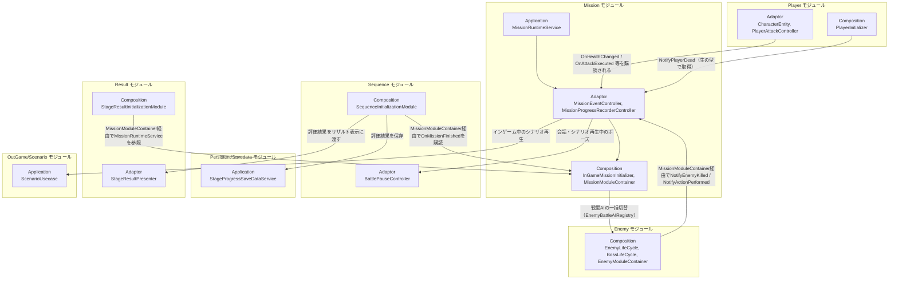

# ミッション

- page_id: 39e7c2c6-cc02-80d5-ac4e-cd46b87fd375
- Notion パス: Symphony Kill Chord / システム概要 / ミッション
- スナップショットの最終更新: 2026-08-24T13:37:38.303Z
- 書き込み許可: 可（システム概要 配下）
- 処置: 本文置き換え
- 確認日 / コミット: 2026-09-22 / origin/develop 73fefeb45

## 判定

- 信頼性: 一部古い — Order 600 は正しい（`Assets/Scripts/Runtime/6.Composition/InGame/Mission/InGameMissionInitializer.cs:47`）。クラス表のクラスはすべて実在する（Grep 確認）。ただし 2026-08-24 以降の追加（インゲーム会話 PR #1550 / #1554 / #1624 / #1862 / #1909、全 Wave 撃破条件 PR #1721、チュートリアルの成功表示 PR #1865 / #1871 / #1872、スマホのタップ攻撃 PR #1543、ポップアップの入力抑止）が入っていない。`MissionModuleContainer` の中身、`SelectedMissionState` が持つ型、Enemy からの取得方法、登録簿の名前、実行器のプロパティ名が実装と違う。リポジトリ側 `Assets/Docs/ScriptsDocs/Modules/NotionModuleDocs/Mission.md`（2026-08-18、最終更新日の表記は 2026-07-15）はこのページより古く、リポジトリにだけある記述は無い
- 整合性:
  - システム概要 / 敵 3957c2c6-cc02-80cd-94c0-f412b11ffcf7 は「Container 経由に統一」と書き、このページは「直接取得」と書いていて矛盾していた。実装は Container 経由（`EnemyLifeCycle.cs:117`、`Boss/BossLifeCycle.cs:127`）。このページを直した（EN-24）
  - 実装との矛盾: `MissionModuleContainer` が保持するのは `MissionRuntimeService` と `MissionEventController` の 2 つだけ（`MissionModuleContainer.cs`）。`MissionProgressRecorderController` は保持していない
  - 実装との矛盾: `SelectedMissionState` が保持するのは `MissionDefinition` ではなく `MissionId`。定義は `InGameMissionInitializer` が Addressables の `MissionDefinitionRepository` から作る（`InGameMissionInitializer.cs:54-87`）
  - 実装との矛盾: 一括切替の登録簿の実名は `EnemyAIControllerRegistry`（`EnemyBattleAIRegistry` は `EnemyModuleContainer` のプロパティ名）。実行器が型を申告するプロパティは `EntryActionType`（`IMissionStepEntryActionExecutor.cs:12`）
  - 実装との矛盾: HUD の表示状態の実名は Failed / Challenging / Succeeded（失敗 / 挑戦中 / 成功）。ページの「未達成 / 挑戦中 / 達成済み」と合っていない（EN-22）
  - 仕様概要 / ステージルール / ミッション 3257c2c6-cc02-809e-8860-fabeb3648dd8 との相互リンクが無い（EN-35）
  - Master と Demo でチュートリアルのミッション定義が別アセットになっていて、会話の配置が違う（TU-04）。どちらを正本とするかは未決
- 変更点:
  - 概要の表: 「最終更新日」を 2026-09-22 に更新した。「関連する仕様ページ」の行を追加した（EN-35）
  - 🏗️ クラス: `AllEnemyWavesClearCondition`、`IObjectiveSequenceStepCondition`、`MissionEndReason`、`MissionEvaluationResultTiming`、`MissionEvaluationDisplaySituation`、`MissionDialogueLine`、`PlayDialogueStepEntryAction`、`MissionDialogueController`、`MissionDialoguePresenter`、`IMissionDialogueViewModel` / `MissionDialogueDTO`、`MissionDialogueView` / `MissionDialogueViewModel`、`MissionDialogueAnimationBase` / `MissionDialogueSlideAnimation`、`MissionDialogueLineAsset`、`PlayDialogueStepEntryActionAsset`、`AllEnemyWavesClearConditionAsset`、`TutorialAttackFeedbackPresenter` / `TutorialSkillFeedbackPresenter` / `TutorialAttackTargetQuery` / `ITutorialAttackFeedbackView` / `TutorialAttackFeedbackView`、`MobileTapAttackInput` / `MobileTapAttackPopupViewDecorator` を追加した（EN-24, SC-09, TU-06, TU-07）
  - 🏗️ クラス: 旧: `MissionActionKind`「目標として計測できるプレイヤー行動の種別」 → 新: 値の一覧と `EnemyAttack`（敵の攻撃）を追記。旧: `MissionProgressRecorderController`「`OnHealthChanged`・`OnAttackExecuted`を購読」 → 新: 移動・回避・攻撃拍・スキル・ロックオン・リズムタイムアウトの購読を追記。旧: `SelectedMissionState`「選択中の`MissionDefinition`を保持」 → 新: `MissionId` を保持。旧: `IMissionStepEntryActionExecutor`「`ActionType`で申告」 → 新: `EntryActionType`。旧: 実行器「`EnemyBattleAIRegistry`への一括切替」 → 新: `EnemyAIControllerRegistry`。旧: `MissionEvaluationRunner`「未達成/挑戦中/達成済み」 → 新: 失敗/挑戦中/成功（Failed / Challenging / Succeeded）。旧: `PlayVoiceStepEntryAction` の説明 → 新: 字幕の出ない方式であることを追記（SC-09）。`MissionStepPopupController` に表示直後 1.5 秒の入力抑止を追記した（TU-07）
  - 🧩 Composition初期化情報: 旧: 「`MissionRuntimeService`, `MissionEventController`, `MissionProgressRecorderController`を保持」 → 新: 前の 2 つだけ。二重登録された生の型を誰が使っているかを追記した
  - 🔗 モジュール結合（図）: Enemy の矢印ラベルを旧: 「ServiceLocator直接取得でNotifyEnemyKilled」 → 新: Container 経由。Mission→Enemy（戦闘 AI の一括切替）、Player の死亡通知、Result、Sequence のポーズ、Scenario を追加した
  - 📥 依存しているもの: 旧: Player だけ → 新: Player（取得する型を追記）・Skill・Target・Music・Enemy・Sequence・Input・Scenario・Combo を追加した
  - 📤 依存されているもの: Enemy の詳細を Container 経由に直した。Player（死亡通知）・Result の取得元・OutGame/StageSelect を追加した
  - 🧅レイヤー情報: ① Domain に全 Wave 撃破条件と会話を、③ Adaptor に会話・チュートリアルの成功表示を、④ View に会話 UI・スマホのタップ攻撃を、⑤ Infrastructure に会話アセットと Master / Demo の分岐を、⑥ Composition に Build / Ready の実際の手順を追記した
  - 🔌 拡張ポイント: 進入時アクションの行に、会話の実行器（`MissionDialogueController`）が別経路で追加されることを添えた
  - 🔄処理フロー: 見出しは変えていない（子ページはタイトルで突き合わせるため）
- 決定（2026-09-22 八幡）: No.20 コンボは 3 コンボ以上で表示する。📥 依存しているもの の Combo の詳細に、仕様（3 以上）と現状（4 以上）を書いた
- 決定（2026-09-22 八幡）: No.21 コンボは被ダメージでリセットし、キルコード発動ではリセットしない。📥 依存しているもの の Combo の詳細に、仕様と現状（キルコード発動の攻撃でリセットされる）を書いた
- 実装の修正が必要: No.20 コンボの表示開始を 3 にする（根拠 `Assets/Scripts/Runtime/6.Composition/InGame/Mission/InGameMissionInitializer.cs:449` `_comboVisibleCount = 4`、判定は `Assets/Scripts/Runtime/4.View/InGame/Combo/ComboHudView.cs:45`）
- 実装の修正が必要: No.21 キルコード発動でコンボをリセットしない（根拠 `Assets/Scripts/Runtime/3.Adaptor/InGame/Battle/PlayerAttackController.cs:147-153`（通常攻撃のダメージを飛ばす指定は `Assets/Scripts/Runtime/3.Adaptor/InGame/Skill/SkillController.cs:89-92`） で通常攻撃のダメージを飛ばすとき `OnAttackExecuted(…, false)` を通知し、`Assets/Scripts/Runtime/3.Adaptor/InGame/Mission/MissionProgressRecorderController.cs:232-236` が未命中としてリセットする）
- 決定（2026-09-22 八幡）: No.2 敵の出現単位の説明語「Wave」を「ウェーブ」に直した（概要・🏗️ クラス・① Domain・③ Adaptor・🔌 拡張ポイント）。クラス名・メンバー名・ページ名は変えていない
- 織り込んだ反映項目: EN-24, EN-22（表示状態の名前）, EN-35（相互リンク部分）, TU-03（会話の表示ルール）, TU-04, TU-06（仕組みの部分）, TU-07（仕組みの部分）, SC-09
- 出典: 実装（`6.Composition/InGame/Mission/InGameMissionInitializer.cs`、`MissionModuleContainer.cs`、`InGameScenarioInputModeController.cs`、`2.Application/InGame/Mission/MissionRuntimeService.cs`、`3.Adaptor/InGame/Mission/MissionProgressRecorderController.cs:47-77`、`MissionDialogueController.cs`、`MissionStepPopupController.cs:14`、`IMissionStepEntryActionExecutor.cs:12`、`SelectedMissionState.cs`、`1.Domain/InGame/Mission/MissionDefinition.cs:50-53`、`MissionActionKind.cs`、`MissionEvaluationDisplaySituation.cs`、`5.InfraStructure/InGame/Mission/MissionDialogueLineAsset.cs:29-30`、`PlayDialogueStepEntryActionAsset.cs:30-38`、`6.Composition/InGame/Player/PlayerInitializer.cs:274`、`6.Composition/InGame/Result/StageResultInitializationModule.cs:50`、`3.Adaptor/OutGame/StageSelect/BattleSortieSelectionService.cs:35`）、マスターデータ（`Assets/Level/Data/Master/OutGame/StageSelect/Mission/MissionDefinition_*.asset`、`Assets/Level/Data/Demo/OutGame/StageSelect/Mission/MissionDefinition_*.asset`）、PR #1393 / #1510 / #1543 / #1550 / #1554 / #1624 / #1721 / #1862 / #1865 / #1871 / #1872 / #1909
- 要確認:
  - No.21: スキル 5 の HP 消費による HP 減少を、コンボをリセットする被ダメージとして扱うか（企画。現状は `MissionProgressRecorderController.cs:207-220` で HP 減少をすべてリセットに使う）
  - チュートリアルのミッション定義は Master と Demo のどちらを正本とし、どう同期するか（企画、TU-04）
  - `PlayVoiceStepEntryAction` を今後も使うか、会話（`PlayDialogueStepEntryAction`）へ寄せるか（企画）
  - PR #1550 の残論点「会話を MissionStep から外した方が良いかもしれない」の結論（プログラム担当、Discord 未照合）
  - 見出しの階層は NotionMarkdownWriter の形式（H1 = 概要 / 詳細）で書いた。貼るときに既存ページの見た目と合っているか確かめる

## 適用する本文

# 概要 {color="gray_bg"}

> 💡 **モジュール概要**
> ステージのクリア条件・失敗条件・サブミッション（評価条件）の判定、進行状況の記録、クリア時のランク算出を司るモジュールである。リザルト画面（Result）は別モジュールであるが、`MissionEvaluationResult`を介して密接に連携する。目標ステップに合わせた説明ポップアップ・敵ウェーブの生成・バフ付与・会話の再生・インゲーム中のシナリオ再生も、このモジュールが起点になる。

| 項目 | 内容 |
| --- | --- |
| **モジュール名** | Mission |
| **カテゴリ** | InGame |
| **ステータス** | 実装済み |
| **最終更新日** | 2026-09-22 |
| **関連する仕様ページ** | 仕様概要 / ステージルール / ミッション（3257c2c6-cc02-809e-8860-fabeb3648dd8）、仕様概要 / チュートリアル |

---

## 🏗️ クラス {toggle="true"}

| クラス名 | レイヤー | 役割・機能 |
| --- | --- | --- |
| **`MissionDefinition`** | Domain | ミッションの不変定義（クリア条件・失敗条件・評価条件群・テキスト・敗北Tips）を保持。クリア条件は常に目標シーケンス（`ObjectiveSequenceClearCondition`）で、単一条件のミッションは要素数1のシーケンスとして扱う |
| **`MissionProgress`** | Domain | 実行中の進行状態（経過時間・被ダメージ・最大コンボ・使用武器種・撃破記録・全ウェーブ撃破・現在の目標ステップ・終了理由）を保持する可変Entity |
| **`MissionEndReason`** | Domain | ミッションの終了理由（None / Clear / Fail） |
| **`EnemyKillRecord`** | Domain | 敵種別（`EnemyMissionKey`）ごとの撃破数カウンターEntity |
| **`MissionEvaluationResult`** | Domain | 評価条件の達成状況一覧（`MissionEvaluationProgress[]`）と達成数を集約 |
| **`MissionEvaluationProgress`** | Domain | 1評価条件の進捗を表すreadonly struct（達成状況の表示状態を含む） |
| **`MissionEvaluationResultTiming`** / **`MissionEvaluationDisplaySituation`** | Domain | 評価条件の結果を確定させるタイミング（Immediate: 達成と同時 / Cleared: ミッション終了後）と、HUDに出す状況（Failed / Challenging / Succeeded） |
| **`MissionId`** / **`EnemyMissionKey`** / **`MissionEvaluationId`** | Domain | 文字列ベースの識別子ValueObject群 |
| **`MissionElapsedTime`** / **`ComboCount`** / **`MissionMaxCombo`** / **`MissionDamageTaken`** / **`MissionWeaponVariety`** | Domain | 経過時間・コンボ数・最大コンボ・被ダメージ量・使用武器種数を表す不変ValueObject群 |
| **`MissionActionKind`** / **`MissionActionRecord`** | Domain | 目標として計測できる行動の種別（Dodge / Attack / Skill / Move / LockOn / 1・2・3・4・6・8拍子の攻撃 / EnemyAttack）と、その発動回数を記録するEntity。EnemyAttackは敵の攻撃の実行を数える |
| **`IMissionClearCondition`** | Domain | クリア条件の抽象。`ElapsedTimeClearCondition`（生存時間）、`EnemyKillCountClearCondition`（撃破数）、`ActionRepeatCountClearCondition`（行動回数）、`AllEnemyWavesClearCondition`（最終ウェーブまでの全敵撃破）、`AndClearConditionGroup`/`OrClearConditionGroup`（複合条件）が実装 |
| **`ObjectiveSequenceClearCondition`** / **`ObjectiveSequenceStep`** | Domain | 複数の目標を順番に達成させるクリア条件と、その1ステップ（達成条件と案内メッセージ） |
| **`IObjectiveSequenceStepCondition`** | Domain | ステップ開始時の進行値を基準に評価する条件の契約（ステップ開始時に`BeginStep`で記録する） |
| **`IDecoratorClearCondition`** / **`ClearConditionChain`** | Domain | 内側の条件をラップするデコレータの契約と、連結されたチェーンを探索するヘルパー |
| **`PopupClearCondition`** / **`WaveStartClearCondition`** / **`PlayerBuffClearCondition`** | Domain | 内側の条件をラップし、ステップ開始時の説明表示・敵ウェーブ生成・バフ付与の目印を兼ねるデコレータ |
| **`ScenarioPlaybackClearCondition`** | Domain | 指定シナリオの再生完了を待つ目標ステップ条件。再生自体はAdaptorのControllerが行い、完了時に`CompletePlayback`が呼ばれる |
| **`IMissionStepEntryAction`** | Domain | 目標ステップへ進入したときに実行するアクションの契約。実装を見分けるためのマーカーであり、メンバーを持たない |
| **`PlayVoiceStepEntryAction`** / **`SetSkillExecutionEnabledStepEntryAction`** / **`ToggleEnemyBattleAIStepEntryAction`** | Domain | 進入時アクションの具象。ボイス再生・スキル発動可否の切替・敵の戦闘AIの有効無効を表す。`PlayVoiceStepEntryAction`はボイスだけを鳴らし、字幕は出ない |
| **`PlayDialogueStepEntryAction`** / **`MissionDialogueLine`** | Domain | 進入時アクションの具象。ステップ開始時に順番に再生する会話（1行 = 字幕キー・日本語フォールバック・顔画像・ボイスのCue・無音時の表示秒数）と、ステップが変わったら会話を打ち切るかどうかを保持する |
| **`IObjectiveProgressReporter`** | Domain | 達成条件が進行状況を「現在値/必要値」で報告できることを表す契約 |
| **`IMissionFailCondition`** | Domain | 失敗条件の抽象。`ElapsedTimeFailCondition`（制限時間超過）、`PlayerDeadFailCondition`（プレイヤー死亡）、`AndFailConditionGroup`/`OrFailConditionGroup`（複合条件）が実装 |
| **`IMissionEvaluationCondition`** | Domain | サブミッション（評価条件）の抽象。`ClearTimeEvaluationCondition`・`DamageTakenEvaluationCondition`・`ComboEvaluationCondition`・`WeaponVarietyEvaluationCondition`の4種が実装 |
| **`StageRank`** | Domain | ランクを表すenum（C=0, B=1, A=2, S=3） |
| **`StageRankCalculator`** | Domain | 達成数からランクを算出する静的クラス（0→C, 1→B, 2→A, 3以上→S） |
| **`MissionRuntimeService`** | Application | ミッション進行の中心オーケストレーター。`Tick`/`OnEnemyKilled`/`OnEnemyWavesCleared`/`OnActionPerformed`/`OnPlayerDead`/`BuildEvaluationResult()`を公開し、`OnObjectiveStepChanged(int)`と`OnMissionFinished(MissionEndReason)`イベントを発火する。コンストラクタDIのみで構成され、ServiceLocatorに依存しない |
| **`MissionRuleRunner`** | Application | 失敗条件→クリア条件の順で評価し、`MissionProgress.Finish()`を呼ぶ |
| **`MissionEvaluationRunner`** | Application | 全評価条件を実行し`MissionEvaluationResult`を構築。表示状態（失敗/挑戦中/成功）の状態遷移も担う |
| **`MissionEnemyKilledUsecase`** / **`MissionPlayerDeadUsecase`** / **`MissionTimeAdvanceUsecase`** / **`MissionActionPerformedUsecase`** | Application | `MissionProgress`を更新する単機能ユースケース群 |
| **`IMissionPreviewProvider`** | Application | ミッションのプレビュー表示テキストを解決する契約 |
| **`MissionFactory`** | Application | `MissionProgress`の生成 |
| **`MissionEventController`** | Adaptor | Compositionからの通知窓口。`Tick`/`NotifyEnemyKilled`/`NotifyPlayerDead`/`NotifyActionPerformed`/`NotifyActionsPerformed`を公開し`MissionRuntimeService`へ委譲、HUD更新もトリガーする |
| **`MissionProgressRecorderController`** | Adaptor | プレイヤーのHP変化・移動・回避・攻撃（武器種と攻撃拍）・スキル発動・ロックオン、およびリズムタイムアウトを購読し、被ダメージ・武器使用・コンボ・行動回数を`MissionProgress`へ記録する（`IDisposable`）。コンボの変化はコンボHUDへも反映する |
| **`MissionHudPresenter`** | Adaptor | `MissionRuntimeService`の状態から`MissionHudDTO`を構築しHUDへ送る |
| **`IMissionHudViewModel`** / **`MissionHudDTO`** / **`MissionEvaluationItemDTO`** / **`MissionEvaluationDisplayState`** | Adaptor | HUD向けのViewModel契約・DTO群 |
| **`MissionStepPopupController`** / **`MissionWaveController`** / **`MissionPlayerBuffController`** | Adaptor | デコレータ条件を検出し、説明ポップアップ・敵ウェーブ生成・バフ付与へ橋渡しする。`MissionStepPopupController`はポップアップの表示直後1.5秒（既定値）プレイヤーの入力を無効にする。`MissionWaveController`は最終ウェーブまでの全滅もMissionへ伝える |
| **`MissionStepEntryActionController`** | Adaptor | 目標ステップの開始を購読し、そのステップの進入時アクションを型に対応する実行器へ一度だけ振り分ける |
| **`IMissionStepEntryActionExecutor`** | Adaptor | 特定種類の進入時アクションを実行する契約。対象の型を`EntryActionType`で申告する |
| **`PlayVoiceStepEntryActionExecutor`** / **`SetSkillExecutionEnabledStepEntryActionExecutor`** / **`ToggleEnemyBattleAiStepEntryActionExecutor`** | Adaptor | 各進入時アクションの実行器。ボイス再生、`PlayerActionRestrictionState`への反映、`EnemyAIControllerRegistry`への一括切替を行う |
| **`MissionDialogueController`** | Adaptor | `PlayDialogueStepEntryAction`の実行器を兼ね、会話を1行ずつ再生する。ボイスがあれば再生が終わるまで、無い・失敗したときは無音時の表示秒数だけ表示する。戦闘ポーズに合わせて一時停止し、ミッション終了で止める |
| **`MissionDialoguePresenter`** / **`IMissionDialogueViewModel`** / **`MissionDialogueDTO`** | Adaptor | 会話の文字・顔画像・表示状態をViewへ渡すPresenterとその契約・DTO |
| **`MissionScenarioController`** | Adaptor | `ScenarioPlaybackClearCondition`のステップで戦闘を停止してシナリオを再生し、終了後に条件の完了通知と戦闘再開を行う |
| **`IScenarioInputModeController`** | Adaptor | シナリオ再生中の入力マップ切替の契約。実装は`InGameScenarioInputModeController`（Composition） |
| **`TutorialAttackFeedbackPresenter`** / **`TutorialSkillFeedbackPresenter`** / **`TutorialAttackTargetQuery`** / **`ITutorialAttackFeedbackView`** | Adaptor | チュートリアルの色指定課題で、成立した攻撃を課題と比べてSuccess / Miss / Perfectを、スキル課題で成立したスキルのSuccessをViewへ通知する。判定の条件は振動と共通の`TutorialAttackTargetQuery`で参照する |
| **`OutGameMissionSelectController`** | Adaptor | アウトゲームでのミッション選択エントリポイント。出撃時に`BattleSortieSelectionService`がステージ定義の`MissionId`を渡す |
| **`SelectedMissionState`** | Adaptor | OutGame→InGameで選択中の`MissionId`を保持するクロスシーン状態 |
| **`MissionHudView`** / **`MissionHudViewModel`** | View | ミッションHUDの表示と状態保持 |
| **`MissionEvaluationItemView`** / **`MissionEvaluationItemViewModel`** | View | サブミッション1件分の表示 |
| **`MissionStepPopupView`** / **`IMissionStepPopupView`** | View | 目標ステップの説明ポップアップ |
| **`MobileTapAttackInput`** / **`MobileTapAttackPopupViewDecorator`** | View | スマートフォン（Android / iOS）で、説明ポップアップの表示中に画面のタップを攻撃入力として扱う |
| **`MissionDialogueView`** / **`MissionDialogueViewModel`** | View | 会話UI（Prefab `MissionDialogue`）の表示。字幕はロケールの切り替えに追従する |
| **`MissionDialogueAnimationBase`** / **`MissionDialogueSlideAnimation`** | View | 会話UIの入場・退場・一時停止の演出（スライド） |
| **`TutorialAttackFeedbackView`** | View | 色指定課題の判定結果を、事前生成した表示枠でリズムゲージの上へ表示する |
| **`MissionLoopView`** | View | ミッションの定期更新の駆動 |
| **`MissionDefinitionAsset`** / **`MissionDefinitionRepository`** | Infrastructure | ミッション定義のScriptableObjectとID検索。`[SerializeReference, SubclassSelector]`で条件群を保持し`Create()`でDomainへ変換 |
| **`EnemyMissionKeyAsset`** / **`EnemyMissionKeyRepository`** | Infrastructure | 敵のミッションキーアセットとID検索 |
| **`ObjectiveSequenceStepAsset`** | Infrastructure | 目標シーケンスの1ステップを定義するAsset。達成条件・案内メッセージに加え、進入時アクション一覧を保持する |
| **`MissionStepEntryActionAssetBase`** | Infrastructure | 進入時アクションの抽象Assetベース。他の条件Assetと同じく`ISerializationCallbackReceiver`でインスペクタ表示用サマリーを自動生成する |
| **`PlayVoiceStepEntryActionAsset`** / **`SetSkillExecutionEnabledStepEntryActionAsset`** / **`ToggleEnemyBattleAiStepEntryActionAsset`** | Infrastructure | 各進入時アクションのAsset |
| **`PlayDialogueStepEntryActionAsset`** / **`MissionDialogueLineAsset`** | Infrastructure | 会話の進入時アクションのAssetと、会話1行分の定義。`_continueAfterStepChange`をオンにすると、ステップが進んでも会話を最後まで続ける。無音時の表示秒数`_silentDuration`の既定値は3秒 |
| **`ScenarioPlaybackClearConditionAsset`** / **`AllEnemyWavesClearConditionAsset`** | Infrastructure | シナリオ再生完了条件・全ウェーブ撃破条件のAsset |
| **`MissionClearConditionAssetBase`** / **`MissionFailConditionAssetBase`** / **`MissionEvaluationConditionAssetBase`** | Infrastructure | 各条件の抽象Assetベース。`ISerializationCallbackReceiver`でインスペクタ表示用サマリーを自動生成 |
| **`InGameMissionInitializer`** | Composition | ミッション関連オブジェクトの構築・登録・破棄を担当 |
| **`MissionModuleContainer`** | Composition | `MissionRuntimeService`/`MissionEventController`をServiceLocatorへ公開するContainer |
| **`InGameScenarioInputModeController`** | Composition | `IScenarioInputModeController`の実装。シナリオ再生中のInputActionMapを切り替える |

  > リザルト画面（`StageResultController`/`StageResultPresenter`/`StageResultDTO`/`StageRankCalculator`呼び出し）は別モジュール「Result」に属するが、`MissionEvaluationResult`を直接消費するため本ページでも参照する。

### 🧩 Composition初期化情報

| 項目 | 内容 |
| --- | --- |
| **Initializerクラス** | `InGameMissionInitializer` |
| **Order** | 600 |
| **公開する ModuleContainer / ServiceLocator登録型** | `MissionModuleContainer`（`MissionRuntimeService`, `MissionEventController`を保持）。ただし`MissionRuntimeService`/`MissionEventController`は現状Containerとは別に生の型としても`ServiceLocator`へ二重登録されている。生の型は`PlayerInitializer`（`MissionEventController.NotifyPlayerDead`）とチュートリアルの成功表示（`MissionRuntimeService`）が使っている |

## 🔗 モジュール結合

### 📥 依存しているもの

- **`Player`**
  - *依存箇所*: `PlayerModuleContainer`（`PlayerEntity`, `PlayerController`, `PlayerAttackController`, `PlayerActionRestrictionState`, `InputSuppressionState`, `PlayerAttackSignal`）
  - *詳細*: `MissionProgressRecorderController`がHP変化・移動・回避・攻撃のイベントを購読し、被ダメージ量・使用武器種・コンボ数・行動回数をサブミッション評価条件と目標ステップの記録に使う。スキル発動可否の切替、ポップアップ表示直後の入力抑止、チュートリアルの成功表示もPlayer側の状態を使う
- **`Skill`**
  - *依存箇所*: `SkillModuleContainer.SkillController`
  - *詳細*: スキルの発動を行動回数として記録する
- **`Target`**
  - *依存箇所*: `TargetSystemController`
  - *詳細*: ロックオンを行動回数として記録する
- **`Music`**
  - *依存箇所*: `MusicSyncModuleContainer.MusicSyncService`（`OnRhythmTimedOut`）
  - *詳細*: リズム入力が途絶えたときにコンボを破棄する
- **`Enemy`**
  - *依存箇所*: `EnemyModuleContainer.EnemyBattleAIRegistry`（型は`EnemyAIControllerRegistry`）
  - *詳細*: 進入時アクション`ToggleEnemyBattleAIStepEntryAction`で、出現中の全敵の戦闘AIを一括で切り替える
- **`Sequence`**
  - *依存箇所*: `SequenceModuleContainer.BattlePauseController`, `InGamePlayDirector`
  - *詳細*: シナリオ再生中は戦闘をポーズし、会話はポーズに合わせて一時停止する。会話UIはゲームプレイの開始・終了に合わせて動く
- **`Input`**
  - *依存箇所*: `InputComposition`（`GetInputView`, `GetInputMapController`）
  - *詳細*: シナリオ再生中の入力マップ切替と、シナリオの入力Viewの初期化に使う
- **`OutGame/Scenario`**
  - *依存箇所*: `ScenarioUsecase`（`IScenarioPlaybackService`）、`ScenarioView`、背景・アニメーション・立ち絵・シナリオ設定のカタログ
  - *詳細*: `ScenarioPlaybackClearCondition`を持つミッションのときだけ、シナリオ再生の一式をAddressablesから読み込んで構築する
- **`Combo`**
  - *依存箇所*: `ComboHudPresenter`, `ComboHudView`
  - *詳細*: `InGameMissionInitializer`がコンボHUDを構築し、`MissionProgressRecorderController`がコンボ数の変化を反映する。コンボ数は3以上で表示する（現状は4以上。`InGameMissionInitializer._comboVisibleCount`）。コンボは被ダメージでリセットし、キルコード発動ではリセットしない（現状は、キルコード発動の攻撃が通常攻撃のダメージを飛ばすと未命中として扱われ、リセットされる）。【要確認: スキル5のHP消費によるHP減少を被ダメージとしてリセットするか】

### 📤 依存されているもの

- **`Enemy`**
  - *参照箇所*: `MissionModuleContainer.MissionEventController`, `MissionModuleContainer.MissionRuntimeService`
  - *詳細*: `EnemyLifeCycle`/`BossLifeCycle`がServiceLocatorから`MissionModuleContainer`を取得し、敵のHPが0になった瞬間に`NotifyEnemyKilled`を、敵が攻撃したときに`NotifyActionPerformed(EnemyAttack)`を呼ぶ。`EnemyInitializer`は目標シーケンスに`WaveStartClearCondition`があるかを調べ、`MissionWaveController`を構築する
- **`Player`**
  - *参照箇所*: `MissionEventController.NotifyPlayerDead`
  - *詳細*: `PlayerInitializer`がプレイヤーの死亡を通知する。`MissionModuleContainer`を介さず、生の型で取得している
- **`Sequence`**
  - *参照箇所*: `MissionModuleContainer.MissionRuntimeService`, `MissionEvaluationResult`
  - *詳細*: `SequenceInitializationModule`が`MissionRuntimeService.OnMissionFinished`を購読し、クリア時に評価結果を生成してセーブ・リザルト表示へ橋渡しする（Order 1000、Missionの600より後に初期化）
- **`Persistent/Savedata`**
  - *参照箇所*: `MissionEvaluationResult`（`StageProgressSaveDataService.SaveClearAsync`の引数）
  - *詳細*: クリア時の評価結果からステージクリア状態・達成サブミッションIDを永続化する
- **`Result`**
  - *参照箇所*: `MissionEvaluationResult`, `StageRankCalculator`, `MissionModuleContainer.MissionRuntimeService`
  - *詳細*: `StageResultPresenter.PresentVictory`が評価結果を受け取り`StageRankCalculator.Calculate`でランクを算出し表示する。`StageResultInitializationModule`（Order 400）はReadyフェーズで`MissionModuleContainer`を取得する
- **`OutGame/StageSelect`**
  - *参照箇所*: `OutGameMissionSelectController`, `SelectedMissionState`, `IMissionPreviewProvider`
  - *詳細*: 出撃時に選択ステージの`MissionId`を`SelectedMissionState`へ書き込む。ステージ詳細の表示ではミッションのプレビュー文を解決する

# 詳細 {color="gray_bg"}

## 🧅レイヤー情報

### ① Domain

ミッション定義（`MissionDefinition`）、進行状態（`MissionProgress`）、クリア/失敗/評価条件の抽象と具象実装、ランク算出（`StageRankCalculator`）を保持する。クリア条件は単発の判定に加えて、複数の目標を順番に達成させる`ObjectiveSequenceClearCondition`と、内側の条件を包んで副作用の目印を兼ねるデコレータ群を持つ。すべてのミッションのクリア条件は目標シーケンスとして表現される。全ウェーブ撃破条件（`AllEnemyWavesClearCondition`）は、最終ウェーブまでの敵が生成待ちも含めてすべて倒れたことを`MissionProgress`の記録で判定する。会話（`PlayDialogueStepEntryAction`）も進入時アクションの一種として表す。

### ② Application

`MissionRuntimeService`を中心に、条件判定（`MissionRuleRunner`）・評価結果構築（`MissionEvaluationRunner`）・進行更新の各ユースケースを実装する。通知を受けるたびに、目標ステップを進めて（変わったら`OnObjectiveStepChanged`を発火）、失敗→クリアの順に判定し、終了していれば`OnMissionFinished`を発火する。ServiceLocatorに一切依存しない、コンストラクタ注入のみのピュアな構成である。

### ③ Adaptor

Compositionからの通知窓口`MissionEventController`、Player側イベントを購読して実績を記録する`MissionProgressRecorderController`、HUDへのデータ橋渡しを行う`MissionHudPresenter`、およびOutGame側のミッション選択状態を保持する。デコレータ条件に対応する3つのController（ポップアップ・ウェーブ生成・バフ付与）が、Domainの目印を実際の副作用へ橋渡しする。目標ステップの変化はこれらのControllerと`MissionStepEntryActionController`・`MissionDialogueController`・`MissionScenarioController`がそれぞれ購読する。会話は、ボイスがあれば再生が終わるまで、無い・失敗したときは無音時の表示秒数だけ表示する。新しい会話が始まると前の会話は置き換わり、ゲームプレイが終わると止まる。ゲーム開始前に積まれた会話は、開始まで保持してから再生する。チュートリアルの色指定課題とスキル課題の成功表示も同層のPresenterが判定する。

### ④ View

`MissionLoopView`が毎フレーム`MissionEventController.Tick`を駆動し、`MissionHudView`/`MissionHudViewModel`がHUD表示のMVVMチェーンを構成する。サブミッション1件分の表示は`MissionEvaluationItemView`、目標ステップの説明は`MissionStepPopupView`が担当する。会話UIは`MissionDialogueView`（Prefab `Assets/Level/Prefabs/Master/InGame/UI/MissionDialogue.prefab`）が表示し、字幕パネルは説明ポップアップより前面に出る。スマートフォンでは`MobileTapAttackPopupViewDecorator`がポップアップ表示中の画面タップを攻撃入力に変える。

### ⑤ Infrastructure

`MissionDefinitionAsset`が`[SerializeReference, SubclassSelector]`でクリア/失敗/評価条件をインスペクタから多態的に構成できるようにし、`Create()`でDomainオブジェクトへ変換する。`MissionDefinitionRepository`と`EnemyMissionKeyRepository`がそれぞれの定義をIDで引く。両リポジトリはAddressablesのアドレス`MissionDefinitionRepository`/`EnemyMissionKeyRepository`でロードし、ReleaseビルドではMaster側（`Assets/Level/Data/Master/OutGame/StageSelect/Mission/`）、DemoビルドではDemo側（`Assets/Level/Data/Demo/OutGame/StageSelect/Mission/`）が使われる。チュートリアルのミッション定義（`MissionDefinition_Tutorial.asset`）はMasterとDemoで別アセットであり、会話の配置が違う。【要確認: どちらを正本とし、どう同期するかを企画に】

### ⑥ Composition

`InGameMissionInitializer`（Order 600）がミッション関連オブジェクトを構築する。ResourceLoadAsyncフェーズで`SelectedMissionState`の`MissionId`からミッション定義を作り、シナリオ再生条件を持つミッションならシナリオ再生用のアセットも読み込む。Buildフェーズで`MissionRuntimeService`・`MissionEventController`・HUDを構築して`MissionModuleContainer`を登録する。Readyフェーズで`PlayerModuleContainer`・`SkillModuleContainer`・`MusicSyncModuleContainer`・`TargetSystemController`を取得して`MissionProgressRecorderController`を紐付け、ポップアップ・バフ・進入時アクション（`EnemyModuleContainer`の登録簿を含む）・会話・シナリオ再生・チュートリアルの成功表示を順に構築する。`MissionWaveController`はEnemy側の`EnemyInitializer`（Order 700）がReadyフェーズで構築する。

## 🔌 拡張ポイント

| 拡張したいこと | 実装する場所 | 追加登録の要否 |
| --- | --- | --- |
| 新しいサブミッション（評価条件）を追加したい | `IMissionEvaluationCondition`（Domain）を実装し、`MissionEvaluationConditionAssetBase`（Infrastructure）を継承したAssetクラスを作成する | 不要（`[SerializeReference, SubclassSelector]`によりInspectorへ自動的に出現） |
| 新しいクリア条件・失敗条件を追加したい | `IMissionClearCondition`/`IMissionFailCondition`（Domain）を実装し、対応する`MissionClearConditionAssetBase`/`MissionFailConditionAssetBase`（Infrastructure）派生を作成する | 不要（同上）。`And`/`Or`の複合条件Assetと組み合わせて複雑な条件も表現できる |
| 目標ステップに新しい副作用を持たせたい | `IDecoratorClearCondition`を実装したデコレータ条件（Domain）と、それを検出して副作用を起こすControllerを作る。既存例は説明ポップアップ・敵ウェーブ生成・バフ付与の3つ | 必要（Controllerを`InGameMissionInitializer`で構築・購読させないと、条件は判定されるが副作用が起きない） |
| 目標ステップ進入時の新しいアクションを追加したい | `IMissionStepEntryAction`（Domain）を実装し、`MissionStepEntryActionAssetBase`（Infrastructure）派生のAssetと、`IMissionStepEntryActionExecutor`（Adaptor）実装の実行器を作る | 必要（実行器を`InGameMissionInitializer`の実行器配列へ追加しないと、Assetは設定できるが実行されず、警告ログが出る）。会話の実行器（`MissionDialogueController`）は、会話を使うミッションのときだけ配列へ追加される |
| 計測できるプレイヤー行動を増やしたい | `MissionActionKind`へ値を追加し、行動の発生元から`MissionActionPerformedUsecase`を呼ぶ | 必要（呼び出し漏れの場合、回数が増えず条件が永久に未達成になる） |

## 🔄処理フロー

主要な処理フローは、それぞれ子ページに分けている。

- 📄 [[① ミッション開始フロー（ステージ読み込み時）]] (3bf7c2c6-cc02-81cb-9df1-d2491411dc0a)
- 📄 [[② 敵撃破→クリア判定→保存→リザルト表示フロー]] (3bf7c2c6-cc02-8144-aeef-c67ace0b4a39)
- 📄 [[③ サブミッション進捗のHUD表示フロー（毎フレーム／イベント時）]] (3bf7c2c6-cc02-81fe-a927-eadd5d8f3456)
- 📄 [[④ 目標シーケンスの進行フロー（ステップ更新時）]] (3bf7c2c6-cc02-8184-ab76-d50a4ac7e15a)
- 📄 [[⑤ 目標ステップ進入時アクションの実行フロー]] (3c67c2c6-cc02-8179-a0c0-e067bb5af6b7)
- 📄 [[⑥ インゲーム中のシナリオ再生フロー]] (3c67c2c6-cc02-81ef-9ed5-cbaa8c1fcc73)
