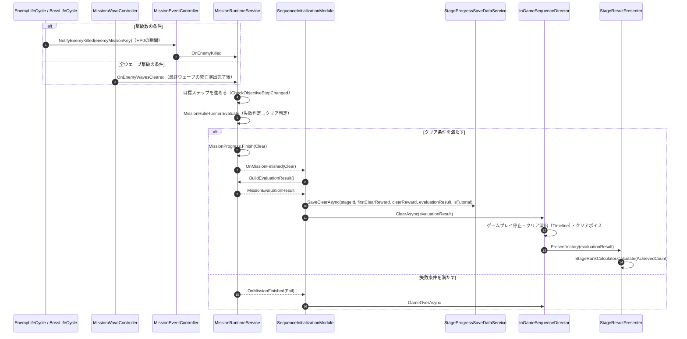

# ② 敵撃破→クリア判定→保存→リザルト表示フロー

- page_id: 3bf7c2c6-cc02-8144-aeef-c67ace0b4a39
- Notion パス: Symphony Kill Chord / システム概要 / ミッション / ② 敵撃破→クリア判定→保存→リザルト表示フロー
- スナップショットの最終更新: 2026-08-17T17:31:54.954Z
- 書き込み許可: 可（システム概要 配下）
- 処置: 本文置き換え
- 確認日 / コミット: 2026-09-22 / origin/develop 73fefeb45

## 判定

- 信頼性: 一部古い — 流れ（撃破通知 → 判定 → `OnMissionFinished` → 保存 → リザルト）は実装どおり（`Assets/Scripts/Runtime/2.Application/InGame/Mission/MissionRuntimeService.cs`、`6.Composition/InGame/Sequence/SequenceInitializationModule.cs:364-425`）。次の点が古い・足りない
  - 撃破の通知タイミング（HP0 の瞬間、PR #1802）と、全 Wave 撃破の通知経路（PR #1721）が書かれていない
  - 判定の前に目標ステップを進める処理（`CheckObjectiveStepChanged`）が無い
  - `SaveClearAsync` の引数は 5 つ（ステージ ID・初回報酬・クリア報酬・評価結果・チュートリアルか）。図の 3 引数は古い
  - `SequenceDirector.ClearAsync` の中身（クリア演出の Timeline・ボイス）が省かれている
- 整合性: 親ページ 39e7c2c6-cc02-80d5-ac4e-cd46b87fd375、システム概要 / シークエンス / ② クリア→保存→リザルト表示フロー 3bf7c2c6-cc02-813a-b8d9-e1b983c89a04（同じ領域の別原稿）と矛盾しないよう、演出の中身はシークエンス側へ任せた。システム概要 / 敵 の新規子ページ ⑤（死亡処理）と、撃破通知のタイミングを揃えた
- 変更点:
  - 冒頭の説明文: 撃破数は HP0 の瞬間に加算され、全滅系（次 Wave・全 Wave 撃破）は死亡演出の後になることを追記した（EN-16）
  - 図: 参加者に `MissionWaveController` と `InGameSequenceDirector` を追加した。全 Wave 撃破の経路を `alt` で追加した。旧: `SaveClearAsync(stageId, evaluationResult, isTutorial)` → 新: 5 引数。旧: `SequenceDirector.ClearAsync → PresentVictory(evaluationResult)` → 新: `InGameSequenceDirector.ClearAsync` の中で、クリア演出とボイスの後に `PresentVictory` を呼ぶ。失敗時の `GameOverAsync` を追加した
- 決定（2026-09-22 八幡）: No.2 敵の出現単位の説明語「Wave」を「ウェーブ」に直した（冒頭の説明文と図）。クラス名・メンバー名・ページ名は変えていない
- 織り込んだ反映項目: EN-16, EN-24（全 Wave 撃破条件）
- 出典: 実装（`6.Composition/InGame/Enemy/EnemyLifeCycle.cs:773-791`、`3.Adaptor/InGame/Mission/MissionWaveController.cs`、`2.Application/InGame/Mission/MissionRuntimeService.cs`、`MissionRuleRunner.cs`、`6.Composition/InGame/Sequence/SequenceInitializationModule.cs:364-425`、`InGameSequenceDirector.cs:115-135`、`3.Adaptor/InGame/Result/StageResultPresenter.cs:48-56`）、PR #1802 / #1721
- 決定（2026-09-22 八幡）: R19 キル数の計上とウェーブ全滅判定のタイミングを揃える。冒頭の説明文に「同じタイミングで行う。現状の時間差は修正が必要」と書き、ずれを許容するかの【要確認】を「どちらに揃えるか」に置き換えた
- 実装の修正が必要: キル数の計上（HP0 の瞬間）とウェーブ全滅判定（死亡演出の完了後）を同じタイミングにする（Issue #2052、根拠 `Assets/Scripts/Runtime/6.Composition/InGame/Enemy/EnemyLifeCycle.cs:773-791`）
- 要確認: キル数の計上と全滅判定を、HP0 の瞬間と死亡演出の完了後のどちらに揃えるか（企画、EN-16。仕様概要 / ステージルール / ミッション側と同じ要確認）

## 適用する本文

敵を撃破しクリア条件が満たされると、評価結果が生成・保存され、リザルト画面へ反映される。撃破数はHPが0になった瞬間に通知されるため、撃破数を数えるミッションは死亡演出の途中でもクリアしうる。一方、最終ウェーブまでの全敵撃破（`AllEnemyWavesClearCondition`）は、生存数が減る死亡演出の完了後に`MissionWaveController`から通知される。どの通知でも、目標ステップを進めてから失敗→クリアの順に判定する。
キル数の計上とウェーブの全滅判定は、同じタイミングで行う。上記の時間差は現状の実装であり、修正が必要である。どちらのタイミングに揃えるかは【要確認: HP0 の瞬間と死亡演出の完了後のどちらに揃えるかを企画に】。

