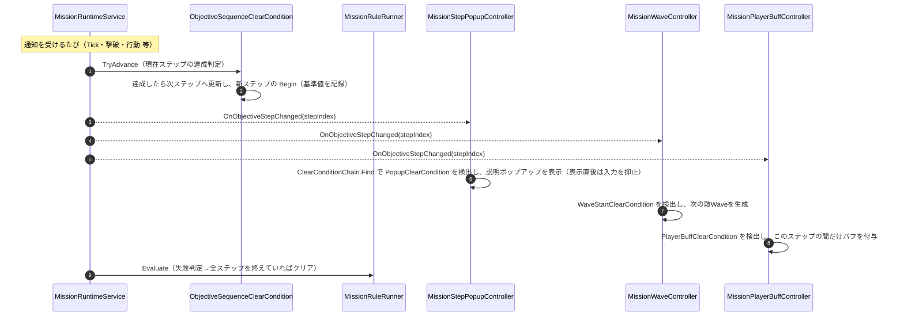

# ④ 目標シーケンスの進行フロー（ステップ更新時）

- page_id: 3bf7c2c6-cc02-8184-ab76-d50a4ac7e15a
- Notion パス: Symphony Kill Chord / システム概要 / ミッション / ④ 目標シーケンスの進行フロー（ステップ更新時）
- スナップショットの最終更新: 2026-08-17T17:31:58.820Z
- 書き込み許可: 可（システム概要 配下）
- 処置: 本文置き換え
- 確認日 / コミット: 2026-09-22 / origin/develop 73fefeb45

## 判定

- 信頼性: 一部古い — 図ではステップを進めるのが `MissionRuleRunner`、副作用を起こすのが `ClearConditionChain` からの呼び出しになっているが、実装は違う。ステップを進めるのは `MissionRuntimeService.CheckObjectiveStepChanged` → `ObjectiveSequenceClearCondition.TryAdvance` で、`MissionRuleRunner` はすべてのステップを終えたかを判定するだけ（`Assets/Scripts/Runtime/2.Application/InGame/Mission/MissionRuntimeService.cs` の `CheckObjectiveStepChanged`、`MissionRuleRunner.cs`、`1.Domain/InGame/Mission/ClearCondition/ObjectiveSequenceClearCondition.cs` の `TryAdvance`）。各 Controller は `OnObjectiveStepChanged` を購読し、自分で `ClearConditionChain.Find<T>` を呼んでデコレータを探す。ステップ開始時の基準値の記録（`IObjectiveSequenceStepCondition.BeginStep`）と、同じイベントを購読する進入時アクション・会話・シナリオ再生も書かれていない
- 整合性: 親ページ 39e7c2c6-cc02-80d5-ac4e-cd46b87fd375 の Application 節・Adaptor 節と揃えた。子ページ ⑤ 3c67c2c6-cc02-8179-a0c0-e067bb5af6b7・⑥ 3c67c2c6-cc02-81ef-9ed5-cbaa8c1fcc73 の起点と一致させた
- 変更点:
  - 冒頭の説明文: 既存の文は残し、ステップを進める主体と、`OnObjectiveStepChanged` を購読する Controller の一覧を追記した
  - 図: 旧: `Runner ->> Seq: 現在ステップの達成判定` / `Seq -->> Runner: 達成したら次ステップへ更新` → 新: `MissionRuntimeService` → `TryAdvance` → 新ステップの `Begin` → `OnObjectiveStepChanged`。旧: `Chain ->> Popup: PopupClearCondition を検出` など → 新: 各 Controller が `ClearConditionChain.Find` で検出する形に直した。ポップアップの入力抑止、全ステップ達成でクリアする判定を追加した
- 織り込んだ反映項目: EN-24（古い記述の修正）, TU-07（ポップアップの閉じ方・入力抑止の仕組み部分）
- 出典: 実装（上記ファイル、`3.Adaptor/InGame/Mission/MissionStepPopupController.cs:14,40`、`MissionWaveController.cs:78-90`、`MissionPlayerBuffController.cs:33`、`MissionStepEntryActionController.cs:33`、`MissionDialogueController.cs:24`、`MissionScenarioController.cs:52`、`1.Domain/InGame/Mission/ClearCondition/PopupClearCondition.cs:7-8`、`IObjectiveSequenceStepCondition.cs`）
- 要確認: なし

## 適用する本文

`ObjectiveSequenceClearCondition`は目標を順番に達成させる。各ステップの条件はデコレータで包まれており、ステップ開始時の副作用はDomainではなくControllerが起こす。ステップを進めるのは`MissionRuntimeService`で、時間経過・撃破・行動・全Wave撃破・プレイヤー死亡のどの通知でも、まず現在のステップが達成されたかを確かめて次へ進め、変わったら`OnObjectiveStepChanged(stepIndex)`を発火する。このイベントは説明ポップアップ・敵Wave生成・バフ付与の各Controllerに加え、進入時アクション（⑤）・会話・シナリオ再生（⑥）のControllerも購読する。説明ポップアップは内側の条件（多くは攻撃1回）を満たすと閉じ、表示直後の1.5秒はプレイヤーの入力を受け付けない。

