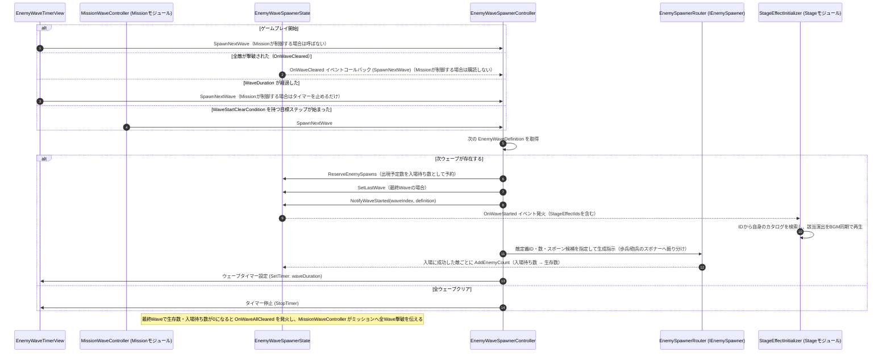

# ③ ウェーブスポナー & Wave開始通知フロー（ウェーブクリア／開始時）

- page_id: 3bf7c2c6-cc02-818e-9975-fa89910dbb43
- Notion パス: Symphony Kill Chord / システム概要 / 敵 / ③ ウェーブスポナー & Wave開始通知フロー（ウェーブクリア／開始時）
- スナップショットの最終更新: 2026-08-17T17:28:15.993Z
- 書き込み許可: 可（システム概要 配下）
- 処置: 本文置き換え
- 確認日 / コミット: 2026-09-22 / origin/develop 73fefeb45

## 判定

- 信頼性: 一部古い — 全滅時の分岐しか描かれていない。実装は「全滅」「`WaveDuration` の経過」「ミッションの目標ステップ」の 3 つの起点で次の Wave を生成し、最初の Wave はゲーム開始時に生成する（`Assets/Scripts/Runtime/4.View/InGame/Enemy/EnemyWaveTimerView.cs`、`3.Adaptor/InGame/Mission/MissionWaveController.cs:78-90`）。生成前の入場待ち数の予約（PR #1721）と、最終 Wave の全滅通知 `OnWaveAllCleared` も無い。スポナーの参加者 `EnemyInfantrySpawner / EnemyArtillerySpawner` は、実際には `IEnemySpawner`（`EnemySpawnerRouter`）を経由する
- 整合性: 仕様概要 / ステージルール / フェーズについて 3497c2c6-cc02-802d-9439-de4cfc3001ab（A1 担当、EN-17）の「殲滅 / 一定時間経過」と一致させた。親ページ 3957c2c6-cc02-80cd-94c0-f412b11ffcf7 の新規子ページ ⑤（死亡処理）と、全滅判定が死亡演出の後になる点を揃えた
- 変更点:
  - 冒頭の説明文: 旧: 「ウェーブ内の全敵が撃破されると次ウェーブが生成され」だけ → 新: 3 つの起点、入場待ち数、ループ、ミッションが Wave 開始を制御する場合を追記した
  - 図: 開始の起点（ゲーム開始・全滅・時間切れ・目標ステップ）の分岐を追加した。`ReserveEnemySpawns`、`SetLastWave`、入場成功時の `AddEnemyCount` を追加した。スポナーを `EnemySpawnerRouter` 経由に直した
- 織り込んだ反映項目: EN-17（③フローへの時間切れ分岐）, EN-16（全滅判定のタイミング）, EN-25（`ReserveEnemySpawns`）
- 出典: 実装（`3.Adaptor/InGame/Enemy/EnemyWaveSpawnerController.cs`、`EnemyWaveSpawnerState.cs:61-79`、`4.View/InGame/Enemy/EnemyWaveTimerView.cs`、`1.Domain/InGame/Enemy/EnemyWaves.cs`、`3.Adaptor/InGame/Mission/MissionWaveController.cs`、`6.Composition/InGame/Enemy/EnemyInitializer.cs:193-217`、`6.Composition/InGame/Stage/StageEffectInitializer.cs`）、PR #1721
- 要確認: なし（同時に存在できる敵数に上限が無いことを許容するかは仕様概要側の要確認）

## 適用する本文

次のWaveは、ウェーブ内の全敵の撃破、`WaveDuration`（秒）の経過、ミッションの目標ステップのいずれかを起点に生成され、Wave開始が他モジュールへ通知される。最初のWaveはゲームプレイ開始時（`EnemyWaveTimerView.StartGameplay`）に生成する。時間切れで進んだ場合、前のWaveの残りと重なって出現する。Wave列にループが設定されていれば、最後まで進んだあとループ開始位置へ戻る。

生成を始める前に、そのWaveの出現予定数を「入場待ち数」として予約し、敵が入場を終えるたびに生存数へ移す。全滅は生存数と入場待ち数がともに0になったときだけ成立する。生存数が減るのは敵の死亡演出が終わってからである（⑤）。

ミッションの目標シーケンスに`WaveStartClearCondition`を持つステップがある場合は、全滅と時間切れによる自動生成を止め、`MissionWaveController`が該当ステップの開始時に次のWaveを生成する。

