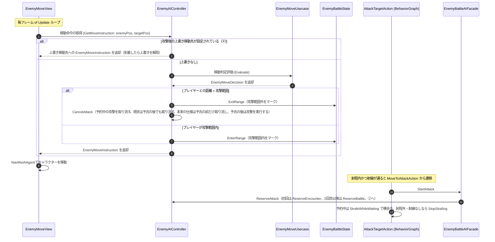

# ① AI 移動制御フロー（毎フレーム）

- page_id: 3bf7c2c6-cc02-8193-b6cf-cfd3ff3cb46f
- Notion パス: Symphony Kill Chord / システム概要 / 敵 / ① AI 移動制御フロー（毎フレーム）
- スナップショットの最終更新: 2026-09-09T03:32:23.108Z
- 書き込み許可: 可（システム概要 配下）
- 処置: 本文置き換え
- 確認日 / コミット: 2026-09-22 / origin/develop 73fefeb45

## 判定

- 信頼性: 一部古い — 図の参加者 `EnemyView (MonoBehaviour)` は存在しない（毎フレーム `GetMoveInstruction` を呼ぶのは `EnemyMoveView`、`Assets/Scripts/Runtime/4.View/InGame/Enemy/EnemyMoveView.cs:173`）。`GetMoveInstruction` の中で攻撃を予約する記述も実装と違う。予約は BehaviorGraph の `AttackTargetAction` が `EnemyBattleAIFacade.StartAttack` 経由で行う（`BehaviorGraphNode/Action/AttackTargetAction.cs:33-34`、`AIFacade/EnemyBattleAIFacade.cs`）。攻撃範囲を出たときの予約取り消し（PR #1592）、攻撃後の上書き移動先の優先（`EnemyAIController.cs` の `GetMoveInstruction` 冒頭）、横歩き（PR #1740）、戦闘 AI の一括停止（PR #1393）が入っていない
- 整合性: 親ページ 3957c2c6-cc02-80cd-94c0-f412b11ffcf7 のクラス表と合わせた。仕様概要 / 敵 / 敵の行動アルゴリズム 33a7c2c6-cc02-8055-bd1c-ed5ce324bd7b（A1 担当）の「射程外に出ても攻撃する」旧記述とは逆で、実装は取り消す
- 決定（2026-09-22 八幡）: No.16 攻撃の予兆表示が出た後は、プレイヤーが射程外に出ても攻撃を実行する。予兆の前に射程外になった場合は攻撃しない。図の「プレイヤーとの距離 > 攻撃範囲」の分岐に、現状（取り消す）と本来の仕様を併記した
- 実装の修正が必要: No.16 予兆表示（`On2BeatBefore`）の後は射程外に出ても予約を取り消さない（根拠 `Assets/Scripts/Runtime/3.Adaptor/InGame/Enemy/EnemyAIController.cs:132-140`、PR #1592）
- 決定（2026-09-22 八幡）: R17 発見状態のシステムを無効にし、常に発見状態に固定する（モジュールは残す）。冒頭の説明文の索敵ゲートの段落に、現状であることと本来の仕様を書いた
- 実装の修正が必要: R17 索敵ゲートを無効にして常に発見状態にする（Issue #2051、根拠 `Assets/Scripts/Runtime/4.View/InGame/Enemy/BehaviorGraphNode/Action/WaitForDiscoveryAction.cs`、`Assets/Scripts/Runtime/4.View/InGame/Enemy/AIFacade/EnemyStateFacade.cs:42,106-113`）
- 変更点:
  - 冒頭の説明文: 既存の索敵ゲートの説明は残し、戦闘 AI の有効判定（`IsBattleAiActivatedCondition`）、攻撃予約の起点、横歩きを追記した
  - 図: 旧: 参加者 `EnemyView (MonoBehaviour)` → 新: `EnemyMoveView`。旧: 「攻撃範囲内 → `ReserveAttack`（攻撃を予約）」 → 新: `GetMoveInstruction` は範囲の出入りを記録するだけで、範囲外へ出たら `CancelAttack` する。予約は BehaviorGraph 側（`AttackTargetAction` → `EnemyBattleAIFacade.StartAttack` → `ReserveAttack`）に分けた。上書き移動先の分岐を追加した
- 織り込んだ反映項目: EN-25（横歩き・戦闘 AI 一括切替・範囲外キャンセル）
- 出典: 実装（`3.Adaptor/InGame/Enemy/EnemyAIController.cs`、`4.View/InGame/Enemy/EnemyMoveView.cs:173`、`BehaviorGraphNode/Action/AttackTargetAction.cs`、`BehaviorGraphNode/Action/MoveToAttackAction.cs:26`、`AIFacade/EnemyBattleAIFacade.cs`、`AIFacade/EnemyMovementAIFacade.cs:39-47`）、PR #1592 / #1740 / #1393
- 要確認: なし

## 適用する本文

敵がプレイヤーを追尾・接近し、攻撃範囲に入った際に攻撃を予約する処理フローである。BehaviorGraph上ではこの移動制御に入る前段に「発見前の索敵ゲート」があり、`WaitForDiscoveryAction`が`EnemyStateFacade.IsDiscovered`を毎フレーム確認する。未発見の間は`IsPlayerDiscoverable`（視野角・索敵距離・視線をすべて満たすか）を判定し、満たせば`Discover()`で発見済みにしてSuccessを返し、満たさなければ`LookAround()`でその場の見回しを続けながらRunningを維持する。発見済みになると`IsDiscoveredCondition`がtrueとなり、下記の移動制御フローへ分岐する。この索敵ゲートは現状の実装である。仕様では敵は常に発見状態とし、発見状態のシステムは無効にして、再利用できる形で残す（Issue #2051）。戦闘AIが無効にされている間（Missionの進入時アクションで切り替わる。`IsBattleAiActivatedCondition`）は攻撃に進まない。

移動は`EnemyMoveView`が毎フレーム`EnemyAIController`から移動指示を受け取って行う。攻撃の予約は移動制御とは別に、BehaviorGraphの`AttackTargetAction`が射程内・射線ありを確かめたうえで行う。予約中は射程内かつ射線が通る間だけ左右へ横歩きし、方向は0.6〜1.4秒ごとに抽選し直す。

