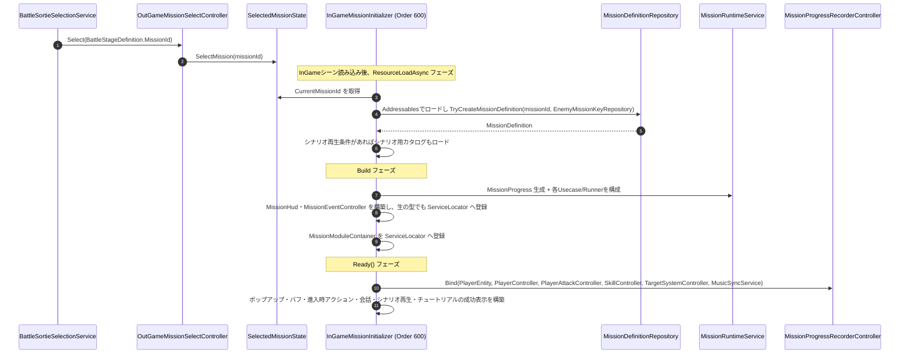

# ① ミッション開始フロー（ステージ読み込み時）

- page_id: 3bf7c2c6-cc02-81cb-9df1-d2491411dc0a
- Notion パス: Symphony Kill Chord / システム概要 / ミッション / ① ミッション開始フロー（ステージ読み込み時）
- スナップショットの最終更新: 2026-08-17T17:31:52.557Z
- 書き込み許可: 可（システム概要 配下）
- 処置: 本文置き換え
- 確認日 / コミット: 2026-09-22 / origin/develop 73fefeb45

## 判定

- 信頼性: 一部古い — 図の `SelectMission(missionDefinitionAsset)` と `CurrentMissionDefinition` は、アセットを直接渡していた頃の記述である。現在は出撃時に `BattleSortieSelectionService` が `BattleStageDefinition.MissionId`（`BattleStageAsset` を `StageBindAsset` がステージツリーへ結び付ける構成）を `OutGameMissionSelectController.Select(MissionId)` に渡し、`SelectedMissionState` は `MissionId` だけを持つ（`Assets/Scripts/Runtime/3.Adaptor/OutGame/StageSelect/BattleSortieSelectionService.cs:35`、`3.Adaptor/InGame/Mission/SelectedMissionState.cs`）。定義は InGame の ResourceLoadAsync フェーズで Addressables の `MissionDefinitionRepository` / `EnemyMissionKeyRepository` から作る（`6.Composition/InGame/Mission/InGameMissionInitializer.cs:54-87`）。Ready フェーズの `Bind` は引数が 6 つになっている（`MissionProgressRecorderController.cs:47-53`）
- 整合性: 親ページ 39e7c2c6-cc02-80d5-ac4e-cd46b87fd375 の Composition 節と合わせた
- 変更点:
  - 冒頭の説明文: 旧: 「アウトゲームで選択したミッションが、インゲーム側で構築される」だけ → 新: 選択は `MissionId` で渡すこと、初期化の 3 フェーズを追記した
  - 図: 旧: `SelectMission(missionDefinitionAsset)` → 新: `BattleSortieSelectionService` → `Select(MissionId)` → `SelectMission(MissionId)`。旧: `CurrentMissionDefinition を取得` → 新: `CurrentMissionId` を取得し、リポジトリから `TryCreateMissionDefinition`。旧: `Bind(PlayerEntity, PlayerAttackController)` → 新: 6 引数。Build フェーズの二重登録と、Ready フェーズで構築する Controller 群を追加した
- 織り込んだ反映項目: EN-24（取得方法・構築物の古い記述）
- 出典: 実装（上記ファイル、`5.InfraStructure/InGame/Mission/MissionDefinitionRepository.cs:57-60`、`6.Composition/Bootstrap/InitializationCoordinator.cs:19`）、PR #1510（Mission リポジトリの Release / Demo 切替）
- 要確認: なし

## 適用する本文

アウトゲームで選択したミッションが、インゲーム側で構築される。アウトゲームからは`MissionId`だけを渡し、ミッション定義はインゲームの初期化でリポジトリから作る。初期化はResourceLoadAsync→Build→Readyのフェーズ順に、全モジュールをOrder順で実行する。

