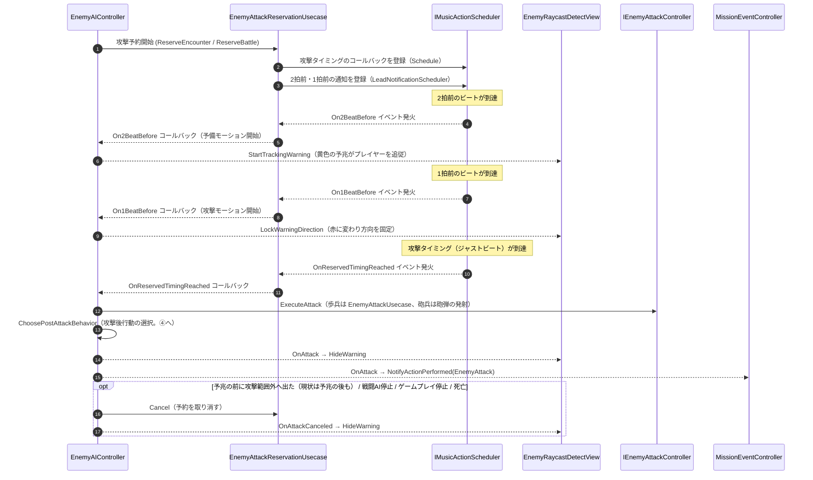

# ② リズム同期攻撃予約フロー（非同期・イベント駆動）

- page_id: 3bf7c2c6-cc02-81df-b1af-ef9310f5693b
- Notion パス: Symphony Kill Chord / システム概要 / 敵 / ② リズム同期攻撃予約フロー（非同期・イベント駆動）
- スナップショットの最終更新: 2026-08-17T17:28:14.762Z
- 書き込み許可: 可（システム概要 配下）
- 処置: 本文置き換え
- 確認日 / コミット: 2026-09-22 / origin/develop 73fefeb45

## 判定

- 信頼性: 一部古い — 3 段階の予約（2 拍前・1 拍前・本番）とイベント名は実装どおり（`Assets/Scripts/Runtime/2.Application/InGame/Enemy/EnemyAttackReservationUsecase.cs:35-37,101-125`）。ただし本番で `EnemyAttackUsecase.Execute` を直接呼ぶ記述は古い。実装は `IEnemyAttackController.ExecuteAttack` を呼び、歩兵は `EnemyAttackUsecase.ExecuteAttack`、砲兵は砲弾の発射へ振り分ける（`EnemyAIController.cs` の `HandleReservedTimingReached`、`EnemyInfantryAttackController.cs:19-25`）。2 拍前・1 拍前の通知は `LeadNotificationScheduler` で登録する。攻撃予兆デカールの表示（`EnemyLifeCycle.cs:198-201`）、攻撃後行動の選択（④）、ミッションへの敵攻撃通知（`EnemyLifeCycle.cs:797-800`）、予約の取り消し経路（PR #1592・#1393）が無い
- 整合性: 親ページ 3957c2c6-cc02-80cd-94c0-f412b11ffcf7 と合わせた。予兆の表示方法（黄→赤、追従→固定）は仕様概要 / 敵 / 敵の行動アルゴリズム 33a7c2c6-cc02-8055-bd1c-ed5ce324bd7b（EN-05、A1 担当）と一致させた
- 変更点:
  - 冒頭の説明文: 予約の起点（`AttackTargetAction`）、初回と 2 回目以降で使う音楽同期アセット、取り消しの条件を追記した
  - 図: 旧: 「`EAI ->> EAttUC: 攻撃判定発動 (Execute)`」 → 新: `IEnemyAttackController.ExecuteAttack` を経由。旧: 「予備モーション開始」「攻撃モーション開始」だけ → 新: `EnemyRaycastDetectView` の予兆デカール（2 拍前に黄色で追従、1 拍前に赤で固定、攻撃で非表示）を追加。攻撃後の `ChoosePostAttackBehavior`（④）とミッション通知、取り消しの分岐を追加した
- 決定（2026-09-22 八幡）: No.15 敵の初回攻撃は 3 拍目が正しい。冒頭の説明文の初回攻撃のタイミングを、仕様（3 拍目）と現状（2 拍目、実装の不具合）の併記に直した。判定の要確認（EN-04）を外した
- 決定（2026-09-22 八幡）: No.16 攻撃の予兆表示が出た後は、プレイヤーが射程外に出ても攻撃を実行する。予兆の前に射程外になった場合は攻撃しない。冒頭の説明文の取り消し条件と、図の取り消しの分岐に、現状と本来の仕様を併記した
- 実装の修正が必要: No.15 初回攻撃を 3 拍目にする（根拠 `Assets/Level/Data/Master/InGame/Battle/ExampleEncountMusicData.asset:17` `_targetBeat: 2`）
- 実装の修正が必要: No.16 予兆表示（`On2BeatBefore`）の後は射程外に出ても予約を取り消さない（根拠 `Assets/Scripts/Runtime/3.Adaptor/InGame/Enemy/EnemyAIController.cs:132-140`、PR #1592）
- 織り込んだ反映項目: EN-25（範囲外での攻撃キャンセル、戦闘 AI 停止時の取り消し）
- 出典: 実装（`2.Application/InGame/Enemy/EnemyAttackReservationUsecase.cs`、`2.Application/InGame/Music/LeadNotificationScheduler.cs`、`3.Adaptor/InGame/Enemy/EnemyAIController.cs`、`3.Adaptor/InGame/Enemy/EnemyInfantryAttackController.cs`、`4.View/InGame/Enemy/EnemyRaycastDetectView.cs:82-106`、`6.Composition/InGame/Enemy/EnemyLifeCycle.cs:198-203,797-800`）、マスターデータ（`Assets/Level/Data/Master/InGame/Battle/ExampleEncountMusicData.asset`: `_barFlag: 1, _timeSignature: 4, _targetBeat: 2`、`ExampleBattleMusicData.asset`: `_barFlag: 2, _timeSignature: 4, _targetBeat: 3`）、PR #1592 / #1393
- 要確認: 予兆デカールを出さない砲兵（`EnemyLifeCycle.cs:196-202` で歩兵だけに接続）で、どの時点を「予兆表示の後」とみなすか（企画）

## 適用する本文

敵の攻撃は「2拍前・1拍前・攻撃本番」と3段階で非同期に予約・実行される。予約はBehaviorGraphの`AttackTargetAction`が`EnemyBattleAIFacade.StartAttack`を通じて`EnemyAIController.ReserveAttack`を呼ぶことで始まる（①）。初回の攻撃は`ReserveEncounter`（`ExampleEncountMusicData.asset`）のタイミングで、次の小節の3拍目に予約する（現状は2拍目。実装の不具合）。2回目以降は`ReserveBattle`（`ExampleBattleMusicData.asset`: 2小節後の4拍子3拍目）のタイミングで予約する。戦闘AIが無効化された場合、ゲームプレイが止まった場合、敵が死亡した場合は、予約を取り消して予兆表示を消す。予兆表示（2拍前）が出た後は、プレイヤーが攻撃範囲を出ても攻撃を実行する。予兆の前に攻撃範囲を出た場合は攻撃しない（現状は、予兆の後でも攻撃範囲を出ると予約を取り消す）。

