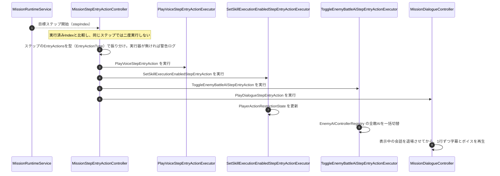

# ⑤ 目標ステップ進入時アクションの実行フロー

- page_id: 3c67c2c6-cc02-8179-a0c0-e067bb5af6b7
- Notion パス: Symphony Kill Chord / システム概要 / ミッション / ⑤ 目標ステップ進入時アクションの実行フロー
- スナップショットの最終更新: 2026-08-24T13:37:20.042Z
- 書き込み許可: 可（システム概要 配下）
- 処置: 本文置き換え
- 確認日 / コミット: 2026-09-22 / origin/develop 73fefeb45

## 判定

- 信頼性: 一部古い — 進入時アクションが 3 種のままで、会話（`PlayDialogueStepEntryAction`、PR #1550）が無い。登録簿の名前 `EnemyBattleAIRegistry` は `EnemyModuleContainer` のプロパティ名で、型は `EnemyAIControllerRegistry`（`Assets/Scripts/Runtime/3.Adaptor/InGame/Enemy/EnemyAIControllerRegistry.cs`）。一度だけ実行する仕組み（実行済み Index との比較）は実装どおり（`3.Adaptor/InGame/Mission/MissionStepEntryActionController.cs:55-85`）
- 整合性: 親ページ 39e7c2c6-cc02-80d5-ac4e-cd46b87fd375 のクラス表と揃えた。仕様概要 / チュートリアル（A4 担当、TU-03）の Triad 会話の表示ルールと同じ内容を、仕組みの側から書いた
- 変更点:
  - 冒頭の説明文: 既存の文は残し、会話の表示ルール（ボイスの終了まで・無音時は `_silentDuration` 秒・ステップ変更で打ち切るかは会話ごとの設定・前の会話は置き換え・ゲーム開始前は保持）と、`PlayVoiceStepEntryAction` は字幕が出ないことを追記した（TU-03, SC-09）
  - 図: 会話の実行器 `MissionDialogueController` を追加した。旧: 「`EnemyBattleAIRegistry` の全敵AIを一括切替」 → 新: `EnemyAIControllerRegistry`。実行器が見つからない場合の警告を追加した
- 織り込んだ反映項目: SC-09, TU-03（表示ルールの仕組み部分）, EN-24（会話アクション・登録簿名）
- 出典: 実装（上記ファイル、`3.Adaptor/InGame/Mission/MissionDialogueController.cs`、`5.InfraStructure/InGame/Mission/MissionDialogueLineAsset.cs:29-30`、`PlayDialogueStepEntryActionAsset.cs:30-38`、`6.Composition/InGame/Mission/InGameMissionInitializer.cs` の `TryInitializeDialogue`）、PR #1550 / #1554 / #1624 / #1862 / #1909
- 要確認: なし（未使用の Triad 台詞の扱いは仕様概要 / チュートリアル側の要確認）

## 適用する本文

目標ステップの達成条件とは別に、そのステップへ入った瞬間に一度だけ起こす副作用を`ObjectiveSequenceStepAsset`へ設定できる。デコレータ条件による副作用（ポップアップ・Wave・バフ）と違い、条件の判定には関与しない。実行器は`InGameMissionInitializer`のReadyフェーズで登録する。会話の実行器（`MissionDialogueController`）は、ミッションのどこかのステップに会話がある場合だけ登録される。対応する実行器が無いアクションは実行されず、警告ログが出る。

会話（`PlayDialogueStepEntryAction`）は、設定した行を順番に再生する。ボイスがあれば再生が終わるまで字幕を表示し、ボイスが無い・失敗したときは行ごとの`_silentDuration`秒（既定3秒）表示する。ステップが進んだときに会話を打ち切るかは会話ごとの設定（`_continueAfterStepChange`）で決まる。新しい会話が始まると前の会話は置き換わり、ゲームプレイが終わると止まる。ゲーム開始前に積まれた会話は、開始まで保持してから再生する。戦闘ポーズ中は一時停止する。`PlayVoiceStepEntryAction`はボイスだけを鳴らし、字幕は出ない。

