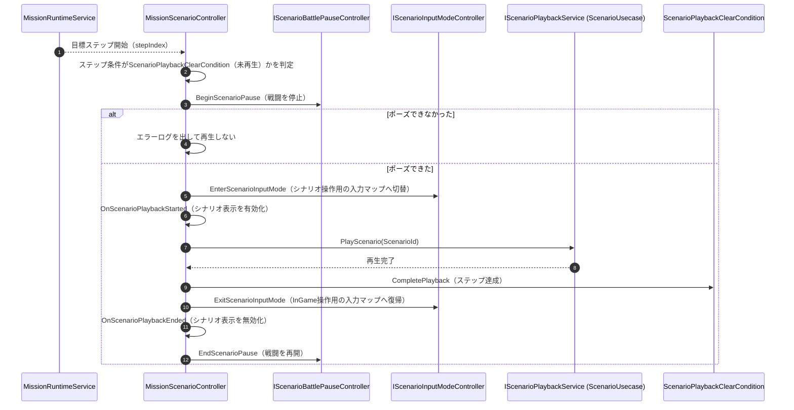

# ⑥ インゲーム中のシナリオ再生フロー

- page_id: 3c67c2c6-cc02-81ef-9ed5-cbaa8c1fcc73
- Notion パス: Symphony Kill Chord / システム概要 / ミッション / ⑥ インゲーム中のシナリオ再生フロー
- スナップショットの最終更新: 2026-08-24T13:37:21.955Z
- 書き込み許可: 可（システム概要 配下）
- 処置: 本文置き換え
- 確認日 / コミット: 2026-09-22 / origin/develop 73fefeb45

## 判定

- 信頼性: 一部古い — 参加者とメソッドは実在する（`Assets/Scripts/Runtime/3.Adaptor/InGame/Mission/MissionScenarioController.cs`、`3.Adaptor/InGame/Sequence/IScenarioBattlePauseController.cs`、`2.Application/OutGame/Scenario/IScenarioPlaybackService.cs`）。ただし終了時の順番が実装と違う。実装は再生完了の直後に `CompletePlayback` を呼び、その後で入力マップを戻して戦闘を再開する（`MissionScenarioController.cs` の `PlayScenarioAsync`）。ポーズに失敗したら再生しない分岐、シナリオ表示の有効化（`OnScenarioPlaybackStarted` / `Ended`）、シナリオ用アセットをミッションが必要とするときだけ読み込むことが書かれていない
- 整合性: 親ページ 39e7c2c6-cc02-80d5-ac4e-cd46b87fd375 の依存関係（Sequence・Input・OutGame/Scenario）と揃えた。システム概要 / シークエンス / ④ 戦闘ポーズフロー 3c67c2c6-cc02-81f3-b9fa-c1775a59771d（同じ領域の別原稿）のシナリオポーズと同じ `BeginScenarioPause` / `EndScenarioPause` を使う
- 変更点:
  - 冒頭の説明文: 既存の文は残し、シナリオ用アセットの読み込み条件、ポーズ失敗時の扱い、1 ステップにつき 1 回だけ再生することを追記した
  - 図: 旧: 入力復帰 → 戦闘再開 → `CompletePlayback` → 新: `CompletePlayback` → 入力復帰 → 戦闘再開。`BeginScenarioPause` の失敗分岐と、シナリオ表示の有効・無効を追加した。参加者 `ScenarioUsecase` を、契約名 `IScenarioPlaybackService`（実装は `ScenarioUsecase`）に直した
- 織り込んだ反映項目: EN-24（古い記述の修正）
- 出典: 実装（上記ファイル、`3.Adaptor/InGame/Sequence/BattlePauseController.cs:8`、`6.Composition/InGame/Mission/InGameMissionInitializer.cs` の `RequiresScenarioPlayback` / `TryBuildScenarioPlayback` / `TryInitializeMissionScenarioController`、`InGameScenarioInputModeController.cs`）
- 要確認: なし

## 適用する本文

`ScenarioPlaybackClearCondition`を持つステップでは、戦闘を止めてシナリオを再生し、再生完了をもってステップを達成させる。シナリオ再生そのものはScenarioモジュールの実装を流用し、Mission側は起動と復帰だけを担う。シナリオ表示に必要な背景・アニメーション・立ち絵・シナリオ設定のカタログは、この条件を持つミッションのときだけ読み込む。同じステップで再生するのは1回だけで、再生済みの条件は再生しない。戦闘のポーズに失敗した場合はシナリオを始めない。

