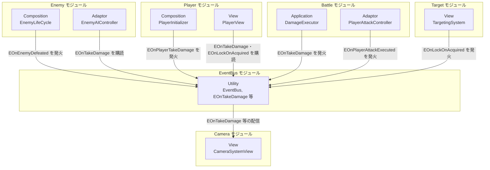

# EventBus

- page_id: 3d67c2c6-cc02-816d-bc9d-d0a44b549c00
- Notion パス: Symphony Kill Chord / システム概要 / EventBus
- スナップショットの最終更新: 2026-09-09T04:38:21.225Z
- 書き込み許可: 可
- 処置: 本文置き換え（既存の節構成のまま、クラス表・結合図・依存されているものを更新）
- 確認日 / コミット: 2026-09-22 / 73fefeb45

## 判定

- 信頼性: 一部古い — 2026-09-09 以降にイベント 1 種と利用箇所が増えた。`EOnLockOnAcquired`（`0.Utility/Persistent/EOnLockOnAcquired.cs`、79dee834c で追加）、`EOnTakeDamage.IsJustHit`（c58a15b0a 2026-09-04。ページ作成時点で既にあったが漏れていた）、`TutorialSkillFeedbackPresenter` と `AIDebugCombatRecorder`（b756291d2 2026-09-18 で追加）。基盤本体（`EventBus.cs` / `EventBusResetRegistry.cs`）は記述どおり
- 整合性:
  - 実装との矛盾: 「依存されているもの > InGame/Player」の PlayerView の購読目的が「被弾時の演出フィードバック」になっているが、実装は**プレイヤーの攻撃が敵に命中した時の Hit SE** である（`PlayerView.cs:860-894`。自分が被弾した通知は無視する）
  - 他ページとの矛盾: なし。リポジトリ側 `Assets/Docs/ScriptsDocs/Modules/NotionModuleDocs/EventBus.md`（2026-09-09）と Notion は同内容（リポジトリ側はフローを本文に持つだけの差）。Notion の方が新しいか同等なので Notion を基に更新した
  - DB のカテゴリー（インゲーム）と本文の「カテゴリ」（Utility / Persistent（横断基盤））が食い違う
- 変更点:
  - 「概要」のコールアウト: 通知の種類に「ロックオン成立」を追加
  - 「概要」の表: 最終更新日 旧: 2026-09-09 → 新: 2026-09-22
  - 「🏗️ クラス」: `EOnTakeDamage` の役割に「ジャスト判定の有無」を追加。`EOnLockOnAcquired` の行を追加。表の下に「`Clear()` は現在どこからも呼ばれていない」を追加
  - 「🔗 モジュール結合」の図: Target モジュール（`TargetingSystem` が `EOnLockOnAcquired` を発火）と、PlayerView の `EOnLockOnAcquired` 購読を追加
  - 「📤 依存されているもの」: 旧: PlayerView は「被弾時の演出フィードバック」 → 新: 敵への命中時の Hit SE と、ロックオン成立時の SE。`InGame/Target`（TargetingSystem）、`InGame/Mission`（TutorialSkillFeedbackPresenter）、`Editor/AIDebugPlay`（AIDebugCombatRecorder）を追加。Enemy の EnemyHealthHudPresenter に「ジャスト判定でダメージ数値の表示種類を変える」を追加。Camera の購読数「5種類すべて」→「ロックオン成立を除く 5 種類」
  - 「⑥ Composition」: 自動リンク化されていた `[疑問点.md](http://疑問点.md)`（リンク先は無効）を文字だけに戻した
  - クラス名の装飾を `**X**` をコードで囲む形から、NotionDocsRules の `**` + コード の形に揃えた（表示は同じ）
- 織り込んだ反映項目: IF-06
- 出典: `EventBus.cs`、`EventBusResetRegistry.cs`、`EOnTakeDamage.cs:14`、`EOnLockOnAcquired.cs`、`TargetingSystem.cs:276-284`、`PlayerView.cs:180-181,230-231,860-904`、`EnemyHealthHudPresenter.cs:105-114`、`TutorialSkillFeedbackPresenter.cs:21-43`（生成は `InGameMissionInitializer.cs:377`）、`AIDebugCombatRecorder.cs:22-26,63-65`、`git grep "EventBus<"` の全件
- 要確認:
  - DB のカテゴリーを本文（Utility / 横断基盤）に合わせて変えるか（IF-06 は「開発用など」と提案）。システムリスト DB の選択肢に何があるかを含め、ドキュメント管理者に確認

## 適用する本文

---

## 概要
> 💡 **モジュール概要**
> 戦闘中の演出通知（被弾・撃破・攻撃実行・スキル発動・ロックオン成立）を、発生元と購読先を疎結合にしたまま伝搬させる、横断的な静的イベントバス基盤である。特定のモジュールに属さず、`0.Utility` 配下からInGameの多数のモジュールに利用される。

| 項目 | 内容 |
|---|---|
| **モジュール名** | EventBus |
| **カテゴリ** | Utility / Persistent（横断基盤） |
| **ステータス** | 実装済み |
| **最終更新日** | 2026-09-22 |

---

### 🏗️ クラス

| クラス名 | レイヤー | 役割・機能 |
|---|---|---|
| **`EventBus<T>`** | Utility（横断） | `T`（`IEvent`制約）ごとに独立した静的購読リストを持ち、`Register` / `Unregister` / `Raise` / `Clear` を提供するジェネリック静的クラス |
| **`IEvent`** | Utility（横断） | イベント構造体に付与する、中身のないマーカーインターフェース |
| **`EventBusResetRegistry`** | Utility（横断） | 各`EventBus<T>`の静的コンストラクタから登録されたリセット処理を、`RuntimeInitializeOnLoadMethod`でまとめて呼び出す非ジェネリックな受け皿 |
| **`EOnTakeDamage`** | Utility（イベント定義） | 被弾通知（ダメージ量・クリティカル有無・ジャスト判定の有無・被弾者ID・攻撃種別）。発火元は攻撃処理側のみのため、実質的に敵側の被弾通知として使われる |
| **`EOnPlayerTakeDamage`** | Utility（イベント定義） | プレイヤー被弾時の演出通知（ダメージ量）。HP減少時のみ発火し、回復・無敵回避時は発火しない |
| **`EOnEnemyDefeated`** | Utility（イベント定義） | 敵撃破通知（撃破された敵のID）。通常敵・ボスの双方で死亡確定時に発火する |
| **`EOnPlayerAttackExecuted`** | Utility（イベント定義） | プレイヤー攻撃実行通知。中身なし。命中の有無に関わらず攻撃成立時点で発火する |
| **`EOnSkillExecuted`** | Utility（イベント定義） | スキル発動通知（発動したスキルのID）。対象の有無は問わない |
| **`EOnLockOnAcquired`** | Utility（イベント定義） | ロックオン成立通知。中身なし。未ロックオン状態からの新規捕捉と、ロックオン中に別の敵へ切り替わった時の両方で発火する |
| **`DamageAttackType`** | Utility（イベント定義） | ダメージの発生要因を表すEnum（`Normal` / `Skill` / `Infection`） |

`EventBus<T>`本体は `Assets/Scripts/Runtime/0.Utility/Persistent/EventBus.cs`、リセット機構は同フォルダの `EventBusResetRegistry.cs` にある。イベント定義構造体（`EOn~`）も同じ `0.Utility/Persistent/` に配置されている。
`Clear()` は現在どこからも呼ばれていない。

---

### 🔗 モジュール結合
EventBusは特定モジュールへの依存を持たない横断基盤であり、多数のモジュールから一方的に参照される。代表的な利用元として、Enemy・Player・Camera・Battle・Targetの5モジュールを図示する（全利用箇所は「依存されているもの」を参照）。

#### 📥 依存しているもの

- なし
  - *詳細*: `EventBus<T>`・`IEvent`・イベント定義構造体は、いずれも他モジュールの型を参照しない。Unity標準の`Debug`・`RuntimeInitializeOnLoadMethod`のみに依存する

#### 📤 依存されているもの

- **`InGame/Enemy`（`EnemyLifeCycle`・`EnemyAIController`・`EnemyHealthHudPresenter`）**
  - *参照箇所*: `EventBus<EOnEnemyDefeated>.Raise`（`EnemyLifeCycle.cs`）、`EventBus<EOnTakeDamage>.Register/Unregister`（`EnemyAIController.cs`・`EnemyHealthHudPresenter.cs`）
  - *詳細*: 敵の死亡確定時に撃破通知を発火し、被弾時のAI反応・HUD更新のために被弾通知を購読する。`EnemyHealthHudPresenter`は、ジャスト判定の有無（`IsJustHit`）でダメージ数値の表示種類を切り替える
- **`InGame/Enemy/Boss`（`BossLifeCycle`・`BossAIController`）**
  - *参照箇所*: `EventBus<EOnEnemyDefeated>.Raise`（`BossLifeCycle.cs`）、`EventBus<EOnTakeDamage>.Register/Unregister`（`BossAIController.cs`）
  - *詳細*: 通常敵と同じ仕組みをボス側でも利用する
- **`InGame/Battle`（`DamageExecutor`・`PlayerAttackController`）**
  - *参照箇所*: `EventBus<EOnTakeDamage>.Raise`（`DamageExecutor.cs`）、`EventBus<EOnPlayerAttackExecuted>.Raise`（`PlayerAttackController.cs`）
  - *詳細*: ダメージ確定処理・プレイヤー攻撃確定処理の末尾で、演出用にイベントを発火する発火元となっている
- **`InGame/Skill`（`SkillExecutionController`・`CriticalBranchSkillEffectPresentation`）**
  - *参照箇所*: `EventBus<EOnSkillExecuted>.Raise`（`SkillExecutionController.cs`）、`EventBus<EOnTakeDamage>.Register/Unregister`（`CriticalBranchSkillEffectPresentation.cs`）
  - *詳細*: スキル発動を通知し、クリティカル演出は再生ウィンドウ中だけ被弾通知を一時購読して分岐判定に使う
- **`InGame/Camera`（`CameraSystemView`）**
  - *参照箇所*: `EventBus<EOnTakeDamage>.Register`、`EventBus<EOnEnemyDefeated>.Register`、`EventBus<EOnPlayerAttackExecuted>.Register`、`EventBus<EOnPlayerTakeDamage>.Register`、`EventBus<EOnSkillExecuted>.Register`
  - *詳細*: `EOnLockOnAcquired`を除く5種類のイベントを購読し、オートロックオンの向け直しやカメラシェイクなどの演出トリガーに使う
- **`InGame/Player`（`PlayerInitializer`・`PlayerView`）**
  - *参照箇所*: `EventBus<EOnPlayerTakeDamage>.Raise`（`PlayerInitializer.cs`）、`EventBus<EOnTakeDamage>.Register/Unregister`・`EventBus<EOnLockOnAcquired>.Register/Unregister`（`PlayerView.cs`）
  - *詳細*: プレイヤーのHP変化を演出用イベントへ変換して発火する。`PlayerView`は、プレイヤーの攻撃が敵に命中した時のHit SE（クリティカル時は専用SE）と、ロックオン成立時のSEを再生するために購読する。自分自身が被弾した通知は無視し、Hit SEは1フレームに1回だけ再生する
- **`InGame/Target`（`TargetingSystem`）**
  - *参照箇所*: `EventBus<EOnLockOnAcquired>.Raise`（`TargetingSystem.cs`）
  - *詳細*: ロックオン対象が新しい敵に切り替わった時に発火する
- **`InGame/Mission`（`TutorialSkillFeedbackPresenter`）**
  - *参照箇所*: `EventBus<EOnSkillExecuted>.Register/Unregister`（`TutorialSkillFeedbackPresenter.cs`）
  - *詳細*: チュートリアルステージのスキル課題中に、実際に成立したスキル発動だけ成功表示を出すために購読する。`InGameMissionInitializer`が生成し、`Dispose`で解除する
- **`Editor/AIDebugPlay`（`AIDebugCombatRecorder`）**
  - *参照箇所*: `EventBus<EOnSkillExecuted>`・`EventBus<EOnTakeDamage>`・`EventBus<EOnPlayerTakeDamage>`の`Register/Unregister`（`AIDebugCombatRecorder.cs`）
  - *詳細*: エディタ専用。AIデバッグプレイで戦闘イベントを記録するために購読する

---

## 詳細

### 🧅レイヤー情報
> 0.Utility横断基盤のため通常の6層構造に対応しない。EventBus自体は特定レイヤーの責務（入力・演出・永続化等）を持たず、モジュール間の通知経路そのものを提供する存在である。以下では便宜上、各層に相当する要素の有無を記す。

#### ① Domain
当モジュールでは使用していない。イベント定義構造体（`EOnTakeDamage`等）はドメインモデルではなく、モジュール間の通知用DTOという位置づけである。

#### ② Application
当モジュールでは使用していない。

#### ③ Adaptor
当モジュールでは使用していない。

#### ④ View
当モジュールでは使用していない。

#### ⑤ Infrastructure
当モジュールでは使用していない。

#### ⑥ Composition
当モジュールにComposition層のクラスは存在しない。`EventBus<T>`は静的クラスであり、`ServiceLocator`への登録やInitializerによる明示的な初期化を必要とせず、利用側コードが直接`EventBus<T>.Register`等を呼び出すことで結合する。
`EventBusResetRegistry.ResetAll()`は`[RuntimeInitializeOnLoadMethod(RuntimeInitializeLoadType.SubsystemRegistration)]`により、ゲーム起動時、およびUnity Editor上でPlay Modeへ入った際に一度だけ実行され、その時点までに静的コンストラクタを通じて登録済みの全`EventBus<T>`の購読リストを`null`へ戻す。これは「7月β大改修リファクタリング/疑問点.md」で指摘されている、静的イベントの解除漏れによるライフサイクル・メモリリーク問題への対策として導入されたものである。ただし`SubsystemRegistration`はプレイセッションの開始時に一度だけ発火するタイミングであり、**同一プレイセッション内でのシーン再読み込み（ステージ再挑戦・タイトルへ戻ってから再度インゲームへ入る、等）ではリセットされない**。そのため、上記の依存されているものの一覧にある各利用箇所が`OnDisable`/`OnDestroy`/`Deactivate`等で確実に`Unregister`を呼ぶことが前提の設計になっており、これを怠ると、破棄済みオブジェクトへの参照が静的購読リストに残り続けるメモリリークや、`Raise`時に破棄済みオブジェクトのハンドラを呼び出してしまう`MissingReferenceException`を引き起こす。実際、`EnemyAIController`は`Deactivate()`と`Dispose()`の両方で`Unregister`を呼んでおり、片方の呼び出し漏れに備えた二重解除の形になっている。

### 🔌 拡張ポイント

| 拡張したいこと | 実装する場所 | 追加登録の要否 |
|---|---|---|
| 新しいイベント型を追加したい | `IEvent`を実装した`readonly struct`を`0.Utility/Persistent/`配下に追加する（例: `EOnNewEvent`） | 不要（`EventBus<T>`はジェネリックであり、新しい`T`を指定した時点で`EventBus<EOnNewEvent>`という新しい静的クラスがJITにより自動生成される。`EventBusResetRegistry`への登録も、初回アクセス時に静的コンストラクタが自動的に行うため手動登録は不要） |
| イベントを発火したい | 発火元のコードから`EventBus<T>.Raise(new T(...))`を呼び出す | 不要（呼び出すだけでよい） |
| イベントを購読したい | 購読側のコードで`EventBus<T>.Register(handler)`を呼び、対応する破棄タイミング（`OnDestroy`・`OnDisable`・`Deactivate`等）で必ず`EventBus<T>.Unregister(handler)`を呼ぶ | 必要（`Unregister`を怠ると上記のメモリリーク・例外リスクにつながるため、実質的に対の実装が必須） |

### 🔄処理フロー
主要な処理フローを、①購読登録、②発火から複数リスナーへの配信、③シーンロード時のリスナー解除、の3つに分けて記述する。

- 📄 ① イベント購読の登録タイミング（既存の子ページへのリンクを残す）
- 📄 ② イベント発火から複数リスナーへの配信（既存の子ページへのリンクを残す）
- 📄 ③ シーンロード時のリスナー解除（プレイセッション開始時）（既存の子ページへのリンクを残す）
