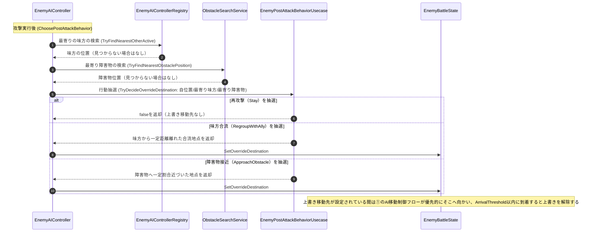

# ④ 攻撃後行動選択フロー（攻撃実行直後）

- page_id: 3d67c2c6-cc02-816f-830b-dc4ee6f3e1df
- Notion パス: Symphony Kill Chord / システム概要 / 敵 / ④ 攻撃後行動選択フロー（攻撃実行直後）
- スナップショットの最終更新: 2026-09-09T03:32:49.266Z
- 書き込み許可: 可（システム概要 配下）
- 処置: 本文置き換え
- 確認日 / コミット: 2026-09-22 / origin/develop 73fefeb45

## 判定

- 信頼性: 最新（ほぼ） — 抽選の 3 分岐・メソッド名は実装どおり（`Assets/Scripts/Runtime/3.Adaptor/InGame/Enemy/EnemyAIController.cs` の `ChoosePostAttackBehavior`、`2.Application/InGame/Enemy/EnemyPostAttackBehaviorUsecase.cs`、PR #1496）。最寄りの味方を `EnemyAIControllerRegistry.TryFindNearestOtherActive` で探す手順が図に無い。上書き移動先を解除する条件（到着）も書かれていない
- 整合性: 仕様概要 / 敵 / 敵の行動アルゴリズム 33a7c2c6-cc02-8055-bd1c-ed5ce324bd7b（EN-09、A1 担当）の攻撃後行動と矛盾しない
- 変更点:
  - 図: 最寄りの味方の検索（`EnemyAIControllerRegistry.TryFindNearestOtherActive`）を追加した。旧: 「上書き移動先が設定されている間は①のAI移動制御フローが優先的にそこへ向かう」 → 新: 到着（`ArrivalThreshold` 以内）で上書きを解除することを追記した
- 織り込んだ反映項目: EN-25（登録簿）
- 出典: 実装（`3.Adaptor/InGame/Enemy/EnemyAIController.cs`、`EnemyAIControllerRegistry.cs:74`、`2.Application/InGame/Enemy/EnemyPostAttackBehaviorUsecase.cs`、`1.Domain/InGame/Enemy/EnemyPostAttackBehaviorSpec.cs:58-70`）、PR #1496
- 要確認: なし

## 適用する本文

攻撃が終わった直後、次にどう動くかを重み抽選で決め、必要なら移動先を上書きする。

