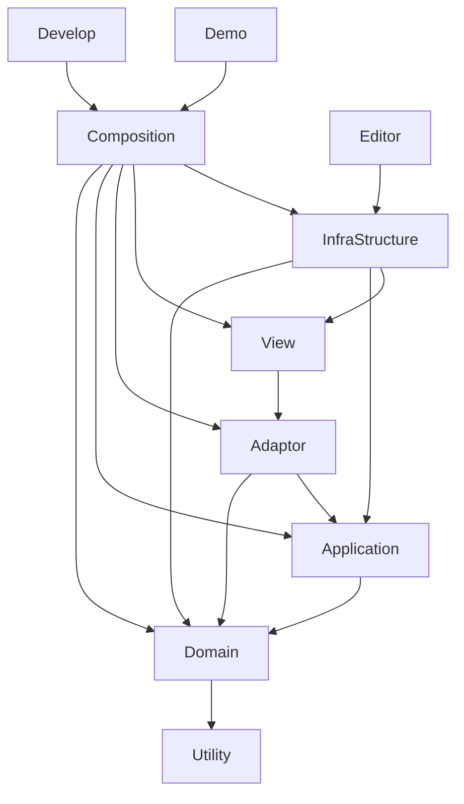
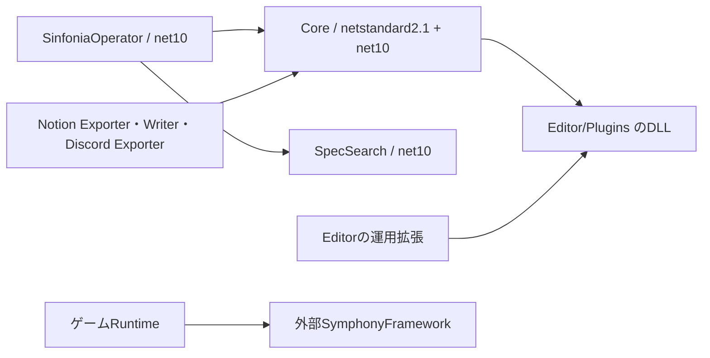

# コード・アーキテクチャ設計 設計レビュー（2026-10-01, Codex）

## 要約

全体評価は **C（A〜Eの5段階）**。レイヤー分割、型付きID、段階的初期化は機能しているが、機能モジュール境界と回帰検証が追いついていない。
Runtime 1,284 C#ファイルに対し、Domain／Applicationの機能間直接依存、肥大化したComposition、静的保存APIへの依存が残る。
過去監査のAdaptor内ServiceLocator参照とCameraの購読解除順は改善した。一方、StageSelectInitializerは過去記録945行から現在2,015行へ拡大している。
SourceDataProvider／DataID／Addressablesの編集支援は充実しているが、ID全件検証と保存互換性を出荷条件にする仕組みが弱い。
まず開発機能の製品混入防止、データ検証、最小限の自動回帰テストを優先する。全面的なDIコンテナ導入や全モジュールasmdef化は急がない。
静的設計の8観点平均は **61.25/100**、設計思想への準拠率は後述のチェック方式で **65%**。動作合格率・コード網羅率ではない。

## 現状の構造

### 調査条件・根拠の読み方

- 表題の日付は指定されたレビュー基準日。実際のファイル確認日は2026-10-02。
- Git操作、Unity起動、コンパイル、テスト実行、外部サービスへの更新は行っていない。
- 出力は指定された本ファイルのみ。通常のDocs/agent配置・コミット規則より、今回の明示的制約を優先した。
- 正本として `Assets/Scripts/DesignPhilosophy.md` と `Assets/Scripts/CodeGuidelines.md` を全文確認した。
- Notionのトップ階層と「仕様書 ガイド」「仕様概要」「システム概要」「ワークフロー」を入口に、初期化、SourceDataProvider、Demo、AutoBuilder、SinfoniaOperatorの技術ページを参照した。
- 全対象のC#／asmdefを列挙・文字列走査し、主要経路は型、継承、コンストラクタ、呼出し、イベント、SerializeFieldまで追跡した。
- すべてのメソッド・全シーンの参照を手動で精査したわけではない。未読の実装を「問題なし」とは判定しない。
- 名前だけの型参照抽出にはプロパティ名との誤結合がある。循環は候補から実コードで再確認できたものだけを確定例にした。
- 略記 `R/` は `Assets/Scripts/Runtime/`、`E/` は `Assets/Editor/`、`N/` は `Docs/NotionSpecifications/Symphony Kill Chord/`。
- `RA/` は `Docs/RuntimeAudit/`、`JUL/` は `Docs/agent/analysis/omnipotens/2026-07-18_symphony-kill-chord/spec/`。
- 行番号は現在のローカルファイル。旧監査の行番号・件数は、その文書の記録として区別する。
- GitHubのruntime-audit Issue一覧を読み取りで取得しようとしたが、接続プロキシの拒否で失敗した。既存Issueとの完全な重複排除は未完了。

### フォルダ・レイヤー一覧

C#数はファイル数であり、公開クラス数や実行可能な型数ではない。コメントのみのファイルも含む。

| Layer／領域 | C#数 | Classesの代表・役割 | 評価 |
|---|---:|---|---|
| Runtime/0.Utility | 26 | DataID、DataIDHasher、DevLog、RingBuffer | 共通機構。7層目に相当する補助層 |
| Runtime/1.Domain | 239 | CharacterEntity、AttackDefinition、SkillId、StageId | データ・不変条件。機能間参照あり |
| Runtime/2.Application | 149 | MusicSyncService、SkillUseCase、StageProgressSaveDataService | 処理本体。保存基盤への直接依存あり |
| Runtime/3.Adaptor | 288 | PlayerAttackPresenter、SkillCrosshairProgressController | Port・DTO・状態仲介 |
| Runtime/4.View | 346 | CameraSystemView、PlayerView、各ViewModel | Unity／UI／音声の実装 |
| Runtime/5.InfraStructure | 121 | SkillRepository、ScriptableObjectRepositoryBase | SO変換、データ取得、Addressables |
| Runtime/6.Composition | 115 | Initializer、Container、Coordinator、Spawner | DIに加えUI動作・生成処理も保持 |
| Demo | 13 | DemoRuntimeBootstrap、DemoSessionState、終了画面 | KILLCHORD_DEMOでアセンブリ単位に限定 |
| Develop | 14 | DevelopSkillUnlockInitializer、RingBufferTest | 開発補助。アセンブリ除外条件なし |
| SymphonyFrameWork | 4 | SceneListEnum、LayersEnum、TagsEnum、AudioGroupTypeEnum | ゲーム側の列挙型。外部基盤本体ではない |
| Assets/Editor | 97 | SourceDataProvider関連、AutoBuilder、AIDebugPlay | Editor asmdefで分離 |
| SinfoniaOperator | 113 | Core、Bot、SpecSearch、Exporter／Writer | 6 csproj。Unity外の運用ツール群 |

`Assets/Scripts/Shaders` の9 C#ファイルは存在を確認したが、今回の指定5領域と分け、シェーダー品質は採点対象にしない。

```text
Assets/Scripts
├─ Runtime
│  ├─ 0.Utility
│  └─ Domain → Application → Adaptor → View
│                  ↖ InfraStructure ↗
│       全層をCompositionが組み立てる
├─ Demo         … 体験版の上位構成・ポリシー
├─ Develop      … 開発用コンポーネント・手動確認コード
└─ SymphonyFrameWork … 自動生成系の列挙型
Assets/Editor   … データ編集・ビルド・QA・運用連携
SinfoniaOperator
├─ Core         … netstandard2.1 / net10.0
├─ Bot          … net10.0
├─ SpecSearch   … net10.0
└─ Exporter / Writer / DiscordLogExporter
Packages        … 外部SymphonyFramework、Unityパッケージ
```

### asmdefが保証する境界

次の矢印は「参照する側 → 参照される側」。Unity・外部ライブラリへの辺は省略した。



- 根拠は `R/0.Utility/KillChord.Utility.asmdef` から `R/6.Composition/KillChord.Composition.asmdef` のreferences。各層はUtilityも参照する。
- InfraStructureのアセンブリ名はファイル名と異なり `KillChord.Structure`。名前の揺れであり、直ちに不正参照とはしない。
- 自前のRuntimeアセンブリ参照には逆向きの循環を認めなかった。外部GUID参照の全推移閉包は未確認。
- ViewがDomainを直接参照できない配置は有効。UnityEngine依存自体は設計思想で許可されている。
- 同一Domainアセンブリ内のBattle→Music等はコンパイラで禁止されない。レイヤー分離と機能モジュール分離は別に評価する。
- `Assets/Scripts/Demo/KillChord.Demo.asmdef` は `KILLCHORD_DEMO` 条件あり。
- `Assets/Scripts/Develop/KillChord.Develop.asmdef` はincludePlatforms・defineConstraintsが空。
- `E/Scripts/KillChord.Editor.asmdef`、`E/AIDebugPlay/KillChord.Editor.AIDebugPlay.asmdef`、`E/ProjectSetup/KillChord.Editor.ProjectSetup.asmdef` はEditor限定。
- Runtime内のEditor専用処理は条件付きのものがある。「RuntimeにEditor機能を置かない」という配置規則と、「Playerに含めない」というビルド条件を混同しない。

### 機能モジュールの依存一覧

下表はRuntime全ファイルのnamespace／usingを集計した**参照宣言グラフ**。
未使用usingを含み得るため、辺数を欠陥数にしない。継承・実呼出しで確認した違反は後段のC01と循環表に限定する。
同じ機能のDomain〜Compositionを統合し、InGame／OutGame／Persistentは直下の機能名単位に集約した。
`I/`＝InGame、`O/`＝OutGame、`P/`＝Persistent、`U/`＝Utility。Playerは旧配置のPlayer配下をまとめる。
ルート直下の型はInGame／OutGame／Persistent／Rootとして別に残した。自モジュールへの辺は省略した。
集計根拠は `R/**.cs` の `namespace KillChord.Runtime.*` と、その中で定義されている名前空間へのusing。

| Module | C#数 | Depends On | Referenced By |
|---|---:|---|---|
| Addressables | 1 | — | I/Enemy, I/Mission, I/Player, I/Skill, I/UI, O/Audio, O/Scenario, O/Screen, O/SkillBuild, O/SkillTree, O/StageSelect, O/Title, P/Savedata, P/Session |
| Bootstrap | 2 | — | I/Bootstrap, O/Bootstrap, P/Bootstrap |
| Csv | 1 | — | O/Scenario, O/Screen |
| I/Animation | 4 | — | I/Enemy, I/Player, Root |
| I/Battle | 45 | I/Character, I/Music, I/Skill, I/StatusEffect, I/Target, P/Input, Persistent, U/Diagnostics | I/Buff, I/Character, I/Enemy, I/Haptics, I/Mission, I/Music, I/Player, I/PostEffect, I/Skill, I/SkillEffect, I/StatusEffect, I/Target, I/UI, O/SkillTree, Player |
| I/Bootstrap | 6 | Bootstrap, I/Camera, I/Player, I/StageSelect, P/Bootstrap, P/Input, P/Load, P/Music, P/SceneManagement, U/Collections, U/Constant, U/Diagnostics | I/Camera, I/Enemy, I/Mission, I/Music, I/Player, I/Result, I/Reticle, I/Sequence, I/Skill, I/Stage, I/Target, I/UI |
| I/Buff | 11 | I/Battle, I/Character, I/StatusEffect, I/Target, Persistent, U/Diagnostics | I/Mission, Player |
| I/Camera | 15 | I/Bootstrap, I/Player, I/Target, InGame, P/Environment, P/Input, Persistent, U/Collections | I/Bootstrap, I/Player |
| I/Character | 31 | I/Battle, I/Music, I/StatusEffect, P/Music, Repository, U/Identity | I/Battle, I/Buff, I/Enemy, I/Mission, I/Player, I/Skill, I/SkillEffect, I/Stage, I/Target, I/UI, O/SkillTree, Player |
| I/Combo | 1 | — | I/Mission |
| I/Enemy | 140 | Addressables, I/Animation, I/Battle, I/Bootstrap, I/Character, I/Mission, I/Music, I/Player, I/Sequence, I/Stage, I/StageSelect, I/Target, I/UI, P/Music, Persistent, Repository, Root, U/Constant, U/Diagnostics, U/Identity, U/Rendering | I/Mission, I/Stage, O/StageSelect, O/Title, P/Session |
| I/Haptics | 4 | I/Battle, P/Environment | I/UI |
| I/Mission | 139 | Addressables, I/Battle, I/Bootstrap, I/Buff, I/Character, I/Combo, I/Enemy, I/Music, I/Player, I/Sequence, I/Skill, I/StageSelect, I/StatusEffect, I/Target, O/Scenario, P/Input, P/Localization, P/Music, P/Voice, Persistent, Repository, Root, U/Identity | I/Enemy, I/Music, I/Player, I/Result, I/Sequence, I/Skill, I/UI, O/Sortie, O/StageSelect, P/Savedata, P/SceneManagement, P/Session |
| I/Music | 41 | I/Battle, I/Bootstrap, I/Mission, I/PostEffect, I/Sequence, I/StageSelect, I/Target, O/SkillBuild, P/Environment, P/Music, U/Collections, U/Constant, U/Diagnostics, U/Identity | I/Battle, I/Character, I/Enemy, I/Mission, I/Player, I/PostEffect, I/Skill, I/Stage, I/UI, O/Skill, O/SkillBuild, O/SkillTree, P/Music, Player, Root |
| I/Player | 29 | Addressables, I/Animation, I/Battle, I/Bootstrap, I/Camera, I/Character, I/Mission, I/Music, I/Sequence, I/Skill, I/Target, I/UI, O/SkillTree, P/Camera, P/Input, P/Music, P/Voice, Persistent, Root, U/Collections, U/Diagnostics, U/Identity | I/Bootstrap, I/Camera, I/Enemy, I/Mission, I/Sequence, I/Skill, I/UI, Root |
| I/PostEffect | 6 | I/Battle, I/Music | I/Music, I/UI |
| I/Result | 16 | I/Bootstrap, I/Mission, I/StageSelect, P/SceneManagement, Root | I/Sequence, I/UI, Root |
| I/Reticle | 7 | I/Bootstrap, I/Target, U/Collections | — |
| I/Sequence | 23 | I/Bootstrap, I/Mission, I/Player, I/Result, I/StageSelect, O/StageSelect, P/Input, P/Load, P/Music, P/Savedata, P/SceneManagement | I/Enemy, I/Mission, I/Music, I/Player, I/Skill, I/UI |
| I/Skill | 100 | Addressables, I/Battle, I/Bootstrap, I/Character, I/Mission, I/Music, I/Player, I/Sequence, I/StatusEffect, I/Target, I/UI, O/SkillBuild, P/Music, P/PostEffect, Persistent, Player, U/Collections, U/Constant, U/Diagnostics, U/Identity | I/Battle, I/Mission, I/Player, I/UI, O/Skill, O/SkillBuild, O/SkillTree, O/StageSelect, Player, Root |
| I/SkillEffect | 4 | I/Battle, I/Character, I/StatusEffect, I/Target, Persistent, U/Diagnostics | Player |
| I/Stage | 38 | I/Bootstrap, I/Character, I/Enemy, I/Music, U/Identity | I/Enemy |
| I/StageSelect | 1 | O/StageSelect | I/Bootstrap, I/Enemy, I/Mission, I/Music, I/Result, I/Sequence, I/UI, O/Screen, O/Sortie, O/StageSelect, P/SceneManagement, P/Session |
| I/StatusEffect | 18 | I/Battle, U/Diagnostics | I/Battle, I/Buff, I/Character, I/Mission, I/Skill, I/SkillEffect, Player |
| I/Target | 17 | I/Battle, I/Bootstrap, I/Character, Persistent | I/Battle, I/Buff, I/Camera, I/Enemy, I/Mission, I/Music, I/Player, I/Reticle, I/Skill, I/SkillEffect, I/UI, Player |
| I/UI | 36 | Addressables, I/Battle, I/Bootstrap, I/Character, I/Haptics, I/Mission, I/Music, I/Player, I/PostEffect, I/Result, I/Sequence, I/Skill, I/StageSelect, I/Target, P/Environment, P/Input, P/Localization, P/SceneManagement, U/Collections, U/Identity | I/Enemy, I/Player, I/Skill |
| InGame | 1 | — | I/Camera |
| O/Audio | 7 | Addressables, O/Bootstrap, O/Navigation, P/Music, U/Identity | O/Screen, O/SkillBuild |
| O/Bootstrap | 3 | Bootstrap | O/Audio, O/Music, O/Scenario, O/Screen, O/Setting, O/SkillBuild, O/SkillTree, O/Sortie, O/StageSelect, O/Title, O/Tutorial, OutGame |
| O/Common | 4 | O/Navigation | O/Screen, O/Setting, O/SkillBuild, O/SkillTree, O/StageSelect, O/Title |
| O/Music | 1 | O/Bootstrap, P/Music | — |
| O/Navigation | 6 | U/Diagnostics | O/Audio, O/Common, O/Screen, O/Setting, O/SkillBuild, O/SkillTree, O/StageSelect, O/Title, O/Tutorial |
| O/Resource | 7 | Repository, U/Constant, U/Identity | O/Screen, O/SkillBuild, O/SkillTree, O/StageSelect, P/Savedata |
| O/Scenario | 104 | Addressables, Csv, O/Bootstrap, O/Screen, O/Sortie, O/StageSelect, P/Bootstrap, P/Input, P/Load, P/Savedata, P/SceneManagement, U/Collections, U/Constant, U/Diagnostics, U/Identity | I/Mission, O/Sortie, O/StageSelect, O/Title, P/Session |
| O/Screen | 48 | Addressables, Csv, I/StageSelect, O/Audio, O/Bootstrap, O/Common, O/Navigation, O/Resource, O/SkillBuild, O/SkillTree, P/Input, P/Load, P/Localization, P/Savedata, P/SceneManagement, U/Identity | O/Scenario, O/Setting, O/SkillBuild, O/SkillTree, O/Sortie, O/StageSelect, O/Title, O/Tutorial, OutGame, P/SceneManagement |
| O/Setting | 8 | O/Bootstrap, O/Common, O/Navigation, O/Screen, P/Environment, P/Localization, P/Music, Root | — |
| O/Skill | 5 | I/Music, I/Skill, Player | O/SkillBuild, O/SkillTree |
| O/SkillBuild | 25 | Addressables, I/Music, I/Skill, O/Audio, O/Bootstrap, O/Common, O/Navigation, O/Resource, O/Screen, O/Skill, O/SkillTree, P/Localization, P/Savedata, Player, Root, U/Constant, U/Diagnostics, U/Identity | I/Music, I/Skill, O/Screen, P/Savedata, Root |
| O/SkillTree | 57 | Addressables, I/Battle, I/Character, I/Music, I/Skill, O/Bootstrap, O/Common, O/Navigation, O/Resource, O/Screen, O/Skill, OutGame, P/Load, P/Localization, P/Savedata, Player, Repository, U/Identity | I/Player, O/Screen, O/SkillBuild, O/StageSelect, O/Title |
| O/Sortie | 7 | I/Mission, I/StageSelect, O/Bootstrap, O/Scenario, O/Screen, O/StageSelect, P/Input, P/Load, P/SceneManagement | O/Scenario, O/StageSelect |
| O/StageSelect | 45 | Addressables, I/Enemy, I/Mission, I/Skill, I/StageSelect, O/Bootstrap, O/Common, O/Navigation, O/Resource, O/Scenario, O/Screen, O/SkillTree, O/Sortie, P/Load, P/Localization, P/Savedata, P/SceneManagement, Player, U/Constant, U/Identity | I/Sequence, I/StageSelect, O/Scenario, O/Sortie, O/Title, P/Savedata, P/SceneManagement, P/Session |
| O/Title | 9 | Addressables, I/Enemy, O/Bootstrap, O/Common, O/Navigation, O/Scenario, O/Screen, O/SkillTree, O/StageSelect, P/Environment, P/Input, P/Load, P/Localization, P/Music, P/Savedata, P/SceneManagement, U/Diagnostics, U/Identity | — |
| O/Tutorial | 2 | O/Bootstrap, O/Navigation, O/Screen, P/Load, P/Savedata | — |
| OutGame | 2 | O/Bootstrap, O/Screen, P/Bootstrap, P/Load, P/Savedata, P/SceneManagement, U/Collections, U/Constant, U/Diagnostics | O/SkillTree |
| P/Audio | 1 | P/Music, P/Voice | P/Music, P/Voice |
| P/Bootstrap | 4 | Bootstrap, P/SceneManagement | I/Bootstrap, O/Scenario, OutGame, P/Camera, P/Environment, P/Input, P/Music, P/Savedata, P/SceneManagement, P/Session, Persistent |
| P/Camera | 2 | P/Bootstrap, P/PostEffect | I/Player |
| P/Environment | 19 | P/Bootstrap, P/Savedata | I/Camera, I/Haptics, I/Music, I/UI, O/Setting, O/Title, P/Input |
| P/Input | 19 | P/Bootstrap, P/Environment, P/Load, P/Localization, U/Collections, U/Constant, U/Diagnostics | I/Battle, I/Bootstrap, I/Camera, I/Mission, I/Player, I/Sequence, I/UI, O/Scenario, O/Screen, O/Sortie, O/Title, P/Localization, P/SceneManagement |
| P/Load | 11 | P/Localization, U/Constant | I/Bootstrap, I/Sequence, O/Scenario, O/Screen, O/SkillTree, O/Sortie, O/StageSelect, O/Title, O/Tutorial, OutGame, P/Input, P/SceneManagement |
| P/Localization | 5 | P/Input | I/Mission, I/UI, O/Screen, O/Setting, O/SkillBuild, O/SkillTree, O/StageSelect, O/Title, P/Input, P/Load |
| P/Music | 24 | I/Music, P/Audio, P/Bootstrap, P/Savedata, P/Voice, U/Constant, U/Diagnostics | I/Bootstrap, I/Character, I/Enemy, I/Mission, I/Music, I/Player, I/Sequence, I/Skill, O/Audio, O/Music, O/Setting, O/Title, P/Audio, P/Voice |
| P/PostEffect | 3 | — | I/Skill, P/Camera |
| P/Savedata | 31 | Addressables, I/Mission, O/Resource, O/SkillBuild, O/StageSelect, P/Bootstrap, U/Diagnostics, U/Identity | I/Sequence, O/Scenario, O/Screen, O/SkillBuild, O/SkillTree, O/StageSelect, O/Title, O/Tutorial, OutGame, P/Environment, P/Music, P/SceneManagement, P/Session, Root |
| P/SceneManagement | 10 | I/Mission, I/StageSelect, O/Screen, O/StageSelect, P/Bootstrap, P/Input, P/Load, P/Savedata, U/Constant, U/Diagnostics | I/Bootstrap, I/Result, I/Sequence, I/UI, O/Scenario, O/Screen, O/Sortie, O/StageSelect, O/Title, OutGame, P/Bootstrap, P/Session, Persistent |
| P/Session | 2 | Addressables, I/Enemy, I/Mission, I/StageSelect, O/Scenario, O/StageSelect, P/Bootstrap, P/Savedata, P/SceneManagement, U/Identity | Persistent |
| P/Voice | 2 | P/Audio, P/Music | I/Mission, I/Player, P/Audio, P/Music |
| Persistent | 11 | P/Bootstrap, P/SceneManagement, P/Session, U/Constant | I/Battle, I/Buff, I/Camera, I/Enemy, I/Mission, I/Player, I/Skill, I/SkillEffect, I/Target, Player |
| Player | 18 | I/Battle, I/Buff, I/Character, I/Music, I/Skill, I/SkillEffect, I/StatusEffect, I/Target, Persistent, Repository, U/Diagnostics, U/Identity | I/Skill, O/Skill, O/SkillBuild, O/SkillTree, O/StageSelect, Root |
| Repository | 1 | — | I/Character, I/Enemy, I/Mission, O/Resource, O/SkillTree, Player |
| Root | 30 | I/Animation, I/Music, I/Player, I/Result, I/Skill, O/SkillBuild, P/Savedata, Player, U/Constant | I/Enemy, I/Mission, I/Player, I/Result, O/Setting, O/SkillBuild |
| U/Collections | 3 | — | I/Bootstrap, I/Camera, I/Music, I/Player, I/Reticle, I/Skill, I/UI, O/Scenario, OutGame, P/Input |
| U/Constant | 4 | — | I/Bootstrap, I/Enemy, I/Music, I/Skill, O/Resource, O/Scenario, O/SkillBuild, O/StageSelect, OutGame, P/Input, P/Load, P/Music, P/SceneManagement, Persistent, Root |
| U/Diagnostics | 1 | — | I/Battle, I/Bootstrap, I/Buff, I/Enemy, I/Music, I/Player, I/Skill, I/SkillEffect, I/StatusEffect, O/Navigation, O/Scenario, O/SkillBuild, O/Title, OutGame, P/Input, P/Music, P/Savedata, P/SceneManagement, Player |
| U/Identity | 5 | — | I/Character, I/Enemy, I/Mission, I/Music, I/Player, I/Skill, I/Stage, I/UI, O/Audio, O/Resource, O/Scenario, O/Screen, O/SkillBuild, O/SkillTree, O/StageSelect, O/Title, P/Savedata, P/Session, Player |
| U/Rendering | 1 | — | I/Enemy |

代表的な実参照は次のとおり。

| 起点 | 実際の依存 | 根拠 |
|---|---|---|
| Domain/Battle | MusicのBeatType | R/1.Domain/InGame/Battle/AttackDefinition.cs:29 |
| Domain/Music | BattleのBattleActionType | R/1.Domain/InGame/Music/RhythmInputRecord.cs:16 |
| Domain/Character | BattleのIAttacker／IDefender、StatusEffect | R/1.Domain/InGame/Character/CharacterEntity.cs:10 |
| Application/Enemy | MusicのIMusicActionScheduler | R/2.Application/InGame/Enemy/EnemyAttackReservationUseCase.cs:19 |
| Application/Enemy | BattleのAttackExecutor | R/2.Application/InGame/Enemy/EnemyAttackUseCase.cs:46 |
| Application/Skill | CharacterEntity、Domain.PlayerのSkillEffectContext | R/2.Application/InGame/Skill/SkillUseCase.cs:17、48 |
| Application/Savedata | Mission評価、StageReward、外部SaveStore | R/2.Application/Persistent/Savedata/StageProgressSaveDataService.cs:30、42、186 |
| Adaptor/Battle | IPlayerAttackSignal経由の表示出力 | R/3.Adaptor/InGame/Battle/PlayerAttackPresenter.cs:15、28 |
| Composition/Enemy | PlayerModuleContainerからPlayerInitializerを取得 | R/6.Composition/InGame/Enemy/EnemyInitializer.cs:163、185 |

### 循環依存の確認結果

循環は「再帰呼出しで停止しない」「メモリリークする」と同義ではない。
同一アセンブリ内の型の相互参照はC#上有効であり、分割や単体検証の障害として評価する。

| 単位 | 確認した循環 | 根拠・判断 |
|---|---|---|
| アセンブリ | 自前Runtime層間では未検出 | 7 asmdefのreferences。外部依存まで含む完全証明ではない |
| 名前空間／モジュール | Domain.InGame.Battle ↔ Domain.InGame.Music | AttackDefinition.cs:29とRhythmInputRecord.cs:16。拍と戦闘入力が相互に依存 |
| 名前空間／モジュール | Domain.InGame.Battle ↔ Domain.InGame.Character | IAttacker.cs:17とCharacterEntity.cs:10 |
| 型／インターフェース | IAttacker ↔ IStatusEffectSystem | IAttacker.cs:12とIStatusEffectSystem.cs:20。戦闘と状態効果の契約が相互依存 |
| クラス | InfectionGroup ↔ InfectionDebuff | R/2.Application/InGame/SkillEffect/InfectionGroup.cs:58、157とInfectionDebuff.cs:19、50 |
| クラス | PlayerInitializer ↔ PlayerModuleContainer | R/6.Composition/InGame/Player/PlayerInitializer.cs:103、207とPlayerModuleContainer.cs:26、42 |
| クラス／名前空間 | PlayerInitializer ↔ SceneDependencyModuleContainer | PlayerInitializer.cs:225とR/6.Composition/InGame/Bootstrap/SceneDependencyModuleContainer.cs:24、44 |
| クラス群／名前空間 | SoundEffectSource → AudioRegistry → VolumeManager → Source | R/4.View/Persistent/Music/SoundEffectSource.cs:110、R/4.View/Persistent/Audio/PersistentAudioVolumeRegistryView.cs:18、37、R/4.View/Persistent/Music/SoundEffectVolumeManager.cs:17 |
| 動的依存 | EventBus／ServiceLocator／SerializeFieldの全循環は未確定 | 型グラフだけでは順序・購読・Scene参照を証明できない |

Infectionの相互参照は、同じ感染グループの構成員を管理する局所設計として許容余地がある。
一方、Initializerを公開Containerに戻す循環は、利用側へ構築責務を公開するため分離の優先度が高い。
7月監査の「201 cycles」は自動候補だった。本監査の確認例とは母集団・抽出法が違い、増減比較しない。

### クラス責務・DI・CQRS／MVVM

| Class | Expected | Actual／判定 |
|---|---|---|
| CharacterEntity | Entityとして状態と不変条件を持つ | constructor注入、読み取りプロパティ、意味のある変更API。概ね適合 |
| SkillId／StageId | readonly structのVO | IEquatable実装。良好 |
| DataID | 編集値から実行IDへの変換境界 | Utilityのシリアライズ用struct。Domain VO規則を機械的に適用しない |
| PlayerAttackPresenter／PlayerAttackDto | 表示への変換・readonly ref DTO | Signal注入とin引数。規約に沿う |
| SkillRepository | Applicationの抽象を実装するInfra | ISkillRepository実装とSO→Domain変換。良好 |
| StageSelectInitializer | 初期化・DI・破棄 | UI生成、配置、スクロール、演出、出撃連鎖まで持つ |
| SkillTreeInitializer | 初期化・DI・破棄 | UI検索、ノード生成、フォーカス、モーダル制御も持つ |
| StageProgressSaveDataService | 保存ユースケース | 静的SaveStore、報酬付与、snapshot復旧、ログまで集約 |
| SoundEffectSource | 再生・表示側の振る舞い | OnEnableで音量Registryを自力検索 |
| PlayerModuleContainer | サービスを公開する境界 | 構築元のPlayerInitializerそのものも公開 |

- Domain／Application／Adaptorの直接MonoBehaviour継承と、Composition以外のRuntime内 `ServiceLocator.` 呼出しは文字列走査で検出しなかった。
- `R/6.Composition/InGame/Player/PlayerInitializer.cs:335`、374はControllerを構築・注入しており、DIの主要経路はCompositionにある。
- 全てのnewを違反にはしない。VO、DTO、作業用コレクション、集約内部のEntity生成は通常の所有権である。
- `CharacterEntity.cs:37` のAttackIntervalEntityは集約内部状態。`MusicSyncService.cs:26` のPriorityQueueも内部実装として扱う。
- ただし `InfectionGroup.cs:209` は継続利用するAttackPipelineと具体Stepを自ら構築する。交換可能な攻撃ルールとして育てる場合はFactory／Compositionへ移す候補。
- `BattleSortieSelectionService.cs:50` の短命Controller生成だけを、永続依存のDI違反とは断定しない。
- CQRSは別DBを要求する評価ではなく、変更と照会の分離として採点する。
- `SaveData.cs:50` のResourceInventory getterは旧ポイント移行を実行する。互換処理として理由はあるが、読取の副作用が残る。
- MVVMはPresenter／Signalの良い例がある一方、CompositionにVisualElement操作が残り、画面設計変更の影響が初期化に及ぶ。

### マスターデータの経路

```text
SourceDataProviderSettings（Editor設定）
  └─ CollectionKey → Addressableキー／コレクションのproperty path
       ├─ PlannerMasterDataWindow／PropertyDrawer
       │   └─ ScriptableObject・Scene内DataIDの編集
       └─ Variant別（Release／Demo）＋Sharedのアセット解決
DataID（編集文字列）
  └─ DataIDHasher(CollectionKey + ":" + id)
       └─ 焼込みint → SkillId／StageId等 → Domain
BuildProfile（KILLCHORD_DEMO）
  └─ GameDataVariantBuildProcessor → Addressables対象Group選択
Composition.ResourceLoadAsync
  └─ ScriptableObjectAddressableLoader → Repository → ToDomain
Composition.Shutdown
  └─ ReleaseLoadedAsset
```

- SourceDataProvider本体は9行のマーカー型。実装の中心はSettings、RepositoryResolver、Drawer、Planner群である。
- `E/Scripts/SourceDataProvider/Core/SourceDataProvider.cs:6`、同 `SourceDataProviderRepositoryResolver.cs:42` が根拠。
- ResolverはVariantとSharedに絞り、複数一致をエラーにする（同:66、94）。ゼロ件時のみ旧Groupを探す互換経路もある（同:88）。
- DataIDの文字列はEditor限定で、Player側はintを持つ（`R/0.Utility/Identity/DataID.cs:89`）。
- ハッシュ入力はカテゴリ付き（`DataIDHasher.cs:23`）。型付きIDに包む設計は、別種IDの取り違え防止に有効。
- ハッシュは識別子の固定性そのものではない。文字列ID・CollectionKeyを変えれば保存IDとの対応が変わる。
- 旧連番のSkill／SkillNode／Stageを移行する処理はある（`R/6.Composition/Persistent/Savedata/LegacyDataIdMigration.cs:26`）。
- 現行文字列IDの将来の改名を一般的に解決する台帳・版付き移行チェーンは、今回の対象コードでは確認できない。
- AddressableKeyValidatorは空・重複・ファイル名との整合をビルド前に検査する（`E/Scripts/Addressables/AddressableKeyValidator.cs:28、128、146`）。
- Variant用ビルド処理はコード条件とデータ種別の一致、および主要な必須アセットを検査する（`GameDataVariantBuildProcessor.cs:24、53`）。
- DataIDの重複・古いhashはDrawerと手動再焼込みで検出するが、全件read-only検証をBuildFailedExceptionへ接続する処理は確認できない。
- Repositoryの重複は警告して後続を無視する（`R/5.InfraStructure/Repository/ScriptableObjectRepositoryBase.cs:85`）。
- 上記は「今のアセットに衝突が存在する」という指摘ではなく、衝突時の出荷抑止が弱いという指摘である。

### テスト・検証の現状

| 種別 | 確認したもの | カバーできること／できないこと |
|---|---|---|
| Unity Test Framework | Packages/manifest.jsonにtest-framework、performance、nunit | 導入済み。ゲームのテスト実装がある証拠ではない |
| 指定5領域の自動テスト | Test／TestCase／UnityTest属性を検出せず | 自動回帰仕様を確認できない |
| SinfoniaOperatorの自動テスト | 6 csprojにTest SDK／テストプロジェクトを確認できず | API変換・CLI回帰の自動保証を確認できない |
| Develop/RingBufferTest | Startでログ表示 | 目視確認用。assertと自動合否判定なし |
| Develop/BuffTest | 全体がコメント | 実行テストではない |
| EditorのBuild Validator | Addressables、Variant、Font、UiDocument | 設定ミスの出荷防止。戦闘仕様・保存競合は対象外 |
| Editor/AIDebugPlay | JSON状態、攻撃予約、戦闘記録、QA観測API | assisted QAの観測基盤。自動assertや実機品質の代替ではない |
| PRテンプレート | コンパイル・関係SceneのPlayMode確認欄 | 手動確認の証跡。回帰ケースを固定するものではない |
| GitHub Actions | ゲームビルド・Bot build／publish・仕様同期 | 読んだ10 workflowにUnity Test Runner／dotnet test呼出しなし |

検索範囲をAssets全体へ補助拡張し、AssetStoreTools／生成物を除いて調べたところ、研究用SaveSystemにNUnitの文字列はあった。
これは今回の本体テストの存在やカバレッジとして計上しない。
コード網羅率は未測定であり、「0%」という測定値は付けない。
根拠：`Assets/Scripts/Develop/RingBufferTest.cs:11`、`BuffTest.cs:1`、`.github/workflows/BuildAndRelease.yml:1252`、`.github/workflows/SinfoniaOperator.yml:28`。

### SinfoniaOperator・外部基盤との境界



- Bot→Core／SpecSearch、CoreとSpecSearchの独立という配置は妥当。
- 根拠：`SinfoniaOperator/SinfoniaOperator/SinfoniaOperator.csproj:16`、`SinfoniaOperator/SinfoniaOperator.SpecSearch/SinfoniaOperator.SpecSearch.csproj:11`。
- ONNX依存はSpecSearch側で、Coreへ混入していない。Unity向けに重量級検索基盤を持ち込まない分離ができている。
- Coreのnetstandard2.1成果物だけをEditor配下へコピーし、Newtonsoft.Jsonはコピー対象から除外する（Core csproj:25）。
- Runtime内にSinfoniaOperator参照は検出しなかった。実際の利用は `E/Scripts/SinfoniaOperator/SinfoniaOperatorWindow.cs:3` 等。
- Editor用DLLは存在するが、現在のDLLとソースが同一版かは未確認。アセンブリ読込みやビルドによる検証は行っていない。
- WriterはExporterのID解釈・例外・レート制限ソースをCompile Linkで共有する（NotionMarkdownWriter.csproj）。運用処理の共通化でありゲームDomainの共有ではない。
- `Assets/Scripts/SymphonyFrameWork` は列挙型4ファイルで、SaveStore／ServiceLocatorの本体ではない。
- 外部基盤は `Packages/manifest.json` のsymphonyframework依存。lockファイルにGit解決hashがあり、「全て未固定」とは言えない。
- SaveDataが外部SaveDataContentを継承し、ApplicationがSaveStoreを呼ぶため、保存機構に対する境界は弱い（`SaveData.cs:13`、`StageProgressSaveDataService.cs:42`）。
- AssetStoreTools／仕様書のサブモジュール化は `.gitmodules:1`、4に定義がある。7月の配布状況を現在へそのまま転記しない。

## 良い点

1. **物理的な層の分離がある。** Runtime asmdefはDomain→Viewの逆参照を制限し、Editor機能にも独立した境界がある。
2. **状態と値の表現が具体的。** SkillId／StageId、AttackResult、CriticalChanceの範囲検証は、不正値を呼出し側に放置しない。
   根拠：`R/1.Domain/InGame/Skill/SkillId.cs:6`、`R/1.Domain/InGame/Character/CriticalChance.cs:15`。
3. **初期化のフェーズと失敗停止が共通化されている。** Init→Load→Build→Readyを全モジュール単位で実行する。
   根拠：`R/6.Composition/Bootstrap/InitializationCoordinator.cs:25`。破棄の逆順は `InGame/Bootstrap/IngameComposition.cs:194`。
4. **表示への受渡しに良い実例がある。** PlayerAttackPresenterは注入SignalへDTOを渡し、Viewを直接操作しない。
   根拠：`R/3.Adaptor/InGame/Battle/PlayerAttackPresenter.cs:15`、`PlayerAttackDto.cs:6`。
5. **Repositoryの共通化とVariant検証が進んでいる。** 辞書化、SO→Domain変換、コード／データ種別照合が再利用可能。
   根拠：`R/5.InfraStructure/Repository/ScriptableObjectRepositoryBase.cs:69`、`GameDataVariantBuildProcessor.cs:32`。
6. **保存失敗に対する局所的な回復がある。** 進行・報酬のsnapshotを取り、例外時にキャッシュを復元する。
   根拠：`R/2.Application/Persistent/Savedata/StageProgressSaveDataService.cs:45、194`。永続ストレージの原子性まで保証するとは限らない。
7. **開発ログの出荷コストを下げている。** DevLogのConditionalで非開発ビルド時の呼出しと引数評価を除去する。
   根拠：`R/0.Utility/Diagnostics/DevLog.cs:16`。
8. **過去の指摘を局所的に修正できている。** AdaptorのLocator取得を注入Funcに変更し、CameraのEventBus解除を早期returnより前へ移した。
   根拠：`BattleSortieSelectionService.cs:19`、`SkillCrosshairProgressController.cs:21`、`CameraSystemView.cs:321`。

## 問題点

### 優先度の高い問題

| ID | 重大度 | 問題 | 根拠 | 影響 |
|---|---|---|---|---|
| C01 | 高 | 「他モジュール参照はAdaptorのみ」と実装の境界が一致しない。DomainとApplicationにも実参照・相互参照がある | R/1.Domain/InGame/Battle/AttackDefinition.cs:29、R/1.Domain/InGame/Music/RhythmInputRecord.cs:16、R/2.Application/InGame/Enemy/EnemyAttackReservationUseCase.cs:19 | 拍、戦闘、敵の変更が同時に波及。モジュール単位の交換・検証が難しい |
| C02 | 高 | Compositionが画面動作の実装場所になっている | R/6.Composition/OutGame/StageSelect/StageSelectInitializer.cs:1190、1271、1452、1567、R/6.Composition/OutGame/SkillTree/SkillTreeInitializer.cs:381、619 | UI変更で初期化・破棄まで壊しやすく、同時編集の衝突範囲も大きい |
| C03 | 高 | 本体・ツールの自動回帰テストを確認できない | 指定5領域の属性走査、6 csproj、.github/workflows、Develop/RingBufferTest.cs:11 | 過去監査の修正を保持できる証拠が弱い。層の再編を安全に進めにくい |
| C04 | 高 | DevelopがMasterから機械的に除外されず、開発用解放処理がMaster Sceneに存在する | Assets/Scripts/Develop/KillChord.Develop.asmdef、DevelopSkillUnlockInitializer.cs:31、Assets/Level/Scenes/Master/OutGame.unity:1404 | 現在の配列は空。推測：値が残ると製品で解放・保存が走る |
| C05 | 高 | DataIDの全件整合性がビルド合否に結び付いていない | E/Scripts/SourceDataProvider/Core/DataIDPropertyDrawer.cs:252、DataIDCollisionDetector.cs:18、DataIDRebuildMenu.cs:297、R/5.InfraStructure/Repository/ScriptableObjectRepositoryBase.cs:85 | 重複・焼込み忘れ・参照切れが警告止まりでPlayerへ進む可能性 |
| C06 | 高 | クリア報酬保存APIに「同じ結果を一度だけ」の識別子がない | R/2.Application/Persistent/Savedata/StageProgressSaveDataService.cs:30、70、184 | 同じクリアの再通知と新しい周回をAPI単独で区別できない。推測：再通知で成功報酬を重複付与 |
| C07 | 中 | Applicationの保存処理が静的SaveStoreに直結し、Domainも保存基盤を継承する | R/2.Application/Persistent/Savedata/StageProgressSaveDataService.cs:42、186、R/1.Domain/Persistent/Savedata/SaveData.cs:13 | 保存失敗・競合の注入が難しい。ゲーム規則と保存方式の変更が結合 |
| C08 | 中 | 文字列IDの改名が保存IDの変更になるが、汎用の版付き移行契約を確認できない | R/0.Utility/Identity/DataIDHasher.cs:23、R/6.Composition/Persistent/Savedata/LegacyDataIdMigration.cs:103、145 | 推測：採番名の整理で解放・編成・ステージ進捗との対応が失われる |
| C09 | 中 | ロードキャンセルが待機中に反映されず、引数tokenを使わない呼出しもある | R/5.InfraStructure/Addressables/ScriptableObjectAddressableLoader.cs:81、R/6.Composition/OutGame/SkillTree/SkillTreeInitializer.cs:176 | 長いロード時の撤退が遅れる。破棄とロード完了の競合を実行確認する必要 |
| C10 | 中 | Viewの音量依存が検索と相互登録に依存する | R/4.View/Persistent/Music/SoundEffectSource.cs:108、R/4.View/Persistent/Audio/PersistentAudioVolumeRegistryView.cs:18、37 | 初期化順・Unity Object破棄後の再取得を追いにくい。??=はUnityの破棄済み判定を代替しない |
| C11 | 中 | ContainerがInitializerを公開し、構築元と利用側が循環する | R/6.Composition/InGame/Player/PlayerModuleContainer.cs:26、42、PlayerInitializer.cs:207、Enemy/EnemyInitializer.cs:185 | 公開サービス面が広がり、初期化手順の変更が利用モジュールへ漏れる |
| C12 | 低 | Player／InGame.Skill／OutGame.Skillに技能概念が分散し、純粋層にも旧配置が残る | R/1.Domain/Player/SkillTemplate.cs:1、R/2.Application/InGame/Skill/SkillUseCase.cs:4、R/5.InfraStructure/Player/SkillRepository.cs:1 | 新メンバーが正しい拡張箇所を判断しにくい。実行不具合の断定ではない |
| C13 | 低 | Runtime禁止事項と実際のEditor補助配置の例外が明確でない | Assets/Scripts/DesignPhilosophy.md:3、R/6.Composition/InGame/Player/PlayerMoveSpecDebug.cs:4、R/5.InfraStructure/Player/SkillRepository.cs:24 | レビューで配置違反とビルド混入を混同し、不要な移動や見逃しが起きる |

### 判断上の留意点

- C01は全てをAdaptorへ迂回させれば解決する問題ではない。Battle／Character／StatusEffectを一つの戦闘境界とする選択肢もある。
- ただし、現行規約の「モジュール」がフォルダを指すのか、より大きな機能境界かは明示が不足する。今回の集計単位を規約の正式定義と取り違えない。
- C02は行数だけで判定していない。VisualElement生成、座標算出、スクロール演出という別責務の実体を確認した。
- C04の対策でasmdefだけを除外すると、現存Sceneの開発コンポーネント参照が残る。Scene側の除去・置換まで含めて設計する必要がある。
- C05の手動再焼込みは更新処理である。ビルド時に全データを勝手に書き換える代案は推奨しない。
- C06は現在の全呼出しで二重付与が発生するという実証ではない。ユースケース境界が重複結果を識別できないという静的事実である。
- C09のLoaderにはcatch時のReleaseがあるため、「全ての失敗ロードが漏れる」とは評価しない。
- C10の型循環そのものより、シーンを越えるRegistry寿命とOnEnable／OnDisableの順序が重要。
- SinfoniaOperatorのゲームへの混入は確認しなかった。DLL／ソースの版一致は改善対象として未確認事項に残す。

### 過去監査からの改善・残存・悪化

旧文書の日付・件数はその時点の記録。Git履歴を読んでいないため、変更の導入コミットや原因担当は特定しない。

| 過去の指摘 | 現在の証拠 | 判定 |
|---|---|---|
| JUL/plan/09-aiformat-architecture-review.md：7層、型付きID、段階初期化は強み | Runtime asmdef、SkillId、InitializationCoordinator | 維持 |
| 同：自動実行テスト／性能ゲートを確認できない | 本体の属性・workflow走査でも回帰テスト未確認 | 残存 |
| 同：保存の回復・報酬のexactly-onceが弱い | StageProgressSaveDataService.cs:194でsnapshot復旧、同:30は結果IDなし | 局所回復は改善、exactly-once契約は残存 |
| 同：武器／敵攻撃のデータ駆動不足 | AttackDefinition.cs:71以降に射程・角度・対象数・連撃情報、EnemyAttackUseCase.cs:47はattacker.BaseDamage | 改善の実装根拠あり。全アセットの接続完了までは未確認 |
| RA/08_緊密結合とレイヤー違反.md：Adaptor2件のLocator | BattleSortieSelectionService.cs:19、SkillCrosshairProgressController.cs:21でFunc注入 | 対象2件は改善。Runtime非CompositionのLocator呼出し未検出 |
| 同：RhythmJustServiceのstatic singleton | 該当ファイル／型がRuntimeに見当たらず、MusicSyncServiceとRhythmJudgmentDefinitionを確認 | 旧指摘の対象は現存せず。同等の全動作保証は未確認 |
| RA/01_イベント購読解除漏れ.md：Cameraの早期return | CameraSystemView.cs:321で解除、:327でnull return | 対象箇所は改善 |
| RA/08：StageSelectInitializer 945行、UI配置責務混在 | 現在2,015行、:1190、1452、1567に配置処理 | 責務集中は残存し規模拡大。保守上は悪化 |
| RA/08：View音源の検索・??= | SoundEffectSource.cs:110に同じ形が残る | 残存 |
| RA/06_非効率なデータ構造.md：Repository探索の不統一 | ScriptableObjectRepositoryBase.cs:69、SkillRepository.cs:14 | 共通化は改善。全Repositoryへの統一完了は未確認 |
| RA/12_ログ運用とビルド影響.md：製品でも補間ログ評価 | DevLog.cs:16、EnemyAttackUseCase.cs:42 | 対応箇所は改善。旧226箇所の全解消は断定しない |
| RA/11_非同期処理の不純点.md：UniTask移行を提案 | DesignPhilosophyの非同期型はComposition=Awaitable、Application=Task／ValueTask | 規約更新を優先。UniTask未統一を現行違反にしない |
| RA/18_命名一貫性と可読性.md：Animaiton表記 | 同文書にIssue #1312対応済みの記載、現行Animationフォルダ | 再起票対象にしない。Issue最新状態は未取得 |

### アーキテクチャ品質スコア

各100点。静的証拠を基にしたレビュアー判断で、ツールが測定した品質値ではない。
A=90〜100、B=75〜89、C=60〜74、D=40〜59、E=0〜39。8観点を同じ重みで平均した。

| 観点 | 点数 | 根拠 |
|---|---:|---|
| レイヤー分離 | 76 | asmdefは方向を制限。C01・C07・C13が減点 |
| SOLID | 60 | SkillUseCase.cs:17のPort注入は良好。C02・C11の責務集中と公開範囲が減点 |
| DDD | 68 | SkillId／StageIdとCharacterEntityの状態表現。C01の境界、C08の保存ID契約が弱い |
| CQRS | 61 | Presenter／Controller分離あり。SaveData.cs:50の読取時移行、C06の結果識別不足 |
| MVVM | 69 | PlayerAttackPresenter／DTOは適合。CompositionのUI実装C02が減点 |
| 保守性 | 54 | 共通Coordinator／Repositoryは加点。2,015行・1,754行のInitializerとC03が減点 |
| 拡張性 | 67 | Asset→Domain変換とVariant、SkillのResolverは有効。C01・C12が探索・変更範囲を拡大 |
| テスト容易性 | 35 | ピュア層とPortは有効。C03、静的SaveStore、Unity寿命依存の検証不足 |
| 平均 | 61.25 | 490÷8。全体評価C |

準拠率は次の10項目を、充足1／一部充足0.5／不充足0で採点したもの。
全1,284ファイルの違反率を表す数値ではなく、主要設計規則のチェック充足率である。

| 設計規則 | 点 | 判定根拠 |
|---|---:|---|
| Runtime層の参照方向 | 1 | 自前asmdefの方向 |
| Domain／Application／Adaptorのピュア性 | 1 | 直接MonoBehaviour継承未検出、代表型確認 |
| DIをCompositionで組み立てる | 0.5 | PlayerInitializerは適合、SaveStore・音源検索が例外 |
| 他モジュール連携をAdaptor経由にする | 0 | C01の実参照 |
| Entity／VOに意味と不変条件を持たせる | 1 | CharacterEntity、SkillId、CriticalChance |
| Presenter／DTO／Viewの責務分離 | 0.5 | 良い例とC02の混在 |
| Repository抽象と実装の分離 | 0.5 | SkillRepositoryは適合、C07は不足 |
| 段階初期化・失敗停止・逆順終了 | 1 | CoordinatorとIngameComposition |
| Initializer／Containerの責務 | 0.5 | C02・C11 |
| Runtime／Develop／Editorの用途分離 | 0.5 | Editor・Demoは分離、C04・C13 |
| 合計 | 6.5/10 | **設計思想への準拠率65%** |

## 改善提案

工数感はS=半日〜2人日、M=3〜7人日、L=8人日以上の目安。
担当者の習熟、Prefab／Scene参照数、実機検証により変わる。納期の約束ではない。

### すぐやる（今週）

#### P1. Masterから開発用動作を排除する

- **何を**：Develop asmdef、DevelopSkillUnlockInitializer、Master/OutGame Sceneの配置を整える。
- **なぜ**：空配列という運用だけでは、追加解放の製品混入を防げない。
- **手順**：使用Sceneを列挙し、開発用Prefab／Sceneへ移すか、明示した開発条件で処理を限定する。
- **手順**：asmdefを除外する場合はMaster側のシリアライズ参照を解消してから、Master／Develop両方の欠落参照を確認する。
- **完了条件**：Masterに開発解放処理が実行可能な形で残らず、Developでは既存確認手順が使える。
- **工数感**：S〜M。**関連問題ID**：C04。**影響範囲**：出撃前の保存・スキル解放・Scene構成。

#### P2. DataIDのread-only検証を出荷条件にする

- **何を**：DataID、SourceDataProvider、Repositoryを横断する検証器をEditorに追加する。
- **なぜ**：Inspectorを開いたデータだけの警告では、Player向けの焼込み不整合を取りこぼす。
- **手順**：Variant別の定義ID重複、異なるIDのhash衝突、未焼込み、参照先不存在を列挙する。
- **手順**：定義と参照を区別し、同じIDへの正当な複数参照を重複定義と誤判定しない。Scene限定Spawn IDはScene単位に検査する。
- **手順**：更新は既存のRebuildメニュー、検証は無変更で分離し、エラー時だけBuildFailedExceptionに接続する。
- **完了条件**：正常なRelease／Demoは通り、意図的に壊した最小fixtureは対象と理由を示して失敗する。
- **工数感**：M。**関連問題ID**：C05・C08。**影響範囲**：Editor、マスターデータ、ビルド前処理。

#### P3. 現行挙動を固定する小さな回帰テストを作る

- **何を**：RhythmJudgmentDefinition、SkillCheckService、初期化Coordinator、保存処理を最初の対象にする。
- **なぜ**：改修量を増やす前に、既に修正した不具合の再発を止める必要がある。
- **手順**：拍境界・timeout、スキル入力順、各初期化フェーズ失敗時の後続停止をEditModeで固定する。
- **手順**：Camera購読解除・Scene再入場・Demo終了ポリシーは少数のPlayMode回帰にする。
- **完了条件**：テスト用asmdefと実行入口があり、失敗結果をPRの確認欄から追える。
- **工数感**：M。**関連問題ID**：C03・C09・C10。**影響範囲**：新規テスト領域とCI。
- 数値カバレッジ目標を先に置かず、過去不具合と出荷条件を優先する。

#### P4. 保存IDの改名ルールを先に固定する

- **何を**：既存のCollectionKey／文字列IDを公開後の固定IDとして扱う。
- **なぜ**：見た目の名称変更が進行データの意味変更になるのを防ぐ。
- **手順**：表示名と識別子を区別し、改名が必要なら旧hash→新hashの明示対応と移行fixtureを同じ変更に含める。
- **完了条件**：旧セーブを使ってスキル解放・編成・ステージ進捗が保持されることを確認できる。
- **工数感**：S。**関連問題ID**：C08。**影響範囲**：データ担当の編集規則、保存互換性。

### 次に（1か月）

#### P5. クリア結果の一意性と保存Portを一緒に整える

- **何を**：StageProgressSaveDataServiceに結果識別子と注入可能な保存Portを導入する。
- **なぜ**：重複イベント、再試行、保存失敗を同じ入口で検証できるようにする。
- **手順**：戦闘セッション／クリア結果にIDを付け、同じ結果は一度、新しい周回は別IDで受け付ける。
- **手順**：進行・報酬・処理済結果を同じ保存単位にまとめ、SaveStore呼出しをInfra実装へ寄せる。
- **手順**：重複呼出し、同時呼出し、保存失敗→再試行、アプリ再起動後の再送をテストする。
- **完了条件**：初回報酬と周回報酬が指定通りで、同一結果は二重付与されない。
- **工数感**：M〜L。**関連問題ID**：C06・C07・C03。**影響範囲**：Result、Scenario終了、SaveData移行。
- 外部SaveStoreの原子書込み・バックアップ契約は別途確認し、その保証を超える「障害回復済み」とは表記しない。

#### P6. StageSelect／SkillTreeの画面処理を順に抽出する

- **何を**：StageMapLayoutBuilder、画面操作Presenter／Controller、SkillTree画面Viewへ責務を移す。
- **なぜ**：初期化失敗やScene寿命の処理を、レイアウト変更から切り離す。
- **手順**：最初はStageSelectのBuildNodeCenterMap／BuildConnectionElements／BuildNodeElementsを一つの表示部品へ抽出する。
- **手順**：次にフォーカス・スクロール・ダイアログ操作を移し、Initializerは生成・結線・破棄を担当する。
- **完了条件**：開始ステージ、クリア後の復帰、ゲームパッド操作、チュートリアル自動出撃が既存回帰で維持される。
- **工数感**：L。**関連問題ID**：C02・C03。**影響範囲**：OutGame UI、UXML、入力ナビゲーション。
- 2画面を同時に書き換えず、StageSelectの一区画で手順を確立してからSkillTreeへ適用する。

#### P7. 戦闘・リズムの正式なモジュール境界を決める

- **何を**：Battle／Character／StatusEffect、Music、Skillの所有する型と公開契約を定義する。
- **なぜ**：現在は規約の禁止範囲と実装上必要な共有型が一致していない。
- **手順**：BeatType、BattleActionType、IAttacker、IStatusEffectSystemの依存を起点に、統合境界と共有契約を選ぶ。
- **手順**：Enemyの予約要求はEnemy側Portを置くか、共通音楽契約として明示し、Adaptorで具体サービスへ接続する。
- **手順**：確定した少数の境界にnamespace／参照検査を追加し、既存例外は理由と撤去条件を記録する。
- **完了条件**：新規の機能間参照をレビュー時に一意に判定でき、Beat／Combat変更の受入テストがある。
- **工数感**：M〜L。**関連問題ID**：C01・C12。**影響範囲**：Domain、Application、Adaptor、規約。
- 先にフォルダ名だけを変更したり、全境界へ形式的なInterfaceを量産したりしない。

#### P8. ロードと音源登録の所有権を明示する

- **何を**：Addressablesのowner／key／取得型とキャンセル方針、音量Registryの注入を整理する。
- **なぜ**：シーン撤退・再入場時の順序依存は、通常起動だけでは見つけにくい。
- **手順**：SkillTreeInitializerは渡されたtokenとdestroyCancellationTokenの関係を定義し、ユースケース側の中止を伝える。
- **手順**：Loaderの共有handleを一人のキャンセルで解放してよいかを決め、待機解除と資源解放の責任を分ける。
- **手順**：Sourceには登録窓口をComposition／Spawnerから渡し、再有効化と破棄済Registryへの対応を固定する。
- **完了条件**：ロード途中の離脱・同一owner/keyへの重複要求・音源再有効化で誤解放や二重登録を起こさない。
- **工数感**：M。**関連問題ID**：C09・C10。**影響範囲**：ロード、音声Prefab、各Initializer。

#### P9. Containerの公開面をサービスへ縮める

- **何を**：PlayerModuleContainer／SceneDependencyModuleContainerからInitializer参照を段階的に除く。
- **なぜ**：利用側が必要とするのはプレイヤー状態や操作であり、構築処理の入口ではない。
- **手順**：Enemy等が呼ぶメンバーを列挙し、必要なQuery／Command／View参照だけを公開する。
- **手順**：取得時期をBuild登録／Ready接続へ揃え、存在しない場合の失敗を初期化結果に伝える。
- **完了条件**：PlayerInitializerを変更しても、Enemy側の公開契約が変わらない。
- **工数感**：M。**関連問題ID**：C11・C01。**影響範囲**：CompositionのPlayer、Enemy、Bootstrap。

### 将来

#### P10. 運用ツールと外部基盤の更新を検証可能にする

- **何を**：SinfoniaOperator Coreのソース／配置DLL一致、外部Framework更新時の互換テストを整える。
- **なぜ**：ゲーム本体への参照がなくても、Editor側だけ古い版が動くと制作環境の再現性を失う。
- **手順**：Coreの配置物に版情報を持たせ、netstandard2.1成果物とEditor配置先の照合を自動化する。
- **手順**：検索処理はSpecSearch側に維持し、保存基盤更新では旧セーブfixtureとScene再入場を確認する。
- **完了条件**：Bot・Editor拡張・ゲームの更新単位が区別され、版差異を検知できる。
- **工数感**：M。**関連問題ID**：C03・C07。**影響範囲**：SinfoniaOperator、Editor配布、Package更新。

#### P11. 規約と構造の継続検査を小さく保つ

- **何を**：モジュール参照規則、Runtime内Editor例外、公開型の配置を静的チェックする。
- **なぜ**：大規模な定期監査だけでは、新規変更による境界の後退を止めにくい。
- **手順**：P7で合意した境界だけを検査対象とし、既存の許可例外を明示する。
- **手順**：既存の全違反を一度に直す条件を設けず、新しい違反の増加を止める。
- **完了条件**：CIがファイル・違反規則・修正先を示す。不要な層の増設を要求しない。
- **工数感**：M。**関連問題ID**：C01・C12・C13。**影響範囲**：規約、PR、CI。
- asmdefの機能別分割は、この運用で変更境界が安定し、コンパイル時間と依存の利点が測れた箇所から行う。

## 他観点との接点

| 他観点 | 本レビューが受け渡す事項 | 重複を避ける境界 |
|---|---|---|
| ゲーム設計 | Rhythm／Combatの接続、クリア結果の一意性、Demo／Releaseデータの区別 | 難易度・面白さ・報酬量の妥当性は再評価しない |
| Notion仕様 | モジュール定義、Initializer責務、非同期型、ID改名ルール | 文書のリンク切れ・DB運用は既存レビューへ委ねる |
| Google Drive | CSV／アセットの取込結果をDataID／Addressables検証へ接続する | 所有者・共有権限・原本構成は既存レビューへ委ねる |
| QA | 正常系だけでなく失敗停止、再入場、保存再試行の回帰ケース | AIDebugPlayの結果と物理端末確認を区別する |
| ビルド・運用 | Master／Develop境界、Variant検証、Core DLLの版一致 | パッケージ配布の全面再設計は本レビューの範囲外 |

参照した他観点報告は別作業ルートの以下3件。本文の結論を今回のコード確認の代わりにはしていない。

- `../SKC-design-review/Docs/agent/reports/2026-10-01_design-review-game.md`
- `../SKC-design-review/Docs/agent/reports/2026-10-01_design-review-notion-spec.md`
- `../SKC-design-review/Docs/agent/reports/2026-10-01_design-review-google-drive.md`

Driveは `.design-review/drive_snapshot.md` と `drive_issue_2141.md` のスナップショットだけを参照した。
Issue #2141、#1985、#2137の取込・配布に関する論点は、データ検証と外部依存の受入確認へ接続する。最新のIssue進捗は未照会。
Discordのアーキテクチャ進捗ログには、Sceneごとの方針分裂を防ぐために共通設計を行う意図が記録されている。
根拠：`Docs/DiscordLog/進捗共有_アーキテクチャ_1477735282953420931.txt:13`。個人の発言を現行規約より優先しない。
8月の `Docs/AI資料まとめ/仕様書と実装の差分分析_2026-08-05.md` は過去差分として参照し、最新Notionの状態と混同しない。

## 未確認事項

- 全1,284 Runtimeファイルのメソッド単位の精査、全Scene／Prefab／SOの動的参照解決。
- IL2CPP、実機、Master／Develop、Demo／Releaseの全ビルド組合せ。
- ゲームのFPS、GC、音源同期、ロード時間、停止・復帰時の体感遅延。
- C04の開発コンポーネントが各製品ビルドへ実際に含まれる最終結果。Master Sceneの参照と空配列までは静的確認済み。
- 全Variantの実データにDataID重複・衝突・参照切れが存在するか。Unity検証器を実行していない。
- Addressablesの全取得／解放経路、同じowner/keyの並行利用、再生停止時のstatic map残留。
- 外部SymphonyFrameworkのSaveStore実装、ファイル置換の原子性、破損復旧、保存要求の直列化。
- 全クリア通知元の重複防止条件。C06は保存APIの契約不足として評価した。
- 旧セーブ実物でのLegacyDataIdMigrationの互換性、将来のID改名・統廃合の扱い。
- Editor配下のSinfoniaOperator DLLと今回のソースの版一致、各DLLの最終Player除外状態。
- GitHub Issueの現在のopen／closed状態、既存runtime-audit Issueとの完全な対応表。ネットワーク制限により取得できなかった。
- 旧監査との差を導入したコミット、変更者、変更時期。Git操作禁止のため確認していない。
- 7月監査の自動抽出グラフと今回のグラフの同条件再計算。欠陥件数の増減とは扱わない。
- 追加すると有効な観点は「公開後IDの互換性」「失敗時の状態復旧」「非同期資源の所有権」「制作ツール成果物の版一致」。
- これらは層規則への形式的準拠だけでは検出できず、P2・P5・P8・P10の受入条件として確認する。
